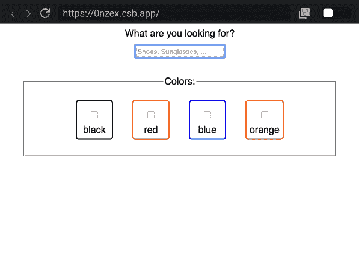

# 挂钩以保持查询字符串中的状态或 React 中的 history.state

> 原文：<https://dev.to/xiel/hooks-to-persist-state-in-the-query-string-or-history-state-in-react-44a7>

**TLDR；**

*   拥抱 URL，把你的一部分状态放入 URL 的查询字符串(？简单=正确)
*   通过这样做，自动支持浏览器中的书签、后退、前进和刷新操作
*   `useQueryState`来自 [`use-location-state`](https://github.com/xiel/use-location-state) 有助于将状态放入查询字符串
*   `useQueryState(itemName, defaultValue)`的工作方式类似于`useState()`，但是在查询字符串中保持状态

## 简介:好网址的好处

自从 90 年代中期被定义以来，URL 是网络的一项基本技术。能够从一个文档到另一个文档进行深度链接是一个非常棒的想法，移动操作系统甚至为他们的应用平台复制了这个原则。苹果称之为*通用链接*，谷歌称之为*应用链接*。虽然本地应用程序只是偶尔通过 share sheet 显示 URL，但 URL 在浏览器中总是可见和可访问的。所以网站应该维护有用的 URL。

好的 URL 使用户能够在特定状态下保存对 web 应用程序的引用，或者与其他人共享它们。虽然 URL 的路径通常定义用户所在的页面，例如搜索结果页面( **/search** ),但是**查询字符串**通常用于编码该页面的自定义状态，例如带有一组颜色和大小过滤器的“鞋子”搜索查询(/search **？q =鞋子&color =蓝色&color =黑色& size=44** 。用户现在可以将此 URL 添加为书签，以便稍后返回，或者与朋友分享，或者单击其中一个产品以查看详细信息，如果他们想返回结果页面，他们可以使用后退功能返回到相同的搜索结果并选择另一个产品。

## 挑战:维护网址很难...所以我们很少这样做

虽然好的 URL 的好处对大多数人来说是显而易见的，但许多使用 React 等框架构建的现代 spa 仍然难以提供好的 URL，因为更新 URL 和查询字符串比更新本地状态或 redux 存储更难。我自己也对此感到内疚，我认为这主要是因为缺少一个易于使用的 API。

一个重要的设计目标是让页面上的独立组件能够利用查询字符串和`history.state`，而不需要它们相互了解。所以一个组件只关心状态的特定部分，例如，尺寸过滤器参数(？...& size=44)，可以读取和更新状态，而不必处理存储在查询字符串中的任何其他信息。

## 简介:useQueryState()

我继续为 React 创建了一个简单而强大的钩子，它的工作方式类似于`useState()`，但是在 URL 的查询字符串中保持状态。要使用它，您只需选择一个参数名并传递一个默认值。API 看起来是这样的:

```
const [currentValue, updateValueFunction] = useQueryState(paramName, defaultValue) 
```

Enter fullscreen mode Exit fullscreen mode

只要值没有更新，并且查询字符串还不包含该参数的值，默认值将作为当前值返回。如果这种语法(数组析构)对你来说是新的，我推荐阅读 [React 文档](https://reactjs.org/docs/hooks-state.html#tip-what-do-square-brackets-mean)中的相关内容。

```
function Search() {
  const [queryString, setQueryString] = useQueryState("queryString", "");
  return (
    <label>
      What are you looking for?
      <input
        value={queryString}
        onChange={e => setQueryString(e.target.value)}
        placeholder="Shoes, Sunglasses, ..."
      />
    </label>
  );
} 
```

Enter fullscreen mode Exit fullscreen mode

[演示](https://lk4cs.csb.app)|[Code sandbox 中的代码](https://codesandbox.io/embed/simple-search-example-lk4cs)

当用户现在在文本字段中键入搜索词“shoes”时，URL 的查询字符串将被更新为`/?queryString=shoes`。您可以重新加载，或者转到另一页并返回，状态将被正确恢复。

[](https://0nzex.csb.app)

当然，你也可以在一个单独的组件中使用多个`useQueryState()`钩子。每个`useQueryState()`自动将其更新与查询字符串中当前编码的状态合并。

```
const  [queryString, setQueryString] =  useQueryState("queryString",  "");
const  [colors, setColors] =  useQueryState("colors",  []);

const toggleColor = e => {
  const color = e.target.value;
  setColors(
    colors.includes(color)
      ? colors.filter(t => t !== color)
      : [...colors, color]
  );
};

return (
  <form>
    ...
    <Color
      name="red"
      active={colors.includes("red")}
      onChange={toggleColor}
    />
    <Color
      name="blue"
      active={colors.includes("blue")}
      onChange={toggleColor}
    />
    ...
  </form>
) 
```

Enter fullscreen mode Exit fullscreen mode

[演示](https://0nzex.csb.app)|[Code sandbox 中的代码](https://codesandbox.io/embed/search-with-colors-example-0nzex)

`useQueryState()`目前支持以下值类型:`string | number | boolean | Date | string[]`。

查询字符串是一个全局状态，所以要明智地选择参数名称，以防止意外冲突。但是当你想在多个地方访问**相同的状态时，当然允许故意使用**相同的参数名**。**

## 如果对 URL 不安全:useLocationState()

在某些情况下，您可能不希望将状态存储在 URL 的查询字符串中，但仍然希望用户能够使用浏览器的后退/前进操作恢复以前的状态。要启用此`useLocationState()`持久状态，请改为在[历史状态](https://developer.mozilla.org/en-US/docs/Web/API/History/state)中。

API 的工作原理是一样的。您提供一个名称和一个默认值，并获得当前值，更新函数成对返回。

```
const [currentValue, updateValueFunction] = useLocationState(paramName, defaultValue) 
```

Enter fullscreen mode Exit fullscreen mode

对于持久化复杂或更敏感的状态`useLocationState()`更合适，例如，一个注释形式的状态。此外，基于频繁变化的数据的状态更适合存储在`history.state`中。这样，你可以避免提供只能在短时间内使用的 URL。

## 安装/使用

您可以使用纱线或 npm 安装这些挂钩:

`yarn add use-location-state`

将挂钩导入到您想要使用它们的地方:

`import { useLocationState, useQueryState } from 'use-location-state'`

### 你用的是 **`react-router`** 还是其他流行的路由器？

为了获得最佳体验，安装一个[路由器集成](https://github.com/xiel/use-location-state#router-integration-optional)。

`yarn add react-router-use-location-state`

并使用这些导入:

`import { useLocationState, useQueryState } from 'react-router-use-location-state'`

## 谢谢！

希望你觉得这个介绍和库有用！乐意讨论增强功能并回答问题👏