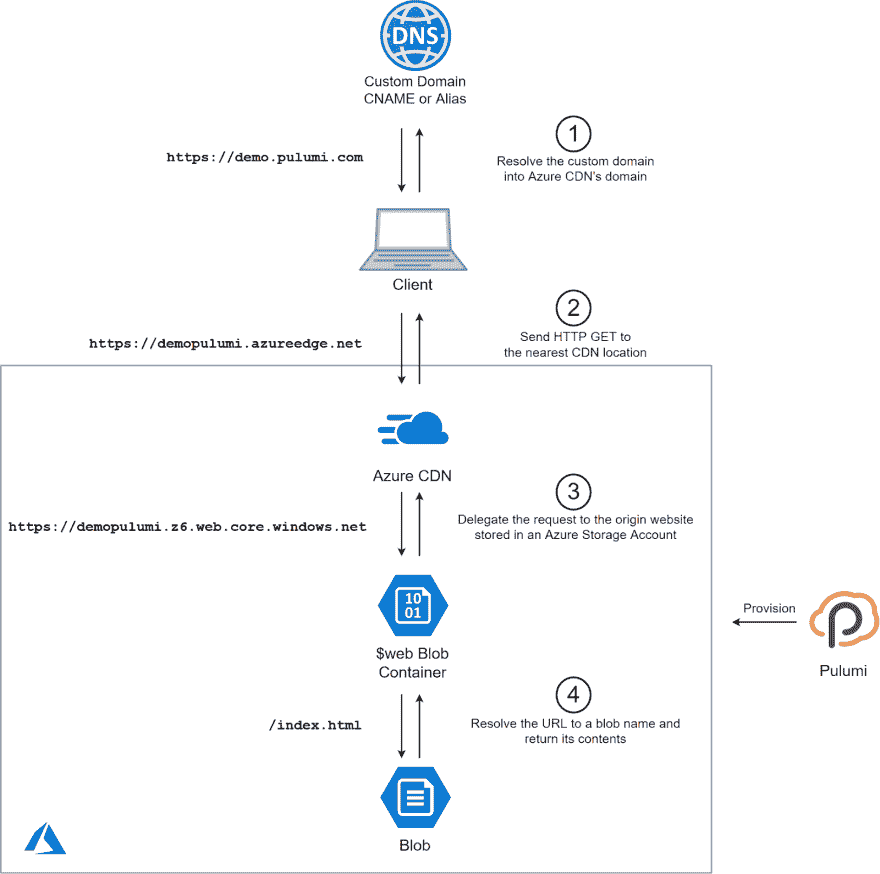

# 用 Pulumi 在 Azure 上托管一个静态网站

> 原文：<https://dev.to/mikhailshilkov/hosting-a-static-website-on-azure-with-pulumi-1a3o>

如今，静态网站重新成为主流。像 Jekyll、Hugo 或 Gatsby 这样的网站生成器可以很容易地将模板和 markdown 页面结合起来生成静态 HTML 文件。静态资产是服务和缓存最简单的东西，因此整个设置最终会变得快速且经济高效。

许多平台提供托管这种静态网站的服务。这篇文章解释了在 Microsoft Azure 上创建基础设施的步骤。

建立服务于静态网站的基础设施听起来并不困难，但是当您考虑 HTTPS 证书、内容分发网络并将其附加到自定义域时，集成所有组件可能会非常困难。

幸运的是，这是一个普鲁米大放异彩的任务。Pulumi 以代码为中心的方法不仅使配置云资源变得更容易，更容易维护，而且还消除了集成多种服务的痛苦。

## 概述

我们的目标是创建一个带有自定义域的静态网站——本文中我将使用一个虚构的`demo.pulumi.com`。2019 年，我的网站必须支持 HTTPS，所以我们也需要创建一个自定义的 TLS 证书。

最终的解决方案由几个 Azure 服务组成:

*   静态文件将存储在**存储帐户**内的 **Blob 容器**中
*   存储帐户将启用**静态网站功能**，以拥有一些基本的 URL 重写规则
*   我们将在容器前放置一个 **Azure CDN 端点**来支持 TLS 上的自定义域
*   Azure CDN 将自行管理 TLS 证书
*   我们的定制 DNS 提供商将拥有指向 CDN 端点的规则(这是一个手动步骤)

下图概述了这些组件的交互:

[](https://res.cloudinary.com/practicaldev/image/fetch/s--0pDUZO4z--/c_limit%2Cf_auto%2Cfl_progressive%2Cq_auto%2Cw_880/https://blog.pulumi.com/hs-fs/hubfs/PulumiStaticWebsite.png%3Fwidth%3D2400%26name%3DPulumiStaticWebsite.png)

<figcaption>Static website running on Azure and defined in Pulumi</figcaption>

让我们来分解一下如何使用 Pulumi 配置每个组件。

## 资源组

让我们启动一个新的 Pulumi 程序，导入 Pulumi 包，并定义一个新的资源组:

```
import * as pulumi from "@pulumi/pulumi";
import * as azure from "@pulumi/azure";

const resourceGroup = new azure.core.ResourceGroup("demo-rg", {
   location: azure.WestEurope,
}); 
```

## 存储账户

存储帐户将包含我们静态网站的资产:

```
const storageAccount = new azure.storage.Account("demopulumi", {
   resourceGroupName: resourceGroup.name,
   accountReplicationType: "LRS",
   accountTier: "Standard",
   accountKind: "StorageV2",
}); 
```

这里唯一的技巧是确保账户类型是 V2；否则，它不会支持静态网站功能。

## Azure 存储中的静态网站托管

任何存储容器都可以作为 web 端点公开。然而，这还不够灵活。URL 将总是包含容器名和确切的文件名，所以用户将不得不请求`https://demo.pulumi.com/containername/index.html`而不是简单的`https://demo.pulumi.com/`。

在 Azure 存储中启用静态网站托管可以改善这种体验。自动创建一个专用的容器 **`$web`** ，它对`index`和`404`文档也有特殊处理。

坏消息是静态网站托管不是 Azure 资源管理器 API 的一部分，因此，它在 ARM 模板、Terraform 或 Pulumi 中不是现成可用的。我们可以使用 Azure CLI 启用此功能，因此解决方案是创建一个动态 Pulumi 资源，在将工作委托给 CLI 的同时启用 Pulumi 体验。您可以在本例的[中找到动态资源的完整源代码，但是用法非常简单:](https://github.com/pulumi/examples/blob/master/azure-ts-static-website/staticWebsite.ts)

```
const staticWebsite = new StorageStaticWebsite("demopulumi-static",
   { accountName: storageAccount.name },
   { parent: storageAccount });

// Web endpoint to the website
export const staticEndpoint = staticWebsite.endpoint; 
```

最后一行导出静态网站端点。它看起来有点像`https://demopulumi01234abc.z6.web.core.windows.net/`——还没有自定义域，但是已经可以使用了——一旦我们在那里部署了一些静态文件。

## 静态文件

现在，是时候将静态文件上传到`$web` Blob 容器了。

对于这个演示，我创建了一个文件夹`wwwroot`，里面有两个文件:`index.html`和`404.html`。我可以用下面的 Pulumi 片段上传这些文件:

```
["index.html", "404.html"].map(name =>
   new azure.storage.Blob(name, {
       name,
       resourceGroupName: resourceGroup.name,
       storageAccountName: storageAccount.name,
       storageContainerName: staticWebsite.webContainerName,
       type: "block",
       source: `./wwwroot/${name}`,
       contentType: "text/html",
   })
); 
```

实际上，您的静态网站可能包含数百或数千个文件。此时，您可能希望将文件上传操作从 Pulumi 中分离出来，作为 CI/CD 管道中的一个单独步骤来完成。

## 天蓝色 CDN

为了使静态网站文件在我们的自定义域和 HTTPS 上可用，我们需要创建一个 Azure CDN 端点并将其指向存储帐户:

```
const cdn = new azure.cdn.Profile("demo-cdn", {
   resourceGroupName: resourceGroup.name,
   sku: "Standard_Microsoft",
});

const endpoint = new azure.cdn.Endpoint("demo-cdn-ep", {
   name: "demopulumi",
   resourceGroupName: resourceGroup.name,
   profileName: cdn.name,
   isHttpAllowed: true,
   isHttpsAllowed: true,
   originHostHeader: staticWebsite.hostName,
   origins: [{
       name: "blobstorage",
       hostName: staticWebsite.hostName,
   }],
});

// CDN endpoint to the website. Allow it some time after the deployment to get ready.
export const cdnEndpoint = pulumi.interpolate`https://${endpoint.hostName}/`; 
```

我为 CDN 端点指定了一个明确的名称:`demopulumi`。该名称必须是全局唯一的，因为它是端点 URL `https://demopulumi.azureedge.net`的一部分。请在运行程序前选择一个自定义名称。

我用`staticWebsite.hostName`将 CDN 原点指向静态网站名称。像往常一样，在 Pulumi 代码中链接资源很容易！

您可能需要等待几分钟才能看到您的内容，因为 CDN 配置不会立即执行。我将`isHttpAllowed`设置为`true`,因为 HTTP 比 HTTPS 更快可用；您可以根据您的生产配置随意关闭它。

## 配置域名 DNS 规则

您可能已经向某个第三方提供商注册了您的域名。按照提供商的说明为网站的 DNS 配置 CNAME 规则。对于定制域`demo.pulumi.com`，CNAME 条目`demo`将被链接到端点`demopulumi.azureedge.net`。

CNAME 条目不支持像`pulumi.com`这样的“裸”域名。如果你想建立一个从静态 Azure 网站提供服务的顶级域名，你必须使用一个[别名 DNS 记录](https://support.dnsimple.com/articles/alias-record/)，一些 DNS 提供商不支持它。请向您的提供商咨询可用选项。

以下步骤假设配置了 CNAME 记录；否则，它会因验证错误而失败。

## 自定义域和 TLS

最后一步是将我们的自定义域指向 CDN 端点，并提供 TLS 证书来启用 HTTPS 支持。同样，这些操作不是 ARM API 表面的一部分，所以创建了另一个动态资源来支持它们。

用法非常简单，只要确保在下面的代码片段中使用您自己的域即可:

```
const customDomain = new CDNCustomDomainResource("cdn-custom-domain", {
   resourceGroupName: resourceGroup.name,
   // Ensure that there is a CNAME record for demo pointing.pulumi.com to demopulumi.azureedge.net.
   // You would do that in your domain registrar's portal.
   customDomainHostName: "demo.pulumi.com",
   profileName: cdn.name,
   endpointName: endpoint.name,
   // This will enable HTTPS through Azure's one-click automated certificate deployment.
   // The certificate is fully managed by Azure from provisioning to automatic renewal
   // at no additional cost to you.
   httpsEnabled: true,
}, { parent: endpoint }); 
```

## 拿来直播！

我们完了。运行`pulumi up`并确保所有资源都成功创建。

从`staticEndpoint`开始测试——它是第一个可用的。`cdnEndpoint`一开始可能会回一些`404`，耐心点。然后，用`HTTP`试试你的自定义域。最后，注册 TLS 证书需要相当长的时间，所以一个小时左右回来测试`HTTPS`。

虽然“静态网站”听起来可能很简单，但我们经历了一个相当复杂的过程将所有组件连接在一起。有些 Azure 服务和功能比其他的更容易自动化，但最终，我们将它们全部合并到一个内聚的 Pulumi 程序中来托管一个静态网站，通过 HTTPS 和全球 CDN 提供服务。这就是通用编程语言应用于复杂基础设施自动化任务的强大之处。一旦可重用组件就位，可靠且可重复的部署就成为现实。