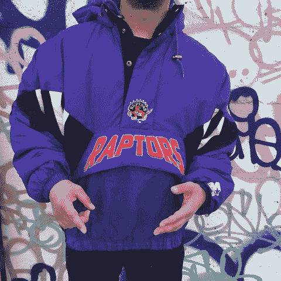

# 多伦多聚会 6 月 22 日。GTA 中的用户有开发吗？

> 原文：<https://dev.to/andrewbrown/hosting-my-2nd-tech-meetup-in-toronto-on-june-22nd-if-you-re-around-come-on-out-43nj>

我想办一个自己的技术聚会，并想出一些范围广泛的东西，以便就 UX、Fullstack、DevOps、安全、BigData 和 ML 等问题进行讨论。我认为所有的工作都需要在某种程度上开始学习云计算，这就是为什么我创建了解决方案架构师多伦多用户组。

如果你不在多伦多，我会通过 Zoom 直播会谈。如果你在多伦多，这是一个建立关系网的好机会。

欲了解更多详情，请阅读 [Meetup 活动页面](https://www.meetup.com/Solution-Architect-Toronto-User-Group/events/262097187/)

猛龙加油？我们在北方。

有趣的事实。当我 7 岁的时候，我就有了这件迅猛龙风衣:
