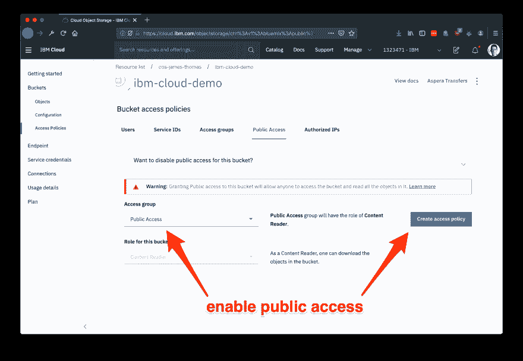
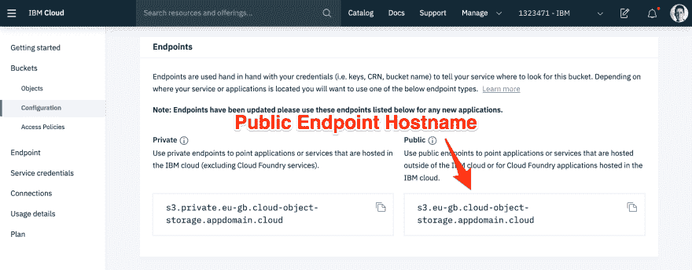
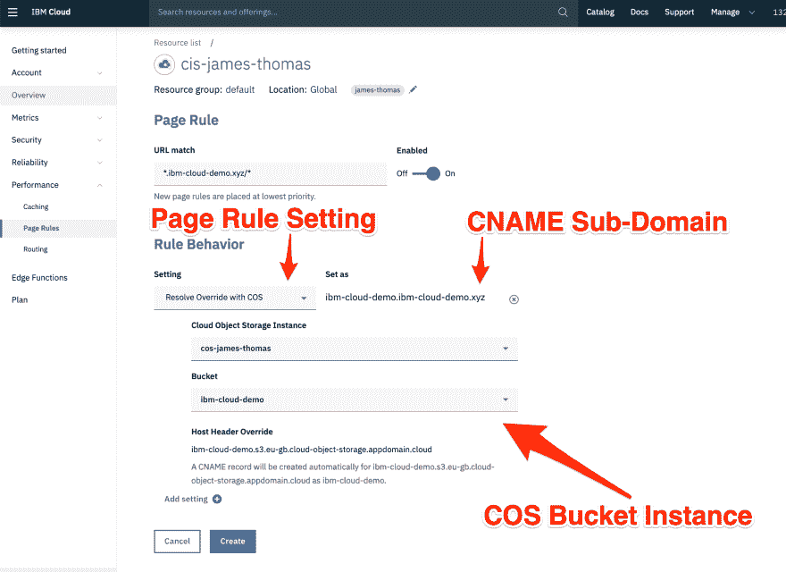

# 在 IBM Cloud 上托管静态网站

> 原文：<https://dev.to/ibmdeveloper/hosting-static-websites-on-ibm-cloud-2ib7>

这篇博文解释了如何在 [IBM Cloud](https://cloud.ibm.com) 上托管一个[静态网站](https://en.wikipedia.org/wiki/Static_web_page)。这些网站由浏览器从静态资产(如 HTML、CSS 和 JS 文件)呈现在客户端。它们不需要服务器端组件来在运行时动态创建页面。静态网站通常与后端 API 相结合来创建[单页面应用](https://en.wikipedia.org/wiki/Single-page_application)。

在 IBM Cloud 上托管静态网站使用[云对象存储](https://www.ibm.com/cloud/object-storage) (COS)和[云互联网服务](https://www.ibm.com/cloud/cloud-internet-services) (CIS)(带有[页面规则](https://cloud.ibm.com/docs/infrastructure/cis?topic=cis-use-page-rules)和[边缘功能](https://cloud.ibm.com/docs/infrastructure/cis?topic=cis-edge-functions) s)。这些服务提供了服务静态网站所需的以下功能。

*   来自提供商管理的 HTTP 服务(云对象存储)的自动服务静态资产。
*   **自定义域名支持，从用户控制的域名提供内容(CIS -页面规则)。**
*   **可配置的索引和错误文件(CIS - Edge 功能)。**

下面是通过组合这些服务在 IBM Cloud 上托管静态网站所需的步骤。

# 服务静态资产

IBM 云对象存储是针对云应用程序的可扩展存储解决方案。文件通过一个 RESTful HTTP API 管理，并存储在用户定义的集合中，称为“桶”。桶文件作为 HTTP 响应从 [HTTP GET 请求](https://cloud.ibm.com/docs/services/cloud-object-storage?topic=cloud-object-storage-compatibility-api#compatibility-api-object)返回。

COS 支持桶的可选*匿名只读访问*[设置。这意味着 bucket 中的所有文件都可以使用匿名 HTTP GET 请求来访问。](https://cloud.ibm.com/docs/services/cloud-object-storage?topic=cloud-object-storage-iam-public-access)

把 HTML，CSS，JS 文件放在一个公共桶里，让静态网站直接由 COS 服务。用户需要为所有桶文件使用的带宽和收到的 HTTP 请求付费。

### 创建 IBM 云对象存储实例

*如果您已经有一个云对象存储实例，您可以跳过这一步...*

*   供应 IBM 云对象存储的一个新实例

### 创建 IBM 云对象存储桶

*   从[资源列表](https://cloud.ibm.com/resources)中打开 COS 实例。
*   [创建一个新的 COS bucket](https://cloud.ibm.com/docs/services/cloud-object-storage?topic=cloud-object-storage-getting-started#gs-create-buckets) 来托管静态站点文件。
    *   选择存储桶名称
    *   为桶选择`Resiliency,` `Location`和`Storage Class`选项。

这些选项的任何选择都可以使用——它不影响静态网站托管能力。有关它们含义的更多细节，请参见此[文档](https://cloud.ibm.com/docs/services/cloud-object-storage?topic=cloud-object-storage-classes)。

### 将静态资产上传到存储桶

*   [将静态文件资产](https://cloud.ibm.com/docs/services/cloud-object-storage?topic=cloud-object-storage-upload)上传到新的存储桶。

### 启用对桶文件的公共访问

*   点击桶级菜单中的*“访问策略”*菜单项。
*   在 bucket 访问策略页面中，单击“*公共访问*选项卡。
*   检查访问组下拉列表是否选择了“*公共访问*”选项。
*   点击弹出菜单中的*创建访问策略*，然后点击*启用*。

[](https://res.cloudinary.com/practicaldev/image/fetch/s--2soX4Saf--/c_limit%2Cf_auto%2Cfl_progressive%2Cq_auto%2Cw_880/https://raw.githubusercontent.com/jthomas/jthomas.github.io/mastimg/static-site-hosting/bucket-access-policy.png)

### 检查桶文件是否可访问

现在应该可以使用服务端点 URL、Bucket id 和文件名来访问 bucket 文件。COS 支持在 URL 路径或服务端点上的子域中提供 bucket 名称。

*   在 bucket 页面打开*配置*面板。
*   检索显示的**公共端点**，例如`s3.<REGION>.cloud-object-storage.appdomain.cloud`

[](https://res.cloudinary.com/practicaldev/image/fetch/s--LNlC4sIJ--/c_limit%2Cf_auto%2Cfl_progressive%2Cq_auto%2Cw_880/https://raw.githubusercontent.com/jthomas/jthomas.github.io/mastimg/static-site-hosting/public-endpoint-hostname.png)

**Bucket 文件(如`index.html`)现在应该可以通过网络浏览器访问了。** COS 同时支持 HTTP 和 HTTPS 流量。使用以下 URL 可以获得桶文件。

#### vhost 寻址

`<BUCKET_NANME>.s3.eu-gb.cloud-object-storage.appdomain.cloud/index.html`

#### url 路径寻址

`s3.<REGION>.cloud-object-storage.appdomain.cloud/<BUCKET_NANME>/index.html`

现在可以在外部 web 应用程序中直接引用 Bucket 文件。COS buckets 通常用于存储大型应用程序资产，如视频或图像。对于托管整个网站，通常需要从自定义域名而不是 COS 桶主机名提供内容。

# 自定义域支持

云互联网服务页面规则可以[自动配置自定义域](https://cloud.ibm.com/docs/infrastructure/cis?topic=cis-resolve-override-cos)支持 COS 桶。

[CNAME](https://en.wikipedia.org/wiki/CNAME_recor) 创建 DNS 记录以将自定义域作为 COS 存储桶主机名的别名。所有到自定义域的流量将被转发到 COS 服务。

当 COS 提供来自 bucket 子域的文件时，HTTP `Host` [请求头值](https://stackoverflow.com/questions/43156023/what-is-http-host-header)来确定 bucket 名称。对于 CNAME DNS 记录，此头值仍将指向自定义域，而不是桶子域。这个字段需要用正确的值动态更新。

### 创建 IBM 云互联网服务实例

*   供应[云互联网服务](https://cloud.ibm.com/catalog/services/internet-services)的新实例。

### 向云互联网服务注册自定义域名

*   遵循[文档](https://cloud.ibm.com/docs/infrastructure/cis?topic=cis-getting-started#add-configure-your-domain)中关于如何向云互联网服务注册自定义域的说明。

这个过程包括将域名服务器控制权委托给 IBM Cloud Internet Services。

### 配置页面规则和 DNS 记录(自动)

云互联网服务[可以自动设置](https://cloud.ibm.com/docs/infrastructure/cis?topic=cis-resolve-override-cos)页面规则和将自定义域流量转发到 COS 桶所需的 DNS 记录。这自动将桶公开为`bucket-name.your-domain.com`。如果您想更改这个默认子域名，请按照下一节中的手动步骤操作。

*   单击性能下拉菜单，然后单击“*页面规则*链接。
*   点击表格中的*创建规则*按钮。
*   选择规则行为设置为“*用 COS* 解决覆盖”
*   选择正确的 COS 实例和时段。
*   点击*创建*按钮。

[](https://res.cloudinary.com/practicaldev/image/fetch/s--YQMI04mt--/c_limit%2Cf_auto%2Cfl_progressive%2Cq_auto%2Cw_880/https://raw.githubusercontent.com/jthomas/jthomas.github.io/mastimg/static-site-hosting/auto-page-rule.png)

**一旦 DNS 记录传播完毕，就应该可以使用自定义域** : `http(s)://<CUSTOM_DOMAIN>/index.html`访问 bucket 文件。

### 配置页面规则和 DNS 记录(手动)

如果你还没有做上面的部分，这些步骤只需要遵循。

创建页面规则以修改 HTTP 主机头。

*   点击性能下拉菜单，选择“*页面规则*链接。
*   点击表格中的*创建规则*按钮。
*   将 URL 匹配字段设置为`<SUB_DOMAIN>.<CUSTOM_DOMAIN>/*`
*   选择规则行为设置为“*主机头覆盖*”作为自定义桶子域:`<BUCKET_NANME>.<REGION>.eu-gb.cloud-object-storage.appdomain.cloud`

创建 DNS CNAME 记录以将流量转发到 COS。

*   单击可靠性下拉菜单，然后单击“ *DNS* ”菜单项。
*   用下列值添加新的 DNS 记录。
    *   **类型:**
    **   **名称:** *<自定义子域主机>**   **TTL:**T2】自动*   **别名域名:** *< COS 斗子域>**

 **名称*是自定义域(如`www`)上的子域，通过它可以访问 COS 桶。*别名域名*是上面的 COS 桶子域，如`<BUCKET_NANME>.<REGION>.eu-gb.cloud-object-storage.appdomain.cloud`

*   添加记录后，将`Proxy`字段设置为真。这是页面规则发挥作用的必要条件。

**一旦传播了 DNS 记录，就应该可以使用自定义域访问 bucket 文件。**

# 可配置索引和错误页面

COS 现在将提供来自自定义子域的静态资产，其中文件名明确包含在 URL 中，例如`http(s)://<CUSTOM_DOMAIN>/index.html`。这对于静态网站来说很好，但有两个例外，网站的默认文档和错误页面。

当用户在没有明确文件路径(`http(s)://<CUSTOM_DOMAIN>`)的情况下访问 COS 桶子域时，COS 服务将返回[桶文件列表](https://cloud.ibm.com/docs/services/cloud-object-storage?topic=cloud-object-storage-compatibility-api-bucket-operations#compatibility-api-list-objects-v2)，而不是站点索引页面。此外，如果用户请求一个丢失的文件，COS 会返回一个 [XML 错误消息](https://cloud.ibm.com/docs/services/cloud-object-storage?topic=cloud-object-storage-compatibility-common#compatibility-errors)，而不是一个定制的错误页面。

这两个问题都可以通过使用云互联网服务的新功能[边缘功能](https://www.ibm.com/cloud/blog/edge-computing-for-serverless-applications?mhsrc=ibmsearch_a&mhq=edge%20functions)来解决。

### 边缘功能

[Edge functions](https://cloud.ibm.com/docs/infrastructure/cis?topic=cis-edge-functions) 是部署到 Cloudflare 边缘位置的 JavaScript 源文件。他们可以动态修改通过 Cloudflare 网络的 HTTP 流量(对于您控制的域)。自定义边缘功能在可配置的 URL 路由上触发。函数传递传入的 HTTP 请求，并控制返回的 HTTP 响应。

### 添加边缘功能提供索引&错误文档

使用自定义边缘功能，可以修改到自定义子域的 HTTP 流量，以支持索引和错误文档。没有显式文件名的传入 HTTP 请求可以更改为使用索引页位置。从 COS 返回的 HTTP 404 响应可以替换为自定义错误页面。

*   在云互联网服务实例首页打开*边缘功能*页面。
*   点击“*动作*选项卡上的“*创建*图标。
*   在动作名称字段中输入“*路由索引和错误*”。
*   将下面的[源代码](https://gist.github.com/jthomas/3c6c1db53e6f8ae7e70e2238b8c3374b)粘贴到动作体部分。

*`INDEX_DOCUMENT`和`ERROR_DOCUMENT`值控制用于重定向请求的索引和错误页面。将这些值替换为所承载的静态网站的正确页面位置。*

```
const INDEX_DOCUMENT = 'index.html'
const ERROR_DOCUMENT = '404.html'

addEventListener('fetch', event => {
  event.respondWith(handleRequest(event.request))
})

async function handleRequest(request) {
  const url = new URL(request.url)

  // if request is a directory path, append the index document.
  if (url.pathname.endsWith('/')) {
    url.pathname = `${url.pathname}${INDEX_DOCUMENT}`
    request = new Request(url, request)
  }

  let response = await fetch(request)

  // if bucket file is missing, return error page.
  if (response.status === 404) {    
    url.pathname = ERROR_DOCUMENT
    request = new Request(url, request)
    response = await fetch(request)

    response = new Response(response.body, {
      status: 404,
      statusText: 'Not Found',
      headers: response.headers
    })      
  } 

  return response
} 
```

*   点击*保存*按钮。

### 为边缘功能设置触发器

*   从 Edge Functions 页面选择“ *Triggers* ”面板。
*   点击*添加触发器*图标。
*   将触发 URL 设置为`http://<SUB_DOMAIN>.<CUSTOM_DOMAIN>/*`。
*   从下拉菜单中选择“*路由索引和错误*”动作。
*   点击*保存*按钮。

### 测试索引和错误页面

设置了触发器和边缘函数后，对定制子域上的根路径的 HTTP 请求将返回索引页面。访问无效的桶文件也将返回错误页面，而不是 COS 错误响应。

*   确认`http://<SUB_DOMAIN>.<CUSTOM_DOMAIN>/`返回与`http://<SUB_DOMAIN>.<CUSTOM_DOMAIN>/index.html`相同的页面
*   确认`http://<SUB_DOMAIN>.<CUSTOM_DOMAIN>/missing-page.html`返回错误页面。这应该不同于访问`<BUCKET_NANME>.s3.<REGION>.cloud-object-storage.appdomain.cloud/missing-page.html`返回的 XML 错误响应。

如果这一切都正常，那么这个网站就正常了！IBM Cloud 现在托管一个静态网站，使用云对象存储和云互联网服务，具有页面规则和边缘功能。🎉🎉🎉

## 总结

静态网站可以使用云对象存储和云互联网服务托管在 IBM Cloud 上。

云对象存储渲染静态网站所需的页面文件。匿名存储桶文件访问意味着文件可以作为公共 HTTP 端点进行访问，而不必运行基础设施来为资产提供服务。

云互联网服务将 HTTP 流量从自定义域转发到桶主机名。DNS CNAME 记录用于将子域解析为自定义存储桶主机名。页面规则覆盖 HTTP 请求头以使其工作。Edge 函数用于实现可配置的索引和错误文档，通过使用定制的 JavaScript 动态修改进行中的请求。

使用这种方法托管静态网站比传统的基础设施更便宜(也更容易)。基于带宽和 HTTP 请求，开发者只为实际的站点使用付费。*