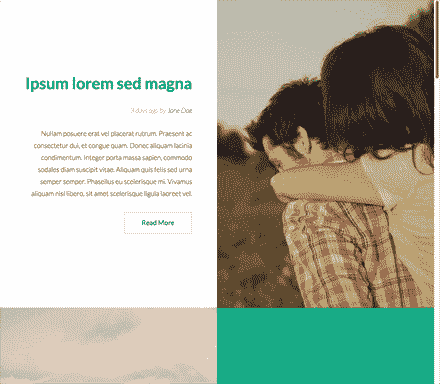
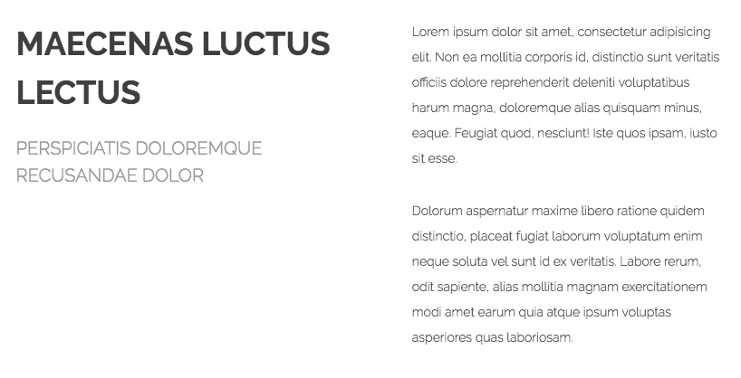
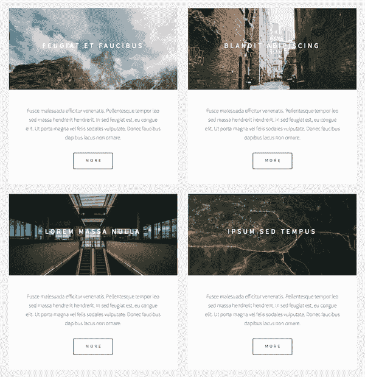

# 悬停动画，石工移动器，侧面开关|模块星期一 47

> 原文：<https://dev.to/tyrw/hover-animate-masonry-mover-side-switch-module-monday-47-1n1>

## 下面的一切都是开源的

它可以在任何网站、web 应用程序或其他任何地方免费使用。开发人员在 AnyMod 上创建并分享了数百个这样的网站。

单击一个 mod 来查看它及其源代码。

## 动画砖石叠加

欢迎覆盖过渡到砖石画廊。添加您自己的文本和图像。
[查看 mod](https://anymod.com/mod/masonry-gallery-with-collapsible-call-to-action-overlay-barnrn?preview=true)
  

## 交替内容章节

预先设计的部分来讲述你的故事。
[查看 mod](https://anymod.com/mod/alternating-content-sections-ordkdo?preview=true)
  

## 悬停社交链接

为你的社交网络添加专业元素。
[查看 mod](https://anymod.com/mod/social-links-with-animations-dkdlnk?preview=true)
  

## 格式化的内容

字体、布局和颜色基于模板化的空间主题。
[查看 mod](https://anymod.com/mod/content-block-alrmdb?preview=true)
  

## 精致的图像卡片

漂亮，反应灵敏的设计，悬停时有一个子缩放。
[查看 mod](https://anymod.com/mod/image-cards-with-call-to-action-raorod?preview=true)
  

* * *

我每周一从社区[这里](https://dev.to/tyrw)贴出新的 mods 我希望你觉得它们有用！

快乐编码✌️