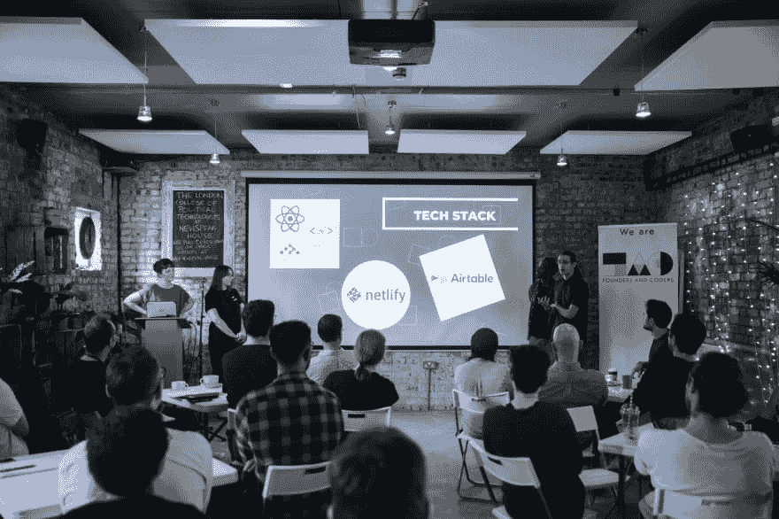
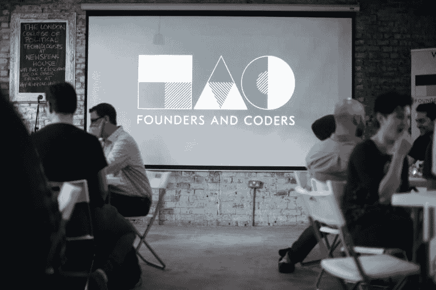

# 构建社会影响力 MVP 如何让你成为更好的开发者

> 原文：<https://dev.to/founderscoders/how-building-social-impact-mvps-makes-you-a-better-developer-3f54>

 
*见面和问候:在创始人和程序员演示日，开发人员与就业伙伴打成一片*

Founders and Coders 是一个全栈编码训练营，主要关注 JavaScript 基础知识和同伴引导学习。在四个月的课程中，学生们获得了将他们对技术的热情转化为职业的软硬技能。

前八周包括涵盖全栈开发原则的实践研讨会。学生两人一组，解决编码问题，并将他们的发现反馈给班级，同时发现不同解决方案的优点。在课程的后半部分，他们分成几个小组，用他们学到的知识为社会企业构建最小可行产品(MVP)。

安娜、詹姆斯和萨姆在为产品所有者和潜在雇主观众成功演示了他们完成的 MVP 后，于 2019 年 7 月毕业。我们采访了他们，听听他们在这些项目上的经历。

* * *

#### 社会影响工作显然对这里的每个人都很重要。你的合作伙伴是哪些组织和个人？你为他们做了什么？

萨姆:我们和一个叫比奇的不错的小伙子一起工作。他试图解决的问题是，很多人并不真正知道他们能回收什么，不能回收什么。许多回收品最终被污染，因为人们把物品放错了垃圾箱，整袋都得扔掉。我们制作了一个游戏来教小学生日常用品的可回收性。

詹姆斯:我们的项目是为一个名为 Groundworks 的组织设计的。我们的产品负责人 Alex 希望帮助大学生培养就业技能，同时获得合理的工资。我们和他一起创建了一个在线市场，学生可以在这里注册，浏览工作机会，并与雇主匹配。

安娜:我们与一个名为 SquareCircle 的组织合作。他们的目标是将年轻人与采用公正招聘流程的雇主联系起来。产品所有者希望我们为他们建立一个网站，在那里他们可以与求职者分享包容性就业机会的信息。

#### 对于他们中的许多人来说，这些 MVP 只是一个开始。为以后的迭代打下了基础是什么感觉？

对于基础工程，MVP 的目标是简化他们现有的一些流程。他们用来匹配学生和雇主的方法是相当劳动密集型的，亚历克斯自己做了很多工作，这意味着他花在其他事情上的时间较少。我认为我们开发的市场将减少他们花费在手工任务上的时间，并帮助他们更快地发展。感觉真好！

安娜:我认为我们的产品负责人打算使用我们为他们制作的网站，这很酷！不管有多少流量，我认为这将使他们的生活更容易。SquareCircle 是一个新的组织，他们仍在建立中，所以他们显然有很多事情要做。做出贡献，做一些对他们有用的事情，这很好。

**Sam:** 我不完全确定我们做的游戏是否会作为最终产品；可玩，但还处于早期状态。也就是说，如果我们的产品负责人将来决定申请资助，他可以将这种东西作为概念证明。而且，知道他将利用我们的成果来解决一个相当重要的问题，感觉很好。

#### 在准备制作这些 MVP 的过程中，你花了几周时间在自己的迷你项目中尝试不同的技术堆栈、设计技术和工作方式。那些学习经历是怎么派上用场的？

Anna: 将敏捷工作原则付诸实践很有挑战性，但是非常有价值。站立，建立冲刺计划，和团队回顾——我不认为我们第一次就把所有的事情都做对了！但是，就像课程中的任何事情一样，你会犯错误，然后从中吸取教训。当真正的客户参与进来时，我们团队的流程和沟通已经有了很大的改进。接触敏捷方法完全改变了我现在对任何工作的看法。

詹姆斯:我非常欣赏这门课程的一点是，它给了我们学习许多新事物的信心。迷你项目的节奏比我以前演过的任何角色都要激烈得多。连续两个月每周做这些项目让我们很好地完成这些 MVP。这给了我们尝试新事物的信心，而不用担心做不完。所以，当涉及到我们的最终项目时，我们毫不犹豫地推出并实施技术，如 Webpack 和 Mocha，这些甚至不是课程的一部分。

Sam: 是的，在课程的第一部分，我们每周有一天半的时间从零开始构建一个新的迷你项目。必须如此快速地将这些整合在一起，这意味着当我们开始与客户合作时，三周就像是世界上所有的时间——也就是说，直到第一个构建 sprint 结束！

* * *

### *查看[创始人和程序员课程在这里。](https://github.com/foundersandcoders/master-reference)*

* * *

 
*演示时间:SquareCircle 团队讨论他们 MVP 的技术组合*

#### 项目范围界定说起来容易做起来难，即使是有经验的团队有时也会陷入“功能蔓延”的困境。这是你必须处理的事情吗？

安娜:当然，这也是为什么我们学生项目的预演如此重要的原因。萨姆和我一起完成了倒数第二个学生项目，这真的很有趣；但是我们确实犯了很多错误，而作用域无疑是其中之一。我们带着“只构建所有功能”的心态来做这件事，却没有真正意识到在我们所拥有的时间内可以完成什么。对于我们的客户项目，我们采取了更多的“只构建能工作的东西”的方法，并且我们制作了一个单独的特性列表，如果我们有时间，我们会添加这些特性。设立延伸目标是好的，但重要的是将它们从你的核心特征中分离出来。

山姆:这让我想起了汽车的比喻——如果有人需要从一个地方旅行到另一个地方，你不会为他们造一辆汽车；你给他们做一个滑板，然后一边做一边添加功能。然而，在那个特别的项目中，我想我们已经有了一辆车，我们只是没有必要去添加后视镜、车门，甚至是车轮！

#### 在网络行业有很多关于成为一名优秀的开发者是否需要学位的讨论。经过 16 周的实践学习，你认为学位是必要的吗？

萨姆:肯定不是。我得说，我的学位确实给了我某些生活技能，我在那里的时候很享受，但这不是我特别热衷的一门学科。创始人和编码者是非常不同的；这是我特意选择做的事情，因为我喜欢它。

詹姆斯:在 web 开发方面，我想我同意。我不认为有一个学位是必不可少的，尽管对于一般的生活技能来说，这可能是一个很好的选择。我认为最重要的是对它感兴趣，并准备投入大量的工作来擅长它。

#### 自学是进入这个行业的另一种流行方式。相对于单打独斗，你觉得团队学习有什么好处？

安娜:我发现团队合作是创始人和程序员最有价值的事情之一。我们每天都在一起，互相学习，在需要的时候互相扶持，这种感觉很棒。我们从导师那里得到了很多支持，他们比我们早几个月完成了课程。你看着他们，你会想，“嗯，我现在可能不理解这个概念，但这个人刚刚做到了，他们明白了——所以我也有希望！”

Sam: 我觉得在团队中工作阻止了我编写糟糕的代码，因为我不得不考虑其他人会审查我的拉请求，或者我不得不向其他人解释某个特定的功能。如果你正在做一个演示，你必须解释你写的一些令人困惑的代码背后的逻辑，团队的其他人不会学到很多东西。我想如果我只是独自完成课程，我可能会写一些没人能读懂的代码。

是的，我确实认为如果你是自学的话，很容易有点迷失方向。创始人和编码员会让你走上正轨。如果我没有创始人和程序员，我不认为我能连续四个月不间断地坚持编码。小组中的其他学生真的激励了我——不是以一种竞争的方式，而是作为一种健康动力的来源。

 
*热点:开发者向创始人和程序员雇佣的合伙人提问公司文化*

#### 《创始人和程序员》让你准备好进入一个非常需要你的技能的行业。你将来想做什么？什么样的机会让你兴奋？

安娜:我想我喜欢的工作与社会影响有关。为人们制造有用的产品——经过深思熟虑的产品，实际上能帮助人们的日常生活——是我想做的事情。至少，在这个时间点上我是这么想的！但是听听其他人的观点是很有趣的，因为他们对这个问题的答案可能会非常不同。

Sam: 是的，我一直以为我会成为一名前端开发人员，但是我很惊讶地发现，在课程进行到一半的时候，大多数人都认为我是一名“后端人员！”这是一个很难回答的问题。我们已经涵盖了如此之多，如此之快，以至于很难决定专注于什么。我不认为我们组中有任何人仅仅通过编写前端或后端代码就完成了课程；你不可能做到的。所以，能够尝试所有的事情实际上让选择变得非常困难。

**James:** 我对整个堆栈感兴趣，就像 Sam 说的那样，我现在不想把自己束之高阁。话虽如此，有些事情我真的想确保我在下一个角色中学到。好的文化对我也很重要；如果你能提供，并且你的工作有积极的社会影响，我很感兴趣。

* * *

*要了解如何雇佣创始人和程序员毕业生，[请访问我们的专门合作伙伴页面。](https://www.foundersandcoders.com/hire)T3】*

