# 如何在 UI 设计中发挥动画的优势？

> 原文：<https://dev.to/sysbunny1/how-can-you-leverage-the-advantages-of-animation-in-ui-design-3ed8>

人类有不同种类的感觉，视觉是所有感觉中最常用和最强大的。由于数字世界在视觉上蓬勃发展，视觉内容消费影响了数字世界中通过数字用户界面(ui)发生的所有交互，包括 web 和移动设备 ui。

**文本&UI 设计中的图形:**
对于 UI 设计师来说，文本是一种内容，它主要是信息性的，或指导性的，在某些方面是功能性的。图形用户界面元素在大多数情况下用于导航和功能目的，而在某些情况下仍然作为布局组件。

**UI 设计中的图像:**
图像在某种意义上是对文本的有力增强，而在另一种意义上则是装饰元素，在视觉上抓住用户的注意力。图像可以是信息性的、功能性的，也可以是概念性的。图像为图形和用户界面设计者提供了一个机会，特别是将人类的想象力转化为其他人可以看到、感觉到和理解其背后思想的视觉景观。

**UI 设计中的动画:**
如果你有一个很长的故事或者很大的概念，或者一个功能涉及几个步骤，你就要创建不止一个带有中转流程的图像，以在数字景观上实现。在这种情况下，设计师采用动画的方式来描绘这些过渡，并创建一个现场演示。

**动画类型**
基于以上讨论，我们可以概括出两种主要的动画类型，比如:

功能动画是 UI 设计中功能的一部分。概念动画在转化为现实之前传达了一个明确的想法。

**1-功能动画**

顾名思义，它简化了动画中表示的应用程序的功能，并提高了可理解性。因此，它大大减轻了认知负荷。它给用户界面带来了活力，并有助于实现某些目标，如直观、反应灵敏和以人为中心的用户界面。制作精良的动画能够满足多种功能，例如:

**对用户动作给出视觉反馈**

按钮是交互式 UI 元素。我们可以用微妙的动画来激活按钮，使其在按下/推动时做出响应。

[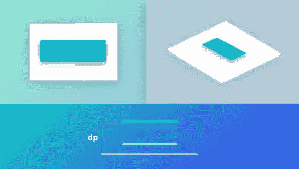](https://res.cloudinary.com/practicaldev/image/fetch/s--qKr_cZiP--/c_limit%2Cf_auto%2Cfl_progressive%2Cq_auto%2Cw_880/https://thepracticaldev.s3.amazonaws.com/i/16wge7jlv0091h4tommn.jpg)

在这里，只有当用户采取像点击按钮这样的动作时，动画才会触发。因此，动画模拟按钮或控件，如使用视觉和动作提示来弥合差距的有形 UI 元素。

在这里，只有当用户采取像点击按钮这样的动作时，动画才会触发。因此，动画模拟按钮或控件，如使用视觉和动作提示来弥合差距的有形 UI 元素。

**显示系统状态**

在与系统的交互过程中，用户总是对他们在数字系统中采取的行动保持好奇。例如，数据上传或下载动作。这样的操作非常耗时，如果过了要求的时间，用户根本看不到想要的结果。

[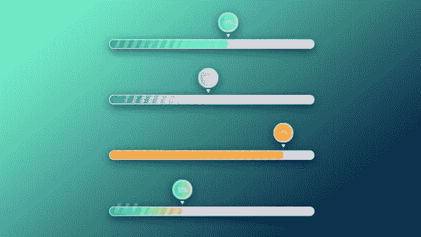](https://res.cloudinary.com/practicaldev/image/fetch/s--tEMlVBQs--/c_limit%2Cf_auto%2Cfl_progressive%2Cq_auto%2Cw_880/https://thepracticaldev.s3.amazonaws.com/i/pk1tz2f4ow7robm5q2v3.jpg)

因此，进度指示条动画帮助设计者以有意义的方式让用户等待。进度指示栏显示结果，如失败或成功，还显示发生了多少个过程，现在还剩下什么。当然，一切都应该是美好而优雅的。

**平滑状态变化**

屏幕流动并不总是平稳的。它通常涉及到在转换过程中用户界面状态的突然变化。它会分散用户体验的注意力(UX ),让用户无法继续前进。为了避免这一切，设计师应该通过在 UI 中添加一些动画来缓和这些时刻。

动画可以在完全不同的用户界面状态之间建立联系，只需简单地充当两个相对端之间的媒介。

在音乐播放器应用程序中，当用户按下播放按钮时，会发生加载过程，屏幕会从停止状态变为播放状态。为了更好地理解屏幕状态的变化，UI 设计者引入了一个独立的动画来显示加载过程。动画有双重作用，一是在两个屏幕状态之间建立联系，二是让用户等待加载过程。

**帮助入职&给出视觉提示**

有时候，设计师是实验性的，试图通过超越市场上流行的惯例或设计趋势，在 UI 设计中引入新的特性、交互或功能。虽然这是一件好事，但会分散用户的体验。

为了节约成本，设计师们通常会借助一些视觉技巧或提示，并把动画作为一种视觉工具。具有完美 UX 的用户入门动画可以给初次用户留下巨大的影响，并能够用独特或创新的 UI 设计概念吸引他们。

视觉提示也有助于重复用户揭示渐进式披露、机制和支持新水平的体验。

**2-概念动画**

它遵循了运动设计中概念艺术的原则。它在一个想法实现之前就传达了这个想法。在 UI 设计中，概念动画包含了各种各样的交互、转换、使用控件的操作以及标记系统反馈的概念。一些动画是成功的概念动画的一个很好的例子，例如

**滚动项目列表**

在这里，动画以两种不同的方式显示了项目列表的滚动。

[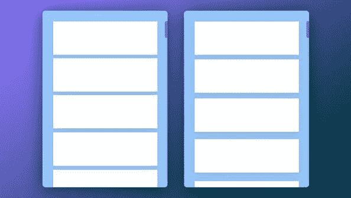](https://res.cloudinary.com/practicaldev/image/fetch/s--cWwhMeCO--/c_limit%2Cf_auto%2Cfl_progressive%2Cq_auto%2Cw_880/https://thepracticaldev.s3.amazonaws.com/i/0696afqmsw6rkmu4vz19.jpg)

第一个变体机械地向上移动所有项目的列表，而第二个变体通过时间延迟和卡片之间的间隙来模拟卡片的一点抑制。因此，第二个变体看起来很有活力，在 UI 中展示了更多的空气。

**过渡–列表到项目**

在现实世界中，用户点击列表中的一个项目。这种反应就像是打开了特定物品的屏幕。

[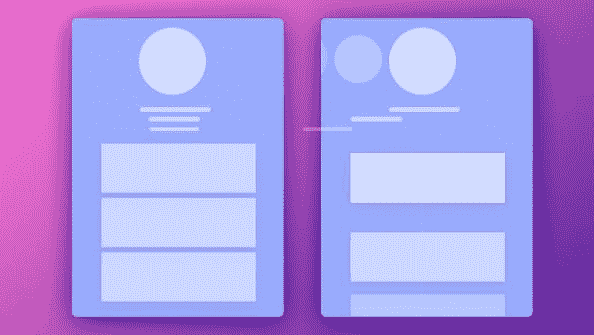](https://res.cloudinary.com/practicaldev/image/fetch/s--nzakNlSR--/c_limit%2Cf_auto%2Cfl_progressive%2Cq_auto%2Cw_880/https://thepracticaldev.s3.amazonaws.com/i/68974uqp2mtfthwxyuzt.jpg)

UI 设计师已经在动画中模拟了这个概念。第一个变体显示了一种基本的过渡方式，而第二个变体通过顶部元素的额外移动在显示中添加了一些动态。

**打开画布外菜单**

侧面菜单或抽屉菜单在现代移动用户界面设计中很常见。概念动画设计师已经把它的开放翻译成两种变体。

[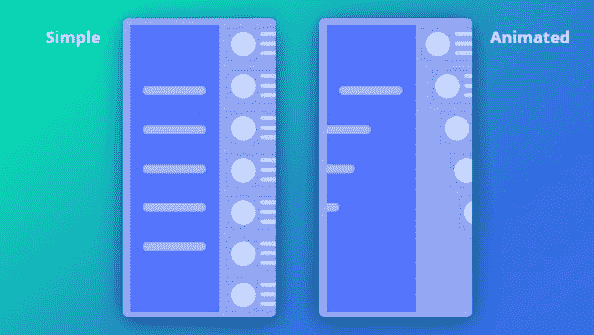](https://res.cloudinary.com/practicaldev/image/fetch/s--lfGGIaR3--/c_limit%2Cf_auto%2Cfl_progressive%2Cq_auto%2Cw_880/https://thepracticaldev.s3.amazonaws.com/i/7u7agg2z6q4njky7df5n.jpg)

第一个变体很简单，而第二个变体是动态的，使用 UI 组件的渐进流程来模拟现实生活中的现象。

**规则&UI 设计中成功动画的原则**

遵循动画规则和原则的一些最佳实践可以为您的 UI 设计项目生成成功的动画。让我们一目了然地检查一些重要的问题。

1–动画的持续时间和速度应该变慢，这样用户才能注意到状态的变化。当然，不应该引起等待。

[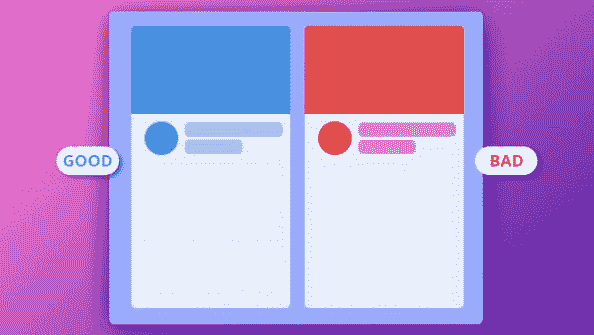](https://res.cloudinary.com/practicaldev/image/fetch/s--vWvtrR9q--/c_limit%2Cf_auto%2Cfl_progressive%2Cq_auto%2Cw_880/https://thepracticaldev.s3.amazonaws.com/i/s3h1lpwmbwmy8tm5z7ed.jpg)

碰撞或弹跳效果会分散用户的注意力，所以在你的 UI 设计动画中不要出现这种效果。

[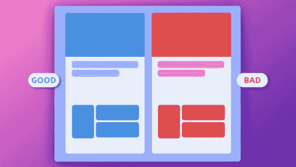](https://res.cloudinary.com/practicaldev/image/fetch/s--uFfMcuud--/c_limit%2Cf_auto%2Cfl_progressive%2Cq_auto%2Cw_880/https://thepracticaldev.s3.amazonaws.com/i/mravogltf0587ez1t1aw.jpg)

**3–大多数现代移动设备都无法支持动画中物体的运动模糊效果模拟。所以，在你的 UI 设计中还是避免为好。**

[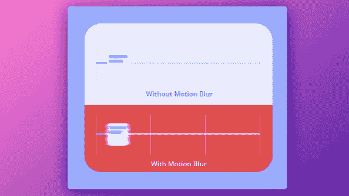](https://res.cloudinary.com/practicaldev/image/fetch/s--NW0X9c-3--/c_limit%2Cf_auto%2Cfl_progressive%2Cq_auto%2Cw_880/https://thepracticaldev.s3.amazonaws.com/i/aytomia113mm2y62bio0.jpg)

UI 设计师应该遵循平等互动的原则。这意味着所有的 UI 对象都应该遵循一个特定的外观规则。例如，在下面的例子中，一个流向是从上到下。

[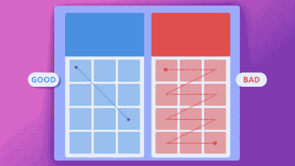](https://res.cloudinary.com/practicaldev/image/fetch/s--IdNp0EJy--/c_limit%2Cf_auto%2Cfl_progressive%2Cq_auto%2Cw_880/https://thepracticaldev.s3.amazonaws.com/i/gyuo8mw9gqm7j5y7cvof.jpg)

UI 设计者应该遵循从属交互法则，即一个中心对象吸引用户的注意力，而 UI 对象的其余部分也遵循这一法则。

[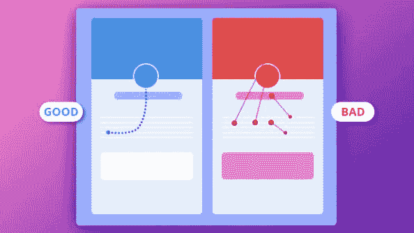](https://res.cloudinary.com/practicaldev/image/fetch/s--bkKXnFfv--/c_limit%2Cf_auto%2Cfl_progressive%2Cq_auto%2Cw_880/https://thepracticaldev.s3.amazonaws.com/i/5hfl7zqz665pvixhecfr.jpg)

**6–在材质设计中，如果想让物体变换运动更自然，就应该沿着弧形的路径运动，而不是直线。换句话说，对象应该成比例地变换它的大小。**

[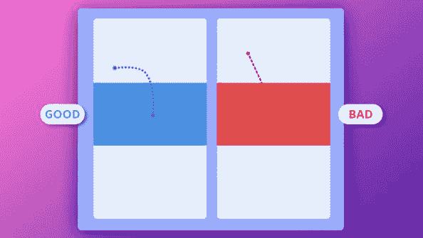](https://res.cloudinary.com/practicaldev/image/fetch/s--n4Lghp-E--/c_limit%2Cf_auto%2Cfl_progressive%2Cq_auto%2Cw_880/https://thepracticaldev.s3.amazonaws.com/i/fcjeikfs96kgh9khz32y.jpg)

**7–对象变换/移动的弧线方向应与 UI 滚动的主方向轴一致。所以，在下面的图像中，物体先向右，然后向下。**

[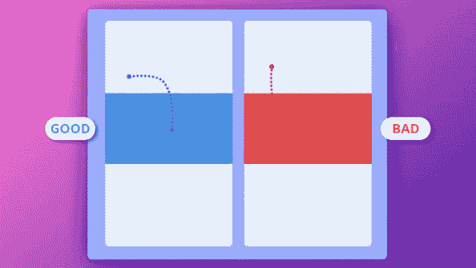](https://res.cloudinary.com/practicaldev/image/fetch/s---r1XxOMB--/c_limit%2Cf_auto%2Cfl_progressive%2Cq_auto%2Cw_880/https://thepracticaldev.s3.amazonaws.com/i/unzh2nc1qsmu2g1vimet.jpg)

如果在移动物体的路径上出现交叉，它会分散 UX 的注意力。因此，在 UI 设计中，无论是加快还是减慢某些对象的速度，都要为移动留出足够的空间。

[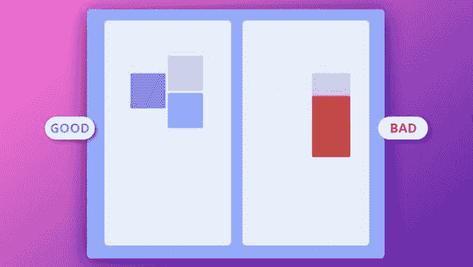](https://res.cloudinary.com/practicaldev/image/fetch/s--4qtHgJgm--/c_limit%2Cf_auto%2Cfl_progressive%2Cq_auto%2Cw_880/https://thepracticaldev.s3.amazonaws.com/i/ppgvn0fanayady3fsza0.jpg)

**结论:**

我们知道动画在数字设备用户界面设计中的额外优势。我们也开始了解现代设计中流行的不同类型的动画。动画设计有一定的规则，遵循这些规则，我们可以在用户界面设计中取得预期的成功。

现在的问题是，谁能帮你决定哪种动画类型是你的 UI 设计项目的最佳选择？在你的用户界面设计中，如何小心地实现动画规则？如果你努力寻求准确的答案，并寻找合适的 UI 设计团队，SysBunny 是一个以经济高效的方式开始的绝佳场所。它拥有一个无可挑剔的用户界面设计师团队，无论你的用户界面设计项目有多复杂，无论是网页、手机，甚至是可穿戴设备，都能保证得到满意的结果。