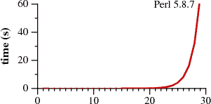

# CloudFlare 如何避免停机(可能)

> 原文：<https://dev.to/xowap/how-cloudflare-could-have-avoided-its-outage-maybe-1jko>

有趣的是，CloudFlare 昨天宕机了一段时间。[事后分析](https://blog.cloudflare.com/cloudflare-outage/)解释说，整个情况是由于全局部署到 WAF 的正则表达式导致 CPU 过载。

怎么会呢？嗯，我们不知道，因为 regexp 没有公开列出，但是如果你知道 regexp 有一个巨大的缺点，猜测是很简单的。

> **注意** —这只是猜测！

正则表达式引擎的一个典型例子是`a?a?a?aaa`。对于像这里这样的 3 `a`来说，这很容易，但当你到了 20 岁，就已经非常复杂了。有关示例，请参见以下 Python 代码。

[https://repl.it/@xowap/time-re?lite=true](https://repl.it/@xowap/time-re?lite=true)

我得到的输出是

```
re.compile('a?a') = 8.5528998170048e-05
re.compile('a?a?a?a?a?aaaaa') = 0.0009152740021818317
re.compile('a?a?a?a?a?a?a?a?a?a?aaaaaaaaaa') = 0.009123567000642652
re.compile('a?a?a?a?a?a?a?a?a?a?a?a?a?a?a?aaaaaaaaaaaaaaa') = 0.4090354809995915 
```

Enter fullscreen mode Exit fullscreen mode

这张图(摘自我将在本文后面链接的文章)看起来像这样:

[](https://res.cloudinary.com/practicaldev/image/fetch/s--NEbKRux8--/c_limit%2Cf_auto%2Cfl_progressive%2Cq_auto%2Cw_880/https://thepracticaldev.s3.amazonaws.com/i/57mupv17f4dipuk34og3.png)

如你所见，绝对不成正比。实际上，超过十几个问号之后，它就变得很慢，到了二十个左右就完全疯狂了。

这里发生了什么？由于 regex 引擎是*回溯*，所以每当你有一个问号，它就会创建一个不同的分支。这意味着它将探索字符串*匹配*的所有不同方式。这个的复杂度是阶乘！

好消息是你不必做缓慢的正则表达式。你写它们的方式没有问题，而是背后的算法问题。你可能听说过肯·汤普森。

他发明了一种处理正则表达式的方法，现在被称为汤普森·NFA。长话短说，他们把以前看到的秒变成微秒！

#### 是魔法吗？

这只是一个非常聪明的优化，将复杂性降低到线性程度。

#### 它是如何工作的？

解释起来很长，而且已经有一篇关于这个问题的非常好的文章，所以我不打算抄袭。

#### 为什么今天不用？

因为现代正则表达式引擎的一些特性不允许这样做。但是大多数正则表达式不使用这些特性，所以现代引擎*可能有两个引擎，包括一个基于汤普森-NFA 的引擎，以避免爆炸性的复杂性。再次，[见文章](https://swtch.com/~rsc/regexp/regexp1.html)。*

#### 今天可以用吗？

当然，有很多实现。然而，据我所知，没有一个是主流。关于 [Python](https://github.com/xysun/regex) 或者 [JavaScript](https://github.com/afader/thompson-regex-js) 的例子参见。

#### 今天该不该用？

视情况而定:

*   你做一些奇特的事情吗？
*   它对性能敏感吗？
*   你对插入的表达式有多少控制权？

如果您是 CloudFlare，并且您的 regexps 将在无数的 HTTP 查询上运行，它们寻找超级怪异的安全模式，并且是由几十个工程师创建的，那么您可能应该使用它。

如果您正在验证表单中的电子邮件，您可能不需要在意。

## 结论

正则表达式引擎是有缺陷的，因为它们的复杂性可以完全爆炸。正如 CloudFlare 所展示的，反响可能是巨大的。

好消息是，有替代引擎不会遭受这种问题。另一方面，它们不是主流，所以集成起来有点复杂，因为这会增加维护面。

这意味着你必须知道缺陷，每次使用正则表达式时，你都需要为它选择合适的引擎。那么你可能会避免很多戏剧！