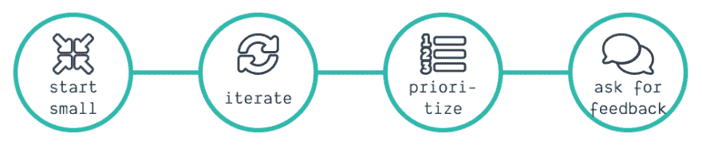
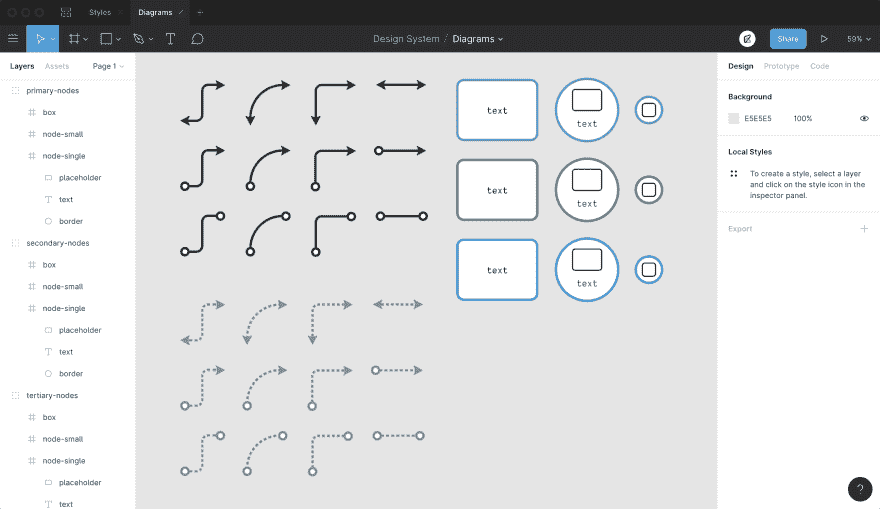

# 你如何找到让你的副业继续下去的动力？

> 原文：<https://dev.to/kevtiq/how-did-i-find-my-motivation-to-get-my-side-projects-going-4kp>

我做网页开发已经超过 10 年了。这一切都始于 Photoshop 的免费大学许可，它让我进入了网页设计领域。我开始意识到，如果我想让我的设计出现在网络上，我必须学习 HTML 和 CSS 来实现它。Photoshop 和一些网页开发成了我的爱好。大约在同一时间，我发现了另一个爱好:写作。

我过去是，现在仍然是游戏的忠实粉丝。2008 年，有人找到我，让我成为一个小网站的作者，这个网站开始被称为 [PlayWatchRead](https://www.playwatchread.nl/) 。很快，我也参与了网站的设计和开发，并一直坚持到 2018 年网站十周年。

自从我试图在我的爱好之间找到一个平衡来开始一些事情。多年来，我和我的 WordPress 网站一直是分分合合的关系，从来没有发货过。直到最近，我才可以把我的网站上线并开始使用它。好吧，我不得不承认；它被搁置了几年。但是这些年来，我很难保持交付最终产品的动力。那么我是怎么找到自己的动力并保持最后一次的呢？

## 从小做起

为业余项目或爱好平衡你的时间是非常困难的。不管它是一幅画，网站还是播客。你的初始范围越大，失败的可能性就越大。没有什么比失败更糟糕的了。

在我建立网站的所有尝试中，我有很多目标。我想向世界展示我能做什么，一部分应该是博客，最后，我想在造型上几乎完全自由。每次我用 WordPress 开始，都失败了。为什么？因为我的两个目标都太大了，WordPress 也太大了，无法实现我的一些目标。

对我来说幸运的是，我们生活在一个后 WordPress 的网站建设世界。与几年前相比，现在建立一个静态网站要容易得多。但是选择最初的技术结构只解决了一半的问题。我不得不缩小范围，但不能忘记我的目标。

> 缩小你最初的范围，但不要忘记你最初的目标

当我遵循我最初的网站构想时，我会花上几天甚至几周的时间来制作。这将确保我会再次失去动力。所以我问自己，能让我保持动力的最小结果是什么？我喜欢在网站代码上修修补补，偶尔还能写一篇博客。那么，为什么不从一个显示博文列表的页面和一个显示单篇博文的页面开始呢？

## 小迭代

现在，我的网站的最初版本终于上线了。它甚至有了第一篇博文！现在怎么办？我过去有，现在仍然有很多想法。我可以为我的网站和帖子写作。看到一长串我想写和整合的东西令人望而生畏。尤其是因为它处于两个非常不同的层次:写作和编程。

为了保持动力，我和自己做了个交易。因为我的职业生涯围绕着编程，所以我的首要任务是写作。但是，对于我写的每一篇文章，我都会为我的网站或与之相关的东西实现一个想法。给你一些想法，这些是我的一些迭代。

*   在我的第二篇博文中，我为我的网站实现了一个黑暗主题；
*   在那之后，我改进了 SEO，它让我学到了一些很棒的新东西；
*   接下来是社交媒体分享方面的改进(例如，在 Twitter 上设置分享图片的能力)；
*   在我的上一篇文章中，我在 Figma 中创建了各种组件来创建一致的图。这让我学到了很多关于图中约束系统的知识。

什么？最后一个与我的网站无关。它不一定是网站上的变化，只要它影响网站。因此，通过将我的注意力转移到 Figma，我学到了一些我可以使用的新东西。

## 分清主次

但是我的下一次迭代会是什么呢？我试着优先考虑我的博客文章和改进。有两个重要的方面会影响优先排序。首先也是最重要的:我最兴奋的事情是获得最高优先级。第二，我试图将我网站的改进与我写的下一篇博文结合起来。

我的网站的内容和访问者都在增长。因此，在这方面我已经有两个选择。我可以创建一个“固定”文章区，以确保我最喜欢的帖子总是可以访问到。另一个选择是创建一个“关于我”的页面，提供更多关于我自己的内容。我决定将第一个特性与本文一起发布。

> 我的优先事项会改变，而且经常改变

我的优先事项会改变，而且经常改变。像你们中的许多人一样，每当我读到别人的新博客帖子时，我都会对完全新的东西感到兴奋。我用这种巅峰的兴奋来提升自己的动力。所以我的优先事项必须改变，而且经常改变。这是一件好事，因为我根据自己的动机来指导我的优先事项。当你强迫自己工作时，即使是你喜欢的事情，你也会更快失去动力。

## 寻求对你工作的反馈

我优先考虑的事情不仅仅因为我阅读的其他博客文章而改变。我经常根据反馈获得新帖子和网站改进的灵感。我与我的妻子、朋友和同事分享我的工作，以获得初步反馈。但是我在不同的社区分享我的作品。在这里，我得到了我最重要的反馈。

我开始在 Dribbble 上设计我的[标志](https://dribbble.com/shots/6709595-Personal-Brand-Logo-V2)和一张[数码图](https://dribbble.com/shots/6815153-CSS-Owl-selector)。我在[实用开发](https://dev.to)上分享我的写作。尤其是对于后者，对我文章的评论和讨论，激发了我对文章的跟进。因为建设性的讨论，我有很高的动机去写这些。这意味着我的优先顺序会根据读者的评论而改变！

## 是什么让你保持动力？

正如你所看到的，我有一个流程或过程来最终启动我的网站并保持我的动力。你是如何对自己的爱好和业余项目保持动力的？请在评论中或在 [Twitter](https://twitter.com/kevtiq) 上告诉我！