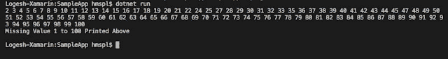

# 如何在给定的 1 到 100 的整数数组中找到一个缺失的数字而不使用 Loop

> 原文：<https://dev.to/logeshpalani30/how-do-you-find-a-missing-number-in-a-given-integer-array-of-1-to-100-without-using-loop-1gd0>

让我们做简单的 C#代码

输入:给定数组
1，46，34，23，26

| |
|
| |

输出:

