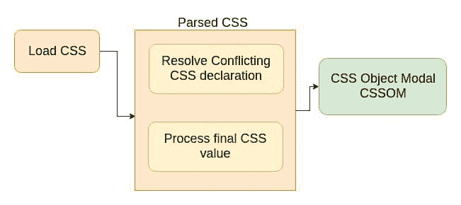
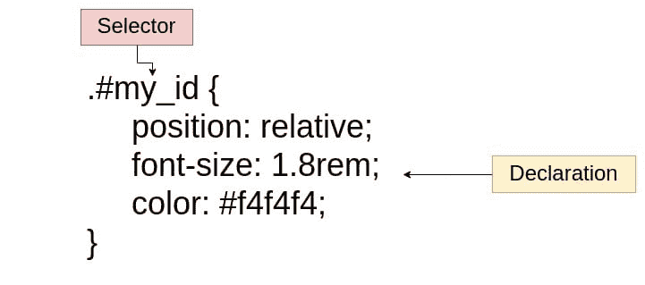
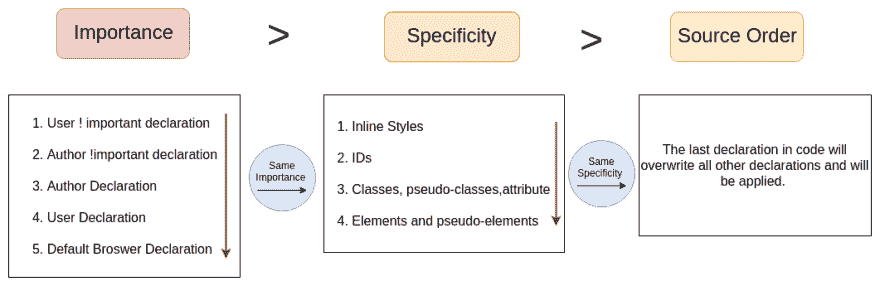

# CSS 是如何在幕后工作的？

> 原文：<https://dev.to/jscodelover/how-does-css-works-behind-the-scenes-cbf>

在本文中，我们将学习 CSS 解析阶段。

<figure> 

<figcaption>乔纳斯·施梅特曼</figcaption>

</figure>

首先，让我们快速回顾一下 CSS 规则中的术语。规则由选择器和声明块组成。

选择器用于选择一个或多个我们想要样式化 HTML 元素。每个声明都由一个 CSS 属性及其对应的值组成。我们赋予属性的这个值称为声明值。

现在，我们来谈谈 CSS 解析阶段。

### 解决冲突的 CSS 声明(层叠)

级联是指当有多个规则适用于某个元素时，组合不同的样式表并解决不同 CSS 规则和声明之间的冲突的过程。

字体大小属性可以出现在几个样式表中，也可以在一个样式表中出现几次。

CSS 有以下不同的来源:

1.  **作者声明**(开发者编写的 css)
2.  **用户声明**(用户在浏览器中完成的设置，例如在浏览器中设置字体大小)
3.  **浏览器声明**(也称为用户代理，默认浏览器声明)

Cascade 组合了来自所有这些不同来源的 CSS 声明。

> 但是级联实际上是如何解决冲突的呢？
> 它通过查看冲突声明的重要性、特异性和来源顺序来确定哪一个优先。

以下是我们查看所有匹配规则的重要性、特异性和来源顺序的顺序。

<figure> 

<figcaption>乔纳斯·施梅特曼</figcaption>

</figure>

## 重要性

> 一个规则！无论该规则出现在 CSS 文档中的什么位置，都将始终应用重要指令。

最重要的声明是用重要的关键字标记的**用户声明。其次，第二重要的声明是标有重要的**的**作者声明。第三，正常的**作者声明**，最后最不重要的是默认的**浏览器声明**，这实际上很有意义，这样我们可以很容易地覆盖这些默认来自浏览器的声明。**

让我们看一个例子来更好地理解: