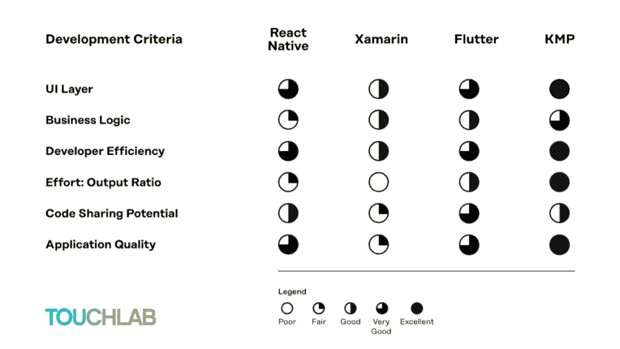

# Kotlin 多平台与其他解决方案相比如何？我们的记分卡，解释说。

> 原文：<https://dev.to/touchlab/how-does-kotlin-multiplatform-stack-up-against-other-solutions-our-scorecard-explained-4g28>

在我的上一篇文章中，我解释了你应该尝试 Kotlin 多平台的原因——不是因为它能做任何事情，而是因为它不能。它不做 UI，甚至也不尝试做。然而，它确实做了一件非常好的事情:为 iOS 或 Android 编写业务逻辑。您只需编写一次代码，就可以部署到任何一个平台上，几乎不会出现任何问题，因为您将 UI 保持在独立的平台上。

自然，引入一种相对较新的编码方式会立即引起与其他流行的多平台解决方案的比较。我用记分卡来结束这篇文章，是为了快速、逐点地比较 KMP 的三个主要解决方案。在这里，我想提供一些关于我们为什么以这样的方式得分的细节。

### UI 层

#### KMP

为什么 KMP 连一个用户界面层都没有，却在用户界面上给它如此高的评价？因为它根本不会妨碍用户界面。Flutter、RN 和 Xamarin 都表示，共享 UI 有利于购买他们各自的生态系统——但每个人的期望和现实之间都有差距。使用 KMP 时，您可以单独编写本机 UI 代码，这样您可以更好地控制结果，从而获得最佳用户体验。

#### 飘起

Flutter 不能让你轻松地使用原生组件来编写 UI。相反，它控制所有的渲染，要么提供显示底层原生 Android 代码的透明视图，要么使用需要相当笨拙的原生互操作的 PlatformViews。无论哪种方式，它本质上都是在自己的画布上选择整个 UI。而如果有 bug，就要等 Flutter 的更新了。

#### 反应原生

虽然您可以使用 React Native 创建自定义的本机 UI 小部件，但是 Javascript 性能仍然是一个问题。例如，开发人员经常会说它承诺 60fps，但它妨碍了良好的 UI。它还阻碍了开发效率，因为它的 UI 小部件库不是由 React Native 维护的。

#### Xamarin

如果你对……情有独钟。NET，Xamarin 将对您有用。但是 Xamarin。Forms 有很多限制，Xamarin 本身并没有真正创建一个伟大的 ui 生态系统。你必须在 Xamarin、Android 以及 Xamarin.iOS 中制作单独的 ui，这比在本地制作要麻烦得多。同样，这也是我们不推荐用 Kotlin 原生语言编写 UIKit 代码的原因(即使你可以)。

### 业务逻辑

#### KMP

对于 Android 来说，KMP 已经是尽可能的本土化了。对于 iOS 来说，它在与惯用的 Swift 代码共享业务逻辑方面仍有一些问题，但总体而言，它是超级快的——并且原生互操作意味着你没有桥或通道要处理。

#### 飘起

目前，Flutter 没有与原生代码充分共享业务逻辑。Flutter 团队正致力于将其集成到原生应用中，但目前仍处于实验阶段。当你需要集成原生代码时，你需要跨通道通信，否则你必须全部用 Dart 编码——一种没有被广泛使用或支持的语言。虽然 Dart VM 相当快，但不如完全本机的解决方案快。基本上，如果你不想处理互操作性问题，完全在 Flutter 中工作会更容易。

#### 反应原生

为了与 native 互操作，它必须通过 JavaScript 解释器[更新:脸书知道这是一个问题，最近发布了他们自己的专门针对 RN 应用程序的 [JS 引擎](https://engineering.fb.com/android/hermes/):，所以它总是会落后于更多的原生解决方案。此外，使用 JavaScript 桥接 native 的成本很高，比 Xamarin 或 Flutter 的成本都高。

#### Xamarin

本质上，Xamarin 提出了与 Flutter 相同的问题:与本机代码没有直接的互操作性。你必须使用 C++、JNI、Java、Kotlin 或 Objective-C 绑定。目前无法与 Swift 互操作，你根本无法与非 Xamarin 应用程序共享业务逻辑，微软也没有这样做的计划。

### 开发者效率

#### KMP

使用 KMP 进行调试非常简单，因为您已经在使用的调试工具是兼容的。Android 编码人员可以在 Kotlin IDE 中调试，iOS 编码人员可以在 Xcode 中调试。与此同时，随着 KMP 图书馆的持续增长，您不会被束缚住——只需使用对该生态系统有意义的工具。

#### 飘起

使用 Flutter，您需要一个包装器来包装它的库，以便与本机代码进行通信。iOS 开发不能用 Xcode。虽然你可以使用 Android Studio，但你并不是真的在用 Flutter 构建一个 Android 应用，你是在构建一个 Flutter 应用并使用 Flutter 插件。本质上，你是在外国领土上。

#### 反应原生

脸书在 React Native 上投入了大量的精力，使你能够从许多优秀的调试工具和集成良好的 ide 中进行选择。它有一个庞大且不断增长的社区，这个社区源于 web 开发生态系统。即便如此，你也无法像使用 KMP 那样轻松地使用原生库，因此你仍然需要将工作放入尚未移植的库中，并与现有应用程序集成。如果你还没有网上商店，你需要了解整个生态系统。

#### Xamarin

为了集成现有的本地库，仅支持绑定到 ObjC 框架，并需要 Java 绑定或 JNI。有时候，你不能将任何来自原生 iOS 或 Android 的新框架带入 Xamarin 项目。此外，您需要使用 LLDB 或 GDB 来调试本机代码。

### 充分利用多平台

#### KMP

有了 KMP，Android 已经完全是本地的了，所以没有必要再搭建桥梁了。而且，在 iOS 上，KMP 编译了一个带有 Objective-C 头文件的本地框架，所以，再一次，桥是不必要的。你可以很容易地把一个主要是商业逻辑的 Android 库变成一个 KMP 库(如果已经用 Kotlin 写了就更容易了)。虽然 UI 必须是独立的，但这不是问题，因为 UI 可以是一个非常薄的层，不依赖于业务逻辑层。

—像 MVP、MVVM 和 CLEAN 这样的通用架构实践已经鼓励分离业务逻辑和更薄的 ui。这只是一个微小的修改，以适应共享模块层。

#### 飘起

把一个现有的 Android 库改造成一个 Flutter 库比使用 KMP 要困难得多。Flutter 真的被设计成了一个自成体系的生态系统。很难与非 Flutter 应用程序共享。虽然共享 UI 比在 React Native 或 Xamarin 中要好，但您必须构建自己的库，或者用 Dart 编写。

#### 反应原生

React Native 对于较大的应用程序或较大的团队来说并不理想，尽管开发人员社区很大，但大多数都是由 web 开发人员组成的，因此不一定完全适应移动开发。存在显著差异——屏幕尺寸、用户界面预期、由于 CPU、RAM 和图形芯片的可变性而导致的可变设备性能、离线和低或不可靠的网络连接，以及由苹果、谷歌和三星的大量工程投资推动的特定平台创新。

#### Xamarin

Xamarin 有自己的生态系统，开发者社区相对较小，与其他生态系统的共享非常有限。你必须在 Xamarin 中构建 ui。表单，或者您必须在 Xamarin 中使用 C#单独构建它们。Android 和 Xamarin.iOS。

### ***潜在代码共享***

#### KMP

尽管 KMP 不共享用户界面，这限制了你可以共享的数量，但你可以设计应用程序，使用户界面层尽可能薄，这实际上是很好的架构实践。而且给用户做最好的 UI 也是很好的做法，反正平台之间需要 UI 发散。使用 KMP，当用户界面需要分离时，你不会遇到障碍。并且您将能够更容易地以更少的性能代价共享非 UI 代码。

#### **飘起**

Flutter 提供了除特定平台特性之外的一切，这些特性需要一个[通道](https://flutter.dev/docs/development/platform-integration/platform-channels)到本地代码。因此，如果您需要的库已经存在于 Flutter 生态系统中，那太好了。但是如果没有，您需要自己创建它，这基本上需要为三个平台编写代码——Android、iOS 和 Flutter Package API，以便与特定于平台的实现进行通信。

#### **反应土著**

React Native 提供了除特定平台特性或高性能逻辑之外的一切(这使得它不如 Flutter 理想)，其中每一项都需要一个到本机代码的[桥](https://facebook.github.io/react-native/docs/native-modules-ios)。如果你需要的一个库已经存在于它的生态系统中，你就准备好了。如果没有，就像 Flutter 一样，需要自己创建，这需要编写三个平台的代码——Android、iOS 和 React 原生桥模块。

#### Xamarin

对于简单的应用，Xamarin。Forms 允许您共享接近 100%的内容。但对于更复杂的应用程序来说，这并不理想，因为许多 UI 和任何特定于平台的功能都需要分离到 Xamarin.iOS 和 Xamarin 中。Android 项目。

### 最高 App 质量

#### KMP

使用 KMP 编码时，你可以获得完全原生的用户界面和业务逻辑，与 iOS 或 Android 中完全原生的应用具有相同的应用质量。

#### 飘起

虽然 UI 是高性能的(正如 Flutter dev-rel 的人喜欢说的“非常平滑”)，但对于经验丰富的用户来说，很容易以较低的质量结束。此外，Dart VM 相当快，比 Javascript 快得多，但是仍然有通道开销问题需要处理。同样，对旧设备的支持也不够强大。特别是对于 Flutter，旧设备上的 UI 可能看起来很现代，但性能可能比原生 UI 和实现更差。

#### 反应原生

从积极的方面来看，React 原生架构鼓励原生视图和小部件，因此您不会落后于平台 UX 更新。(用户期待这些；否则，应用程序对他们来说就开始显得陈旧了。)然而，由于 Javascript，性能下降的风险更高(尤其是在 Android 设备上，标准 Javascript 的性能与 iPhone 6s 的性能差不多，脸书最近发布了他们自己的专门针对 Android 上 RN 应用的 T2 引擎)。

#### Xamarin

对于 Xamarin 来说，UI 真的是事后诸葛亮。Xamarin。表单最近得到了更多的关注，但即使加入了原生小部件，你最终还是要用 Xamarin.iOS 和 Xamarin 编写一个完整的应用程序。在得到现代用户普遍认为质量好的东西之前。至于性能，MonoVM 确实相当快，但是仍然存在桥接开销问题。

*原载于 2019 年 9 月 4 日*[*【https://touchlab.co】*](https://touchlab.co/how-does-kotlin-multiplatform-stack-up-against-other-multiplatform-solutions-our-scorecard-explained/)*。*