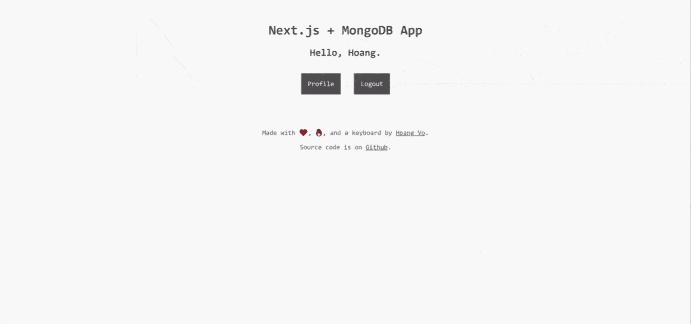
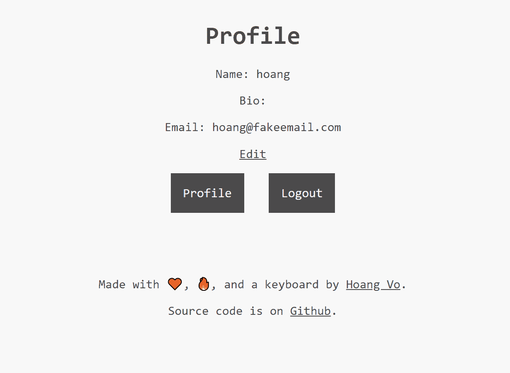
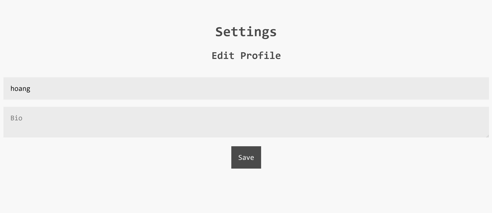

# [过时]我如何用 Next.js 和 MongoDB 构建一个成熟的应用程序第 2 部分:用户资料和资料图片

> 原文：<https://dev.to/hoangvvo/how-i-build-a-full-fledged-app-with-next-js-and-mongodb-part-2-user-profile-and-profile-picture-19cg>

## 这并不能反映 nextjs-mongodb-app 最近的重写。查看[最新版本](https://dev.to/hoangvvo/how-i-build-a-full-fledged-app-with-next-js-and-mongodb-part-2-user-profile-and-profile-picture-hcp)。

在这篇文章中，我将继续研究 [nextjs-mongodb-app](https://github.com/hoangvvo/nextjs-mongodb-app) 。这是《T2》第一部的续集。

在此期间，我做了一些修改。

*   在 _app.js 中，我删除了`<Container>`，因为它已被弃用。
*   一些造型

同样，下面是 Github 库和这个项目的演示。

[Github 回购](https://github.com/hoangvvo/nextjs-mongodb-app)

[演示](https://nextjs-mongodb-app.hoangvvo.now.sh/)

## 我们在制造什么

[](//images.ctfassets.net/rgbpfpd0hrww/3SON0nw56pTo9MNuXlq9H2/def7376b13e7887c6f9dfff2fee3f82e/nextjs-mongodb-app_User_profile_GIF.gif)

我们增加了以下功能:

*   个人资料页面
*   编辑个人资料
*   个人资料图片

## 建立用户档案

### 用户简介页面

[](//images.ctfassets.net/rgbpfpd0hrww/1cJVUmv3CHdmupdHxthqab/ae04eab3c14905eaeecca68aa25563b8/Profile_Page.png)

我的用户资料页面将位于`/profile`。创建`/pages/profile/index.js`。

原因是，我在`/profile`里有`index.js`而不是`profile.jsx`是因为我们后来增加了`/profile/settings`。

```
import React, { useContext } from 'react';
import Link from 'next/link';
import { UserContext } from '../../components/UserContext';
import Layout from '../../components/layout';

const ProfilePage = () => {
  const { state: { isLoggedIn, user: { name, email, bio } } } = useContext(UserContext);

  if (!isLoggedIn) return (<Layout><p>Please log in</p></Layout>);
  return (
    <Layout>
      <div>
        <h1>Profile</h1>
        <div>
          <p>
          Name:
            {'  '}
            { name }
          </p>
          <p>
          Bio:
            {'  '}
            { bio }
          </p>
          <p>
          Email:
            {'  '}
            { email }
          </p>
        </div>
        <Link href="/profile/settings"><a>Edit</a></Link>
      </div>
    </Layout>
  );
};

export default ProfilePage; 
```

Enter fullscreen mode Exit fullscreen mode

没有什么新东西，我们使用`Context API`来获取我们的用户信息。但是，看

```
if (!isLoggedIn) return (<Layout><p>Please log in</p></Layout>); 
```

Enter fullscreen mode Exit fullscreen mode

您可以看到，如果用户没有登录，我会返回一条消息说请登录。

我还添加了一个新字段，`bio`。然而，为了让它工作，我们需要修改我们的`/api/session` :

```
const { name, email, bio } = req.user;

return res.status(200).send({
  status: "ok",
  data: {
    isLoggedIn: true,
    user: { name, email, bio }
  }
}); 
```

Enter fullscreen mode Exit fullscreen mode

基本上，我正在检索附加的`bio`字段并返回它。

另外，我在设置页面添加了一个链接:

```
<Link href="/profile/settings"><a>Edit</a></Link> 
```

Enter fullscreen mode Exit fullscreen mode

这就是我们现在要创造的。

### 概要文件设置页面

#### 构建概要文件更新 API

我们的应用程序更新用户资料的方式是向`/api/user`发出**补丁**请求。

创建`pages/api/user/index.js` :

```
import withMiddleware from '../../../middlewares/withMiddleware';

const handler = (req, res) => {
  if (req.method === 'PATCH') {
    if (!req.user) return res.status(401).send('You need to be logged in.');
    const { name, bio } = req.body;
    return req.db
      .collection('users')
      .updateOne({ _id: req.user._id }, { $set: { name, bio } })
      .then(() => res.json({
        message: 'Profile updated successfully',
        data: { name, bio },
      }));
  }
  return res.status(405).end();
};

export default withMiddleware(handler); 
```

Enter fullscreen mode Exit fullscreen mode

如果请求方法是`PATCH`，将执行配置文件更新逻辑。

它首先通过检查`req.user`来检查用户是否登录。如果没有，它将发送一个 [401](https://developer.mozilla.org/en-US/docs/Web/HTTP/Status/401) 响应。

它将从请求体中检索`name`和`bio`，并调用 MongoDB [UpdateOne](https://docs.mongodb.com/manual/reference/method/db.collection.updateOne/) 来更新用户配置文件。

查询(过滤器)是具有当前登录用户的`_id`的文档。如果成功，它将通过消息`Profile updated successfully`返回更新的信息。

#### 概要文件设置页面

[](//images.ctfassets.net/rgbpfpd0hrww/7dsO9DeEmlz71EkuDuNxh9/503949e1385acb29d160ac84e08c751e/Profile_Settings_Page.jpg)

让我们创建`pages/profile/settings`

```
import React, { useContext, useState } from 'react';
import axioswal from 'axioswal';
import { UserContext } from '../../components/UserContext';
import Layout from '../../components/layout';

const ProfileSection = ({ user: { name: initialName, bio: initialBio }, dispatch }) => {
  const [name, setName] = useState(initialName);
  const [bio, setBio] = useState(initialBio);

  const handleSubmit = (event) => {
    event.preventDefault();
    axioswal
      .patch(
        '/api/user',
        { name, bio },
      )
      .then(() => {
        dispatch({ type: 'fetch' });
      });
  };

  return (
    <section>
      <h2>Edit Profile</h2>
      <form onSubmit={handleSubmit}>
        <div>
          <input
            required
            type="text"
            placeholder="Your name"
            value={name}
            onChange={e => setName(e.target.value)}
          />
        </div>
        <div>
          <textarea
            type="text"
            placeholder="Bio"
            value={bio}
            onChange={e => setBio(e.target.value)}
          />
        </div>
        <button type="submit">
          Save
        </button>
      </form>
    </section>
  );
};

const SettingPage = () => {
  const { state: { isLoggedIn, user }, dispatch } = useContext(UserContext);

  if (!isLoggedIn) return (<Layout><p>Please log in</p></Layout>);
  return (
    <Layout>
      <h1>Settings</h1>
      <ProfileSection user={user} dispatch={dispatch} />
    </Layout>
  );
};

export default SettingPage; 
```

Enter fullscreen mode Exit fullscreen mode

在设置页面中，我将 profile 部分抽象成`<ProfileSection />`，并传入`user`和`dispatch`的道具(需要更新用户对象时调用的 reducer)。

我们将让我们的`name`和`bio`状态具有默认值`initialName`和`initialBio`，它们基本上是来自被传递的`user`对象的`name`和`bio`。

类似地，我们将在输入变化时设置每个值。在提交表单时，将使用`name`和`bio`向`/api/user`发出一个**补丁**请求。然后我们调用`dispatch({ type: 'fetch' })`来更新我们的应用程序中显示的用户信息。

## 建立个人资料图片功能

个人资料图片是一个更复杂的工作，所以我专门为它的一部分。我们需要一个地方来存放我们的图片。我选择 [Cloudinary](https://cloudinary.com) 来托管我的图像，但是你可以使用任何服务。

### 添加个人资料图片到设置页面

在我们的第一个表单之后，添加我们的个人资料图片表单:

```
/* ... */
const profilePictureRef = React.createRef();
const [isUploading, setIsUploading] = useState(false);

const handleSubmitProfilePicture = event => {
  if (isUploading) return;
  event.preventDefault();
  setIsUploading(true);
  const formData = new FormData();
  formData.append("profilepicture", profilePictureRef.current.files[0]);
  axioswal.put("/api/user/profilepicture", formData).then(() => {
    setIsUploading(false);
    dispatch({ type: "fetch" });
  });
};

return (
  <section>
    /* ... */
    <form onSubmit={handleSubmitProfilePicture}>
      <label htmlFor="avatar">
        Profile picture
        <input
          type="file"
          id="avatar"
          name="avatar"
          accept="image/png, image/jpeg"
          ref={profilePictureRef}
          required
        />
      </label>
      <button type="submit" disabled={isUploading}>
        Upload
      </button>
    </form>
  </section>
); 
```

Enter fullscreen mode Exit fullscreen mode

`isUploading`状态告诉我文件是否正在上传。我们确实希望用户通过多次提交表单意外地多次上传。如果`isUploading`为真:`disabled={isUploading}`，提交按钮被禁用，如果`isUploading`为真:`if (isUploading) return;`，表单将不做任何事情

我在提交开始时将`isUploading`设置为`true`，在提交完成时将它设置回`false`。

文件输入是一个不受控制的组件，这意味着它的值只能由用户设置。官方文档对此有一个[很好的解释](https://reactjs.org/docs/uncontrolled-components.html)。我们只能通过使用 [React Refs](https://reactjs.org/docs/refs-and-the-dom.html) 得到它的值。

让我们看看我们的表单提交:

```
const handleSubmitProfilePicture = event => {
  if (isUploading) return;
  event.preventDefault();
  setIsUploading(true);
  const formData = new FormData();
  formData.append("profilePicture", profilePictureRef.current.files[0]);
  axioswal.put("/api/user/profilepicture", formData).then(() => {
    setIsUploading(false);
    dispatch({ type: "fetch" });
  });
}; 
```

Enter fullscreen mode Exit fullscreen mode

我们正在创建一个`FormData`并将我们的文件`profilePictureRef.current.files[0]`追加到`profilePicture`字段中(记住这一点)。然后，我们向`/api/user/profilepicture`发出一个包含那个`FormData`的`PUT`请求。然后，我们再次调用`dispatch({ type: "fetch" });`来更新应用程序中的用户数据。

### 建立个人资料图片上传 API

我希望我们的个人资料图片上传的终点是`PUT /api/user/profilepicture`。我选择了`PUT`方法，因为它指的是一个 Upsert(更新或插入/替换当前配置文件图片或设置新的配置文件图片)操作。

我们需要一些东西来解析上传的文件。在`Express.js`中，你可能会听说过[穆特](https://www.npmjs.com/package/multer)。然而，由于我们没有使用`Express.js`，我将使用一个叫做[强大](https://www.npmjs.com/package/formidable)的模块。

```
npm i formidable 
```

Enter fullscreen mode Exit fullscreen mode

让我们创建我们的`pages/api/user/profilepicture.js` :

```
import formidable from 'formidable';
import withMiddleware from '../../../middlewares/withMiddleware';

const handler = (req, res) => {
  if (req.method === 'PUT') {
    if (!req.user) return res.status(401).send('You need to be logged in.');
    const form = new formidable.IncomingForm();
    return form.parse(req, (err, fields, files) => {
      console.log(files.profilePicture.path);
      res.end('File uploaded');
    });
  }
  return res.status(405).end();
};

export const config = {
  api: {
    bodyParser: false,
  },
};

export default withMiddleware(handler); 
```

Enter fullscreen mode Exit fullscreen mode

请注意，我还没有集成`Cloudinary`。看着:

```
export const config = {
  api: {
    bodyParser: false,
  },
}; 
```

Enter fullscreen mode Exit fullscreen mode

我正在禁用 Next.js 9 主体解析器，因为它与我们的`Formidable`解析器不兼容。

我们现在解析我们的文件。

```
const form = new formidable.IncomingForm();
return form.parse(req, (err, fields, files) => {
  console.log(files.profilePicture.path);
  res.end('File uploaded');
}); 
```

Enter fullscreen mode Exit fullscreen mode

`form.parse()`给出一个包含`error`、`fields`和`files`参数的回调函数。我们只关心`files`的争论。`files`参数给出了一个包含多部分格式的所有文件的对象。我们正在寻找的是`profilePicture`字段。

为了便于学习，我记录了文件保存的路径。运行应用程序，并在控制台中查看输出。文件应该在提到的路径下。

#### 融会贯通

这是文件上传逻辑的部分。此部分的内容取决于您选择的文件上传库或服务。我在我的例子中使用了 Cloudinary。

如果您使用 Cloudinary，请在那里创建一个帐户。

##### 配置云状

Cloudinary 提供了它的 [Javascript SDK](https://www.npmjs.com/package/cloudinary) 。继续安装它:

```
npm i cloudinary 
```

Enter fullscreen mode Exit fullscreen mode

要配置`Cloudinary`，我们需要设置以下环境变量:

```
CLOUDINARY_URL=cloudinary://my_key:my_secret@my_cloud_name 
```

Enter fullscreen mode Exit fullscreen mode

在【仪表盘】(【https://cloudinary.com/console】“云仪表盘”)的**账户明细**部分可以找到一个`Environment variable`值。(点击`Reveal`显示)

如果使用 Cloudinary，查看其 [Node.js SDK 文档](https://cloudinary.com/documentation/node_integration)了解更多信息。

##### 处理轮廓图片

导入 cloudinary SDK(使用其`v2` ):

```
import { v2 as cloudinary } from 'cloudinary' 
```

Enter fullscreen mode Exit fullscreen mode

上传图片非常简单:

```
cloudinary.uploader.upload("theImagePath"); 
```

Enter fullscreen mode Exit fullscreen mode

我们的图像路径是`files.profilePicture.path`。

回到我们的`formidable`回调并替换它的内容:

```
return form.parse(req, (err, fields, files) =>
  cloudinary.uploader
    .upload(files.profilePicture.path, {
      width: 512,
      height: 512,
      crop: "fill"
    })
    .then(image =>
      req.db
        .collection("users")
        .updateOne(
          { _id: req.user._id },
          { $set: { profilePicture: image.secure_url } }
        )
    )
    .then(() => res.send({
      status: 'success',
      message: 'Profile picture updated successfully',
    }))
    .catch(error =>
      res.send({
        status: "error",
        message: error.toString()
      })
    )
); 
```

Enter fullscreen mode Exit fullscreen mode

我们正在将我们的图像上传到`Cloudinary`，并可以选择将其裁剪到`512x512`。你可以把它设置成任何你想要的或者根本没有它。如果上传成功，我将上传图像的 URL(安全的)设置到我们用户的`profilePicture`字段。更多信息见[本](https://www.npmjs.com/package/cloudinary#upload)。

太棒了，我们已经成功创建了个人资料图片功能。

#### 显示个人资料图片

与我们之前所做的类似，转到`pages/api/user/session.js`并包含我们的`profilePicture`字段。

```
const { name, email, bio, profilePicture } = req.user;
return res.status(200).send({
  status: "ok",
  data: {
    isLoggedIn: true,
    user: { name, email, bio, profilePicture }
  }
}); 
```

Enter fullscreen mode Exit fullscreen mode

在我们的`pages/profile/index.jsx`中，包含我们的`profilePicture`字段，并将其设置为一个图像:

```
const ProfilePage = () => {
  const {
    state: {
      isLoggedIn,
      user: { name, email, bio, profilePicture }
    }
  } = useContext(UserContext);

  if (!isLoggedIn)
    return (
      <Layout>
        <p>Please log in</p>
      </Layout>
    );
  return (
    <section>
      /* ... */
      <h1>Profile</h1>
      <div>
        
        /* ... */
      </div>
    </section>
  );
}; 
```

Enter fullscreen mode Exit fullscreen mode

**瞧，这就是我们要做的一切**

## 结论

让我们运行我们的应用程序并进行测试。我们已经成功地创建了我们的用户配置文件功能与个人资料图片。

同样，在这里查看存储库[。这个特定特性的拉请求在这里是](https://github.com/hoangvvo/nextjs-mongodb-app)。

此外，如果你对这个项目感兴趣，请启动它来激励我继续努力。

祝你的下一个 Next.js + MongoDB 项目好运！