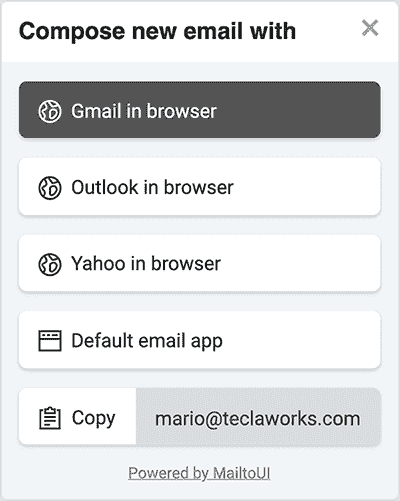
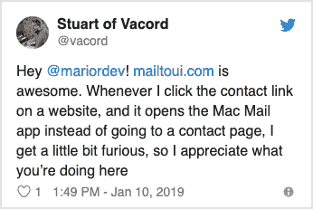
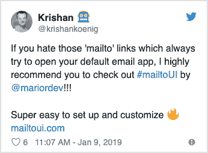

# 我如何创建 MailtoUI.js 来更新 Mailto 链接

> 原文：<https://dev.to/mariordev/how-i-created-mailtoui-js-to-modernize-mailto-links-m0k>

# 在寻找产品的过程中，从创意到当天的头号产品

这是一个关于 MailtoUI.js 如何诞生的故事。

几年前，我发现可以在 Gmail 上创建一个新的空白邮件链接。事实证明，大多数基于浏览器的电子邮件客户端也支持它。在这一点上，我认为这将是一个好主意，简单地使用这种类型的链接，而不是使用普通的旧 mailto 链接。我不使用本地电子邮件客户端应用程序。我使用基于浏览器的电子邮件客户端。我怀疑大多数人都这么认为。问题是这样的:你点击了网页上的 mailto 链接，却让它打开了本地默认的电子邮件应用，而你并没有使用这个应用。因此，你必须关闭它，返回页面，复制电子邮件地址，进入基于浏览器的电子邮件客户端，撰写一封新的电子邮件，然后最后粘贴电子邮件地址。退一步说很烦人。

所以我创造了 MailtoUI 的前身。一个简单的带有 Gmail、Outlook 和 Yahoo 文本链接的模式，通过点击 mailto 链接来触发。这是原始的，简单的，当然，这都是硬编码，所以它只在我的网站上工作。

几年过去了，我始终没有摆脱这样的想法:有一天，我可以将这个小东西转化为对其他人有用的动态东西。

## 这应该是付费服务吧？

我最终回到这个话题，并开始尝试将它变成一项付费服务。我创建了一个由两个组件组成的原型:一个用 Laravel 编写的 API，它将 UI 作为一个小部件提供给请求页面，另一个是使用该 API 的客户端页面。但当我调查这片土地并与人们谈论它时，我清楚地意识到，将它创建为一项付费服务并不是一条出路。没有人会为此买单。但我希望它存在。我想给这个世界带来一些东西来缓解恼人的 mailto 链接问题。

## 一个开源项目

mailto 链接问题主要是在桌面环境中使用基于浏览器的电子邮件客户端的人的问题。所以我想测试我的假设，即大多数人使用基于浏览器的电子邮件客户端。我创建了一个 [Twitter 投票](https://twitter.com/mariordev/status/1072756167577751552)来看看会发生什么，结果基本上证实了我的假设，尽管这不是决定性的证据。尽管如此，这给了我继续前进的信心。

所以我决定创建 MailtoUI 作为一个开源项目。让任何想让那些讨厌的 mailto 链接变得更聪明、更少烦恼的人都可以免费使用它。我们的想法是提供一个可以简单地放在页面上的脚本，当用户点击 mailto 链接时，它会自动为用户提供选项。换句话说，这个想法是为了让 web 开发人员更容易更新 mailto 链接，并提供更好的用户体验。

这将是我自己的第一个开源项目，因为这必须发生在客户端，它必须完全用 JavaScript 编写。这将让我有机会学习比过去更高级的 JavaScript。

## 要求

我提出了一系列要求和约束来构建项目:

*   完全用 JavaScript 编写
*   与前三大基于浏览器的电子邮件客户端(Gmail、Outlook、Yahoo)配合使用
*   没有依赖来保持它的简单和精简，所以它必须用普通的 js 编写
*   必须可定制
*   易于安装和使用
*   必须在一个页面上处理多个邮件链接
*   支持美托 URI 方案(主题、抄送、密件抄送、正文)
*   平易近人，反应灵敏
*   必须提供完整的文件

## 发展

在 MailtoUI 上花了大约两个月的时间，平均每天 2-3 个小时，周末会多一点。以下是我遇到的一些最显著的开发障碍。

MailtoUI 的 alpha 版本有点笨重。我构建代码的方式要求包含 mailto 链接的`<a>`标签具有设置了唯一 ID 的`id`属性。我很快意识到这违背了我对 MailtoUI 易于安装和使用的要求，因为现在用户必须为页面上的每个 mailto 链接提供一个唯一的 id。我在后续版本中删除了这个需求。

另一件我必须在早期重构的事情是模态组件。在早期版本中，为页面上找到的每个 mailto 链接创建了一个模态组件，并将其嵌入到页面中。因此，这意味着如果页面碰巧有许多 mailto 链接，就会创建和嵌入许多模态组件。对性能不是很好。我通过嵌入一个通用的模态组件解决了这个问题，该组件使用来自被点击的 mailto 链接的数据进行再水合。这样，不管一个页面上有多少 mailto 链接，只有一个模式可以被反复使用。

MailtoUI 的早期版本没有提供适当的`npm`支持。我已经创建了一个`npm`包，但是没有添加适当的机制来手动加载库和运行 MailtoUI。为了做到这一点，我需要找到一种方法来检测 MailtoUI 是通过`<script>`标签还是通过`npm`加载的。同样，目标之一是使其易于安装和使用，我希望这是自动发生的，不需要用户采取任何额外的步骤。MailtoUI 现在提供了适当的`npm`支持，可以与 React 和 Vue 等 JavaScript 框架一起加载和使用。

## 软启动

在 MailtoUI 可以正常工作的时候，我向有限的观众发布了它。我主要是向我的同事、开发者、设计师、其他像我一样的独立制作人以及在 Twitter 上宣布的。我在 Twitter 上没有很多粉丝，所以那里的影响力非常有限。绝大多数反应是积极的。人们表示，当点击常规 mailto 链接后打开默认的本地电子邮件应用程序时，这是多么令人沮丧。

 [
T4】](https://twitter.com/vacord/status/1083465784700088321?ref_src=twsrc%5Etfw%7Ctwcamp%5Etweetembed%7Ctwterm%5E1083465784700088321&ref_url=https%3A%2F%2Fmailtoui.com%2F)

 [
T4】](https://twitter.com/krishankoenig/status/1083062705756483584?ref_src=twsrc%5Etfw%7Ctwcamp%5Etweetembed%7Ctwterm%5E1083062705756483584&ref_url=https%3A%2F%2Fmailtoui.com%2F)

从这个早期的试运行中，我能够从试用者那里收集到有价值的反馈。他们报告了一些错误，并提出了一些可以改进的地方。有了这些反馈，我继续改进 MailtoUI，为更广泛的公开发布做准备。

## 启动产品搜索

我拍了一些截图，准备用在[产品搜索帖子](https://www.producthunt.com/posts/mailtoui)上，但我觉得这不足以准确展示产品。所以我决定录制一个快速的截屏作为 MailtoUI 演示来展示它是如何工作的。我选择了来自 josephmcdade.com[的免版税音乐作为背景。我用 QuickTime 来录制，用 iMovie 来编辑视频，添加音乐，不到两个小时，我就有了一个很好的小演示视频来搭配 PH 帖子。](https://josephmcdade.com/)

PH 帖子计划于 2019 年 4 月 26 日午夜上线。我早上 4 点左右醒来，令我惊讶的是，MailtoUI 已经是第一名了。一整天，人们在 PH 上发表的评论让我深受鼓舞。每个人都支持我，并对我的产品赞不绝口。总的来说，这是令人兴奋和难忘的一天。看到我做的东西发布到世界上，得到认可，并在产品搜索中被指定为当天的#1 产品，这真是太棒了。

感谢所有为 MailtoUI 的成功提供反馈、建议、转发、点赞和投票的人。