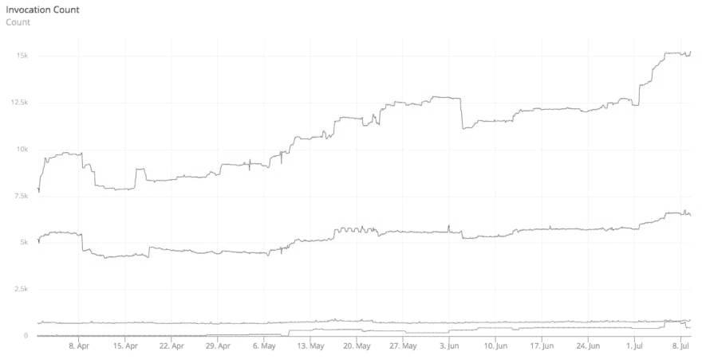
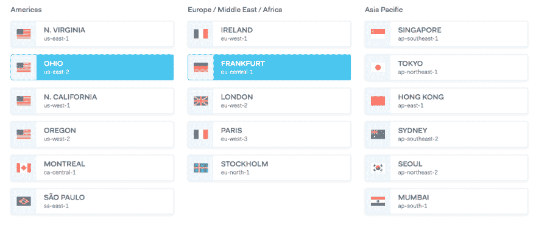
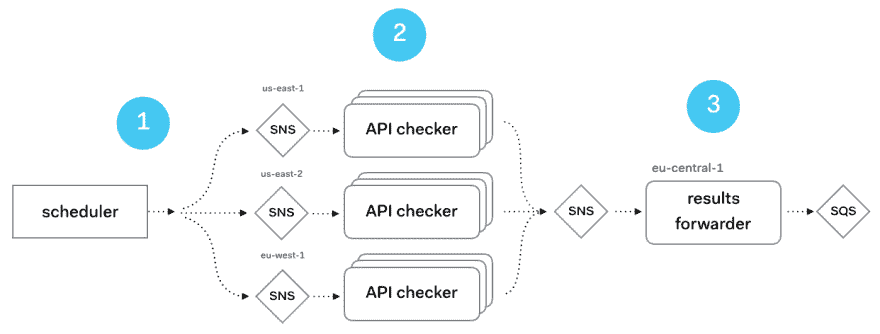
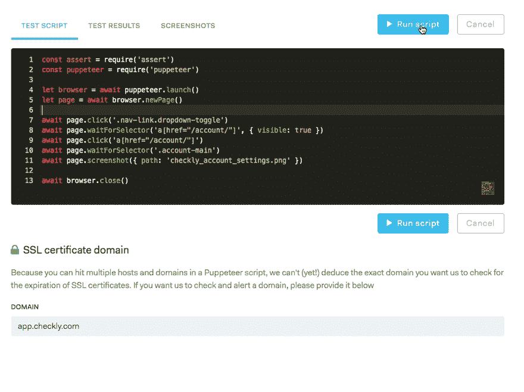
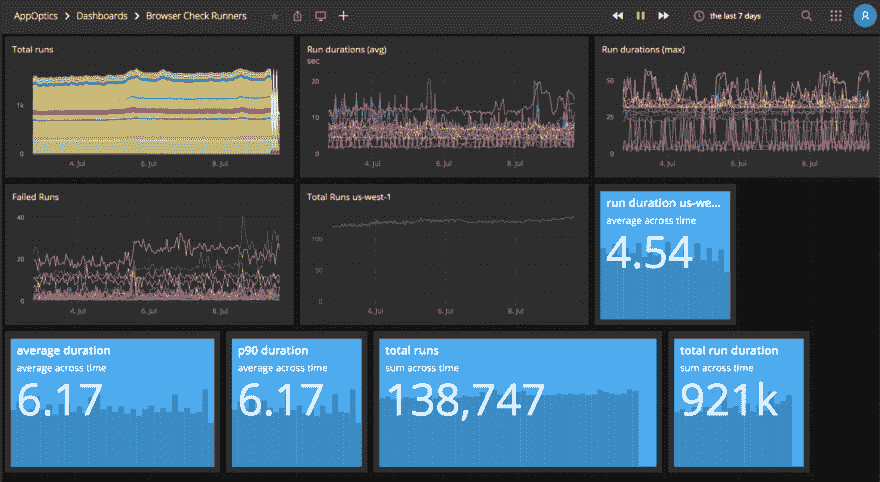

# 我如何让 AWS Lambda 为我的 SaaS 工作

> 原文：<https://dev.to/checkly/how-i-made-aws-lambda-work-for-my-saas-338k>

Checkly 的很大一部分运行在 AWS Lambda 上，但我以前从未在这个博客上深入讨论过它。所以我们开始吧。

主题是:

*   关于我们的 Lambda 设置。
*   为什么 Lambda 几乎是 SaaS 的完美搭档。尤其是当你很小的时候。
*   为什么我不围绕它使用一个“大”框架。
*   为什么由队列触发的分布式后台作业是 Lambda 存在的理由。
*   为什么监视和记录仍然是一个问题。

*注意，我在这里使用“Lambda”作为“无服务器”的代名词。这里讨论的许多东西都适用于[谷歌云功能](https://cloud.google.com/functions/)、 [Azure 功能](https://azure.microsoft.com/en-in/services/functions/)以及可能的 [Zeit](https://zeit.co/) ，尽管我从未使用过它。*

# 我们的λ设置

首先是我们如何使用 Lambda。上周我们进行了 3500 万次检查。Checkly 的所有检查运行都是在 Lambda 上进行的，并且至少在过去 12 个月左右一直如此。

我们甚至在 Checkly 主页上有一个虚荣心指标部分，几乎是实时更新的。

[](https://res.cloudinary.com/practicaldev/image/fetch/s--TC5vxI_E--/c_limit%2Cf_auto%2Cfl_progressive%2Cq_auto%2Cw_880/https://blog.checklyhq.com/conteimg/2019/07/image-1.png)

这只是所有 Lambda 运行的一个子集，因为我们也有一些其他的管道工具在 Lambda 上运行。

关于 Lambda 设置的更多数据:

*   我们在所有的 **AWS 区域**运行三个核心功能。它们处理 API 检查、浏览器检查和安装/拆卸脚本。查看[我们的文档](https://checklyhq.com/docs)找出这是什么意思。
*   所有功能都与 **SNS 主题**挂钩，但也可以通过 AWS SDK 调用直接触发。稍后会详细介绍。
*   最繁忙的功能是将数据转发到数据库的管道功能。它每小时被调用 7000 到 10.000 次，平均持续时间约为 179 毫秒。
*   我们在每个地区运行每个功能的独立开发和测试版本。

更多的虚荣指标。这些是过去三个月中三个核心函数和一个(最繁忙的)管道函数的调用量，总共大约 2100 万次调用。

请注意，调用与 Checkly 允许您运行检查的频率直接相关:每分钟进行一次 API 检查，每 5/10 分钟进行一次浏览器检查。

[](https://res.cloudinary.com/practicaldev/image/fetch/s--jJ35qvw4--/c_limit%2Cf_auto%2Cfl_progressive%2Cq_auto%2Cw_880/https://blog.checklyhq.com/conteimg/2019/07/image-3.png)

你现在明白了。我们至少在某种尺度上使用λ。向前看。

我们之前用 Docker 在虚拟机上运行了浏览器检查。[阅读这篇关于 VM/Docker 解决方案如何工作的旧博文。](https://medium.com/free-code-camp/running-untrusted-javascript-as-a-saas-is-hard-this-is-how-i-tamed-the-demons-973870f76e1c)T3】

# λ💕SaaS

Lambda 非常适合早期的 SaaS 公司，原因有三。至少对我来说是这样:

1.  它让你的可变成本很低或者不存在。如果没有人使用它，你就不用付钱。查找资本支出与 OPEX。
2.  如果人们开始使用你的 SaaS，缩放是 100%透明和自动的。没有自动缩放组，没有`heroku ps:scale`命令。你的账单也会增加。
3.  您可以将功能部署到所有地区，使您能够为客户提供地区特异性。同样，如果你没有顾客使用那个地区，你什么也不用付。但是你仍然可以提供它，并把它作为一个销售论据。用 EC2 设置这个会贵得多。

[](https://res.cloudinary.com/practicaldev/image/fetch/s--ZpY84TEe--/c_limit%2Cf_auto%2Cfl_progressive%2Cq_auto%2Cw_880/https://blog.checklyhq.com/conteimg/2019/07/image-5.png)

因此，这没什么新鲜的。这是任何无服务器解决方案的营销简介。但以我的经验来看是 100%真实的。营销做得好！

# 框架

要部署一个 Lambda 函数，你可以**上传一个. zip 文件**和你的代码到 S3 或者直接上传到 Lambda。我不建议那样做。您将最终编写大量的 bash 脚本来过滤、排序和检查各种错误。

在另一端，有像这样的**框架，它们很大，很复杂，试图做所有的事情。预计会有很多 **YAML 工程**和不同的无服务器提供者的基本泄漏抽象。有些人喜欢它。我讨厌它。**

我选择了 **[Node-Lambda](https://www.npmjs.com/package/node-lambda)** ，一个 Node.js 特定的工具链，介于直接使用 AWS SDK 和无服务器的庞大丛林之间。这就是它对我和 Checkly 有效的原因

*   它通过重试、错误检查和进度表来处理打包和上传。
*   它只做一个**单一语言运行时**。这使得框架更加简单。此外，它坚持你已经习惯的**生态系统模式**，并且不会强迫你去学习一个全新的劣质 DSL。如果你使用 Python 或 Java，可能会有类似的东西。请注意，我真的不喜欢无服务器...
*   它有足够的钩子**来定制构建**，例如:post install 钩子允许你在上传之前触发一个 bash 脚本来修改你的包。我用它来装入一些自定义的 Chromium 和 cURL 二进制文件，这些文件存在于我的普通 NPM 包之外。

唯一缺少的是“一次构建，多区域部署”选项。但那只是几行 bash。

```
#!/usr/bin/env bash

declare -a arr=("us-east-1" "us-east-2" "us-west-1")

npm run package

for i in "${arr[@]}"
do AWS_REGION=$i npm run deploy
done 
```

# 后台作业

Lambda 非常适合后台工作。原因如下

*   通过社交网络或 SQS 信息触发 Lambda 的效果非常好。SQS 和社交网站都是 AWS 生态系统中极其简单和稳定的部分。
*   SNS 和 SQS 都内置了各种重试和失败模式。但是，您需要检查幂等性，因为在极少数情况下，消息可能会被传递多次。在 Checkly 的用例中，如果一些消息被处理两次也没关系。据我所知，在我们跑的 35 米以上的比赛中，这种情况从未发生过。
*   **冷启动时间**并不重要，因为您的工作不需要向用户提供同步响应。当使用 Lambda hooked up API Gateway 并使用它来服务用户请求时，这是一个反复出现的问题。
*   最近添加的 [AWS Lambda Layers](https://docs.aws.amazon.com/lambda/latest/dg/configuration-layers.html) 对于非平凡函数非常有用。我们用它来上传木偶师使用的铬二进制文件。这意味着我们可以迭代函数的代码，而不必在每次代码推送时等待大量的上传。
*   无需与 API Gateway 或 AWS eco 系统的其他相当复杂的部分争论。

# 扇入/扇出

下面是 Checkly 设置的工作原理示意图。

[](https://res.cloudinary.com/practicaldev/image/fetch/s--TodHeNgc--/c_limit%2Cf_auto%2Cfl_progressive%2Cq_auto%2Cw_880/https://blog.checklyhq.com/conteimg/2019/07/image-8.png)

1.  调度程序进程从数据库中读取所有检查，并基于它们被配置运行的位置—还记得区域选择器吗？—将它们提交到特定区域的 SNS 主题。
2.  API checker 函数由关于此主题的消息触发，并执行有效负载。结果被提交到单个“结果”主题。
3.  结果转发器功能被触发，post 处理结果有效载荷并将其转发到 SQS 队列。该队列在 Lambda 基础设施之外进行处理，存储在数据库中，用于警报、仪表板等。

注意这个设置是多么的不耦合。能够换出组件、重启或重新部署部件而不丢失工作，这是一种解放。

# 同步通话

如果你使用 Checkly 或者甚至是[木偶沙箱](https://puppeteersandbox.com/)，你会注意到 UI 有一个按钮以交互的方式运行 HTTP 请求或者木偶脚本。这对于调试您的检查非常有用，就像下面的例子，其中一个木偶脚本有一个错误。

[](https://res.cloudinary.com/practicaldev/image/fetch/s--pJo3sHrv--/c_limit%2Cf_auto%2Cfl_progressive%2Cq_66%2Cw_880/https://blog.checklyhq.com/conteimg/2019/07/2019-07-09-16-54-39.2019-07-09-16_55_28.gif)

这些我们称之为“特别检查运行”应该在与非交互式计划检查完全相同的代码基础和基础设施上执行。

为此，我们做了两件事:

1.  我们通过在一个简单的包装类中使用标准的 AWS Node.js SDK 来调用该函数。

```
const Aws = require('aws-sdk')
const lambda = new Aws.Lambda()
export default class ApiCheckRunner {

  constructor () {
    this.params = {
      FunctionName: 'api-checker'
      InvocationType: 'RequestResponse',
      LogType: 'None'
    }
  }

  run (check) {
    return new Promise((resolve, reject) => {
      this.params.Payload = JSON.stringify(check)
      lambda.invoke(this.params, (err, res) => {
        return resolve(JSON.parse(res.Payload))
      })
    })
  }
} 
```

1.  在函数代码中，我们检查函数是由直接调用还是由 SNS 消息触发的。我们这样做有各种原因。主要是因为我们不想将调试检查的结果提交给下游的度量处理，并让它们出现在“官方”结果中。

```
async function handler (evt, ctx) {
  const isSnsMessage = evt.Records && evt.Records[0].EventSource === 'aws:sns'

  if (isSnsMessage) {
    // handle as non-interactive background job
  } else {
    // handle as ad hoc, interactive call
  }
} 
```

# 监控

AWS Lambda 上的监控和日志记录并不是顶级的，但不可否认的是，它正在变得越来越好。有哪些问题？

1.  **AWS Cloudwatch 日志很可怕**。搜索很烂，布局很烂，过滤很烂。这确实是调试奇怪问题的最后手段。如果可以，插入第三方解决方案，如 Papertrail。
2.  AWS Cloudwatch Metrics 还不错。它是可用的，并且一直在变得更好。但是**它不做跨区域度量**。因此，无法在一个图表中查看美国东部 1 和美国东部 2 的λ误差率。诚然，这就是 AWS 区域为整个生态系统工作的方式。
3.  除了 AWS 原生指标之外，您还可以拥有自己的**自定义指标**，但这非常昂贵！假设您每秒记录 1 个自定义指标。也就是 60 * 60 * 24 * 30 = 2.592.000 个数据点。AWS Cloudwatch 成本将为 2 . 592 . 000 * 0.02 = 51 美元 ex。增值税。

现在，我使用[同位语](https://www.appoptics.com/)。每月不到 30 美元，它吸收了我所有相关的 Cloudwatch、Heroku 和自定义指标，并允许我构建自定义仪表板。

这反过来允许我在应用程序逻辑指标(发送的 SMS 数量、调用的 Slack hooks 等)和 AWS 云指标之间快速切换。这里有一个例子:

[](https://res.cloudinary.com/practicaldev/image/fetch/s--f9pqsyEX--/c_limit%2Cf_auto%2Cfl_progressive%2Cq_auto%2Cw_880/https://blog.checklyhq.com/conteimg/2019/07/image-10.png)

1.  该仪表板结合了直接的 AWS Lambda 指标和自定义指标。例如,“运行持续时间”是一个自定义指标，因为 Lambda 的总运行时间包括一些我不感兴趣测量的安装和拆卸逻辑。这个指标专门测量木偶师会话花费的时间，而不是总的 Lambda 调用花费的时间。使用标准的 AppOptics REST API 记录指标。
2.  图表的顶行都显示了 Lambda 在所有区域的运行。超级，超级有用，可以立即看到什么是最繁忙的地区，哪里的事情变得不稳定。但我们也可以选择一个地区，并在其上设置一些特定的计数器—参见 us-west-1 面板。