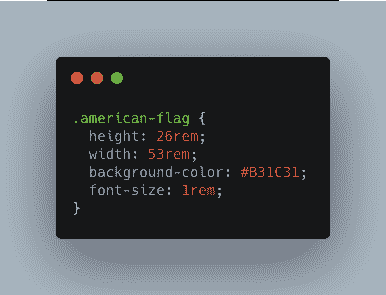
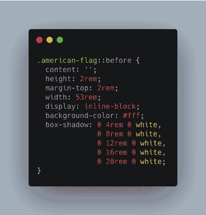
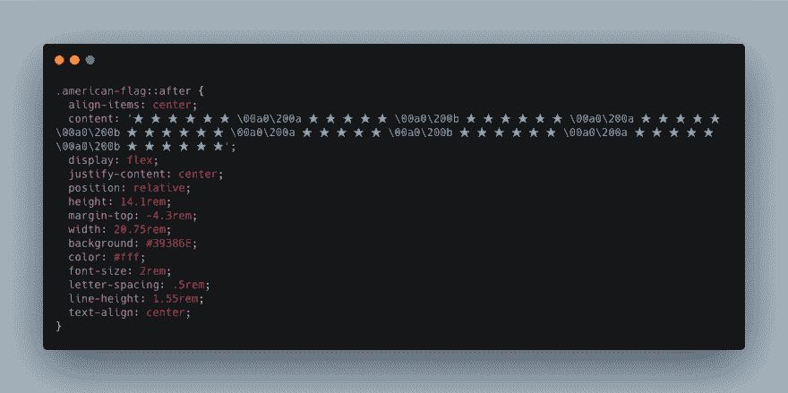
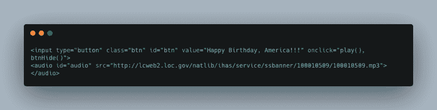
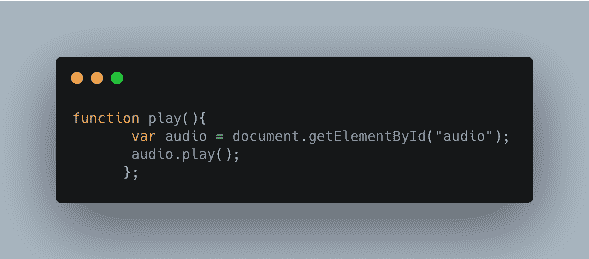
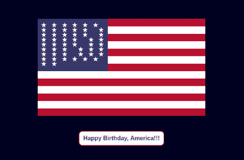

# 我如何与#VWC 代码笔团队一起制作我的第一支代码笔

> 原文：<https://dev.to/vetswhocode/how-i-made-my-first-codepen-with-the-vwc-codepen-team-4oe>

我最近完成了[#编写代码的老兵](https://vetswhocode.io/)训练营。如果你不熟悉[#编写代码的退伍军人](https://vetswhocode.io/)，这是一个退伍军人领导和运营的 501(c)(3)慈善非营利组织，专注于免费培训 web 开发和软件工程原则的退伍军人，重点是开始 javascript 开发人员的职业生涯。作为训练营的一部分，我们学习 HTML、CSS、JavaScript、React、JAMStack 和一些计算机科学。就在我们毕业之前，我们被安排到一个团队，与其他毕业生一起创建或从事现有项目，以提高在训练营期间学到的技能。

我被分配到 CodePen 团队，并被赋予为独立日创建 CodePen 的任务，这是我的第一个项目。我承认我有点害怕。很多人都会看到 CodePens，对于一个刚从训练营出来的人来说，被指派为如此重要的节日创建一个 code pens 是非常可怕的。对代码笔的要求是美国国旗，烟花，它需要发挥“星条旗”。听起来很简单，对吧？

我决定解决的项目的第一部分是旗帜。我为旗帜创建了一个`
`，并按照我想要的尺寸创建了一个红色矩形。

然后我使用 CSS `box-shadow`属性在`
`上使用了`::before`伪元素来创建旗帜的白色条纹。

然后我使用`
`上的`::after`伪元素为旗帜创建蓝色的星空。

旗帜完成后，我使用 HTML `<input>`标签创建了一个按钮，并使用 HTML `<audio>`标签添加了“星条旗”MP3 链接。

然后编写 JavaScript 让按钮在点击时播放“星条旗”字样。

我找到了美国海军陆战队乐队 1953 年演奏的《星条旗永不落》的录音。作为一名前海军陆战队员，在网上找到这段录音真的很特别。这让我在这个项目中加入了一点我作为老兵的身份。

一旦音频和按钮工作，我决定工作的烟花。烟火是这个项目中最吓人的部分。我甚至不知道从哪里开始。我开始通过观看 YouTube 教程、查看其他 CodePens 和搜索网络来进行研究。我使用 CSS 和 JavaScript 来创建焰火显示。我试了很多次，才让烟火按照我想要的那样工作。这段时间，[栈溢出](https://stackoverflow.com/)成了我的朋友。

一旦我让所有东西都工作起来，看起来像我想要的那样，一些编写校友代码的同事 [#Vets 发现国旗上的星星在一些浏览器上看起来有点不稳定。](https://vetswhocode.io/)

它在我的浏览器上看起来很好。在你这一方，修复看起来正确的东西真的很难。我花了三个晚上研究代码，尝试不同的方法来解决这个问题。这是整个项目中最令人沮丧的部分。

这里是已经完成的 CodePen 项目:
[https://codepen.io/vetswhocode/embed/KjZJXQ?height=600&default-tab=result&embed-version=2](https://codepen.io/vetswhocode/embed/KjZJXQ?height=600&default-tab=result&embed-version=2)

在这个项目中，除了如何编写代码，我还学到了一些重要的东西。我学到的一件事是，在项目到期前的某个时候离开自己，去处理任何 bug。你永远不知道在不同的浏览器中是否会有不同的显示。我学到的另一件事是不要害怕寻求帮助，并尽早寻求帮助。不要等到最后一刻才去寻求帮助。不知道如何做某事是可以的。在这个行业不可能什么都懂。我学到的最后一件事是不要害怕尝试编码那些把你推出舒适区的东西。作为一名开发人员，被推出你的舒适区是你成长的方式。试一试就好了，记得要乐在其中。