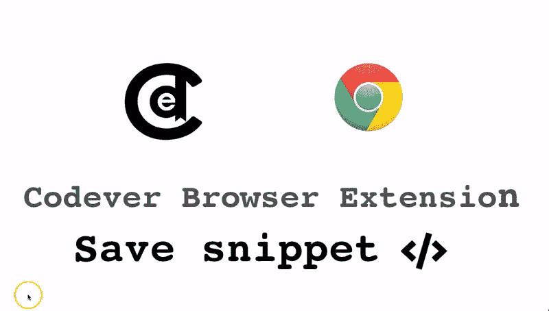

# 我如何管理我的开发书签以节省时间和精力

> 原文：<https://dev.to/ama/how-i-manage-my-dev-bookmarks-and-save-time-and-nerves-56ae>

如果你像我一样，喜欢保持东西整洁有序，你可能会在书签导航栏中有一打文件夹和子文件夹。实际情况是，这只能扩展到某一点，然后你只需将最新的书签添加到`temp`、`to do`或**“公司”**文件夹中。但是我们确实知道这些也增长很快**大**和**不可收拾**。那么文章的源代码链接或者文章发表的日期呢？

正因为如此，我决定将此事掌握在自己手中，并编写了一个工具来帮助我管理我的 dev 书签，该书签现在位于 https://www.codever.land 。我现在广泛使用标签，让链接旁边的源代码容易访问，并且知道它是什么时候发布的，而不是有子文件夹的文件夹。当然，这需要我的一些自律，但我现在确定从长远来看这是值得的。

我最常使用和编程的东西有

## 保存书签

我让保存书签变得很容易:

*   第一种选择是借助 [**书签**](https://www.codever.land/howto/bookmarklets) 。书签小程序是位于浏览器书签工具栏中的小 javascript 链接。将一个 [**书签**](https://www.codever.land/howto/bookmarklets) 拖到你的浏览器工具栏上

*   为基于 Chromium 的浏览器使用 [**Codever**](https://chrome.google.com/webstore/detail/codever/diofdblfhjbpgackifolmboaiccmebjb) chrome 扩展

    > 使用这两种方法，您可以在点击书签链接之前，在第页选择您想要添加到书签描述中的文本

*   使用 [**从网站添加新书签**](https://www.codever.land/personal/new)

参见[如何自动为 youtube 视频添加书签](https://dev.to/ama/automagically-bookmarking-youtube-videos-for-developers-lpn):

* * *

## [书签代码片段](https://dev.to/ama/bookmarking-code-snippets-with-codelets-3d44)

你也可以通过 chrome 扩展或 bookmarklet 从网上或者 IntelliJ:

* * *

## 自定义搜索

您可以保存搜索，它将出现在自动完成功能中，并按上次使用时间排序:

> 演示结束时的搜索在 [AlfredApp](https://www.alfredapp.com/) 中配置了一个自定义查询- `https://www.codever.land/search?q={query}&sd=my-bookmarks`

## 被钉住

这是我放我经常使用的书签的地方。

## 读后世

我偶然发现了一篇非常好的文章或视频，但当时没有时间浏览。没问题，我加到**后面读**。我是一个好公民，在我阅读或观看它之后，如果它值得分享，我会将其公之于众。

## 复制到矿上

如果您发现一个您认为属于您的书签的公共书签，您可以使用**复制到我的**功能，这样该书签将作为私人书签保存在您的书签列表中，即使发布的用户删除了它，您也可以重新调用它。

通过使用这些功能，我不仅节省了大量时间，大约一年一个工作周，正如 gross 在 int [中所说的我如何通过有效地管理我的开发书签](https://www.codepedia.org/ama/how-i-save-a-workweek-a-year-by-efficiently-managing-my-dev-bookmarks)来节省一年一个工作周，而且还减少了许多紧张和搜索挫折。

带着它转一圈，我保证你将离不开它，尤其是在办公室的时候。我很乐意在下面的评论或 Github 上听到你的想法和改进建议——这个项目本身是[开源的](https://github.com/BookmarksDev/bookmarks.dev)

## 公共书签

哦，忘了说了——公共书签定期发布在 https://github.com/codeverland/bookmarks 的 Github 上。