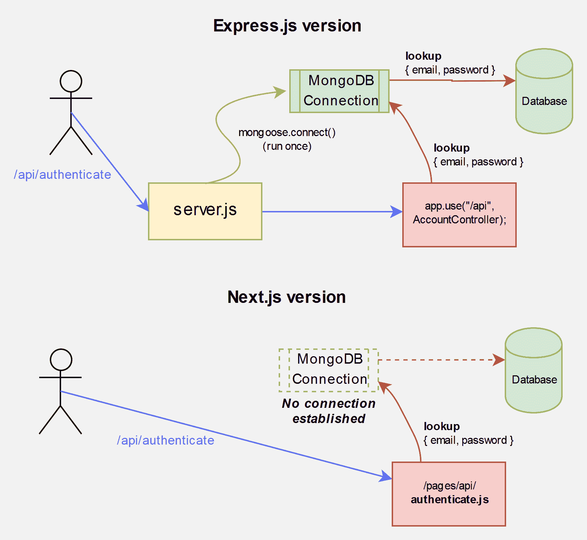
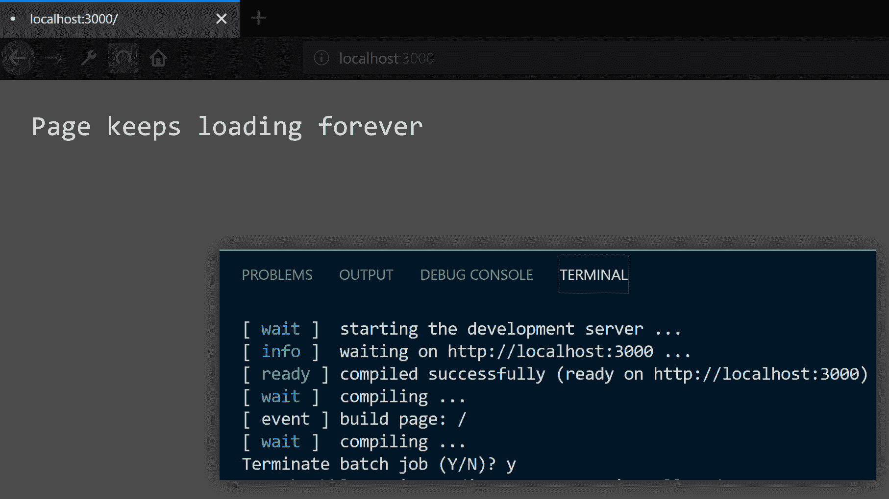
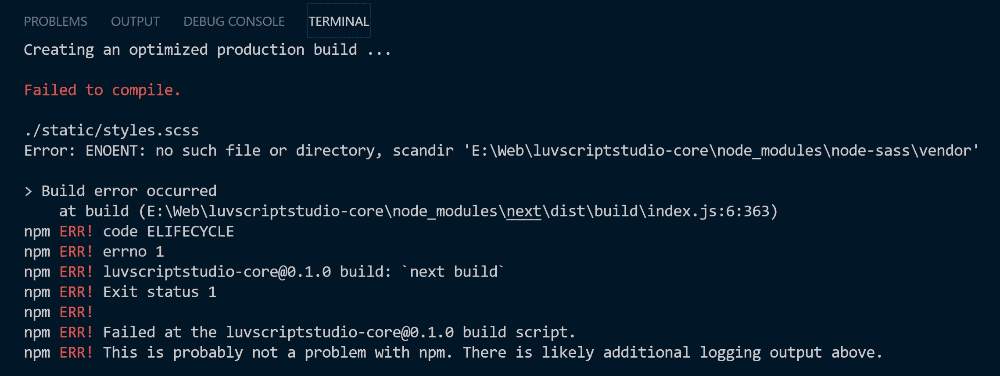

# 如何从 Express.js 迁移到 Next.js API 路由

> 原文：<https://dev.to/hoangvvo/how-i-migrate-from-express-js-to-next-js-api-routes-4g5>

这是我上一篇文章 [Explore Next.js 9 API Routes](https://www.hoangvvo.com/blog/explore-next-js-9-api-routes/) 的后续。

经过深思熟虑，我决定放弃 [Express.js](https://github.com/expressjs/express) ，转而使用 API Routes。在这一点上，我的项目仍然很简单——我没有太多的代码。我认为在项目变得复杂之前最好现在就行动。

## 迁移到 Next.js API 路由

为了使用新的 API 路由，我需要通过运行:
`npm i next@latest react@latest react-dom@latest`将我的 Next.js 模块更新到 v9。这会将 Next.js 和 React.js 一起更新到最新版本。

虽然这是一个重大更新，但我没有发现任何对我有特别影响的重大变化。然而，如果你有任何问题，这份[升级指南](https://github.com/zeit/next.js/blob/canary/UPGRADING.md)可以帮助你解决任何问题。

### 重写代码库——更像是，大量的复制粘贴

#### Express.js 到下 9 条 API 路线

在我当前的 express.js 服务器中，要在`/api/authenticate`访问一个端点，我在`/server/components/account/accountController.js`中的代码是:

```
// accountController.js
const express = require('express');

const User = require('../../api/models/userModel');

// In server.js, I called app.use('/api', AccountController);
const AccountController = express.Router();

AccountController.post("/authenticate", (req, res) => {
  const { email, password } = req.body;
  User.findByCredentials(email, password)
    .then(user => user.generateSessionId())
    .then(sessionId => {
      const { name } = user;
      res
        .cookie("sessionId", sessionId, { httpOnly: true, secure: true })
        .send(`welcome my homie, ${name}`);
    })
    .catch(e => {
      // reject due to wrong email or password
      res.status(401).send("who are u, i dun know u, go away");
    });
});
module.exports = AccountController; 
```

你可以看到我是如何利用`req`和`res`的。下面我们来看看 Next.js 9 API 路线'[方式](https://nextjs.org/docs#api-routes) :

```
export default function handle(req, res) {
  res.end('Hello World');
} 
```

handle 函数具有相同的语法:它采用相同的`req`和`res`。更好的是，Next.js 9 的 API Routes 实现了类似 Express.js 的`Middlewares`，包括解析器`req.body`和辅助函数`res.status`和`res.send`。这意味着我不必做很多改变。

#### //FIXME:next . js API 路由中没有 **res.cookie**

Next.js 9 API Routes 中似乎没有`res.cookie` helper 函数。我需要重写函数，回退到`http.ServerResponse`的 [setHeader](https://nodejs.org/api/http.html#http_response_setheader_name_value) (因为`NextApiResponse`扩展了`http.ServerResponse` ):
`res.cookie("sessionId", sessionId, { httpOnly: true, secure: true })`变成了

`res.setHeader('Set-Cookie', `sessionId=${sessionId}; HttpOnly; Secure`)`

。

我在 [zeit/next.js](https://github.com/zeit/next.js/issues/7923) 上创建了一个添加`res.cookie`的功能请求。希望他们补充一下。现在，我必须坚持使用`res.setHeader`。

#### // TODO:创建 API 路由版本`/api/authenticate`

我创造了`pages/api/authenticate.js`。

```
// authenticate.js
export default (req, res) => {
  const { email, password } = req.body;
  User.findByCredentials(email, password)
    .then(user => user.generateSessionId())
    .then(sessionId => {
      const { name } = user;
      res
        .setHeader("Set-Cookie", `sessionId=${sessionId}; HttpOnly; Secure`)
        .send(`welcome my homie, ${name}`);
    })
    .catch(e => {
      // reject due to wrong email or password
      res.status(401).send("who are u, i dun know u, go away");
    });
}; 
```

太好了，这就是我如何将我的代码从 **Express.js** 转换成 **Next.js API Routes** 的:只是复制粘贴并做一些小改动。通过这样做，我抛弃了**快速路由器**，使得代码更加简洁。我对每个 API 端点都做了同样的事情。

### 呃，哦。我们的数据库在哪里？

回到 Express.js 版本，我的`npm start`运行这个`server.js`脚本:

```
const express = require("express");
const mongoose = require("mongoose");
const AccountController = require("./components/account/accountController");
const app = express();
mongoose.connect(process.env.MONGODB_URI, {
  useNewUrlParser: true,
  useFindAndModify: false,
  useCreateIndex: true
});
app.use("/api", AccountController);
app.listen(process.env.PORT); 
```

*(为了简单起见我去掉了 Next.js 自定义服务器集成)*

请注意，`mongoose.connect()`是我连接到数据库的方式。然后由`app.use("/api", AccountController);`处理到`/api/authenticate`的路由。

让我们来看看我画的这张图:

[](//images.ctfassets.net/rgbpfpd0hrww/5cPDaQBVY8lvvGYEEB1USw/0bd76f756be6e0dc2fc8fc9d67e97e8d/Express.js_and_Next.js_No_MongoDB_connection.jpg)
*next . js 版本中没有 MongoDB 连接*

如您所见，在 Express.js 版本中，服务器保持运行并维护连接。但是，在 Next.js 版本中，服务器没有初始化连接的起点。

在每一个端点`/pages/api`下的每一个端点`.js`的**上加上`mongoose.connect()`怎么样？嗯，不完全是这样。**

想象一下，每次命中一个 API 路由，它就调用`mongoose.connect()`。所以会调用多个`mongoose.connect()`。但是，你只能给`mongoose.connect()`打一次电话。否则，您将得到以下错误:

```
MongooseError: You can not 'mongoose.connect()' multiple times while connected 
```

#### // TODO:只维护一个 Mongoose 连接

必须有一种方法来检查是否有猫鼬连接。如果没有，我们只会尝试连接。

这是我的方法:

```
// db.js
import mongoose from 'mongoose';

export default async () => {
  if (mongoose.connections[0].readyState) return;
  // Using new database connection
  await mongoose.connect(process.env.MONGODB_URI, {
    useNewUrlParser: true,
    useFindAndModify: false,
    useCreateIndex: true,
  });
}; 
```

*编辑:更新正确的做法*

成功连接 MongoDB 后，`mongoose.connections[0].readyState`将会是 **1** (真)。下次调用该函数时，它将简单地返回。

剩下要做的就是在每个 API 端点中从 db.js 导入函数。

```
// authenticate.js
import connectToDb from '../../../api/db';

export default async (req, res) => {

  await connectToDb();

  const { email, password } = req.body;
  User.findByCredentials(email, password)
    .then(user => user.generateSessionId())
    .then(sessionId => {
      const { name } = user;
      res
        .setHeader("Set-Cookie", `sessionId=${sessionId}; HttpOnly; Secure`)
        .send(`welcome my homie, ${name}`);
    })
    .catch(e => {
      // reject due to wrong email or password
      res.status(401).send("who are u, i dun know u, go away");
    });
}; 
```

我把处理程序做成一个`async`函数，这样我就可以在`connectToDb()`上使用关键字 **await** 。通过让**等待**关键字，我们可以确保`connectToDB()`在其他事情之前完成。

**就是这样！**

#### 替代方式:使用中间件

“中间件”可以通过包装处理函数来实现。

创建`dbMiddleware.js` :

```
import mongoose from 'mongoose';

const connectDb = handler => async (req, res) => {
  if (mongoose.connections[0].readyState) return handler(req, res);
  // Using new database connection
  await mongoose.connect(process.env.MONGODB_URI, {
    useNewUrlParser: true,
    useFindAndModify: false,
    useCreateIndex: true,
  })
  return handler(req, res);
}

export default connectDb; 
```

之后，在我的 API 函数中，我包装了处理函数。

```
import connectDb from '../../../api/middlewares/dbMiddleware.js';
const handler = (req, res) => { 
  const { email, password } = req.body;
  User.findByCredentials(email, password)
    .then(user => user.generateSessionId())
    .then(sessionId => {
      const { name } = user;
      res
        .setHeader("Set-Cookie", `sessionId=${sessionId}; HttpOnly; Secure`)
        .send(`welcome my homie, ${name}`);
    })
    .catch(e => {
      // reject due to wrong email or password
      res.status(401).send("who are u, i dun know u, go away");
    });
};
export default connectDb(handler); 
```

在[这篇文章](http://localhost:8000/blog/middlewares-in-next-js-without-custom-server/)中了解更多信息。

#### TODO:导入导出时保持一致

使用 Express.js 时，没有实现 [Babel](https://babeljs.io/) ，无法使用`ES6 Import / Export`。

当我开始使用 API Routes(其中包括**巴别塔**)时，我改变了部分代码库，使用 **ES6 导入**或 **ES6 导出**。不过有几个函数还是用了`module.exports`。这导致了我下面提到的一个问题。(参见`FIXME: ... is not a function`)。

因此，要始终如一。我推荐对整个代码库使用 **ES6 导入/导出**。

### 杂项问题

#### // FIXME:没有错误的空白页

*注意:我下面的这个问题不是来自 Next.js。你可以跳过它！*

我遇到的一个问题是，当我运行`next dev`时，终端显示`build page: /`、`compiling...`然后是`compiled successfully`。然而，当我访问`http://localhost/`时，我看到一个空白页面，标签的状态栏显示加载指示。

[](//images.ctfassets.net/rgbpfpd0hrww/20WKmSh4gGRuNBun3YHap3/466c4a744265d85c15dd25b923a44cee/I_migrate_to_NextJS_API_Routes_-_Page_keeps_loading_while_showing_no_error.jpg)

我看网络选项卡的时候，看到`GET localhost:3000/`一直在运行，没有任何反应。(无状态、响应报头、有效负载)。

这个问题的恼人之处在于，在控制台中没有 **500 内部服务器错误**或任何红色错误文本。

我检查了我的代码，检查了所有的语法。一切看起来都很好。我的意思是，我只是将我的代码的工作版本复制粘贴到新的格式中。如果我的代码中有错误，它应该在我进行迁移之前就已经发生了。

幸运的是，当我试图运行`next build`时，我看到了错误:

[](//images.ctfassets.net/rgbpfpd0hrww/42NOuYZv1ktbq0hnKnMNSn/98de0004bdaf1c612670077ad5f0f865/I_migrate_to_NextJS_API_Routes_-_Build_error_ENOENT_node-sass_vendor.jpg) 
*我是在做我的`next build`* 的时候才发现的

node-sass 在做什么？这完全无关紧要。然后，我想到了那个愚蠢的 IT 笑话“你有没有试过把它关了再开？”。嗯，不，我没有重启我的电脑。我做的就是跑`npm rebuild`。这允许我“重置/重启”节点模块(当然包括`node-sass`)。它神奇地成功了。删除我的 node_modules 文件夹并运行`npm install`会达到同样的效果。

> 如有疑问，运行`npm rebuild`

运行`next build`现在显示`compiled successfully`和运行`next dev`工作:没有更多的空白页...嗯，但是现在我们有一些 **500 内部服务器错误**

#### // FIXME:...不是一个函数

如果运行量产版，可能会遇到`UnhandledPromiseRejectionWarning: TypeError: ... is not a function`。

经过一些尝试和错误之后，我注意到如果我使用`ES6 import`而不是`require`，错误就消失了。

我猜由于某种原因，webpack 没有正确解析`require`。我注意到在我的代码中我使用了两种不同的变体:我通过`require`导入函数，但通过`export default`导出。这可能是问题的原因。

因此，请从`require / modules.export`更改为`import / export`。如果你没有具体的`export *default*`，你将不得不明确地提到函数的名字。例如:

```
import { nameOfFunction } from 'path/to/theFunction' 
```

#### // FIXME:模型一旦编译就不能覆盖

我认为这实际上不是你的错误。你可能认为是因为你多次导入 model.js 文件。当我使用 Express.js 时，我必须做同样的事情，但没有遇到这个问题。我怀疑这是由于热模块更换(HMS)。因为 HMS 是动态编译的，所以 model.js 有可能被编译多次，从而导致问题。

我通过使用`next build`和`next start`服务于生产构建来测试我的理论。没有错误，因为 Webpack 当时没有进行编译。

以下是该问题的解决方法:

```
export default mongoose.models.User || mongoose.model('User', UserSchema); 
```

如您所见，我们首先查看 mongose . models . user 是否存在，如果不存在，只对其建模。

## Hello Next.js API 航线，再见 Express.js

### 卸载多余的依赖项

因为我们不再使用 Express.js，所以删除它总是一个好主意。

对于 Express.js，我还需要卸载两个依赖项: [nodemon](https://github.com/remy/nodemon) 和 [cookie-parser](https://github.com/expressjs/cookie-parser) 。我

当我修改代码时，我需要用`nodemon`来重启我的服务器。这是不再需要的，因为从现在起我将使用 Webpack 的热模块替换。

以前需要`cookie-parser`才能访问`req.cookies`。这已经不再需要，因为 Next.js 9 已经提供了这样做的方法。

我继续运行:
来卸载它们

```
npm uninstall express nodemon cookie-parser 
```

确保从代码中删除任何提到的依赖关系。

### 修改 package.json 中的脚本

在我的 Express.js 版本中，我的脚本是:

```
"scripts":  {  "dev":  "nodemon server/server.js",  "build":  "next build",  "start":  "cross-env NODE_ENV=production node server/server.js",  } 
```

对于`npm run dev`，我 **nodemon** 我的自定义服务器`server.js`。对于`npm run start`，我的**节点**我的`server.js`。

转向 API 路由，我不再需要定制服务器或热重装。我要做的就是运行`next dev`和`next start`。

```
"scripts":  {  "dev":  "next dev",  "build":  "next build",  "start":  "next start",  } 
```

## 结论

我设法将我的代码库改为使用 Next.js API 路由。它开启了**无服务器**的可能性，这个我很快会探讨。

我仍然不时会遇到这个新的 Next.js API 路由的问题。当我这样做的时候，我会确保将它包含在这篇文章中。祝您在部署 Next.js API 路由时好运。