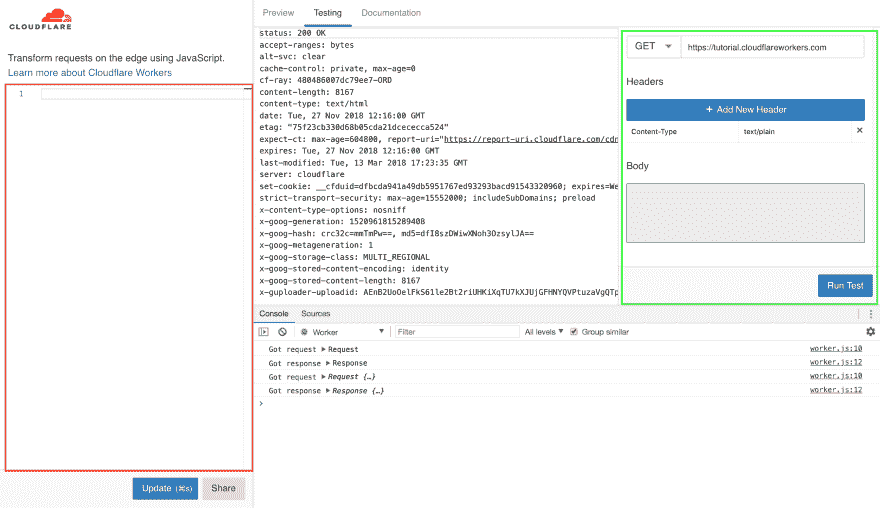

# 我如何通过使用 Cloudflare Workers 节省$$$成本

> 原文：<https://dev.to/rxassim/how-i-save-by-using-cloudflare-workers-3883>

嗨！在这篇文章中(如标题所示),我将向您展示如何使用 Cloudflare Workers 代替 AWS 的 API-Gateway 来代理对 AWS Lambda 函数的请求，从而节省成本。

### 为什么要用 Cloudflare Workers？

都是成本的问题。1000 万个 api 请求将花费您:

*   带 API 网关:\$35
*   使用 Cloudflare 工作人员:5 美元

我们可以说，与 API-Gateway 相比，Cloudflare Workers 为您节省了**85%**！！

## 入门

首先，创建一个新的节点项目，在这篇博文中我将使用`yarn` :

```
mkdir worker-proj
cd worker-proj
yarn init -y 
```

然后安装一些开发包，我们将主要需要捆绑我们的工人:

```
yarn add dotenv-webpack webpack webpack-cli -D 
```

我们还需要`aws4`签署我们对 aws 的请求:

```
yarn add aws4 
```

## 网页包配置

我们使用 webpack 是为了捆绑我们的代码，并将其作为一个工人来使用。

在项目中创建一个新文件，将其命名为`webpack.config.js`，并将以下代码粘贴到其中:

```
const Dotenv = require('dotenv-webpack')

module.exports = {
  entry: './worker.js', // This will be our entry file
  mode: 'production', // We're building for production to optimize our worker
  plugins: [new Dotenv()], // we'll be using a .env file to store our TOKENS
  optimization: {
    minimize: true,
  },
  performance: {
    hints: false,
  },
  output: {
    path: __dirname + '/dist', // this is the output folder
    publicPath: 'dist',
    filename: 'worker.js', // and this is where our final code will be at.
  },
} 
```

## 我们需要的代币

我们需要指定 4 个基本参数:

*   **ACCESS_KEY，SECRET** :从 AWS IAM 获取。
*   **REGION** :我们 Lambda func 所在的区域。
*   **功能** : AWS 功能名称。

一旦你有了所有这些参数，创建一个`.env`文件，然后**将它们添加到**文件中。

## 写作工作者

首先，创建一个文件，我们将其命名为 *worker.js* 。
然后，导入`aws4`并创建一个`credentials`对象来存储我们的 AWS 密钥:

```
import aws4 from 'aws4'

const credentials = {
  accessKeyId: process.env.ACCESS_KEY,
  secretAccessKey: process.env.SECRET,
} 
```

现在我们写我们的工人函数。它接受一个`request`参数，并返回发送给 Lambda 函数的请求的`response`。

```
async function worker(request) {
  const reader = request.body.getReader()
  // getPayloadFromReader is a function that we use to get the body of a request
  const payload = await getPayloadFromReader(reader)
  // we sign our request using the credentials we created earlier
  const req = aws4.sign(
    {
      method: 'POST',
      service: 'lambda',
      region: process.env.REGION,
      path: `/2015-03-31/functions/${process.env.FUNCTION}/invocations/`,
      body: JSON.stringify({ httpMethod: 'POST', body: payload }),
    },
    credentials
  )
  // then we send the signed request to the lambda function and return the response
  return fetch(`https://${req.hostname}/${req.path}`, {
    method: req.method,
    headers: req.headers,
    body: req.body,
  })
}

// The next 3 lines show you how to invoke a worker function using Cloudflare Workers
addEventListener('fetch', event => {
  event.respondWith(worker(event.request))
}) 
```

至于`getPayloadFromReader` :

```
function binary_to_string(array) {
  // We need this function to convert binary to string
  var result = ``
  for (var i = 0; i < array.length; ++i) {
    result += String.fromCharCode(array[i])
  }
  return result
}

async function getPayloadFromReader(reader) {
  let payload = ''
  while (true) {
    let { done, value } = await reader.read()
    if (done) {
      break
    }
    payload = payload + binary_to_string(value)
  }
  return payload
} 
```

## 考试时间到了！

为了测试我们到目前为止所做的工作，将`build`脚本添加到您的包中

```
{  "name":  "worker",  "version":  "1.0.0",  "main":  "worker.js",  "license":  "MIT",  "scripts":  {  "build":  "webpack -p --progress --colors"  },  "dependencies":  {  "aws4":  "^1.8.0"  },  "devDependencies":  {  "dotenv-webpack":  "^1.5.7",  "webpack":  "^4.25.1",  "webpack-cli":  "^3.1.2"  }  } 
```

运行`yarn build`，然后复制将在`dist/worker.js`中找到的代码。

一旦您复制了工人代码，前往[https://cloudflareworkers.com](https://cloudflareworkers.com)并将工人代码粘贴到红色边框部分，然后点击`update`。
[T6】](https://res.cloudinary.com/practicaldev/image/fetch/s--lfzZoXSY--/c_limit%2Cf_auto%2Cfl_progressive%2Cq_auto%2Cw_880/https://thepracticaldev.s3.amazonaws.com/i/tm9hsfqm2sil3pqthbk9.png)

在上面截图的右边部分*(绿色边框)*，你可以看到测试不同种类的请求。

## 结论

现在你可以节省一些了💰💰通过使用 Cloudflare Workers！！

祝你一周愉快！