# 我是如何开始存在于互联网上的

> 原文：<https://dev.to/taillogs/how-i-started-existing-on-the-internet-2nf5>

[警告，这是一个详细的帖子。如果您想查看结果，请点击此处](#outcome)

### [T1】简介](#intro)

对于那些不认识我的人。你好，我叫瑞兰德。我是一名工程师/产品经理，为湾区的 Binaris(一家初创公司)工作。

大约一个半月前，我的公司经历了一些重大变化。我们发起了一项活动，以获得对我在公司推行的一个新想法的反馈。作为这项工作的一部分，我必须创建一些内容(博客、视频)，然后通过社交媒体传播这些内容。

不想失去工作事件给我的动力，我决定是时候开始努力提高我的社交形象了。

### 相识

大多数认识我的人也知道我不是社交媒体的粉丝。我真的认为，当前的平台是为了操纵和吸引用户而设计的，而不是鼓励真正的社交互动。虽然我对此感受很强烈，但我也努力做一个务实的人。由于社交媒体是现代商业的一个重要方面，我知道我必须跟上这个计划。

直到大约一个月前，我完全脱离了社交媒体。我在高中时有一个脸书账户，但在过去的 6 年里它基本上被停用了。我确实经常使用 Reddit，但主要是作为一种信息工具，而不是用于社交互动。我最初在两年前创建了我的 twitter 账户，但是直到大约 1.5 个月前，我只有 40 个关注者(完全由私人朋友组成)，并且自从最初创建账户以来，我没有发过任何 Twitter 消息。这是我从今年四月开始的不活动。

[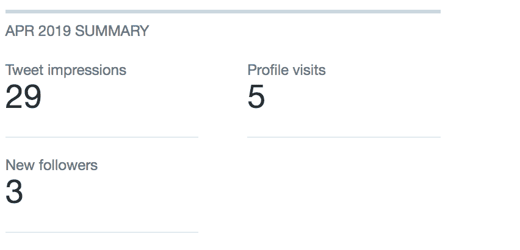](https://res.cloudinary.com/practicaldev/image/fetch/s--7RD42P1Q--/c_limit%2Cf_auto%2Cfl_progressive%2Cq_auto%2Cw_880/https://thepracticaldev.s3.amazonaws.com/i/onybemtsy85i04vroddh.png)

在做了一些研究后，我认为 twitter 是建立自己的最佳选择。尽管我不了解 Twitter 的文化和平台，但我相信 Twitter 拥有与我最相关的人口统计数据(技术和生活方式)。我开始关注一些最有影响力的人，并很快开始了解什么类型的内容在 Twitter 上效果很好。

从 5 月 15 日到 5 月 30 日，我纯粹通过在推特上发布任意想法、发布笑话推特和在我的 feed 上回复有趣的内容获得了大约 600 名粉丝。做了研究后，我知道标签对推特的可见性至关重要，所以我慷慨地使用了它们。在这段时间里，我的平均推文做得相当不错，但内容并不代表“我”。

液体错误:内部

*我五月最成功的推文*

快到五月底的时候，我开始意识到，尽管人们在跟踪我，但我并没有建立起任何信誉。如果你在 Twitter 上相对默默无闻，建立信誉是非常困难的。我强烈认为，twitter 的这一方面促成了该平台令人难以置信的毒性，并真正伤害了有意义的话语。为了保持务实，我寻找其他途径来加速我的成长。

### 肌球蛋白

根据我在 Twitter 上的观察，我假设创建一个开源项目是一个非常可靠的吸引人的方法。许多社交媒体技术影响者是受欢迎的开源项目的创造者，这给了他们技术可信度和可能在 Github 之外追随他们的已经参与进来的观众。

我已经做了几个月的个人项目，这是我渴望与他人分享的东西。我意识到仅仅通过 Twitter 传播消息是非常困难的，而博客似乎是更合适的媒介。我对 webdev 非常满意，所以我花了一两天时间用 Gridsome 建立了一个博客。

然后，我开始清理我的代码，并撰写相应的博客文章。我真的相信这个项目的价值(这是我每天都在使用的东西)，所以我决定尽我所能让它变得可见。一切准备就绪后，我将项目发布到 [Github](https://github.com/rylandg/myos/issues) 上，并开始在任何可能的地方发布相应的博客帖子。

[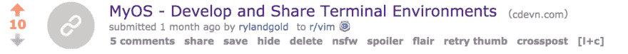](https://res.cloudinary.com/practicaldev/image/fetch/s--BLwk2VY3--/c_limit%2Cf_auto%2Cfl_progressive%2Cq_auto%2Cw_880/https://thepracticaldev.s3.amazonaws.com/i/hqb9loqfdvmwaflvryjr.png)

*有人在/r/vim 上给了我白金*

[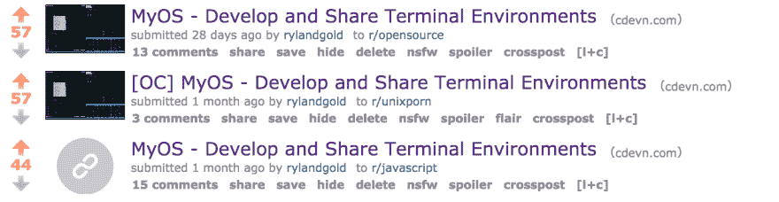](https://res.cloudinary.com/practicaldev/image/fetch/s--d3CPrI2e--/c_limit%2Cf_auto%2Cfl_progressive%2Cq_auto%2Cw_880/https://thepracticaldev.s3.amazonaws.com/i/k9zi9t5jb5fhtapenx60.png)

*MyOS Reddit 帖子*

在我寻求在互联网上发布 MyOS 的过程中，我听说了一个更新的、社区驱动的内容平台 Dev.to。我喜欢我在初次访问后所看到的，并决定也在那里交叉发布我的博客。

[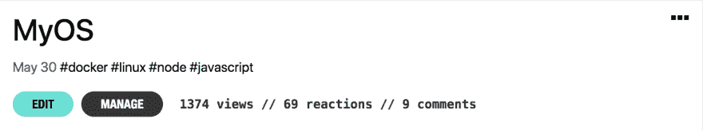](https://res.cloudinary.com/practicaldev/image/fetch/s--c0cRY8yY--/c_limit%2Cf_auto%2Cfl_progressive%2Cq_auto%2Cw_880/https://thepracticaldev.s3.amazonaws.com/i/p6z0gaul524xyiuvmx3o.png)

我也考虑过交叉发布到 Medium，但就在那时，我发现 Medium 缺乏对 canonical_url 的支持。

液体错误:内部

MyOS 比我最初预期的更成功。到今天为止，这个项目已经有了大约 120 位明星和 16 位贡献者，对于第一次尝试来说已经不错了。不幸的是，MyOS 模型无法扩展。我花了几个月的时间把这个项目放到一个我愿意分享的地方，几个月的过程不可能是获得追随者的有效(更不用说风险)方法。

但是 MyOS 的努力还带来了其他的东西，我现在有了一个个人博客。

[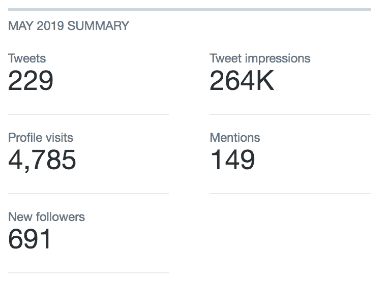](https://res.cloudinary.com/practicaldev/image/fetch/s--orj51gAb--/c_limit%2Cf_auto%2Cfl_progressive%2Cq_auto%2Cw_880/https://thepracticaldev.s3.amazonaws.com/i/sfk7tenhcvuwg7sjhuli.png)

*Twitter 5 月统计数据(包括 MyOS 流量)*

### 最佳培养基

在 MyOS 发布前一周，我开始在 Twitter 上看到许多针对 Medium 的负面关注。在做了一些研究后，我意识到大部分的愤怒都是被误导的，所以我尽我最大的努力来对抗虚假信息。

> 

但是，在六月初，一封来自自由代码营创始人昆西的泄露邮件出现在我的 feed 里。很明显，昆西对消息泄露很不高兴，因为这条推文相对不为人知，我想它会消散的。

几天后，开始出现引用泄露邮件的文章，我不再觉得在道德/伦理上倾向于对此保持沉默。我已经对我在 Medium 的经历感到沮丧，我觉得邮件中指控的行为越界了。我很快写了一个帖子，讨论泄露的电子邮件，以及我个人对 Medium 的问题。我知道这个帖子是有争议的，如果你能处理好，这几乎总是一件好事。我又一次在许多“灵媒”上发帖(我很有趣)，这一次是立即发帖给 Dev.to。

我还决定向《黑客新闻》发帖，这是我以前从未做过的。很多人可能会和我争论，但我认为黑客新闻是现存的最负面的平台之一。因为我的故事在信息中是负面的，所以这篇帖子迅速走红，成为当天大部分时间黑客新闻的第一名。

[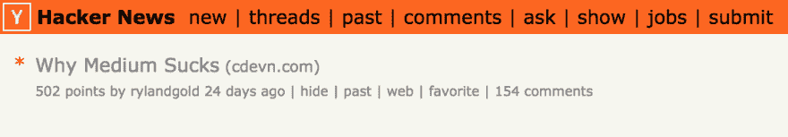](https://res.cloudinary.com/practicaldev/image/fetch/s--oCHhswck--/c_limit%2Cf_auto%2Cfl_progressive%2Cq_auto%2Cw_880/https://thepracticaldev.s3.amazonaws.com/i/jmqyh9wnrtn4wi0su541.png)

我不小心贴到了 [/r/javascript](//reddit.com/r/javascript) 上，以为是 [/r/technology](//reddit.com/r/technology) ，回来后震惊地发现它也做得相当好。

[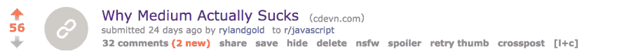](https://res.cloudinary.com/practicaldev/image/fetch/s--pAAVPAsL--/c_limit%2Cf_auto%2Cfl_progressive%2Cq_auto%2Cw_880/https://thepracticaldev.s3.amazonaws.com/i/woi5ud11byvdioye2tgs.png)

在这一点上，我主要是链接到我的个人领域，而不是开发。

[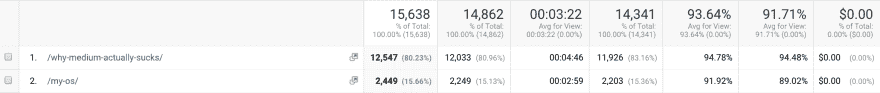](https://res.cloudinary.com/practicaldev/image/fetch/s--GPjEenTY--/c_limit%2Cf_auto%2Cfl_progressive%2Cq_auto%2Cw_880/https://thepracticaldev.s3.amazonaws.com/i/croez4a9ntc0ipcyjq6n.png)

### 开发到

Medium 帖子做得很好，但更重要的是，它向我展示了 Dev.to 的潜力。仅 MyOS 和 Medium 帖子，我就在 Dev.to 上有近 500 名粉丝。老实说，我的第一个猜测是 Dev.to 出于某种社会心理学的原因夸大了我的粉丝数量。

我开始调查它，并很快意识到没有恶意发生，事实上恰恰相反。因为 Dev.to 不公开显示关注者数量，所以读者倾向于根据他们喜欢的内容来关注，而不是他们认为受欢迎的人。这深深地引起了我的共鸣，因为它完美地解决了我在 Twitter 等平台上遇到的问题。说什么比谁说更重要。

在这一点上，我仍然对写博客和“走出去”感到很不舒服。这似乎很难相信，但我不是一个非常外向的人。在过去克服了这样的个人缺陷后，我知道完全沉浸是一种快速而可靠的方法，可以让自己正常化，适应不舒服的经历。有鉴于此，我决定在下个月的每个工作日尽我所能发布一些东西。考虑到我已经在一家初创公司工作了更长时间，这是一项艰巨的任务。

### 博客博客博客博客

#### 第一周

第一周很轻松，中岗后只剩一天了。我没有完全致力于这个计划，所以这个帖子本质上是一个讨论帖。

[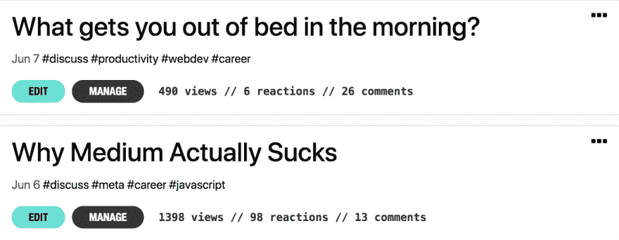](https://res.cloudinary.com/practicaldev/image/fetch/s--OBnovAZg--/c_limit%2Cf_auto%2Cfl_progressive%2Cq_auto%2Cw_880/https://thepracticaldev.s3.amazonaws.com/i/7e0xjsaskk9s8l9q552p.png)

#### 第二周

在第二周，事情变得越来越多。我把所有的东西都上传到了我的个人博客上，但是我只给出了 Dev.to 版本的链接。这是一个艰难的选择，但它主要源于用户对 Dev.to 平台的熟悉，而不是我的个人网站。我预测，如果人们已经有了账户，他们会更愿意参与/互动。

[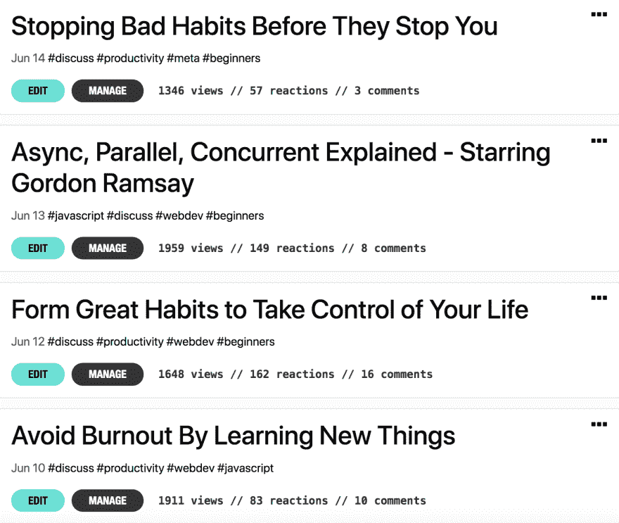](https://res.cloudinary.com/practicaldev/image/fetch/s--Mzj7BQN8--/c_limit%2Cf_auto%2Cfl_progressive%2Cq_auto%2Cw_880/https://thepracticaldev.s3.amazonaws.com/i/bx3nubtr7imoqxy2jijx.png)

这周我开始尝试不同类型的内容。很明显，我有制作高技术内容的技术才能，但是用我有限的时间制作高质量的非技术内容要容易得多。你必须明白这些都是成熟的博客文章，它们需要花很多时间来写。我也开始熟悉我的内容管道，每天我都会把我的新内容发布到相关平台上。

液体错误:内部

正如你从上面的推文中看到的，我的内容开始得到更多的参与。这是一个不断增长的 twitter 关注者(接近 800 个关注者)和我以前没有收到的流量增加的组合。

#### 星期三

此时我已经进入了真正的节奏。正如他们所说，做好一件事的最好方法就是去做。写作不再是一种痛苦的经历，它转化成了更多的时间和更好的内容。

[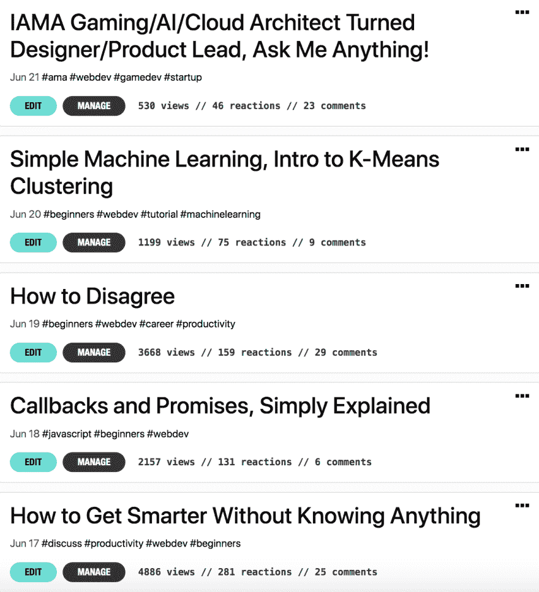](https://res.cloudinary.com/practicaldev/image/fetch/s--qGvK319A--/c_limit%2Cf_auto%2Cfl_progressive%2Cq_auto%2Cw_880/https://thepracticaldev.s3.amazonaws.com/i/o7nn5gbdcq00lcfzcajy.png)

最大的胜利是本周的第一篇帖子，它实际上是我迄今为止最好的帖子之一。我肯定把它的成功归功于我在 Reddit 上的帖子。

[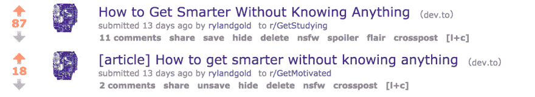](https://res.cloudinary.com/practicaldev/image/fetch/s--raSx1itY--/c_limit%2Cf_auto%2Cfl_progressive%2Cq_auto%2Cw_880/https://thepracticaldev.s3.amazonaws.com/i/bbnq2qm4v3abgva6o33m.png)

> 注意:如果你试图在 Reddit 上自我推销，你将会有一段糟糕的时光。我不会把所有的东西都发布到 Reddit 上，当我发布的时候，我会确保它是一种易于理解的 Reddit 友好格式。我还制定了一个规则，对于我在 Reddit 上发布的每一条内容，我都需要评论其他 5 个人的帖子，并帮助/回复他们。

关于分歧的帖子也做得很好，我想主要是因为 Dev.to 在 Twitter 上的这条幸运的推文。

液体错误:内部

那一周最大的惊喜其实是我关于 K-Means 的帖子。我真的觉得这是迄今为止质量最高的作品/内容，这让我意识到在 Dev.to 上根本没有数据科学社区。

对于那些想知道为什么我在 6 月 21 日做了一个 AMA 而不是一个合适的帖子的人来说，这是因为那天是星期五。在查看了 Dev.to 上发布的内容的一般统计数据后，我意识到周五实际上是一个死亡日，因此我可以对我发布的内容更加放松。我也觉得 AMA 是建立信誉的好方法。

#### 第四周(最后一周)

第四周开始时非常强劲。我本周的第一篇帖子是关于埃隆·马斯克的，埃隆·马斯克与迄今为止对我有用的任何一个话题都没有关系。不管怎样，我知道这是小众内容，因为特斯拉很受欢迎，所以很有吸引力。

[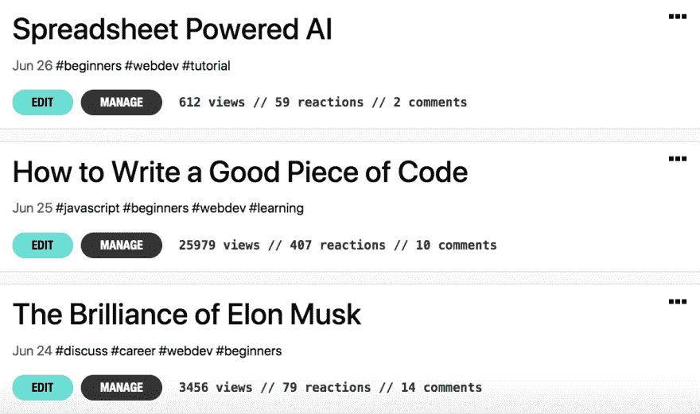](https://res.cloudinary.com/practicaldev/image/fetch/s--FvVHYSGH--/c_limit%2Cf_auto%2Cfl_progressive%2Cq_auto%2Cw_880/https://thepracticaldev.s3.amazonaws.com/i/e9dva0y3uhanmw5ix2da.png)

很多写作成功的内容都来自于对社会和互联网拓扑结构的理解。例如，因为我知道埃隆·马斯克有一群半狂热的追随者，所以正面描述他的内容可能会做得很好。尤其是当发布到致力于该类型内容的社区时。

我还了解到，当有人像马斯克一样有争议时，写关于他们的内容也会把争议带回家。

> 罗勃森@该死的强盗[@ taillogs](https://twitter.com/taillogs)[@ ThePracticalDev](https://twitter.com/ThePracticalDev)[@ elon musk](https://twitter.com/elonmusk)他的愚蠢其实21:32pm-24 2019 年 6 月

*对我的埃隆·马斯克博客帖子的回应*

我真的没有时间赶周二的邮件。事实上，我在睡觉前一个小时就放弃了我的整篇文章，然后在恐慌的匆忙中写了一些全新的东西。那篇名为[“如何写出一段好的代码”](https://dev.to/taillogs/how-to-write-a-good-piece-of-code-2gmj)的帖子最终成为我最成功的帖子。我认为这完全是因为它在 [/r/programming](//reddit.com/r/programming) 的首页上停留了一整天。

液体错误:内部

*推文也做得很好*

周三邮报很特别，或者我是这么认为的。这是一个我已经工作了很长时间的项目，并且只使用 Google sheets 公式完成了构建一个简单的 AI(多层感知器)的过程。我一直在使用谷歌表单，我认为这是几乎每个人都可以涉及的东西。我错了。《邮报》做得并不差，但还不足以证明我投入的时间是值得的。这也证实了我之前的怀疑，即 Dev.to 上没有数据科学社区。

即使到了周四，“如何写出一段好的代码”仍然占据着我的社交媒体。每天早上醒来，我都会收到大量来自分享它的人的通知。部分是因为这个原因(也是因为太累了)，在本月的最后三篇帖子(周四、周五和周六)中，我都很随意。

[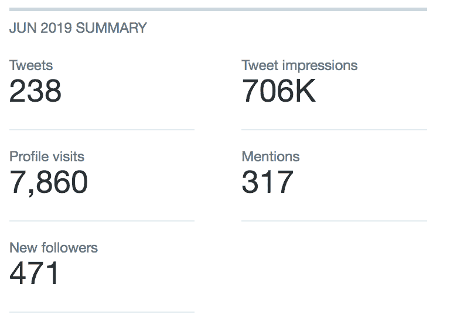](https://res.cloudinary.com/practicaldev/image/fetch/s--z2CJhhyX--/c_limit%2Cf_auto%2Cfl_progressive%2Cq_auto%2Cw_880/https://thepracticaldev.s3.amazonaws.com/i/11rzdkyvcfk3l34hj2ac.png)

*6 月推特统计数据*

### 胜负

我讲的故事很棒，但是结果呢？我们将从 Twitter 开始，因为最初的目标是获得更多的 Twitter 追随者。

[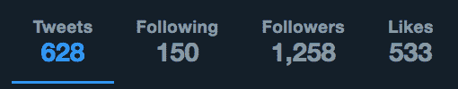](https://res.cloudinary.com/practicaldev/image/fetch/s--iI61HKI_--/c_limit%2Cf_auto%2Cfl_progressive%2Cq_auto%2Cw_880/https://thepracticaldev.s3.amazonaws.com/i/nctb7yeamwm90m77om91.png)

在 1.5 个月的时间里，我的推特粉丝从 0 人增加到了 1250 人。我没有真正的方法来衡量这一点，但我个人非常满意。我还认为，因为我把注意力更多地转移到了博客上，这减缓了我在 twitter 上的增长。

最大的收获实际上是在 Dev.to 上。在拥有 Dev.to 账户的整整 30 天里，我获得了 3500 名关注者，并从零开始积累了大约 54k 的浏览量。

[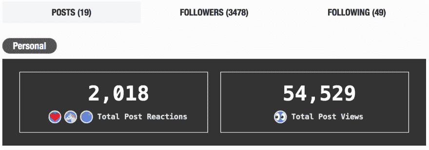](https://res.cloudinary.com/practicaldev/image/fetch/s--wYt4eFCk--/c_limit%2Cf_auto%2Cfl_progressive%2Cq_auto%2Cw_880/https://thepracticaldev.s3.amazonaws.com/i/psndh8ngm65dfvv945x1.png)

如果你还想知道 Dev.to 是不是一个开始的好地方，不要再想了。最后，这是我在 Reddit 上发布内容和帮助随机 redditors 解决技术问题所获得的报应。

[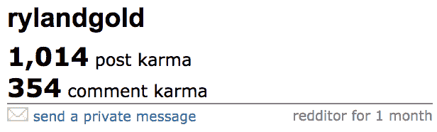](https://res.cloudinary.com/practicaldev/image/fetch/s--aT7pZdX1--/c_limit%2Cf_auto%2Cfl_progressive%2Cq_auto%2Cw_880/https://thepracticaldev.s3.amazonaws.com/i/hl4ajybon0lrftgvhncg.png)

> 披露:我以前从未购买过“互联网上的广告”,出于好奇，我花了 200 美元在 Reddit、Twitter 和 Google 上尝试了各自的广告平台。不是广告烂，就是我广告烂，他们做得很差，几乎没有增加流量。

### 外卖

*   **有些内容不会做得很好**这是我 100%期望进入过程的事情，这使得在整个过程中保持高效变得非常容易。让自己每天都这样做的最大好处是，你最终会发布如此多的内容，以至于一些不太受欢迎的内容没有意义。通常，那些“害怕”写博客的人有很多焦虑，担心他们写的东西不会被很好地接受。经常发帖可以让你用尺度解决这个问题。是的，有些内容不起作用，不，这不是因为它很烂(也许是错误的受众，也许是错误的格式)。

*   没有你想的那么可怕我不会撒谎说我喜欢写博客/社交媒体。但我绝对没有一个月前开始时那种纠结的感觉。我知道很多人和我一样在挣扎，但我保证这只是你的想象。只要你抱着自强不息的心态走出去，愿意改正自己的错误，就会一帆风顺。

*   写大纲:我建议你永远不要在没有至少一个粗略大纲的情况下开始写博客。大纲不仅使内容的写作变得更容易，而且通常会使最终的产品更加简洁和集中。我在月初没有使用大纲，事情很糟糕。

*   你必须传播你的内容:我看到很多很棒的帖子从来没有获得关注，因为作者没有充分分享。我知道很多人对此感到不舒服(包括上个月初的我)，但你真的不应该这样。如果你花了力气去做一个高质量的产品，但却不去分享它，这是不合逻辑的。你可以看到我的帖子从我确保它在多个平台上可见中获得了多少额外的吸引力。

*   **Dev.to 是热门:**如果你还没有考虑在网站上写内容，你应该这样做。我在这里的一个月里看到的增长数量令人震惊。我也与 Dev.to 团队有过多次互动，可以有把握地说，他们是你会遇到的最理性、积极、头脑冷静的人。我可能经常让他们心烦，但他们从来没有抱怨过。这个社区也相当无毒，但我担心这只是它规模的一个因素。

*   **参与反馈:**如果你只是写帖子而不回复评论/反应，你就错过了。我尽我所能对我收到的每一个合理的/非巨魔的评论给予真诚的回应。是的，这很费时间，但也很容易被发现，有助于在社区中建立你的正面形象。

*   我不能每天都发帖子，六月对我来说很难熬。我没有一点空闲时间。我要么在我的创业公司工作，要么为第二天的帖子写内容。我会说我平均每天花 12-16 个小时在工作、写作和编辑上(包括周末)。这几乎完全是生产时间。我一天只吃一顿饭，而且我住的地方离工作地点只有 5 分钟的路程，所以开销很小。

起床->工作->回家->工作->睡觉->重复