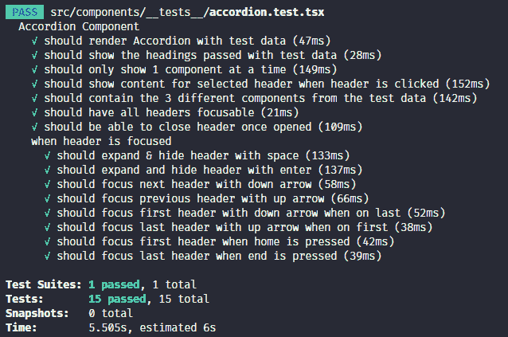
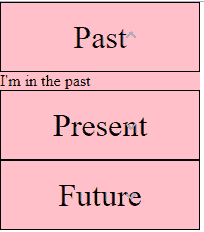

# 我如何设计一个无障碍反应手风琴

> 原文：<https://dev.to/liammyles/how-i-tdd-an-accessible-react-accordion-mcb>

# [T1】简介](#intro)

最近我在工作中做了很多 TDD，我开始思考将 TDD 引入我的 react 工作流的最佳方式。

这不是一个关于细节的教程，而是更多的关于与用户交互时的思考方式。

我正在构建的组件接收组件和标题，并将它们显示在一个 accordion 中。如果您对最终代码或我使用的任何库感兴趣，您会在最后找到它们:)

# 我是如何开始的

当我处理任何复杂的交互时，我首先会查看 wai-aria 规范。他们有大量常见 UX 模式的例子，包括一个无障碍手风琴的[例子](https://www.w3.org/TR/wai-aria-practices/examples/accordion/accordion.html)。

这个规范是整个组件 TDD 周期的起点。它清楚地概述了用户应该能够与手风琴交互的方式，并提供了一个工作示例。

我喜欢从一长串`todo`开始。所有这些待办事项可能不会成为最终的测试，但它有助于我思考问题。

将不同的工作分成清晰的逻辑步骤也很有用。例如，在下面的待办事项中我需要先`only show 1 component at a time`才能可靠地`show content for selected header when clicked`

```
 describe("Accordion Component", () => {
      it.todo("should render Accordion with test data")
      it.todo("should show the headings passed")
      it.todo("should only show 1 component at a time")
      it.todo("should show content for selected header when header is clicked")
      it.todo("should contain the 3 different components from the test data")
      it.todo("should focus next focusable element with tab")
      it.todo("should focus previous focusable element with tab")
      describe("when header is focused", () => {
        it.todo("should expand header with space")
        it.todo("should expand header with enter")
        it.todo("should focus next header with down arrow")
        it.todo("should focus previous header with up arrow")
        it.todo("should focus first header with down arrow when on last")
        it.todo("should focus last header with up arrow when on first")
        it.todo("should focus last header with up arrow when on first")
        it.todo("should focus first header when home is pressed")
        it.todo("should focus last header when end is pressed")
      })
    }) 
```

Enter fullscreen mode Exit fullscreen mode

有了定义的测试，我很想开始通过它们，但是我发现以同样的规划方式布局 HTML 很重要。我不会在这里讨论这个，但是在我的代码中，我只是遵循了 aira 规范。将其分解成有意义的 react 组件，并根据传递的属性更新正确的 HTML 属性。

围绕 HTML 编写测试对我来说可能是有价值的，我在这次探索中没有这样做。如果 HTML 变得不可访问，我相信交互会失败。然而，事后看来，HTML 的屏幕阅读器部分并没有得到完全的保护。

# 编写测试

## 为什么我先写测试

虽然直接进入 react 很诱人，但是先写测试会更干净、更省时。我想描述我想要创建的东西，这样我就可以轻松简单地确认它已经被创建了。

我还想在做任何事情之前确保我的测试失败。每当我遇到更新我的测试使它们通过的情况时，它迫使我为了信任它而破坏我的代码。这只是浪费时间。

## 为什么我只考虑当前的测试

我发现很容易陷入更广泛的解决方案中。然而，专注于最终解决方案将导致大量前期管理的复杂性。这就是为什么我试图考虑通过当前测试的最小代码量。这样，最终的解决方案会随着我对问题的理解而增长。

在这个例子中，我怀疑我将需要 useReducer 来处理状态。这让我陷入了一个兔子洞，最终我浪费了大量的时间只是为了展示一个内部组件。

最后，我后退一步，创建了一个`const`布尔数组。这样做，我减少了问题的前期复杂性，并随着我不断通过测试，慢慢地分解它。我最终还是使用了 useReducer，但是随着我对问题理解的加深，我的植入变得更加健壮。

## 我尽量不担心的事情

我尽量不去担心一遍又一遍地测试相同的逻辑。测试总是有用的，只要它提供一些新的上下文。在一次测试中没有必要干(不要重复自己)。

我也知道我不会在第一次测试中就发现所有的边缘情况，如果将来有 bug 发生，只要写一个新的测试就不会再发生了。你不必第一次就把一切都做好。它只是一个组件:)

# 我到底有什么

所以我做了所有这些测试，使用模拟真实用户如何使用它的测试库。并创建了一些非常健壮的代码。我已经通过了所有的测试，甚至还添加了一些新的测试，这些都不是我的首要任务。这就是我的结局。

[](https://res.cloudinary.com/practicaldev/image/fetch/s--h5e7BhK9--/c_limit%2Cf_auto%2Cfl_progressive%2Cq_auto%2Cw_880/https://thepracticaldev.s3.amazonaws.com/i/iy8uet8e9x6k4awpkze0.png)

[](https://res.cloudinary.com/practicaldev/image/fetch/s--K9XGtew4--/c_limit%2Cf_auto%2Cfl_progressive%2Cq_auto%2Cw_880/https://thepracticaldev.s3.amazonaws.com/i/d52fvxcz6uubgf31psvt.png)

一组可爱的通过测试，一个组件在用户可以使用它之前还有很长的路要走。它仍然很棒，它真的只是缺少 CSS，而且 CSS 在大多数情况下不应该被测试。CSS 更像是一门艺术，比 JS 更难定义。但是有了良好的交互基础，就可以更自由地将设计添加到可访问的功能中。

它还有助于保护组件的可访问性，并清楚地定义了设计的约束。它不会捕捉每一个可访问性错误，但至少会确保它按照 aria 规范的要求运行。

# 明白了

任何新的东西都很难，学习 Jest、React-testing-library & jest-dom 需要提前学习很多东西。它也迫使你去理解 DOM API，所以如果你不是 100%了解它，有些事情会很混乱。

不过，我从中获得了很多乐趣，我甚至还加入了 typescript。但是，如果你是第一次学习，这会让你花更多的时间。尤其是如果你是一个人学习的话。没关系。

此外，在 react 中管理焦点是一件需要注意的事情，它超出了我在这里要说的范围。但是，想想当组件重新呈现时，您将如何管理焦点。提示，您需要了解裁判

# 查看这些资源！

*   [运行组件示例](https://bg9wu.codesandbox.io/)
*   [代码](https://codesandbox.io/s/flamboyant-hugle-bg9wu?fontsize=14)的代码沙箱
*   [反应测试库](https://github.com/testing-library/react-testing-library)
*   [是家(github)](https://github.com/testing-library/jest-dom)
*   [是](https://jestjs.io/)
*   [咏叹调示例](https://www.w3.org/TR/2019/NOTE-wai-aria-practices-1.1-20190207/examples/)