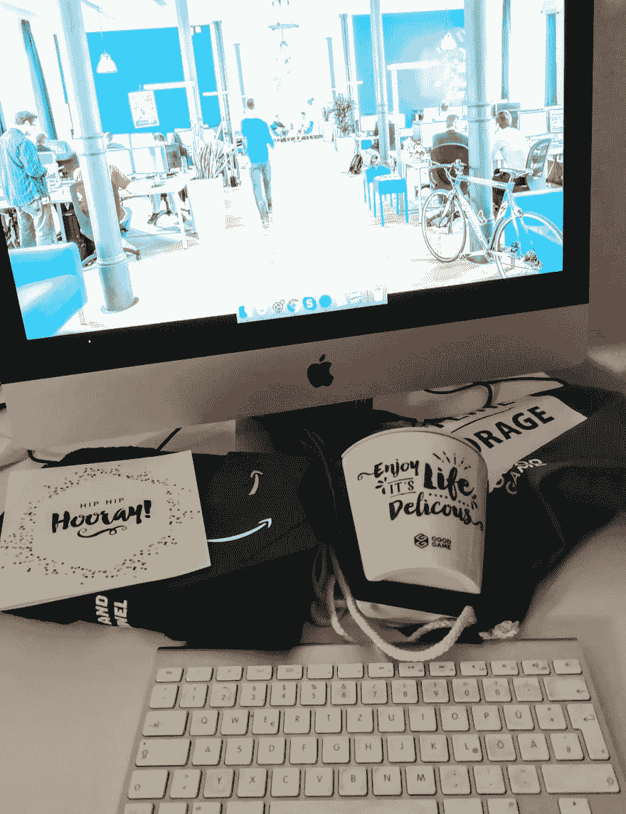

# 你在同一家公司工作多久了？

> 原文：<https://dev.to/dvddpl/how-long-have-you-worked-at-the-same-company-448b>

本周，我在 Goodgamestudios 度过了我的 6 周年纪念日。
这也意味着我已经 6 年没有从米兰(意大利)搬到汉堡(德国)了。

这是一次奇妙的旅程，我真的很感谢这次经历。它让我有机会在一个现代、年轻和创新的环境中工作，并在一个绿色、整洁、自行车友好、时尚、充满活力的城市中生活和抚养我的孩子。

尽管我们经历了一些困难时期——3 年前有过两次大规模裁员浪潮——我很高兴我还在这里。
我在这里学到了很多！作为一名软件工程师，这 6 年比之前的 10 年我成长得更多！我有机会和了不起的人一起工作，结交令人难以置信和鼓舞人心的朋友，在不同的领域和语言中挑战自己:前端-后端-网络-移动- ActionScript - Unity3D 和 Javascript，无服务器。
和**这可能是我还在这里的原因**(是的，除了我住的地方骑自行车正好有 7 分钟的路程:-))。

过去，我总是觉得有必要和冲动继续前进，改变公司，寻找新人和新挑战。在同一个地方呆久了没有什么不好，但是

> 尤其是在 IT 行业，我总是觉得如果你不前进，你可能会陷入困境，变得过时。

幸运的是，在 GGS 的这 6 年里，我参与了 4 个不同的项目和团队，所以我真的感觉好像在 4 个不同的公司工作。

你的体验是什么？长期在同一个地方工作，你有什么感受？只是我变懒了，不想接受新的挑战吗？或者我终于认识到，如果我在我现在的地方很快乐，就没有必要不断地去寻找其他地方？

* * *

twinsfisch 在 Unsplash 上拍摄的照片