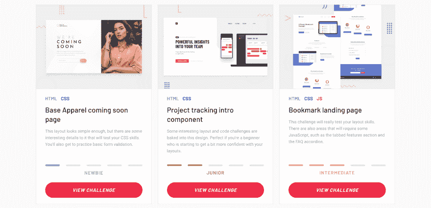

# Matt 是如何在没有学位的情况下学会编程的

> 原文：<https://dev.to/petecodes/how-matt-from-frontend-mentor-learned-to-code-without-a-degree-11eo>

马特·斯图德特(Matt Studdert)经营着优秀前端导师网站(excellent Frontend Mentor website)，该网站通过制作真实的项目来帮助新手程序员学习制作网站，而不是做无休止的教程。我自己也用过！Matt 从一个新手开发者参加训练营，到在同一个训练营教授 web 开发课程。我和他聊起了学习编码、编码新手的小技巧以及他对没有 CS 学位的求职者的建议。

## 非常感谢面试！那么能不能给想更多了解你的人介绍一下？

不客气，谢谢你创建了这个了不起的网站！大家好，我叫马特，来自英国伦敦。我是[前端导师](https://beta.frontendmentor.io/)的创始人，该公司旨在通过为人们提供设计来帮助他们建立前端技能。

当我不在[前端导师](https://beta.frontendmentor.io/)工作时，我也是大会的兼职首席导师。我教很多他们的兼职网络开发课程和研习班。

## 你最初是怎么进入编码的？

在研究了一个完全不同的领域后，我在 20 多岁时进入了编码领域。在学校，我从来没有接触过编程，我更喜欢运动。这让我在大学学习运动科学，并在完成学位后开始了个人训练业务。

我会时不时地在精神上快进我的生活 5 年或 10 年，想想如果我继续我现在的道路，我是否会幸福。在经营我的 PT 业务 4 年后，这个问题的答案开始变成“不”。我看不出自己会长期这样做。一旦我意识到这一点，我的思想就开始不断地游走于其他可能的路线。我仍然热爱我正在做的事情，但我知道我必须尽快做出改变。

不幸的是，所有让我兴奋的想法都与推出网站或应用程序有关。由于我没有任何编码知识，我认为开始学习是个好主意！当我开始的时候，就像灯泡熄灭了一样，我完全被吸引住了！我不敢相信我以前没有写过代码。

我开始使用像 Lynda 和 Codecademy 这样的网站。但很快，来自大会的一个适时的 YouTube 前置广告引起了我的注意。我浏览了网站，发现他们有一个全职训练营，将于 4 周后在他们的伦敦校园开始。

我很幸运，因为我有一些积蓄，并且通过把我的客户卖给另一个教练赚了一些钱。所以我立即访问了 GA 校园，并经历了面试过程。不过，我在伦敦没有自己的住处，所以在整个 3 个月的课程中，我都睡在空余的房间里，睡在朋友和家人的沙发上。这是一次令人惊奇的经历，完成训练营 8 天后，我已经被聘为全职开发人员了！

## [没有 CS OK——没有学位的开发者的工作板](https://nocsok.com)

## 对于正在学习编码却觉得力不从心的人，你有什么建议？

尽可能努力专注于一个单一的学习目标，排除其他一切，直到你觉得你已经实现了它。保持可控、专注，并计划好你将如何实现它。在科技领域，总有新的、闪亮的东西可以玩，这意味着人们很容易分心。希望这个计划能帮助你坚持下去。

以你觉得舒服的速度学习，如果你觉得自己学得比别人慢，也不要担心。我绝不是 GA 团队中最聪明的人。但随着时间的推移，我开始得到更少的错误，事情开始移动到我想要他们去的地方！

此外，寻找支持和欢迎有抱负的开发者的社区。Frontend Mentor 有一个 Slack 社区，有超过 1，600 名各种技能水平的开发人员讨论前端代码并互相帮助。如果你喜欢这个声音，请随时[加入这里的社区](https://beta.frontendmentor.io/slack)。

## 对找第一份工作的程序员有什么建议？

我的主要建议是表现出学习的意愿和建设项目的热情。对于你的第一份工作，你很可能会因为态度而不是能力被录用。在你职业生涯的早期阶段，表现出学习和提高的意愿尤其重要。

## **想要一份开发人员的工作却没有学位？通过 [Triple Byte 的测验](https://triplebyte.com/a/Ww4mbM6/d)，直接进入顶级科技公司的最终现场面试**

## 你曾经考虑过计算机科学学位吗？如果没有，为什么没有？在找工作时，这曾经是一个问题吗？

因为我在上学期间从未接触过编程，所以计算机科学从未出现在我的视野中。我有一种感觉，如果我在生活中早点开始编码，可能会是一个不同的故事，我可能会走上 CS 的道路。然而，如今，有了编码方面的学习资源，我不认为 CS 学位对成为一名 web 开发人员是至关重要的。

我个人没有因为没有计算机科学学位而在找工作方面遇到任何问题。这取决于角色，但我不认为这是很多工作规范中的要求。只要你能展示一些项目，并讨论技术方面的问题，你就能在很多地方获得成功。

## 你为什么要成立前端导师，进展如何？

我在 GA 教的课程之一是 10 周的兼职前端开发课程。每当课程结束时，学生们问我的最常见的问题是“我现在可以去哪里继续练习？”。我的默认答案是去 Dribbble，尝试重新创建一些照片，建立一个作品集网站，或者尝试从头开始重新创建可下载的模板网站。但这些选项都没有真正模仿前端开发人员的工作方式。

过了一段时间，我开始想为什么一个为开发者提供设计的网站不存在。有这么多令人难以置信的教程和一步一步的代码，但我找不到任何网站只提供设计，其余的交给你。我觉得对试图走出“教程炼狱”的人会有价值，所以我建了！

自从我推出这个网站以来，反馈一直很惊人。看到人们发布他们的解决方案并随着每个新的提交而改进，这是非常值得的。有些人甚至将他们的项目作为投资组合项目，这太棒了！该平台目前仍处于测试阶段，但我会很快将其转入主域。

## 人们在学习编码时有什么生产力小贴士？

这并不是专门针对编码的，但是我认为每个人都应该读一读杰克·纳普和约翰·泽拉特斯基写的《创造时间》一书。在一个不断分心的世界里，它真的能帮助你实施保持专注于任何任务的策略。

## 你有没有想过你会教人们编码？你认为你自己在训练营的那个位置会更容易吗？

如果你告诉 16 岁的我，34 岁时我会成为一名网站开发员和讲师，我绝不会相信你！教书从来不是我有意识的目标。起初，我晚上回到 GA 当助教，帮助巩固我的知识，赚点外快。但是当我开始帮助别人进步时，我发现这非常有益。

我想说，作为一名训练营的学生，帮助我形成了自己的教学风格。我知道自己作为学生的感受，所以我想确保我的学生得到尽可能多的支持。

## 你对未来有什么抱负？

我希望 Frontend Mentor 有朝一日成为业内知名人士，成为帮助人们提高前端技能的宝贵资源。我的目标是不断发展社区，帮助尽可能多的人获得在真实工作流程中构建的经验。

## [每周获得两次编码灵感](https://mailchi.mp/67e1bf258afa/nocsdegree)