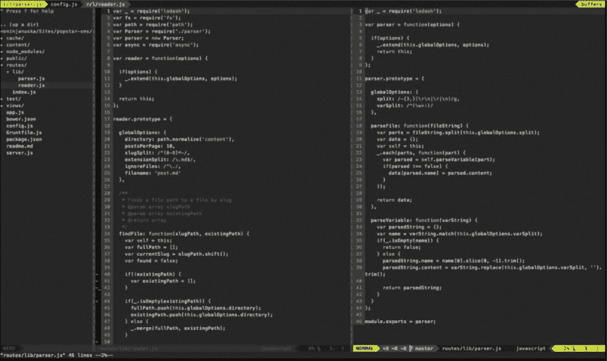
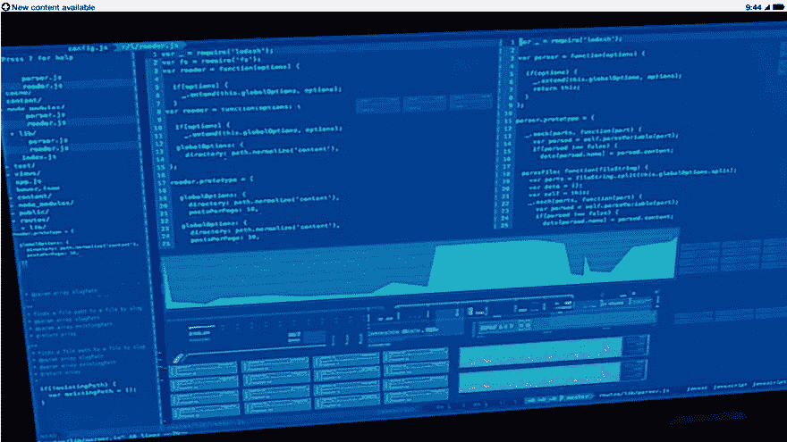

# 我的 VIM 设置和开源代码是如何出现在 AAA 视频游戏中的

> 原文：<https://dev.to/antjanus/how-my-vim-setup-and-open-source-code-ended-up-in-an-aaa-video-game-1if2>

我将带你去听一个疯狂的故事，我把它告诉每个人，因为我觉得它很刺激。它在我的 Twitter 上占据了第一位，我只是想用这篇文章来结束我个人令人讨厌的故事分享，这样我就可以停止用它来烦别人了:)

## 图像

几年前，当 LinkedIn 在个人资料中引入这个功能时，我把它设为我在 LinkedIn 上的新横幅图片。我觉得这挺不错的。我没有在其他任何地方分享过这张照片。

那里面有什么？

这是我当时使用的自定义 VIM 设置。在 VIM 中，你可以看到我打开了一个名为 [popstar-cms](https://github.com/AntJanus/popstar-cms) 的项目和一个名为`reader.js`的文件。我提到这一点是为了让您知道，那里写的代码就是我的代码。

还要注意，我在顶部导入了 [lodash](https://lodash.com) ,这个项目在这个时间点没有许可证文件。

## 育碧员工参观

在某个时间点，我检查了谁查看了我在 LinkedIn 上的个人资料。在一群招聘人员、不知名的名字以及其他人当中，有一个育碧的员工，但我必须向 LinkedIn 支付高级会员费才能透露这个人是谁。

我没多想。各种各样的人查看我的个人资料。也许是他们的一个网站开发者。谁知道呢。

## 推文

一段时间后，我看到了约翰-大卫道尔顿(lodash 的创造者)的推文。大约在这个时候，Lodash 出现在一切事物中已经成为了一个迷因。每个人都在使用它，这是一个笑话，所以 lodash 出现在一个名为 Watch Dogs 2:

> 约翰-大卫道尔顿[@ JD alton](https://dev.to/jdalton)ZOMG！洛达什在游戏中亮相 WATCH _ DOGS _ 2 \[@ watchdogs game](https://twitter.com/watchdogsgame)[twitter.com/PorlyP/status/…](https://t.co/ECX1LXSD6A)2016 年 11 月 21 日上午 05:19保罗 @PorlyPDedsec 桌面运行一个@nodejs 应用程序，使用洛达什和@ bower:# JavaScript # watchdogs 2 # ps4 share https://t.co/M2vna284Ry[【t3t](https://twitter.com/intent/tweet?in_reply_to=800569316575997952)

我记得我漫不经心地喜欢这条推文，却没有仔细查看。我也在用 lodash，这个笑话是真的。我觉得这很有趣。

然后道尔顿花时间弄清楚这是我的项目，并在推特上发了@ me:

> 约翰-大卫道尔顿[@ JD alton](https://dev.to/jdalton)代码为 jumbotron-feed-app 的 reader . js&parser . js by[@ antjanus](https://dev.to/antjanus)/ht @ fskreuz
> [github.com/AntJanus/jumbo…](https://t.co/TGUNlAA1iY)08:00am-2016 年 11 月 21 日

看到他发来的推文，我真的很惊讶，当我发现我的代码出现在一个 AAA 游戏中时，我欣喜若狂！我听说过《看门狗》及其续集，我从未玩过，但我认为它真的真的很棒。当然，我告诉了所有人。

让我们不要忘记[归功于拍摄原始截图的保罗](https://twitter.com/PorlyP/status/800472188637900800)。

(注意:道尔顿在推特上给我发的那个项目是错误的，横幅应用是之前提到的 popstar cms 的一个分支)

## ded sec 截图

这张截图是一个名为 DedSec 的黑客团体在一个名为 Watch Dogs 2 的游戏中的藏身处的监视器，该游戏是由育碧加拿大公司开发的——而且育碧员工的随机访问是有意义的！

所以在我离开这个故事之前(我的意思是，大揭露已经发生了)，我想比较两个截图:

育碧在几个方面修改了我的原稿:

1.  他们删除了我的名字和项目名称(这让我很不爽)
2.  文件树的特点是复制/粘贴了一些`reader.js`和`parser.js`文件列表
3.  看起来他们只选择了每个文件缓冲区的特定部分
4.  在文件树下，我们实际上看到了`findFile`函数的一部分
5.  在 2 个缓冲区下有一些随机的可视化

## 嗯，我们来说说 Reddit

当时我真的很兴奋，所以我决定在 Reddit 和 WOW 上分享这个故事。我没想到人们会这么差劲。长话短说，大多数人认为 DedSec 截图中的代码与我的截图无关，这对我来说很奇怪。我是说，他们甚至抄袭了我的 JSDoc 代码注释。不管怎样...

给大家的一个教训:千万别上 Reddit。如果你想成为一个好的技术社区的一员，请呆在 dev.to 上或者去 Twitter(如果你敢的话)。

## 为什么提牌照？

好吧，Reddit 上的人确实有一个优点。育碧未经许可使用了我有版权的截图，他们发布了我的部分代码，可以在 Github 上免费查看，但不能免费使用/复制/等等。无论如何。我确信这符合合理使用的条件；然而，我不是律师🤷‍♀️.

我对此并不生气，天啊，我也不会对此大惊小怪，但它让我很感兴趣，并让我想知道还有多少公司在没有让创造者知道的情况下使用其他资产，没有给它们信用，并从资产中抹去它们的名字，以便它们可以使用。