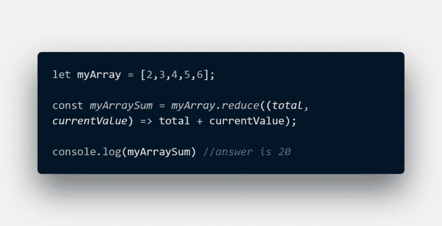
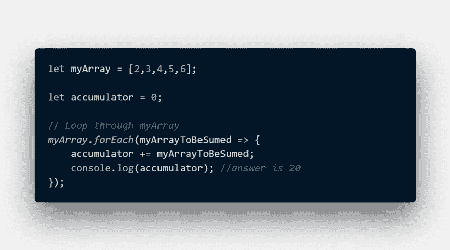

# reduce()函数是如何工作的

> 原文：<https://dev.to/saucekode/how-reduce-function-really-works-3j6m>

你好！新人提醒！这是我在这里的第一个帖子，我非常兴奋。

今天，我将解释 reduce()函数到底是什么样子，以便 Javascript 初学者能够真正理解它是如何工作的。仅仅使用它是不够的，我认为理解它是如何工作的也很酷。

首先，reduce()函数是一个高阶函数。高阶函数是将其他函数作为参数的函数。它是在 ES2015 或 ES6 中推出的。

## REDUCE()函数到底是干什么的？

reduce()函数帮助您将一组元素转换成一个值。简而言之，它总结了数组中的所有内容。很酷，对吧？😊

## 工作原理

这是一些关于 reduce()如何工作的代码，但现在我将向您展示它真正是如何工作的。

准备好了。设置。走吧。

## 减少引擎盖下的()

这是 reduce()函数的扩展。

现在，我将把它分成几个部分，让你自己理解这是如何发生的。这是简单的数学，在 Javascript 中，它被称为增广加法/加法。

## 把它打碎成块

记住我们将累加器初始化为 0，这是整个代码的起点。

### 添加:

累加器+= myArrayToBeSumed，这也意味着...累加器=累加器+ myArrayToBeSumed。(+=)这是增广求和/加法。

快速分解一下:左边的值是**累加器**而右边的值是**myArrayToBeSumed**
=>0+= 2 也表示 0 = 0 + 2 答案是 2。累加器现在是 2。
= > 2 += 3，3 是数组中的下一个元素。累加器现在是 5。
= > 5 += 4，累加器现在是 9。
= > 9 += 5，累加器现在是 14。
= > 14 += 6，累加器现在是 20。

累加器不断增加数组中的所有内容，直到到达数组中的最后一个元素，然后停止。

P/S: accumulator 只是为我的变量选择的一个名字，它不是 Javascript 中的一个关键字。

下一篇文章希望是在实际例子中使用 reduce()函数，而不仅仅是数字。

希望通过这个，你能理解 reduce()是如何工作的，以及你为什么要使用它。♥️ ♥️ ♥️