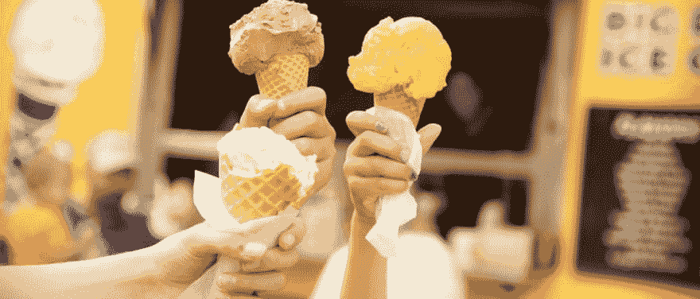

# 创业公司如何像中小企业一样——北斗星冰淇淋，密西西比州

> 原文：<https://dev.to/scottmathson/how-startups-can-be-like-smbs-big-dipper-ice-cream-missoula-mt-3c5i>

自 1995 年以来，北斗星冰淇淋一直是蒙大拿州米苏拉的主食。

Coneboy 是他们欢快的吉祥物，出现在帽子、纽扣和 t 恤等服装上，出现在电影节和其他活动的赞助商阵容中，出现在他们的冰激凌车上，出现在杂货店的冰激凌通道上，以及许多其他地方。

手工制作的小批量冰淇淋在原产地供应，沿着米苏拉市中心的河边步行即可到达。人们去北斗星是为了体验。整个品牌、其产品、店面设计、快乐的团队、乐观的音乐、参与社区以及他们的诚信继续塑造着这种体验。

这种北斗星体验是有意的——他们的品牌、产品、整体氛围都是有意的。我对像北斗星这样专注于创造一致性体验的中小型企业(SMB)非常着迷，也非常钦佩，从产品到服务到包装，一切都是一致的。完全为他们的朋友、家人和当地社区服务的企业。我发现这种情况更多发生在中小型企业，而不是大型科技机构。

如果更多的科技创业公司开始这样思考会怎样？

他们不断尝试新的、有趣的、受当地启发的口味，与当地厨师、酿酒厂、咖啡烘焙商和其他企业合作。站在希金斯大街(Higgins Ave .)旗舰店门口(总是很长)的队伍中，你的眼睛自然会看向手写的季节性和特色菜广告牌。有些味道能坚持，有些味道不能，但最重要的是北斗星不怕尝试。

几年前，我听过合伙人查理·比顿(Charlie Beaton)在米苏拉当地的一次商业活动上的演讲，我记得他说过，他们从未真正制定过 5 年或 10 年的商业计划。北斗七星是有机进化的，没有强迫。对他们来说，扩张是以店面增长和批发分销的形式出现的。

这次活动后不久，他们推出了北斗七星精选系列。这种常青树式的扩张已经持续了 21 年，通过战略合作伙伴关系，他们一直在寻找新的机会，比如向地区商店和餐馆配送，同时向蒙大拿州冰川和黄石国家公园的游客提供冰淇淋。

虽然像《早安美国》、《美食与美酒》杂志和《今日美国》这样的人物已经照亮了他们的生意，但比顿一家仍然保持谦逊，从不寻求成为任何焦点。与坐在店外木凳上的长期忠诚顾客分享体验，是持续带给他们快乐的事情。

创业公司可以从像蒙大拿州北斗星冰淇淋米苏拉这样的中小企业那里学到很多品牌、营销和产品方面的经验。保持好奇心，继续在你自己的领域和行业之外寻找，并保持一致。