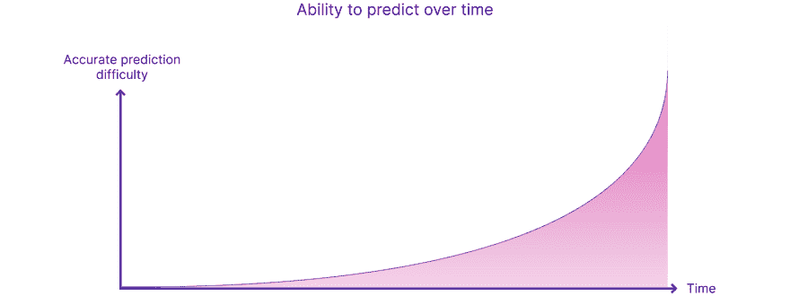
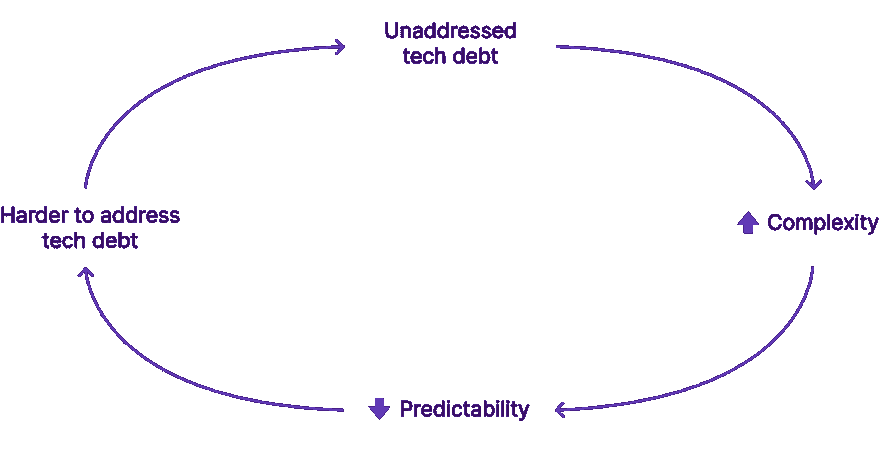
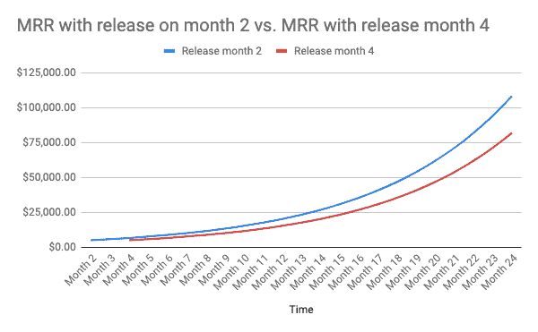
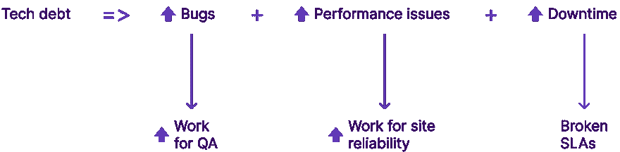
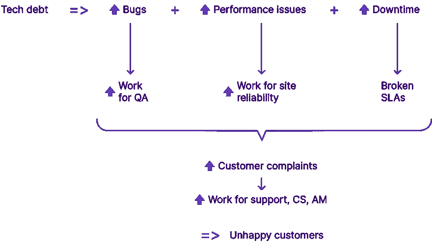

# 科技债务如何影响公司的每个人

> 原文：<https://dev.to/stepsize/how-tech-debt-impacts-everyone-in-the-company-2neo>

如果你读过我们关于工程师需要战胜技术债务的习惯的文章，你可能会想起康威定律:

> 设计系统的组织[...]被限制于生产复制这些组织的通信结构的设计。

[维基百科](https://en.wikipedia.org/wiki/Conway%27s_law)

这是可能将我们推向技术破产的力量之一，因为软件工程师设计的系统受到他们公司组织结构的限制——他们对此几乎没有控制权。对抗这些力量的正确方法是在整个公司范围内谈论科技债务，这样每个人都能理解为什么小心管理它是至关重要的。
在本文中，我们将讨论由技术债务引起的元问题，并讨论它们如何影响任何软件业务的各个领域。这将给你工具来减轻你的工程师必须处理的压力。

## 科技债引发的元问题

在宏观层面上，任何成长中的软件公司都可能经历由代码库不断增加的熵(即[系统中的随机性](https://www.britannica.com/science/entropy-physics))导致的技术债务。查看我们的文章，这篇文章概述了[科技债务不可避免的简单原因](https://blog.stepsize.com/laws-of-tech-debt-part-i-macro-trends-that-make-tech-debt-inevitable/)来深入探讨这个话题。
一般来说，熵的增加意味着复杂性的增加。复杂意味着缺乏可预测性。

我们试图预测的未来越遥远，我们的预测就越不准确。再加上复杂的代码库需要更多的时间来修改，这就形成了一个很好的恶性循环。

在高速发展的软件组织中，这比大多数人想象的要快得多。

> 开发人员发现质量差的代码会在几周内显著降低他们的速度。

Martin Fowler，[高质量的软件值这个价钱吗？](https://martinfowler.com/articles/is-quality-worth-cost.html)
为了帮助工程师打破这种恶性循环，我们构建了一个免费的 VSCode 扩展来持续跟踪和偿还技术债务。[趁还来得及，现在就开始吧！](http://bit.ly/VSCode-marketplace-Stepsize)

## 科技债务如何影响产品管理

让我们从显而易见的开始:产品开发需要适当的管理。要创造一个卓越的产品并赢得一个品类，你需要密切关注客户的需求。。。尽快见到他们。
正如 Martin Fowler 解释的那样，“客户确实关心新功能的快速出现。。。更好的内部质量使得添加新功能更容易，因此更快更便宜。你可以在[的文章](https://martinfowler.com/articles/is-quality-worth-cost.html#CustomersDoCareThatNewFeaturesComeQuickly)中了解更多。
正如我们在上一篇关于[为什么技术债务是不可避免的](https://blog.stepsize.com/laws-of-tech-debt-part-i-macro-trends-that-make-tech-debt-inevitable/)的文章中所讨论的，我们在每次冲刺中都要面对的权衡是发布新功能还是偿还一些技术债务。Martin Fowler 的观点解释了为什么如果我们想要跟上发展的步伐，我们不能总是选择前者。如果我们屈服于我们可以两者兼顾的幻想，我们将会在技术上破产，我们将需要六个月的时间来重写我们应用程序的所有部分。实际上，我们可以把这个时间延长一倍，至少一年，因为一个有技术债务的代码库非常复杂，很难估计对代码的任何修改的范围。当然，复杂的代码库抵制变化，这意味着一切都需要更长的时间。
即使他们知道他们必须咬——如果不是吞下——子弹，公司领导*真的不希望听到 70%的工程能力需要分配给重写。他们可能会决定更换产品领导。
如果你是一名产品经理，你想避免这种情况，确保在每次冲刺中分配一个合理的技术债务预算，以便工程师可以在发布新功能时偿还技术债务。查看我们关于[如何停止在技术债务上浪费工程时间的文章](https://blog.stepsize.com/how-to-stop-wasting-engineering-time-on-technical-debt/)以获得指导。做正确的事情，你会有一个双赢的局面——你会更快地避免技术破产。*

## 技术债务如何影响销售团队

销售团队喜欢通过在功能上竞争来赢得与竞争对手的交易:“我们的软件比竞争对手有更多更好的功能，所以你应该购买我们的产品。”然而，现实是，当初创软件公司在一个既定的产品类别中竞争时，它们很少能仅靠功能来竞争。现任者通常会有一个更长的特性列表。敏捷软件公司拥有的一个优势——或者更确切地说是*应该拥有的—*—是以比不那么敏捷的竞争对手更快的速度发布更好功能的能力。因此，正如我们所看到的，如果我们的代码库充满了技术债务，我们将无法按部就班地交付新功能，错误将会妨碍我们的用户体验，销售团队将会失去交易。
想要达成更多交易、获得更多佣金的销售人员(即所有销售人员)，需要明白工程不能经常偷工减料。它会回来咬每个人。

## 科技债务如何影响营销&公关

成功的营销活动需要持续不断的大量协调——我们不能一年只在 Techcrunch 上发布一次，然后就此收工。我们需要创造一个不断改进的增长引擎，以逐步建立客户心智共享。这需要几年时间。为了做到这一点，营销需要产品和功能发布日期，而这些发布日期需要得到满足。换句话说，我们需要可预测性，因为营销活动需要大量的前期工作。市场营销和软件发布周期之间有许多依赖关系。
如果工程以持续和可预测的速度发展，市场营销可以相应地做好准备。为了让工程做到这一点，需要小心管理技术债务。
至于公关，我将留给你[这个银行业恐怖故事](https://www.bbc.co.uk/news/business-43923561)关于数据库迁移出错如何让 TSB 客户看到并控制其他客户的银行账户。它让这家银行的庞然大物屈服了，正如巴克莱银行前全球网络主管、现任环球科技金融服务首席顾问尼克·哈蒙德(Nick Hammond)解释的那样:“TSB 危机为许多银行 It 系统的复杂性所带来的问题提供了一个很好的案例研究，尤其是改变这些系统的难度。
这就是未受管理的科技债务的样子，它显示了它能造成多大的损害。你不需要成为一个大银行，这样的事情也会发生在你的代码库上。你可能上不了 BBC 新闻，但后果同样可怕。不要让它发生在你身上。如果营销部门希望产品开发能在截止日期前完成，并避免公关失败，他们需要放弃工程师在发布新功能时浪费时间偿还技术债务的想法。事实上，他们需要欢迎技术债务的偿还，并给工程师们处理它所需的喘息空间，而不是迫使他们发布新功能。这会让我们的生活更轻松。

## 科技债务如何影响人力资源

“高质量的代码库”是黑客新闻读者在工作中寻找的第二重要的东西，仅次于“工作/生活平衡”(也受到科技债务的影响)。简而言之，那些在充斥着技术债务的代码库中工作的工程师并不开心。他们花了太多时间在本应是形式的功能上。他们在工作上没有进步。他们感到无聊。它们不会生长。他们离开公司。
[考虑到雇佣新工程师的成本](https://www.qualified.io/blog/posts/the-hidden-cost-of-hiring-software-engineers)，公司需要尽可能降低员工流动率。最好的方法是小心管理技术债务，以维护一个健康的代码库。

## 科技债务如何影响金融

技术债务会以多种方式让我们损失金钱:失去交易、客户流失、员工流失、诉讼等等。然而，有几个问题比其他问题更重要:工程时间和软件延迟的收入成本。
工程时间成本很简单:

> 工程师花 33%的时间处理技术债务。

[显影剂系数](https://stripe.com/files/reports/the-developer-coefficient.pdf)(条纹)

可以这样想:如果你付给你的软件工程师 10 万美元，其中 33%用于处理技术债务。对于一个 50 人的工程团队来说，33%是 165 万美元/年。Stripe 估计这将对全球 GDP 产生 3 万亿美元的影响。我们不需要在这些数字上多费口舌，它们已经够清楚了。另一方面，软件产品发布延迟对每月经常性收入(MRR)的影响值得深入研究。让我们快速浏览两个场景，在这两个场景中，月收入增长率保持不变，为 15%，发布时获得的 MRR 为 5，000 美元:

1.  该产品将于 2 月份发布(下图中的第二个月)
2.  该产品将于 4 月发布(下图中的第 4 个月)

仅仅两个月之后发货就会使我们的业务损失掉在这一段时间内我们本可以获得的收入的 25%。如果我们提前两个月发货，并设法保持这一发货速度，第 24 个月的 MRR 会高出 30%以上。这些数字对高速增长的 SaaS 公司至关重要。
正如 Martin Fowler 解释的那样，健康的代码库会加快功能的发布，因此，工程团队在构建产品时拥有持续管理技术债务的权限至关重要。

## 科技债的其他影响

管理不善的技术债务会导致系统中更多的错误、更多的性能问题和更多的停机时间。

这不可避免地增加了 QA 的负担，QA 负责在 bug 到达客户之前捕捉它们。它还会影响站点的可靠性，维护正常运行时间和处理任何性能问题的人员。最终，这意味着 SLA 没有得到满足。

反过来，这会导致更多的客户投诉，从而增加客户支持、成功和客户管理的工作量，因为不满意的客户需要更多的帮助和关注。更糟糕的是，这些客户最终可能会离开。

## 底线

作为科技债务鉴赏家，我们需要揭穿一些普遍持有的观点:

1.  健康的代码库不值得花费
2.  健康代码库的成本很高
3.  科技债务只是工程的问题

管理技术债务确实在工程的职权范围之内，但显然，技术债务也影响下游的一切。整个组织需要准确地意识到技术债务是如何影响它的，然后才能真正理解它有时会产生的不正当激励。。。这让事情变得更加困难。如果工程团队不浪费时间处理或容忍错误类型的技术债务，一个健康的代码库——技术债务永远不会失控——会使新功能的添加更容易、更快、更便宜。前进的道路包括[持续的技术债务管理](https://stepsize.com/)，以及[促进所有权](https://blog.stepsize.com/the-one-cultural-characteristic-you-need-for-a-healthy-codebase/)以确保长期代码库健康的工程文化——这符合每个人的最佳利益。

* * *

你的公司是如何运作的？请在评论中告诉我你的想法！