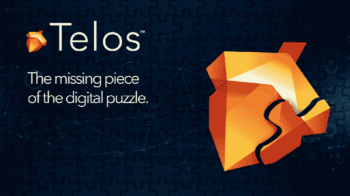
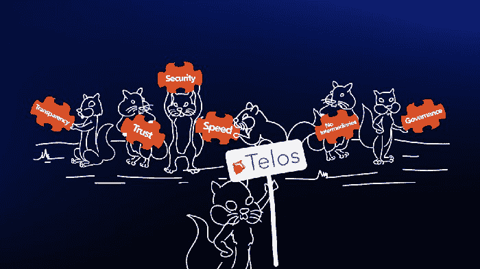

# 泰罗斯区块链如何将它的优势融合成一个伟大的数字拼图？

> 原文：<https://dev.to/telosfeed/how-telos-blockchain-merge-its-benefits-for-a-great-digital-puzzle-2lc7>

[通过媒体访问我们](https://medium.com/@1o1marketing.cs)

今天，区块链是加密货币和其他技术发展的关键要素；此外，它还是信任和技术发展的同义词。

当提到区块链的透明度时，一个主要特征是在链条上的网络中进行的所有交易的登记。简单比较一下:在政治和民主中，通过投票选举代表，信息是公开的，选民拥有与选举过程相关的所有数据(审计、监管等)。在区块链，您可以跟踪从区块生产商(BP)到用户的交易，无需中间人或对网络中自动保存的数据进行处理。

可以说，透明度与安全是相辅相成的。在区块链，交易在块中被存储、跟踪和加密，它们也是可追踪的，留下数字指纹，这阻止了潜在的黑客进入系统。

另一方面，区块链的技术很快。如今，人们在日常银行交易中会遇到许多因素导致的延迟，如中介、约束或简单的程序管理不善。这一点已经被提高运营效率所取代。目前，这些数字方法确保了交易路线的流畅，因为没有第三方延迟交易过程和四舍五入价格。

泰洛斯区块链之所以脱颖而出，是因为其 DApp 发展的潜力；它在治理、速度、成本和巨大的可扩展性方面提供了巨大的优势，这是由该技术及其委托利益证明(DPoS)提供的，DPoS 是一种由共识制定的算法，维护网络中的真实性协议(数字民主)。
泰勒斯谜题。

# **那么，Telos 对其用户有哪些具体的好处呢？**

Telos 是第三代区块链，在其白皮书(正式文件，其中技术细节和重要概念定义了网络的操作参数)中规定在没有当局干预的情况下自主操作；这样就鼓励了权力下放。

**开发者**

这一部分非常重要，因为 Telos 可以无限制地生产各种应用程序，其中突出了区块链的巨大潜力，通过智能合同对访问角色进行分级，这是一个促进、确保和执行网络中注册的协议的计算机程序。

Telos 为 DApps 的代码提供了私有的选择。它还提供了诸如部署成本低的优点，因为没有 RAM 的囤积；而且，它的费用比 EOS 低。至于联网时间，它是以这样一种方式构建的，当 BPs 失败或没有回答他们正在开发的块时，他们可以被自动系统替换为备用块生产者，并且在块的生成中将没有间隙。

**令牌持有者**

自从创建了泰洛斯，40，000 TLOS(代币)被分发并覆盖了创世账户，这一倡议产生来避开隐密鲸鱼。

治理补充了事务的安全性。同样，它保证了任意进行的投票。所有代币持有者都有资格投票并为区块链做出有利的决定。

在 BPs 投票过程的情况下，投票是反向加权的，他们必须选择 30 名候选人，以便加权达到 100%的权重。Telos:透明、信任、安全、速度、无中介、治理。

**区块生产者(BP)**

块生产者验证交易并增加网上的安全性，所有这些都是在他们与受法令管辖的合同一起工作时进行的。每个 BP 的报酬是相等的，待命的 BP 得到一半的报酬。由于智能合同，不符合要求的 BP 将被自动替换，并且必须向社区证明他们能够履行自己的职责，这样工作区将保持活跃并选择最佳候选人，这将创建一个完全公平的流程。

值得一提的是，EOS 的 mainnet 和 tokens 完全兼容 Telos，这一特性使该平台成为区块链的姐妹。

在提到前面的好处后，我们不得不强调另一个推动 Telos 成为理想区块链的优势。

**速度**

Telos 网络每秒处理大约 5000 笔交易，这可能会导致时间变慢，但使用 Telos 区块链，情况并非如此，平均交易持续 1.5 秒，甚至比其他区块链更快。

上面提到的优势有助于合并数字拼图的碎片，使 Telos 对所有参与区块链的人来说都是理想的，它有治理，对开发者友好，并且没有与没有中介相关的每笔交易的成本，这样 Telos 对所有用户都有利，特别是在数字社会中。