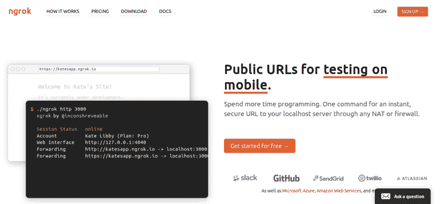

# 如何在任何设备上访问本地主机应用程序

> 原文：<https://dev.to/gugacavalieri/how-to-access-your-localhost-application-on-any-device-4gm4>

我在本地主机上测试应用程序时总是遇到问题。这个过程是如此痛苦，以至于我不得不在我的路由器上做一些疯狂的端口转发(是的，使用我的互联网提供商公共 IP ),甚至部署到暂存环境服务器并在所需的设备上访问它(遗憾的是，我只做过一次😢).

直到有一天，我的同事(非常感谢 Tays)给了我一个神奇的解决方案，叫做 ngrok。简而言之，ngrok 通过安全隧道将 NAT 和防火墙后面的本地服务器暴露给公共互联网。

## 什么？？我在那里什么也没抓到！

所以，它所做的，就是在你的电脑上取一个端口，然后转发给 ngrok 的服务器。此端口链接到一个公共 URL，世界上任何地方的任何设备都可以访问该 URL！

## 等等！那样做不是很危险吗？

嗯，如果我们坚持只测试 API 和调试 web 应用程序，我们应该是安全的。我们可以在本地主机上部署任何应用程序/API，使用 ngrok 公开它，然后关闭它。对于那些真正担心安全的人来说，ngrok 可以选择创建一个密码保护的隧道。最重要的是，每条隧道都通过 HTTPS 协议得到保护。

## 我最喜欢的用例(目前为止)❤:

*   在将任何代码部署到服务器之前，使用我的手机测试 Web 应用程序
*   调试 OAuth 与外部服务的集成
*   更多！❤