# 通过实例说明的项目计划方法:它是如何工作的

> 原文：<https://dev.to/django_stars/how-to-ace-project-planning-with-specification-by-example-approach-136>

在软件开发中，几乎每个和你一起工作的人都理解[质量保证](https://djangostars.com/services/#quality-assurance) (QA)的重要性，但是很少理解雇佣 QA 工程师的价值——尤其是在早期项目规划阶段。最终结果是，QA 工程师本可以提供的许多价值被白白浪费了。

在我作为 SCRUM 开发团队的一员，几乎没有技术规范，并与非技术产品负责人交流的经历中，我的 QA 团队的角色被证明是产品开发过程中必不可少的一部分。在这里，我想分享一种有效的方法，用一种叫做范例规范的方法在软件开发、软件质量保证和业务之间架起一座桥梁。

在本文中，我们旨在关注 QA 工程师的价值，尤其是在关键的项目阶段:计划阶段。

让我们更深入地了解一下具体是如何做到这一点的，但在此之前，要先了解一些 QA 基础知识。

理想情况下，它允许避免后期项目交付阶段的错误，节省时间和意外开支，降低缺陷(bug)的成本。

缺陷的成本取决于它们的影响和它们被发现的时间。通常情况下，你越早发现一个，修复它所花费的时间和精力就越少。当您仍处于需求或设计阶段时，任何错误都更容易修复，成本也更低。另一方面，如果你在产品上线后发现一个缺陷，从修复和用户反应的角度来看，纠错的成本可能要高得多。

[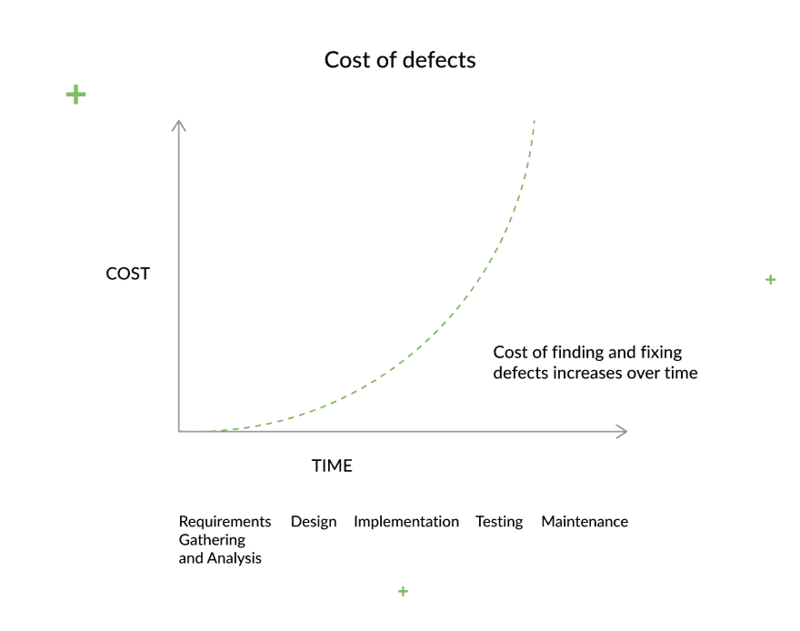](https://res.cloudinary.com/practicaldev/image/fetch/s--KPpt26rk--/c_limit%2Cf_auto%2Cfl_progressive%2Cq_auto%2Cw_880/https://djangostars.com/blog/uploads/2019/07/cost-of-defects.png)

通常，需求收集和分析阶段(有时也称为计划)在软件开发(SDLC)过程中没有得到足够的重视，即使它会对项目产生重大影响。

在我看来，QA 专家必须出现在所有阶段(基于 Scrum 标准)，然而，涉及 QA 工程师的测试和详细培训的需求通常不会在早期精神中处理，只遵循良好 Scrum 标准的字面意思，而不是其精神。

### 在需求收集和分析期间最大化 QA 影响

当只有产品所有者、业务分析师和软件开发人员处理需求时，由于计划不周导致的缺陷更容易被忽略。下图说明了正确的 QA 过程对软件开发的重要性。

[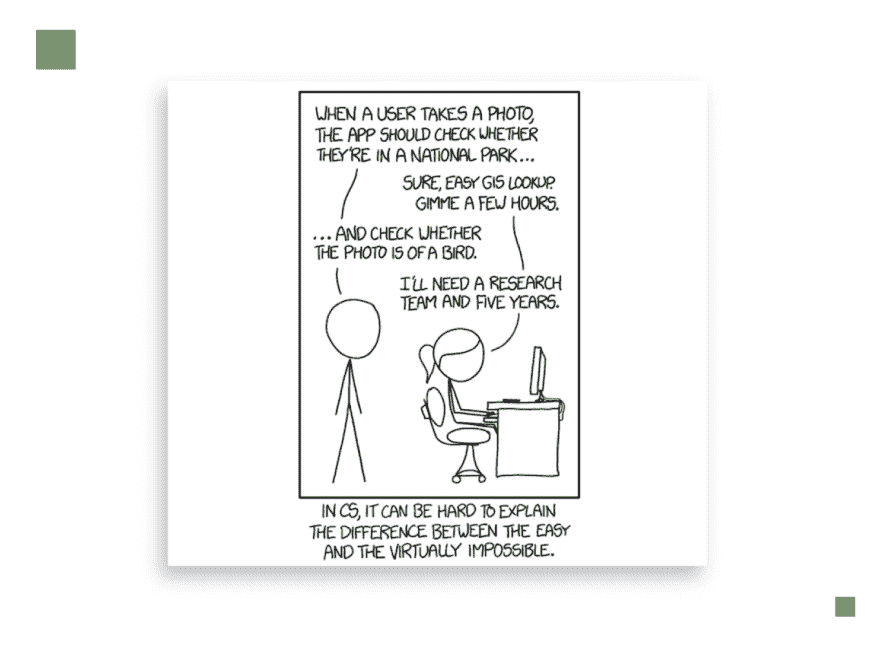](https://xkcd.com/1425/)

在第一个也是最关键的影响阶段，质量保证工程师可以:

*   **拓展产品知识**。通过探索用户故事、框架模型和论文，QA 工程师可以了解工作流程，找出相关方的目标，并准备问题。
*   **揭示逻辑矛盾**。一旦 QA 工程师深入到文档中，他们对项目的理解就会增加，他们可以在开发过程的早期发现逻辑矛盾。
*   **寻址未寻址元素**。他们开始注意到业务流程、授权和用户角色中的缺陷。像用户和输入验证以及文本字段需求这样定义不完善的东西通常在早期就被 QA 工程师发现了。
*   **提供用户故事反馈**。用户故事是产品应该为用户做什么的简要描述，每个功能。如果故事过于密集、复杂或不完整，它们会导致编码和准备测试用例的困难。依靠经验，QA 工程师可以在用户故事上留下他们的反馈和建议，使它们更加准确
*   **提出问题**。为了帮助解决问题，他们张贴问题或指出他们注意到的缺陷。

在软件开发过程的早期包括 QA 工程师可以防止许多缺陷，并减少对时间表、预算和风险的负面影响。

### 质量保证工程师及其在沟通和协作中的作用

软件开发项目中有效协作的成功在于清晰的沟通，并且可以通过专注于满足业务目标来轻松实现。尽管 QA 工程师和软件开发人员各有侧重，但他们仍然被一个共同的目标所束缚:制造一个可靠的、高质量的产品。这就是为什么我们可以使用一个叫做“三个朋友”的概念。

简单地说，三个朋友是产品所有者或业务分析师、软件开发人员和质量保证工程师讨论新特性和细化规范的会议。从不同的角度来看，各方合作确定他们必须做什么，以及他们如何知道已经正确地完成了(“完成”的定义是清楚而精确的)。

质量保证工程师在此过程中扮演以下角色:

*   在与业务沟通时提出问题。
*   分析需求并创建测试文档，以防止在开发阶段出现不明确的解释。准确的测试准备有助于开发人员避免 bug，并及时交付高质量的产品。
*   建议客户在将块方案发送给开发人员之前先对其进行审查。

有许多方法旨在使计划和需求收集对所有涉众更有效。行为驱动开发(BDD)就是这样一种值得探索的方法。

### 行为驱动开发中的质量保证

行为驱动开发(BDD)意味着开发人员、QA 工程师和业务分析师或非技术方(通常由业务参与者提出)之间基于实例的交流。最终，BDD 是为了改善涉众之间的交流。

[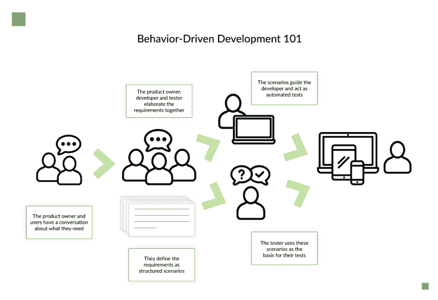](https://res.cloudinary.com/practicaldev/image/fetch/s--AxYwUpEH--/c_limit%2Cf_auto%2Cfl_progressive%2Cq_auto%2Cw_880/https://djangostars.com/blog/uploads/2019/07/behavior-driven-development.png)

行为驱动开发示例的结果将展示用一种通用的无技术术语的语言编写的测试用例，这将导致相关方之间的有效协作。团队可能更喜欢 BDD 方法而不是 TDD(测试驱动开发),原因如下:

*   BDD 就如何更好地安排涉众之间的对话提供了更准确的指导。
*   BDD 将“[五个为什么](https://en.wikipedia.org/wiki/5_Whys)”——用于发现特定问题中因果关系的著名技术——应用于每个用户故事，以便其目的与业务结果明确相关。
*   BDD 带有一种" [Given-When-Then](https://en.wikipedia.org/wiki/Given-When-Then) "方法，这是指用简单的语言为用户故事写下测试用例的一种风格。
*   BDD 包含各种工具，用于解决技术文档和最终用户文档的自动创建。

行为驱动的开发不可避免地与另一种叫做范例说明的技术联系在一起。他们都用例子来确定系统应该如何运行。接下来，示例用任何参与者都可以理解的通用语言来表达，包括非技术成员。在某些情况下，它归结为小黄瓜语言，旨在帮助从客户的角度解释需求。

下面是通过例子说明和小黄瓜的工作原理。

## 举例说明和小黄瓜

示例说明(SbE)是一种协作技术。它有助于确定适合业务需求的需求和功能测试。需求是基于记录和说明需求，用明确的例子代替抽象的陈述。SbE 应用于行为驱动的开发，对于大型项目尤其重要(因为它允许管理需求和功能测试)。

[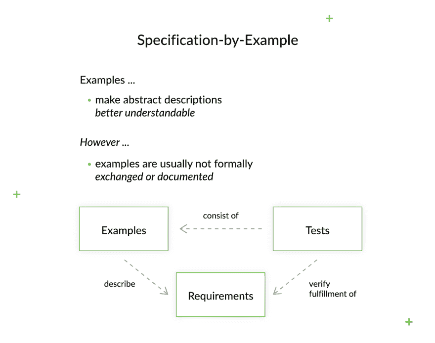](https://res.cloudinary.com/practicaldev/image/fetch/s--euE0hUyg--/c_limit%2Cf_auto%2Cfl_progressive%2Cq_auto%2Cw_880/https://djangostars.com/blog/uploads/2019/07/specification-by-example.png)

同时，Gherkin 指的是 DSL(或特定领域语言)，它为业务分析和最终用户测试提供了一个平台。
[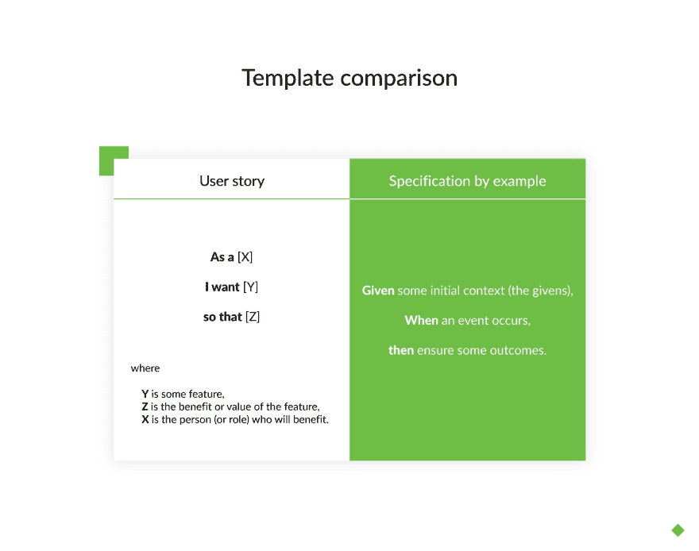](https://res.cloudinary.com/practicaldev/image/fetch/s--uVWIpw29--/c_limit%2Cf_auto%2Cfl_progressive%2Cq_auto%2Cw_880/https://djangostars.com/blog/uploads/2019/07/template-comparison.png) 
通过给出客户如何看待需求的想法，它阐明了用户的工作过程，并创建了软件必须满足的明确条件，以满足用户需求。

[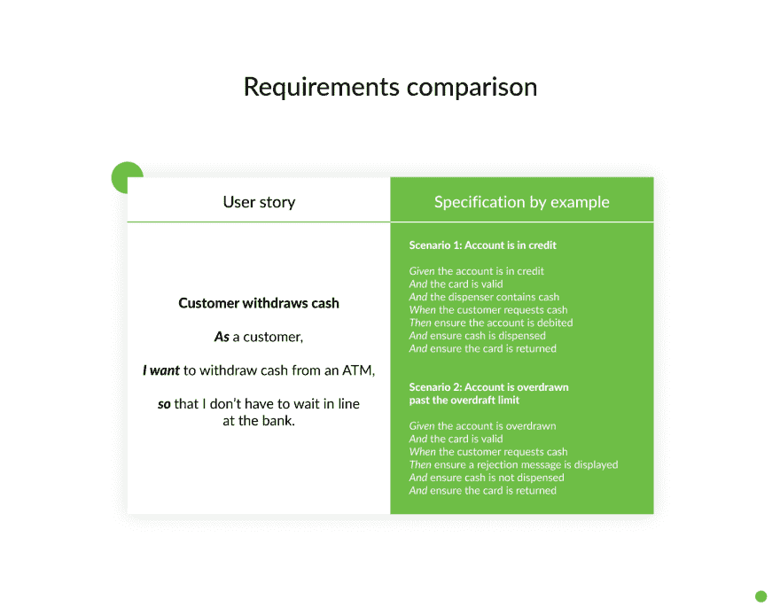](https://res.cloudinary.com/practicaldev/image/fetch/s--skflznWA--/c_limit%2Cf_auto%2Cfl_progressive%2Cq_auto%2Cw_880/https://djangostars.com/blog/uploads/2019/07/requirements-comparison.png)

### 举例说明是如何工作的？

当更深入地研究 SbE 并在质量保证的背景下考虑它时，提到过程模式是很重要的，这些过程模式使调整软件产品变得容易并保证交付必要的产品。

现在让我们仔细看看每个过程模式及其目标。

**协作规范**

这种模式的目标包括:

1.  让所有必要的角色加入团队，这样每个人都可以分享他们的观点，并有助于达成共识；
2.  共同负责项目的特性和规格。

**使用示例说明说明书**

这是一个给定的 When-Then 公式用于创建可测试规范的时候。在这种模式下，开发过程中的参与者——包括开发人员、QA 和产品所有者——一直考虑这些例子，直到它们符合特性的预期行为。

**细化规范**

基于原始示例和协作规范，产品负责人创建细化的需求，这些需求易于所有涉众理解。

**自动化示例**

使用 DSL，您可以通过显示输入和输出之间的清晰链接来自动化测试。当执行测试自动化时，确保你强调规格而不是场景。除此之外，测试应该准确且易于理解，因此是可测试的。

**频繁验证**

在部署管道中，您还可以在每次应用更改时验证示例。此外，你可以期待有大量的工具和技术，你可以用来确保产品质量。通过尽可能频繁地执行测试，您就有机会在早期发现薄弱环节。

**生活文档**

这种模式的原则是保持规范的简单和精确，随着工作的进展不断发展，并允许每个人访问文档。

[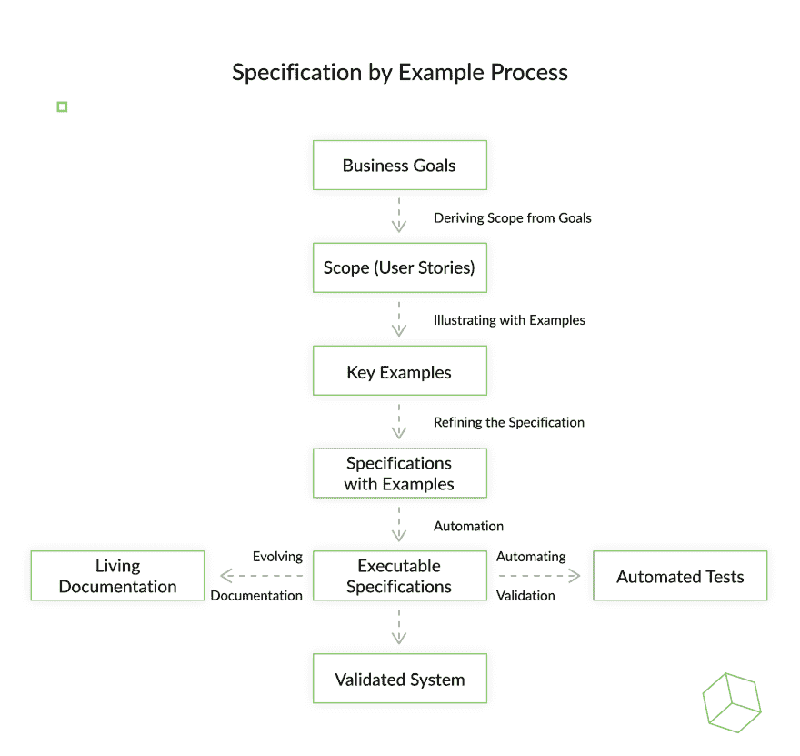](https://res.cloudinary.com/practicaldev/image/fetch/s--ZU3HW_di--/c_limit%2Cf_auto%2Cfl_progressive%2Cq_auto%2Cw_880/https://djangostars.com/blog/uploads/2019/07/specification-by-example-process.png)

## SbE 示例

如果产品负责人对软件开发有清晰的理解和经验，并且知道如何写项目论文，他们就写验收标准。但是在大多数情况下，这是开发团队的任务。

为了更有效的沟通，开发人员必须与业务分析师、产品所有者和 QA 工程师合作。召集整个团队后，他们开始创建验收标准。

让我们考虑一下这个过程需要哪些步骤:

### 1。讨论验收标准

产品所有者、开发人员和质量保证工程师最初对验收标准有不同的看法。这可能会导致误解和进一步的缺陷。
[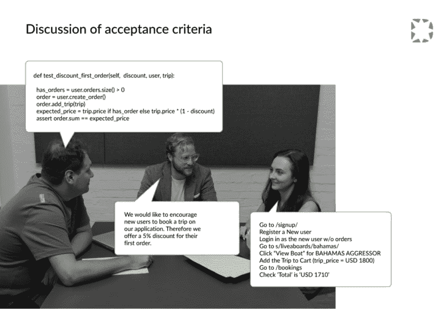T3】](https://res.cloudinary.com/practicaldev/image/fetch/s--o1SOCRbp--/c_limit%2Cf_auto%2Cfl_progressive%2Cq_auto%2Cw_880/https://djangostars.com/blog/uploads/2019/07/discussion-of-acceptance-criteria_1024.png)

### 2。举例说明验收标准

为了最小化理解上的差异，在需求分析期间可以使用通用的语言格式。

[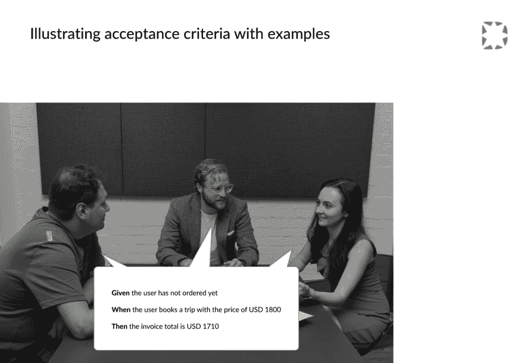](https://res.cloudinary.com/practicaldev/image/fetch/s--uD7WFalg--/c_limit%2Cf_auto%2Cfl_progressive%2Cq_auto%2Cw_880/https://djangostars.com/blog/uploads/2019/07/illustrating-acceptance-criteria-with-examples.png)

### 3。发现隐藏的假设

为了避免每个团队成员用他们自己的未记录的假设来填充缺失的数据，团队讨论了边缘情况、例外和可选的业务流程和用户流。

[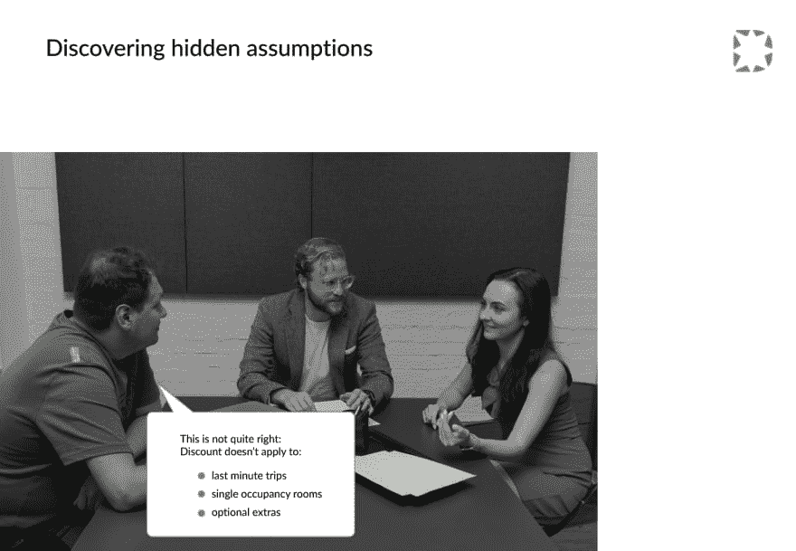](https://res.cloudinary.com/practicaldev/image/fetch/s--4CSzYz79--/c_limit%2Cf_auto%2Cfl_progressive%2Cq_auto%2Cw_880/https://djangostars.com/blog/uploads/2019/07/discovering-hidden-assumptions.png)

### 4。撰写摘要验收标准

目标是达成共同的接受标准，为不明显的场景引出额外的澄清问题。

[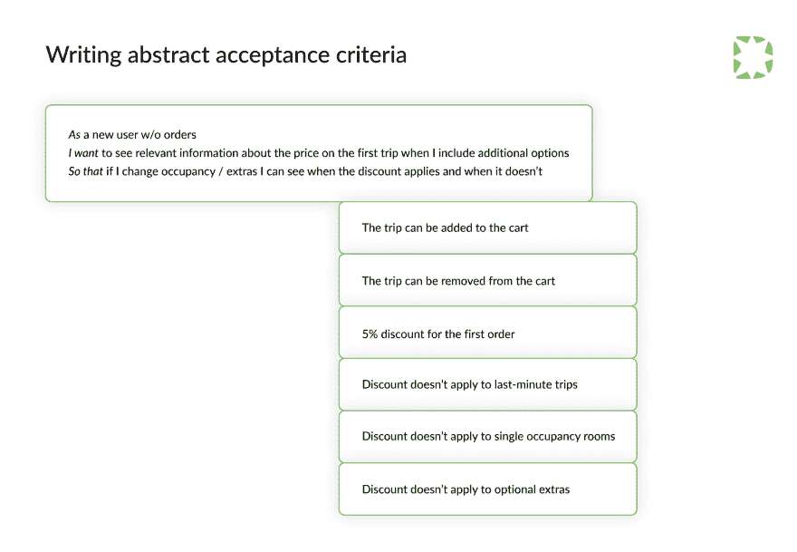](https://res.cloudinary.com/practicaldev/image/fetch/s--oqi_H_49--/c_limit%2Cf_auto%2Cfl_progressive%2Cq_auto%2Cw_880/https://djangostars.com/blog/uploads/2019/07/writing-abstract-acceptance-criteria.png)

### 5。制作验收标准示例

用现实生活中的例子和任何人都能理解的清晰的接受标准来扩充抽象的标准。

[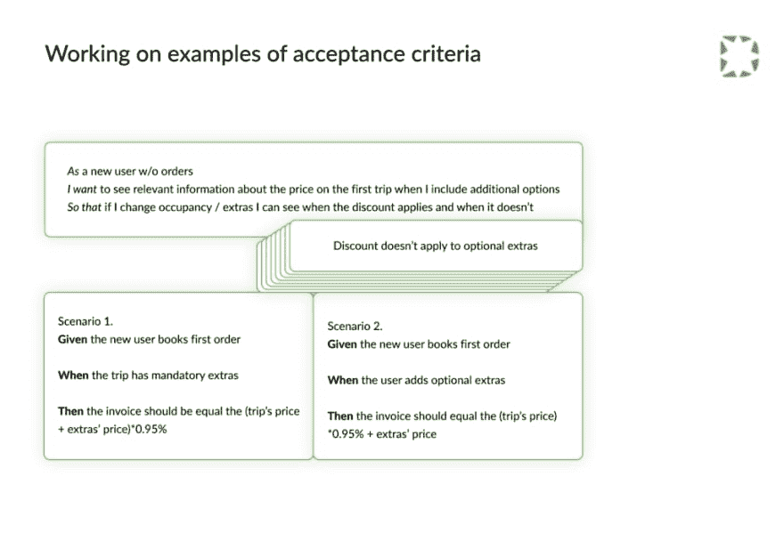](https://res.cloudinary.com/practicaldev/image/fetch/s--cxJs9prw--/c_limit%2Cf_auto%2Cfl_progressive%2Cq_auto%2Cw_880/https://djangostars.com/blog/uploads/2019/07/working-on-examples-of-acceptance-criteria_1024.png)

## 验收标准的好处

不同种类的方法和途径旨在弥合项目生命周期中的沟通鸿沟。通过示例使用规范，参与开发过程的每一方都可以从使用其中任何一个规范中获益匪浅。通过在组合中加入验收标准，所有参与者都是赢家。以下是每一方如何从写作中获益:

**产品负责人:**

*   扩展并验证需求
*   澄清反面案例
*   对业务目标有清晰的理解，并为团队提供早期反馈(产生比开发人员选择的更好的替代决策)

**软件开发商:**

*   确保需求明确，并且没有功能缺口
*   跟上业务目标，这让他们保持动力去寻找合适的解决方案
*   编写更好的代码，因为他们清楚地了解测试用例的依赖性，这允许他们提供更好的替代架构设计

**质量保证工程师:**

*   在开发过程的早期构建质量，并最终帮助创建更高质量的产品
*   为用户验收测试提供现成的测试脚本
*   提供完全适合自动化测试的形式化测试格式
*   防止开发错误，只要开发人员清楚地了解他们的代码将被测试的具体标准

## 通过示例结束对规范的思考

从项目一开始就包括 QA 工程师有很多好处，从节省时间和金钱到在最后阶段减少 bug。所有这些都带来了一个主要优势——交付满足所有客户要求和业务需求的高质量产品的能力。

此外，QA 工程师在与所有参与软件开发的利益相关者的沟通和协作中扮演着重要的角色。对于他们来说，在整个软件开发过程中进行沟通是很重要的，特别是当许多方法和技术被用来或者可能被用来改进沟通时(例如，三个朋友，通过例子的规范，等等)。).

在寻求构建满足业务需求的高质量产品时，我建议您尝试一下通过示例进行规范。它强调共同的理解，并允许团队确定单一的真相来源。使用这种协作方法，涉众可以自动化验收标准的编写，并专注于预防缺陷。

如果您将 QA 测试应用到需求收集和分析阶段，您将能够防止设计中的缺陷被编码到软件中。在这个阶段，QA 深入学习文档和需求，监控它们是否被开发人员满足和跳过，确保业务问题得到解决，并揭示矛盾和未解决的元素。因此，QA 是需求管理的重要部分。

最后，如果您是开发团队的一员，请记住以下几点:

1.  没有目标和目的的公式化规划方法不会带来好的产品结果。
2.  没有灵丹妙药——在你的具体过程中尝试不同的方法；不要抓着一个不放。
3.  每个团队都有自己的最佳方法组合。如果一种方法对你不起作用，那就换一种方法。
4.  重要的是试验和修改这些元素，直到它们为你工作。
5.  所有具有不同能力的团队成员都应该参与到规划过程中来，以便更全面地了解需求。

这篇关于[项目规划的文章是由 Django Stars 的质量保证主管 Irina Meshchankina 撰写的。最初发布于](https://djangostars.com/blog/ace-project-use-specification-by-example/) [Django Stars 博客](https://djangostars.com/blog/)。