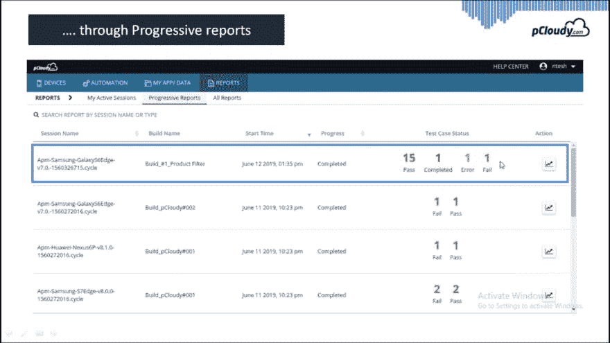
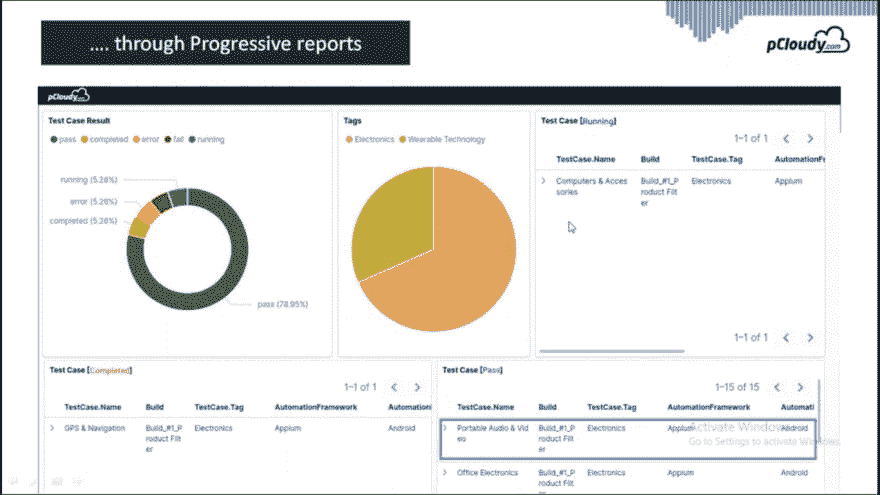
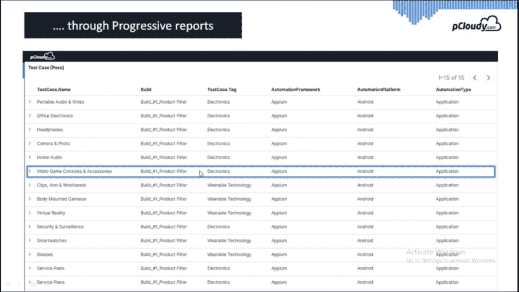
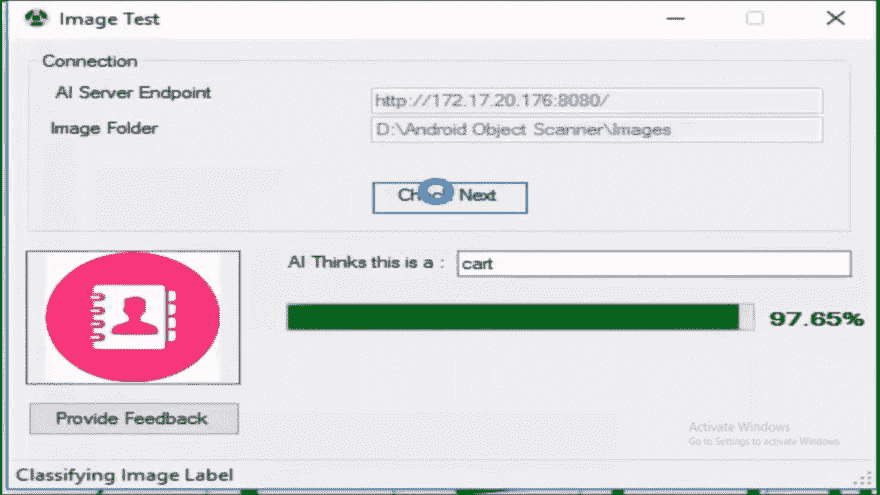
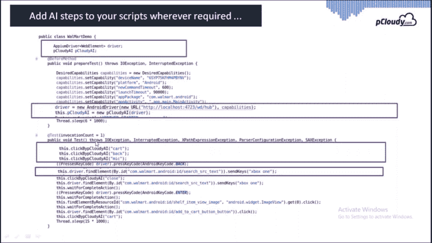

# 如何使用 Appium 实现可扩展性、质量和速度

> 原文：<https://dev.to/bala27/how-to-achieve-scalability-quality-and-speed-with-appium-2p7j>

Google Play 和苹果应用商店总共有超过 550 万个应用程序，到 2022 年，应用程序下载量将达到 2500 亿左右。全球智能手机用户数量超过 30 亿，用户更喜欢使用智能手机而不是台式机。这一数据表明，移动应用市场竞争非常激烈，并且在不断增长。在这个数字化转型的时代，企业移动性的重点是快速提供更好的用户体验。5G 的推出将使最初的应用开发和测试过程进一步复杂化。但除此之外，还有三个主要挑战需要克服，而 pCloudy 正在引领带来积极变化的道路。让我们来看看这些挑战及其解决方案。

企业移动性面临的挑战

移动应用行业对质量和速度的需求越来越大。当前的市场动态是，必须在更短的时间内提供最优质的产品，才能在竞争中保持优势。当我们谈到移动 app 测试时，只有当企业能够实现规模时，质量才能得以保持。市场上有各种各样的设备，有不同的操作系统版本、浏览器、定制 ROM 等。该应用程序应该与所有设备兼容。如何确保这一点，最重要的是，我们如何能够[加快在多个设备上的测试过程](https://www.pcloudy.com/mobile-app-testing-on-multiple-devices/)？pCloudy 凭借其一流的功能帮助您克服这一挑战。让我们一个一个来看看。

实现可扩展性的并行测试

如果我们谈论的是可扩展性，那么在 5、10 甚至 20 台设备上测试你的应用对于企业来说是不够的，以确保一个无 bug 的应用。pCloudy 允许测试人员在 50 台、100 台甚至更多的设备上同时运行您的测试脚本。企业可以选择在我们的公共云中或在我们的即插即用本地基础设施解决方案中执行并行测试。有了 5000 多种设备浏览器组合，企业可以确保应用程序在所有设备上正常运行。

对 50 台设备进行并行测试

您可以在上面的图片中看到，我们已经为 50 台设备设置了设备基础架构以进行演示。我们的内部解决方案可以提供类似的设备设置，公共云用户只需登录 pCloudy 平台并预订设备即可执行测试。这些真实的设备可以在云上远程访问，这使得用户更加方便，因为没有位置限制。

提高质量的渐进式报告

浏览每份报告来分析每台设备的数据是没有效率的。取而代之的是，您会得到智能的结果，您可以快速分析错误，然后快速调试。在下面的图片中，您可以看到不同构建的结果列表及其开始时间、进度、状态和行动。在状态中，您将能够看到有多少测试通过、失败和错误。这样你就可以专注于失败的测试，并且节省时间，因为你不必手动检查所有的情况。

您可以将任何报告框架与您现有的 Appium 设置相集成。同样，您必须在创建资产时添加一行代码来配置 pCloudy。

在上面的图片中，你可以看到测试用例的详细结果。您可以看到标签、测试用例名称、构建、自动化以及错误的实时状态。

展开测试案例后，您可以看到该特定会话的日志、Jason 格式、屏幕截图和视频。这个信息可以用来加速测试的执行。

与人工智能集成，加速移动应用测试

下一个挑战是加速和简化测试脚本的创建过程。通常，程序是将设备连接到系统，并使用像 Appium 这样的自动化框架来使用对象存储库。如果您使用的是图像，那么 XPath 可能会因设备而异。

这个基于人工智能的工具将帮助你获得整个页面的对象库。因此，如果有一个图标的接触，然后这个工具将自动识别元素。

在代码中，您只需要声明 Appium 和 pCloudy 的驱动程序。然后，您需要初始化驱动程序，并开始使用通过 AI 实用程序生成的代码。这就是如何使用人工智能加速脚本的创建。

结论

总的来说，pCloudy 为企业移动性提供了解决方案，以规模和速度提供质量。无论是[并行测试](https://www.pcloudy.com/parallel-testing/)，渐进式报告还是使用基于人工智能的实用程序创建脚本，所有这些功能都可以解决前面提到的问题。谚语“变化是唯一不变的”非常符合 pCloudy 定期更新以解决问题并使移动应用测试更好。