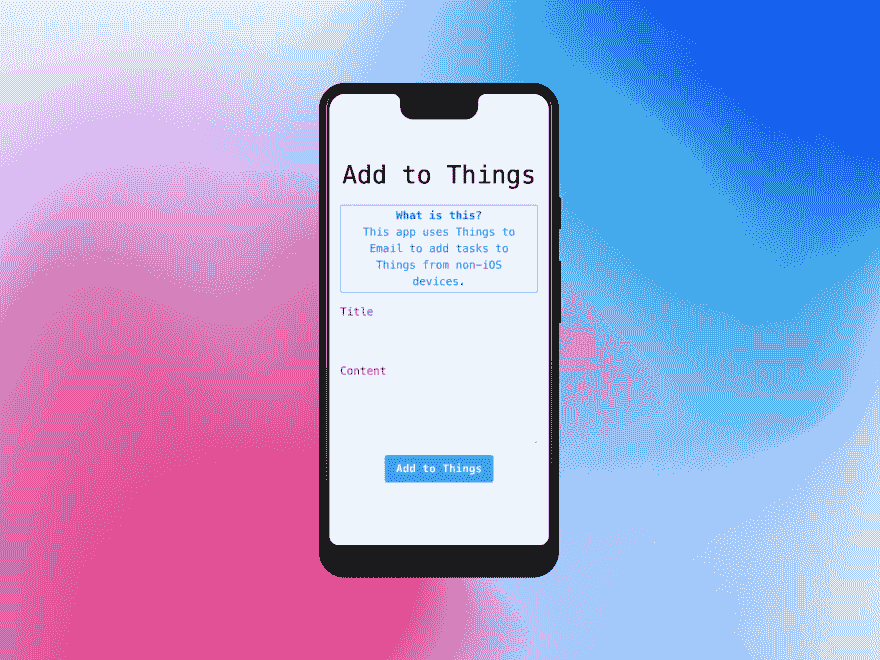

# 如何从 Android 向事物添加任务

> 原文：<https://dev.to/m1guelpf/how-to-add-tasks-to-things-from-android-1fji>

前几天开始用[东西](https://culturedcode.com/things)。这是一个非常棒的任务管理器应用程序，唯一的缺点是它只能在 iOS 设备上使用。这对我来说是个问题，因为虽然我每天都使用 Mac，但我也是安卓用户。提供的唯一解决方法是一个您可以发送任务的电子邮件地址。对于一些人来说，这可能已经足够了，但是我想要更好的体验，所以我决定构建一些东西。

<figure> 

<figcaption>这是这个应用安装后的样子。</figcaption>

</figure>

介绍 *Send to Things* ，这是一个自托管的渐进式网络应用程序(PWA)，允许你从 Android 手机、Chromebook、任天堂 3DS 以及其他任何有浏览器的地方添加任务。

这个应用程序本身非常简单，一旦你点击`Add to Things`按钮，一个 Lambda 函数就会发送一封电子邮件到你的 *Mail to Things* 地址，然后将任务添加到你的列表中。

想开始吗？访问[GitHub 库](https://github.com/m1guelpf/send-to-things)并按照说明开始。如果你遇到困难，请随意给我发电子邮件，我很乐意帮忙。如果这个项目对你有用，你也可以[在 Patreon](https://miguelpiedrafita.com/patreon) 上支持我😁