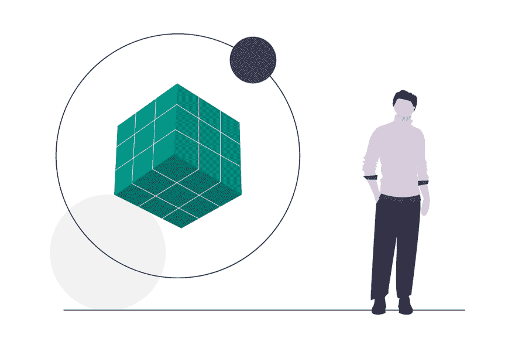
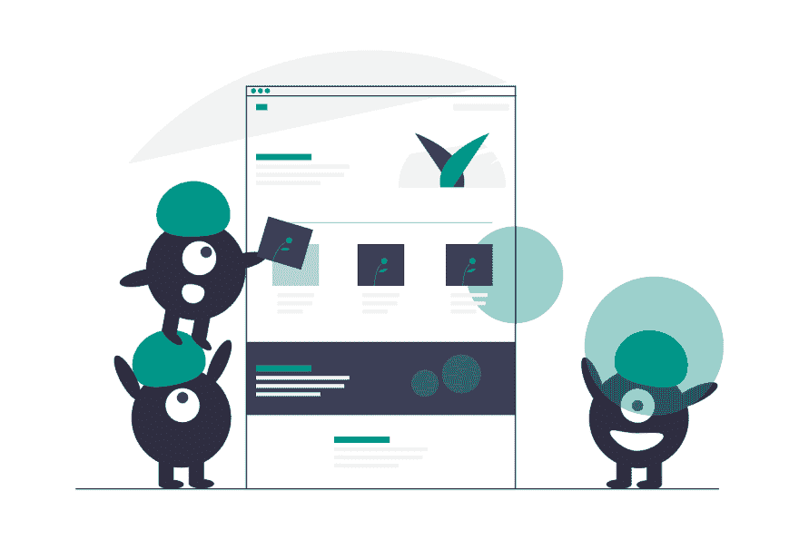

# 如何采用开发人员心智模型

> 原文：<https://dev.to/steelwolf180/how-to-adopt-developer-mental-models-1kca>

# 简介

当我在听[“知识工程”](https://fs.blog/the-knowledge-project/)关于心智模型的播客时。

节目主持人正在谈论他如何开始探索心智模型来做出更好的决定。

如果成功的话，不要通过希望和祈祷凭直觉做决定。

下面是我认为开发人员为了成为更好的开发人员可能需要关注的心智模型类型。

# 什么是心智模型？

 
心智模型允许一个人从多个角度就如何解决问题做出决策。

据说为了拯救森林，不同的专家提供几种解决方案。

这样它就可以实现一个单一的目标，即**拯救一片森林**。

从护林员、伐木工、环保主义者、森林消防员或野生生物学家的角度来看。

我发现作为开发人员，与其追逐最新的技术、工具或最佳实践。

我们应该专注于开发这些心智模型来帮助我们理解和创造能够解决问题的软件。

通过使用多种心智模型来让人们相信解决方案的有效性。

# 心智模型的类型

以下是我认为任何开发人员都应该开发的心智模型。

## 设计思维

 
近年来，设计思维已经被用于解决围绕日常使用该解决方案的特定用户的问题。

它可以是针对创造性解决方案的[设计冲刺](https://www.gv.com/sprint/)的形式，也可以是针对任何人的[精益创业](http://theleanstartup.com/principles)的形式，以试验想法来建立自己的创业公司。

理解它可以帮助开发人员通过与其他专家在共同基础上的合作来制定更好的、更有创造性的解决方案，以满足特定类型用户的需求。

## 系统思维

 
这是在之前关于[系统思维的重要性](https://www.oreilly.com/ideas/the-critical-role-of-systems-thinking-in-software-development)的一次指导会上，一位导师同事介绍给我的。

它允许通过关注高度复杂系统的小部分来解决复杂系统的问题。

你学习它，以便在风险变成整个系统的全面失败之前，可以控制和减轻风险。

要理解系统思维，你可以看看[丰田之道:来自世界最大制造商的 14 条管理原则](https://www.amazon.com/Toyota-Way-Management-Principles-Manufacturer/dp/0071392319)或[devo PS 手册](https://www.amazon.com/DevOps-Handbook-World-Class-Reliability-Organizations/dp/1942788002)

## 劝说

 
我大力推荐投入时间和精力去学习它。

通过向采纳者描述一个故事来影响决策过程。

从做出购买决定的人到软件的实际用户。

我发现，如果不能很好地理解它，时间、精力和资源就会浪费在构建软件上。

这可能允许任何人采用你的软件来帮助他们解决他们面临的问题。

通过阅读像《写得好:非小说写作经典指南》这样的书来了解它、《鼓励加法软件养成习惯》[、《习惯的力量:为什么我们在生活和商业中这样做》](https://www.amazon.com/Power-Habit-What-Life-Business/dp/081298160X)、像《T4:影响和说服的革命性方法》这样的说服研究

# 结论

用这些 **3** 心智模型武装自己。

它帮助你成为一个有效的、更好的开发人员，既可以作为独立的贡献者，也可以作为管理层的一部分。

我一直在研究这些心智模型，以便让我成为一名更好的开发人员。

如果你喜欢我的文章，请**注册**Max[冒险家简讯](http://eepurl.com/dOUoUb)获取我每周在 **Python** 、**创业**和 **Web 开发**偶然发现的牛逼内容。

你也可以**关注**我来获取我在 **Dev** 上的文章的**最新**更新

这篇文章最初发表在 Max 的博客上，主题是[如何采用开发人员心智模型——阅读时间:3 分钟](https://www.maxongzb.com/how-to-adopt-developer-mental-models-reading-time-3-mins/)和[照片由 Kalen Emsley 在 Unsplash 上拍摄](https://unsplash.com/photos/UqyHjOgYxYY)

# 参考文献

*   [知识工程播客](https://fs.blog/the-knowledge-project/)
*   [设计冲刺](https://www.gv.com/sprint/)
*   [精益启动](http://theleanstartup.com/principles)
*   [系统思维](https://www.oreilly.com/ideas/the-critical-role-of-systems-thinking-in-software-development)
*   [丰田之道:来自世界最大制造商的 14 条管理原则](https://www.amazon.com/Toyota-Way-Management-Principles-Manufacturer/dp/0071392319)
*   [devo PS 手册](https://www.amazon.com/DevOps-Handbook-World-Class-Reliability-Organizations/dp/1942788002)
*   [写得好:写非小说的经典指南](https://www.amazon.com/Writing-Well-Classic-Guide-Nonfiction/dp/0060891548)
*   习惯的力量:为什么我们在生活和工作中会这样做
*   [预先劝说:影响和说服的革命性方法](https://www.amazon.com/gp/product/1501109804/ref=dbs_a_def_rwt_bibl_vppi_i1)