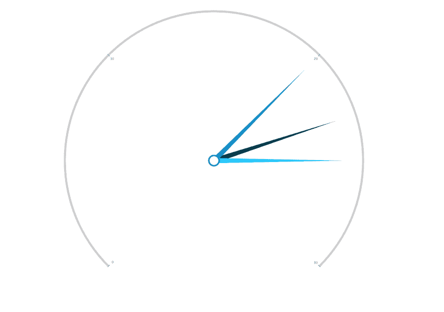

# 如何在两分钟内制作仪表图动画

> 原文：<https://dev.to/zingchartinc/how-to-animate-a-gauge-chart-in-under-2-minutes-3o2a>

这是 ZingChart 的秒表功能系列的第二篇文章。这一系列的文章旨在向您展示使用强大的 JavaScript 库 ZingChart 创建图表和制作图表动画是多么快速和容易。

观看下面的视频，看看这有多容易实现。对于逐步演练，请滚动视频至下面的内容。

[https://www.youtube.com/embed/9pg-hZYj3Jg](https://www.youtube.com/embed/9pg-hZYj3Jg)

在这篇文章中，我将讨论 3 个主要项目:

1.  添加包含图表的 HTML
2.  使用 Javascript 和 ZingChart 添加数据、属性和动画
3.  在页面上呈现仪表图

出于本演示的目的，您将创建如下所示的仪表图，并用虚拟数据填充它。

[](https://res.cloudinary.com/practicaldev/image/fetch/s--GZqdRi-U--/c_limit%2Cf_auto%2Cfl_progressive%2Cq_auto%2Cw_880/https://thepracticaldev.s3.amazonaws.com/i/xiycqzr04z29i8y50z4d.png)

## 在我开始之前...

每次我尝试 ZingChart 库时，我总是在他们的免费网络应用程序“ZingSoft Studio”中进行。

这个免费的类似沙盒的环境将让你完全访问 ZingChart 库，并让你尝试 ZingChart 的所有功能、动画和图表类型。

查看工作室并开始制图！

1.  添加您的 HTML

要开始这个过程，您需要创建一个基本的 HTML 布局，如果您还没有这样做的话。感觉费复制我下面的一个。

```
<!DOCTYPE html>
<html>
  <head>
    <meta charset="utf-8">
    ZingSoft Demo
    <script src="https://cdn.zingchart.com/zingchart.min.js"></script>
  </head>
  <body>
    <div id="myChart" class="chart--container"></div>
  </body>
</html> 
```

注意，我在`script`标签中包含了引用 ZingChart 库的 CDN。

我还在将呈现图表的 HTML 主体中包含了一个`div`。这个`div`还包括一个名为`chart--container`的预定义类。参考[此处](https://app.zingsoft.com/demos/create/EQ7G07OX)查看添加到此图表的基本 CSS 类。

就 HTML 设置而言，您已经完成了！

1.  添加 JavaScript

现在您已经完成了我的 HTML 的设置，接下来的时间您将使用和创建 JavaScript。

首先，您可以在初始设置 div 下设置一个脚本，或者引用一个外部 JavaScript 文档。

ZingChart 是一个极其强大和复杂的库。出于本演示的目的，您将只使用少数可用的属性。要获得 ZingChart 提供的 JSON 属性的完整列表，请查看 [JSON 属性](https://www.zingchart.com/docs/api/json-configuration)页面。

首先，您将创建并命名一个对象变量。在这个对象中，您将包括 3 个主要属性:`type`、`series`和`plot`。参考下面的格式。

```
 var chartConfig = {
      type: 'gauge',
      series: [
        {
          text: 'Day 1',
          values: [23],
          backgroundColor: '#00384A'
        },
        {
          text: 'Day 2',
          values: [20],
          backgroundColor: '#008ECC'
        },
        {
          text: 'Day 3',
          values: [25],
          backgroundColor: '#06C5FC'
        }
      ],
        plot: {
      },
    }; 
```

`type`属性将决定您将呈现给页面的图表类型。ZingChart 有超过 35 种不同的图表类型可用，但我将在本文中浏览仪表图。如果你参考上面的内容，你会注意到我已经将属性`type`设置为属性值`gauge`。

`series`属性是 chartConfig 对象中的下一项。该属性是所有数据和数据样式的存放处。这里有大量的[特性](https://www.zingchart.com/docs/api/json-configuration/graphset/series)，你可以直接添加悬停状态、图例标记、工具提示、值框等等到你的数据点。

您将需要遵循我在上面创建的格式，以确保将三根针添加到图形中。

`plot`将在下一节中用于向您的图形添加动画。

如果您按照变量现在的样子呈现图表，它将完全显示，没有动画。

### 2。添加动画

ZingChart 让向所有图表类型添加动画变得非常容易。使用`plot`对象，您将在`plot`中包含另一个名为`animation`的对象作为属性。

在`animation`对象中，您将包含的第一个属性是`effect`。Effect 可以接受字符串或数字(1 或 2)作为值。

在下面的代码中，我添加了动画并将效果的属性值设置为 2。如果你用下面的代码运行演示，你会看到针有一个运行的基本动画。

```
var chartConfig = {
  type: 'gauge',
  series: [
    {
      text: 'Day 1',
      values: [23],
      backgroundColor: '#00384A'
    },
    {
      text: 'Day 2',
      values: [20],
      backgroundColor: '#008ECC'
    },
    {
      text: 'Day 3',
      values: [25],
      backgroundColor: '#06C5FC'
    }
  ],
  plot: {
    animation: {
      effect: 2
    }
  }
}; 
```

以下是`effect`属性的动画特征:

*   1 =淡入
*   2 =从左向右旋转

```
...,
  plot: {
    animation: {
      effect: 2,
      sequence: 1
    }
  }
... 
```

下一个可以包含的动画属性是`sequence`属性。该属性决定了节点(或针)渲染的顺序，并接受 1 到 2 之间的值。以下是每种类型的特征:

*   1 =渲染单个节点
*   2 =一次渲染所有节点

```
...,
  plot: {
    animation: {
      effect: 2,
      sequence: 1,
      method: 1
    }
  }
... 
```

下一个可以利用的动画属性是`method`属性。`method`决定了节点在动画结束时的行为，并且只能在`effect: 2`激活时应用。该属性接受 1 到 5 之间的值。

理解`method`的最好方法是亲自尝试。

以下是每个值的特征:

*   1 =节点在动画结束时具有长反弹
*   2 =节点在动画结束时具有更快的反弹
*   3 =节点在动画结束时有非常快的反弹
*   4 =节点在动画结束时变慢
*   5 =接近动画结尾时，节点速度更慢
*   6 =节点在整个动画过程中保持一致的速度

### 3。呈现您的图表

您将添加到这个演示中的最后一部分 JavaScript 是`zingchart.render()`方法。

在这个内置的方法中，您将希望包含包含在 HTML 中的`div`中的`id`。这就是将图表呈现给 HTML 的内容。

除此之外，您还需要引用您之前创建的 JavaScript 变量。这可以通过添加`data`属性并将其值设置为变量的名称来实现。在这种情况下，您将把它设置为`chartConfig`。

可以添加到该对象的另外两个属性是`height`和`width`。这些属性像普通 CSS 属性一样接受数值。

您的 JavaScript 现在应该是这样的:

```
var chartConfig = {
  type: 'gauge',
  series: [
    {
      values: [23],
      backgroundColor: '#00384A'
    },
    {
      values: [20],
      backgroundColor: '#008ECC'
    },
    {
      text: 'Day 3',
      values: [25],
      backgroundColor: '#06C5FC'
    }
  ],
  plot: {
    animation: {
      effect: 2,
      sequence: 1,
      method: 1
    }
  }
};

zingchart.render({
  id: 'myChart',
  data: chartConfig,
  height: '100%',
  width: '100%',
}); 
```

您可以实现许多不同的`effect` `method`和`sequence`组合。您还可以向`plot`对象添加其他属性，如`speed`和`delay`。要了解更多，请访问 ZingChart [动画文档](https://www.zingchart.com/docs/tutorials/styling/animation)。

要查看该图表的定制版本，请查看[演示](https://app.zingsoft.com/demos/create/DPBFQQVB)。请随意使用您自己的设计和数据来派生、编辑和定制演示！

* * *

作为数据可视化领域的先驱，ZingChart 是一个强大的 Javascript 库，以大数据为设计理念。ZingChart 拥有超过 35 种图表类型，并可与您的开发堆栈轻松集成，允许您轻松创建交互式响应图表。