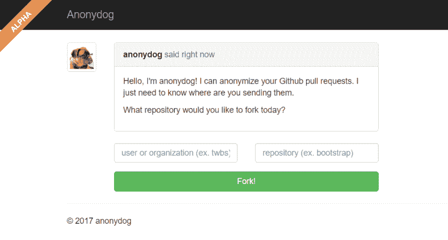

# 如何匿名化你的 GitHub 活动

> 原文：<https://dev.to/jcabot/how-to-anonymize-your-github-activity-3775>

有没有希望在 GitHub 中隐藏自己的身份？。大多数时候你想要的恰恰相反。当你免费贡献你的时间来帮助开源项目向前发展时，你至少希望得到认可(如果这打开了就业机会的大门，那就更好了)。

但是有时在 GitHub 中匿名是一个要求(至少一段时间)。让我给你举三个希望匿名的例子:

*   当你合作的项目可能是你当前公司的竞争对手时(例如，你公司正在销售的专利软件的开源替代品)
*   或者当你是一名女性，或者，总的来说，属于任何一种在工作评估中可能遭受负面歧视的集体。在那种情况下，不幸的是，有真实的证据表明你的工作可能会被[以负面偏见](https://www.theguardian.com/technology/2016/feb/12/women-considered-better-coders-hide-gender-github)评价。
*   您是一名研究人员，需要将您的工作成果(包括能够复制它们的代码)提交给一个会议或期刊进行评估。如果连采用的是*双盲评审*的评价方法，**评审员应该无法知道或猜测你是谁**。显然，在文章正文中隐藏你的名字，然后发送一个到你的 GitHub repo 的链接，评审者将知道你的身份，这违背了盲评的目的(更糟糕的是，你的作品可能会因此立即被拒绝)。

请注意，上面的每个场景都略有不同。在最后一个例子中，我们希望匿名化整个回购。在其他情况下，只有我们对其他回购协议的贡献。此外，在第一种情况下，我们希望永远隐藏我们的身份(或至少长时间)，而在另外两种情况下，匿名只是一种暂时的情况，我们希望在作品被评估后揭示我们的身份。我将为每种情况展示几种解决方案。但要明确的是，没有一个是完美的。与其说让你完全不可能知道(或猜测)你是谁，不如说让你很难知道(或猜测)你是谁。

## 如何匿名化 GitHub repo

[匿名 Github](https://github.com/tdurieux/anonymous_github/) 是一个代理服务器，支持匿名浏览开放科学代码和数据的 Github 存储库。

你不用发送一个链接到你的回购协议，而是用这个服务克隆它，并发送链接到他们在域名[【https://anonymous.4open.science/】](https://anonymous.4open.science/)下生成的托管版本的回购协议。

除了匿名化 URL 之外，该服务还隐藏 Github 所有者、组织、存储库名称，并在给定一组禁用词的情况下(如您的姓名或您所在机构的名称)，确保这些词不会出现在自述文件、文件内容或文件名中，正如您在这个简短的动画中所看到的。

## 如何匿名化你对 GitHub 项目的贡献

我知道有两种选择: [GitMask](https://www.gitmask.com/) 和 [Anonydog](https://github.com/anonydog/anonydog) 。两者的工作方式相似:他们代表你(以他们的名义)提交 Pull 请求，并对提交的个人数据(姓名、电子邮件甚至时间戳)进行匿名处理。正如我们上面所讨论的，这可以防止你的个人简历因你的个人资料而被拒绝，但也有可能项目决定系统地拒绝匿名的个人简历。

这两者的主要区别在于，使用 Anonydog 之后，你可以暴露你的真实身份。另一个区别是它们需要设置的方式。对于 Anydog，你需要首先让它派生出你计划参与的项目，然后在派生的版本上工作。有了 gitMask，你就可以独立工作了，准备好之后，你可以向 gitMask 提交一个 [git 包](https://git-scm.com/docs/git-bundle)来匿名化。

## GitHub 中“匿名模式”下的其他替代方案

匿名的一种更“奇特”的方式是使用[或](https://www.torproject.org/projects/torbrowser.html.en)。例如，这个项目解释了如何通过向[提交匿名提交。一个更极端的选择是](https://github.com/chr15m/gitnonymous)[将有争议的软件项目的整个协作开发过程转移到“深层网络”](https://motherboard.vice.com/en_us/article/mg7aea/theres-a-dark-web-github-for-controversial-code)。