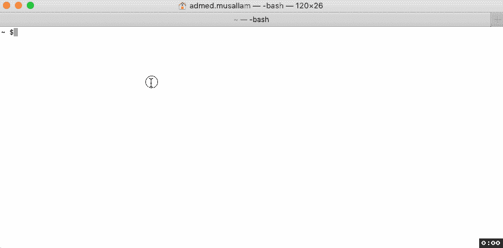

# 如何自动完成 SSH 主机

> 原文：<https://dev.to/ahmedmusallam/how-to-autocomplete-ssh-hosts-1hob>

你知道 SSH 配置文件，关于这个主题有几篇很棒的文章:

[这篇牛逼的文章](https://linuxize.com/post/using-the-ssh-config-file/#ssh-config-file-structure-and-patterns)

这本书介绍了一些技巧和窍门

[](/cpu) [## SSH 配置提示和技巧

### 丹尼尔·麦卡尼 1919 年 2 月 1 日 4 分钟阅读

#linux #cli #ssh #security](/cpu/ssh-config-tips-and-tricks-54hk)

现在，尽管如此，您仍然需要记住完整的主机条目来连接，它不会自动完成。

假设我的配置文件中有以下内容:

```
 Host unicorn-one
  HostName 1.2.3.4
  User amusallam
  IdentityFile ~/.ssh/id_rsa

Host unicorn-two
  HostName 2.2.3.4
  User amusallam
  IdentityFile ~/.ssh/id_rsa

Host unicorn-three
  HostName 3.2.3.4
  User amusallam
  IdentityFile ~/.ssh/id_rsa 
```

现在我在终端中键入`ssh unicorn`并点击`⇥ Tab`，它不会自动完成...

[](https://i.giphy.com/media/ZEgBHVeRlmTqjCPlqx/giphy.gif)

但是不要害怕！因为我有你想要的！

## 自动完成脚本

> 我只在 MacOs 上试过这个。

感谢 stackexchange 的回答:

<header>

#  [ 回答回复:自动完成 SSH 和 SCP 的服务器名](https://unix.stackexchange.com/questions/136351/autocomplete-server-names-for-ssh-and-scp/181603#181603)

Jan 28 '15[74](https://unix.stackexchange.com/questions/136351/autocomplete-server-names-for-ssh-and-scp/181603#181603) </header>

**找到了！！**

似乎在 Ubuntu [中`~/.ssh/known_hosts`中的条目被散列](https://bugs.launchpad.net/ubuntu/+source/bash/+bug/42382)，所以 SSH 完成无法读取它们。这是功能，不是 bug。即使将`HashKnownHosts no`添加到`~/.ssh/config`和`/etc/ssh/ssh_config`中，我也无法阻止主机哈希。

然而，我是主持人…

<button class="ltag__stackexchange--btn" type="button">[Open Full Answer](https://unix.stackexchange.com/questions/136351/autocomplete-server-names-for-ssh-and-scp/181603#181603)</button>

添加以下文件:`/etc/bash_completion.d/ssh`，其内容:

```
_ssh() 
{
    local cur prev opts
    COMPREPLY=()
    cur="${COMP_WORDS[COMP_CWORD]}"
    prev="${COMP_WORDS[COMP_CWORD-1]}"
    opts=$(grep '^Host' ~/.ssh/config ~/.ssh/config.d/* 2>/dev/null | grep -v '[?*]' | cut -d ' ' -f 2-)

    COMPREPLY=( $(compgen -W "$opts" -- ${cur}) )
    return 0
}
complete -F _ssh ssh 
```

然后加载该文件:在您的`~/.bash_profile`中，添加:

```
## load ssh autocompletion
. /etc/bash_completion.d/ssh 
```

并通过运行`source ~/.bash_profile`重新加载，或者终止您的终端并重新打开它。

瞧啊。

(你在下面看到的闪光是我点击`⇥ Tab`

[](https://res.cloudinary.com/practicaldev/image/fetch/s--FiQTFl1d--/c_limit%2Cf_auto%2Cfl_progressive%2Cq_66%2Cw_880/https://thepracticaldev.s3.amazonaws.com/i/84a1xd9pv1id7rweutsv.gif)

很简单！

## 额外有用的别名

如果您想查看所有主机的列表，您可以将此别名添加到您的`.bash_profile` :

```
# list all "Host" and "HostName" lines, then remove the strings: "Host " and "HostName "
alias sshhosts="grep -w -i -E 'Host|HostName' ~/.ssh/config | sed 's/Host //' | sed 's/HostName //'" 
```

运行`source ~/.bash_profile`重新加载，或者终止你的终端并重新打开它。

然后就可以运行了:

```
sshhosts 
```

从上面的 unicorn 示例中，可以看到:

```
unicorn-one
  1.2.3.4
unicorn-two
  2.2.3.4
unicorn-three
  3.2.3.4 
```