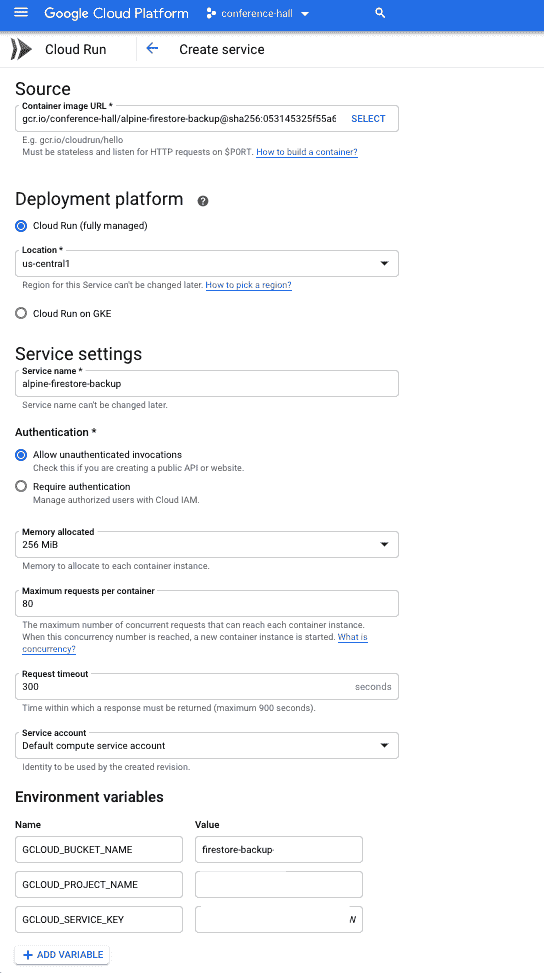
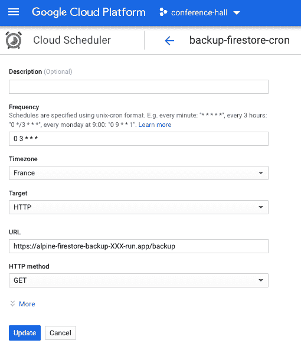

# 如何自动备份你的 firestorm 数据

> 原文：<https://dev.to/zenika/how-to-backup-your-firestore-data-automatically-48em>

在我的团队中，我们使用了很多 Firebase 特性，比如 Firestore。

但是没有简单的方法来定期备份数据。

我们创建了一个小小的 [Docker 映像](https://hub.docker.com/r/zenika/alpine-firestore-backup/) `zenika/alpine-firestore-backup`和这个简单的教程，通过`Cloud Run`和`Cloud Scheduler`等无服务器服务在谷歌云平台上自动执行备份。

# 步骤 1:在 GCP 上创建一个存储桶

创建一个 [GCP coldline 桶](https://cloud.google.com/storage/docs/storage-classes)并保存你的桶的名称。

# 第二步:创建服务账户

创建一个具有以下权限的 [GCP 服务帐户](https://cloud.google.com/iam/docs/creating-managing-service-accounts):

*   `Owner`
*   `Cloud Datastore Owner`
*   `Cloud Datastore Import Export Admin`
*   `Storage Admin`

然后，下载 [JSON 私钥文件](https://cloud.google.com/iam/docs/creating-managing-service-account-keys)。

# 步骤 3:为云运行创建环境变量

请填写以下信息:

*   `GCLOUD_PROJECT_ID`
*   `GCLOUD_BUCKET_NAME`
*   `GCLOUD_SERVICE_KEY`

对于`GCLOUD_SERVICE_KEY`，使用以下命令制作一个 base64 编码的字符串:

```
cat key.json | base64 
```

# 第四步:设置云运行

[Cloud Run](https://cloud.google.com/run/docs/deploying) 是一种无服务器服务，使用 http 自动为您的容器提供服务。

使用公共图像`gcr.io/zenika-hub/alpine-firestore-backup`创建一个`Cloud Run service`。

请注意:

*   在`latest`中选择您的新图像
*   选择“云运行(完全管理)”和位置
*   输入服务名
*   选择“允许未经验证的调用”
*   在“显示可选设置/环境变量”中，设置上一节中看到的 3 个环境变量

您可以使用浏览器测试服务:`https://alpine-firestore-backup-XXX-run.app/`

保存为调用您的云运行服务而创建的 url。
例如:`https://alpine-firestore-backup-XXX-run.app/backup`

[](https://res.cloudinary.com/practicaldev/image/fetch/s--a3v7Cxhq--/c_limit%2Cf_auto%2Cfl_progressive%2Cq_auto%2Cw_880/https://user-images.githubusercontent.com/525974/62141405-ce9e0800-b2ec-11e9-8763-45efddb4c55d.png)

# 第五步:使用云调度程序启动

[云调度器](https://cloud.google.com/scheduler/docs/)允许您调度一个 cronjob，以便定期调用 https 端点。

准备一个`Cloud Scheduler`在你每次需要的时候发送一个请求给你的`Cloud Run Service`。

例如，每周一凌晨 3:00`0 3 * * 1`会进行一次备份并存储在您的存储桶中。

[](https://res.cloudinary.com/practicaldev/image/fetch/s--_99IXCZk--/c_limit%2Cf_auto%2Cfl_progressive%2Cq_auto%2Cw_880/https://user-images.githubusercontent.com/525974/62141536-02792d80-b2ed-11e9-80fe-b81466cb862d.png)

# 第六步:监控备份操作

您还可以使用以下 url `https://alpine-firestore-backup-XXX-run.app/list`检查每个备份操作的当前状态

# 结论

你可以在 github 这里或者 dockerhub 这里随意看看我们为这个操作[创建的 Docker 图像。](https://github.com/Zenika/alpine-firestore-backup)

我们也有其他我们维护的图片，比如一个流行的小的无头图片叫做`zenika/alpine-chrome`。