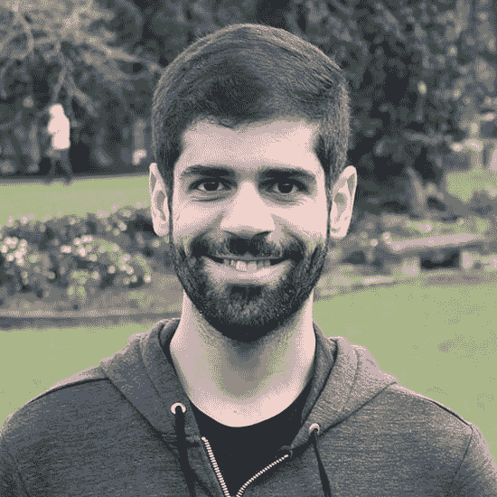

# 如何变得成功-第 1 集-格劳科·皮雷斯

> 原文：<https://dev.to/hussein_cheayto/how-to-become-successful-episode-1-glauco-pires-3ifb>

我很荣幸和格劳科·皮雷斯一起开始了我的采访博客“如何变得成功”的第一集。

我很高兴地介绍传奇游戏开发者 Glauco Pires 与我聊天，分享他 10 年的编码经验。交给格劳科…

1 -你是如何开始你的职业生涯的？T3】

答案:这要追溯到我早期的计算机科学研究生课程，那时我发现我可以以制作游戏为生。我开始在业余时间制作自己的游戏，几个学期后，我被一家游戏开发公司录用为实习生。

#### **2 -你最喜欢/最不喜欢编码的什么？**

**T3】**

**回答:**我最喜欢的是在这些日子里做几乎任何事情的自由。这个世界从来没有像现在这样联系紧密，像编码这样的技能使你能够在数字世界和现实世界中构建自己的产品。有时技术发展如此之快，以至于很难跟上所有新的可用语言和工具，但这只是生活在一个渴望进步的世界中的本性。

3 -你是如何度过最糟糕的时光的？T3】

**回答:**这个我想了不少，最后归结为“只是一个阶段”。如果你认为是长期的(几年，甚至几十年)，好时光和坏时光都是我们生活/事业中反复出现的微小时刻。在困难时期，我只记得它们最终会结束，只要我继续努力，尽我最大的努力。

**相关文章:** [10 人跟随在没有学位的情况下获得游戏开发工作](https://dev.to/hussein_cheayto/10-people-to-follow-to-land-a-job-in-game-development-without-a-degree-4lo)

4 -你什么时候认为自己是成功的？T3】

**回答:**我其实不认为自己是这样的人。此外，成功是真正个人的东西:它可能是一个富裕的银行账户，一个健康的生活，一个幸福的家庭，能够做一个好的社会影响，等等。在事业方面，我总是喜欢不断(健康)进步。认为“我是一个成功者”是一种危险的想法，因为你可能会在一个快速发展的世界中停滞不前。

#### **5 -你的成功习惯是什么？**

**T3】**

**回答:**话虽如此，我相信有些习惯对于职业提升是必不可少的，而这些习惯肯定与职业无关。为了让我们成为更好的工作者，我们首先要成为更好的自己，这意味着要好好照顾我们的身心。在科技行业工作，生活在一个联系如此紧密的社会中，意味着我们需要非常小心自己的健康，这是一个全新的概念。

我的习惯对于把健康放在第一位至关重要:我早睡早起，锻炼身体，吃健康的食物，和积极向上的人在一起。这些事情的结合使我成为一名马拉松运动员，这是我喜欢的事情，最终，它在我的社交和工作生活中帮助了我。

#### **6 -谁是你的灵感？**

**T3】**

**回答:**我的父母，他们是我见过的最坚强的人。他们教会了我坚韧不拔，把爱放在第一位。把爱用在你做的每一件事上，关心你遇到的每一个人，你就会快乐。

7 -如果你可以回到过去，在这条职业道路上做任何不同的事情，你会怎么做？T3】

**回答:**当想到回到过去时，我从来没有想过改变我的决定，哪怕是最小的决定。我们在这一刻所经历的一切都将我们带到了这一刻，我们总是可以用我们所拥有的做些好事。也就是说，如果我能回到过去和自己说话，我会告诉自己要有耐心！我们的愿望最终会实现。

8 -你来年的计划是什么？你正在做什么新项目吗？T3】

**回答:**我的计划是继续与游戏合作，尽我所能对我们的世界产生积极影响。

我要感谢格劳科抽出时间给我这次独家采访。

你可以[联系](https://grpires.com/#contact)格劳科，了解更多关于他最新的[项目](https://grpires.com/#portfolio)

**相关文章:** [年轻时希望知道的 7 件事](https://dev.to/hussein_cheayto/7-things-that-i-wish-i-knew-when-i-was-younger-135g)