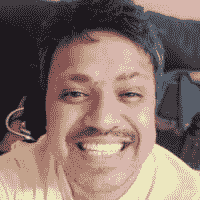

# 如何变得成功-第 4 集-费尔南多里拉

> 原文：<https://dev.to/hussein_cheayto/how-to-become-successful-episode-4-fernando-lira-437n>

在这一集，我将主持费尔南多里拉，一个巴西自学成才的开发人员。Fernando 是一位才华横溢的软件工程师、高级 PHP 开发人员和经验丰富的系统管理员。交给费尔南多...

1-你是如何开始你的职业生涯的？
**答:**我 14 岁开始。这只是一个爱好。我不得不创建一个网站来存储我的游戏并与大家分享。
通过看教程和网站学习 Perl 和 PHP。专业上，我从巴西拨号接入提供商的支持分析师做起。你认为你事业成功的第一大关键是什么？
**答案:**做基础做得非常好。

#### **3-你对新人和应届毕业生有什么建议？**

**回答:**我给他们的建议是，要有耐心，在 Github 上展示进步，尽可能多的参加社区活动。
 **#### 4-任何一个刚进入你的行业的人需要知道哪 3 件事？** 
**答案:**
1-加盟可难。2-尽可能地学习。3-尽可能多地练习。

**相关文章:** [没有学位也能成功的 5 大网络开发者。](https://dev.to/hussein_cheayto/top-5-web-developers-you-should-follow-to-succeed-without-a-degree-25lg)

#### **5-你如何处理失败？**

**答案:**我得到悲伤。但是，我想想自己哪里做错了，下一次不应该做什么。
 **#### 6-如何让自己保持动力？** 
**答案:**我喜欢科技。此外，我喜欢不断学习，帮助朋友和同事。
 **#### 7-你有哪些成功的习惯？** 
**答案:**
1——买书看书。练习我的编程技巧。寻找新事物。睡眠和娱乐。

**相关文章:** [如何在 12 个月内实现个人目标](https://dev.to/hussein_cheayto/how-to-achieve-your-personal-goals-in-12-months-303o)

#### **8-你的灵感来自谁？**

**回答:**我爸，一直很努力。
我的家人和一些走过我人生的人。如果你可以回到过去，在这条职业道路上做任何不同的事情，你会怎么做？
**回答:**我会多研究 Java，巴西公司爱死它了。
 **#### 10-你来年的计划是什么？你正在做什么新项目吗？** 
**回答:**本人目前失业，正在寻找新的机会。我真的很想参与那些对很多人都有影响的大项目。

**相关文章:** [如何变得成功-第 3 集-布莱恩·格拉](https://dev.to/hussein_cheayto/how-to-become-successful-episode-3-bryan-guerra-4c0e)

#### **11-别人怎么联系你？**

**回答:**你可以在 [Linkedin](https://www.linkedin.com/in/liraf/) 和 [GitHub](https://github.com/lira)
上找到我在这次采访的最后，我要感谢 Fernando 抽出时间，给我这次独家的、很棒的采访。