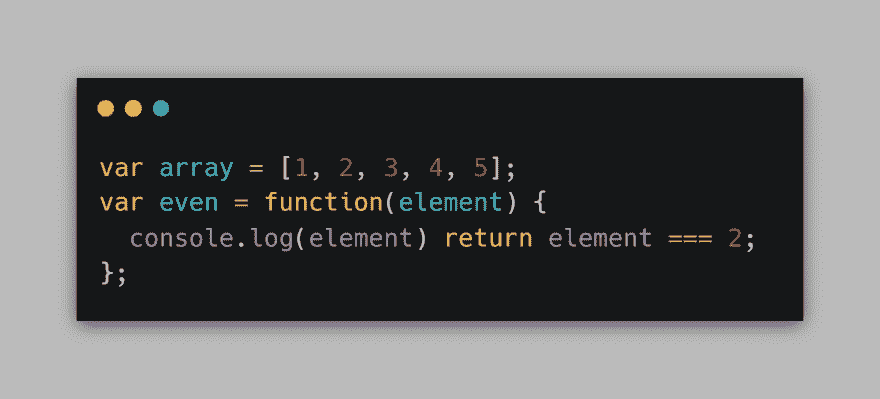
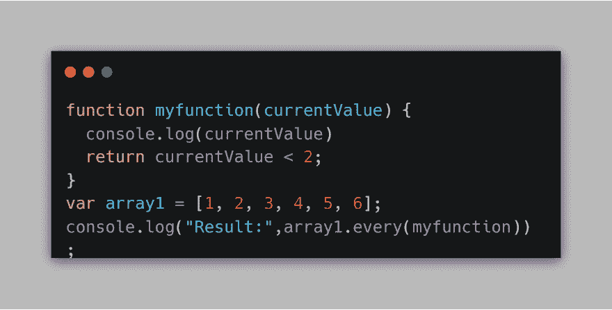

# 如何跳出 Javascript/NodeJS 中的 forEach

> 原文：<https://dev.to/pookdeveloper/how-to-break-out-of-the-foreach-in-javascript-nodejs-1k86>

很简单。

用“some”或“every”代替“forEach”

Array.prototype.some 的使用

some()方法检查数组中是否至少有一个元素满足由所提供的函数实现的条件。

示例:

结果应该是这样的:

> 1
> 2
> 结果:“真

更多信息:[https://developer . Mozilla . org/es/docs/Web/JavaScript/reference ia/Objetos _ global es/Array/some](https://developer.mozilla.org/es/docs/Web/JavaScript/Referencia/Objetos_globales/Array/some)

* * *

Array.prototype.every 的使用

every()方法返回一个布尔值，如果数组中的所有元素都满足给定函数实现的条件，则返回 true，如果没有满足条件，则返回 false。

示例:

结果应该是这样的:

> 1
> 2
> 结果:“假

更多信息:[https://developer . Mozilla . org/es/docs/Web/JavaScript/reference ia/Objetos _ global es/Array/every](https://developer.mozilla.org/es/docs/Web/JavaScript/Referencia/Objetos_globales/Array/every)

这是所有的乡亲