# 如何用 Solace 构建一个简单的聊天应用程序(第 2 部分)

> 原文：<https://dev.to/solacedevs/how-to-build-a-simple-chat-app-with-solace-part-2-2efh>

在之前的一篇博客文章中，我解释了[如何构建一个简单的聊天浏览器应用程序](https://dev.to/hq190204/how-to-build-a-simple-chat-app-with-solace-part-1-4hg1-temp-slug-6948697)，它通过直接主题订阅来消费消息。在该教程的后续文章中，我将解释如何修改示例代码，让应用程序使用队列中的消息。

具体来说，您将创建一个队列，向队列添加一个订阅，并创建队列使用者。

**先决条件:**

*   将 Git 下载到您的电脑上
*   [安装 Apache Maven](https://maven.apache.org/install.html)
*   [在 Solace PubSub+ Cloud 上注册](https://console.solace.cloud/login)
*   [了解安慰话题和队列](https://www.udemy.com/fundamentals-of-solace-administration/)

**等级:**初学者

## **创建队列**

1.  在代码编辑器中，检查 developer-exercise-2 分支，或者在命令行中输入`git checkout remotes/origin/developer-exercise-2 -f`
2.  打开 src > main > resources > static 下的脚本目录。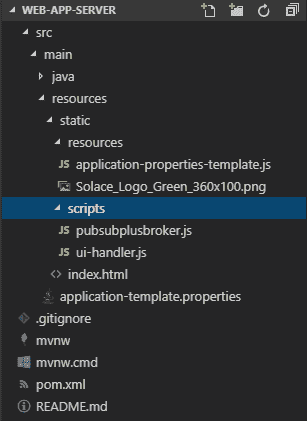
3.  打开 pubsubplusbroker.js 文件，注释掉第 1 部分中添加的直接主题订阅，并保存文件。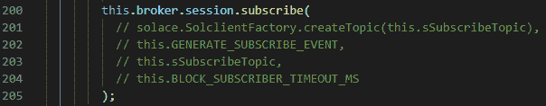
4.  [登录](https://console.solace.cloud/login)到 Solace PubSub+ Cloud，打开你的服务，点击**管理服务**。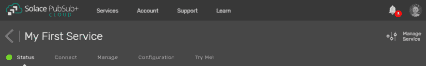
5.  点击左侧的**队列**标签。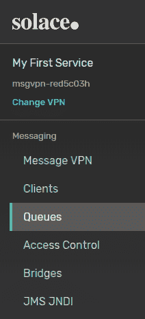
6.  点击 **+** **创建**按钮创建一个队列。
7.  在**创建队列**对话框中，给队列命名并点击**创建**按钮。 **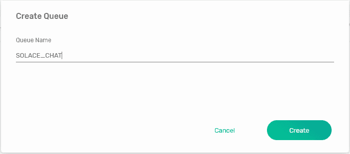**
8.  点击**应用**使用默认设置。

## **添加订阅队列**

1.  单击您刚刚创建的队列，然后单击**订阅**选项卡。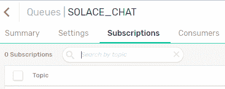
2.  点击 **+订阅**按钮，打开**创建订阅**对话框。
3.  在**创建订阅**对话框中，添加主题订阅，按**进入**，点击**创建**。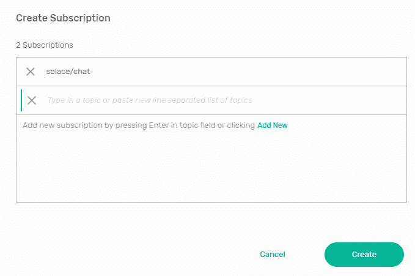
4.  在代码编辑器中，键入 **mvn spring-boot:run** 来运行应用程序。确保您位于 web-app-server 目录中。
5.  如果应用程序尚未打开，请在 Web 浏览器中键入 localhost:8081 以将其打开。
6.  在应用程序中发送几条消息。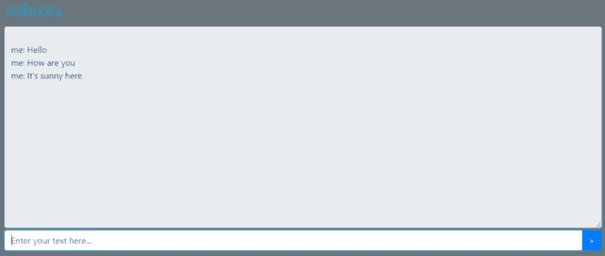
7.  在第 3 步创建的队列中，单击 **Summary** 查看排队的消息。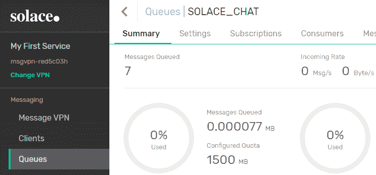

## **创建队列消费者**

现在消息已经在队列中，您需要创建使用队列中消息的消费者。要创建消费者，请按照以下步骤操作:

1.  打开 static > resources 下的 application-properties.js 文件，并将“SOLACE_CHAT”添加到 sReceiveQueue。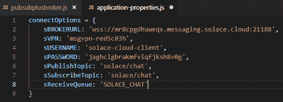
2.  打开 pubsubplusbroker.js 文件，指定队列描述符，包括队列的名称和类型，并设置确认模式。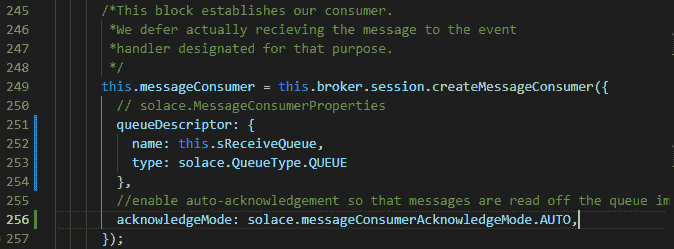
3.  添加以下代码来连接消息使用者。
4.  在代码编辑器中，键入 **mvn spring-boot:run** 来运行应用程序。
5.  刷新浏览器中的聊天应用程序。您应该能够看到从代理收到的消息。
6.  在之前创建的队列中，点击**摘要**，然后点击右下角的**刷新数据**。您应该看到，由于自动确认，消息不再在队列中。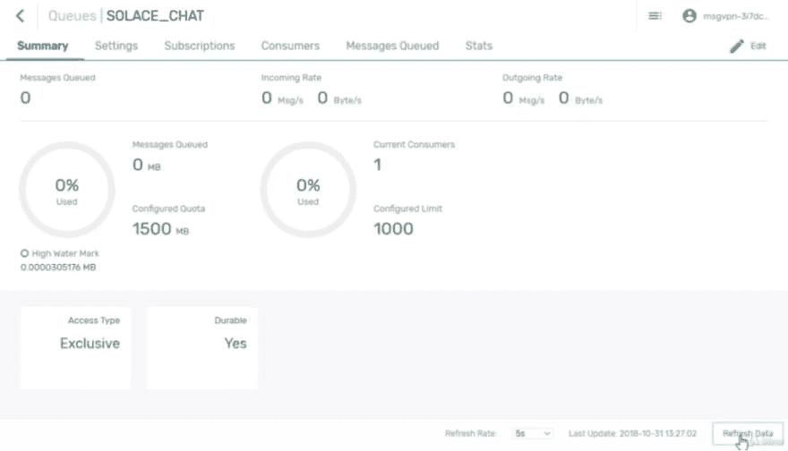

恭喜你！您刚刚创建了一个队列，向队列添加了一个订阅，并创建了队列使用者。在本系列的第 3 部分(即将推出)，您将学习如何从登录页面向虚拟身份验证服务发送 REST POST 请求。

### **相关资源**

*   [如何用 Solace 构建一个简单的聊天应用程序(第一部分)](https://dev.to/hq190204/how-to-build-a-simple-chat-app-with-solace-part-1-4hg1-temp-slug-6948697)
*   Udemy 课程:[Solace 开发基础](https://www.udemy.com/fundamentals-of-solace-development/)

帖子[如何用 Solace(第二部分)](https://solace.com/blog/build-chat-app-solace-2/)最早出现在 [Solace](https://solace.com) 上。