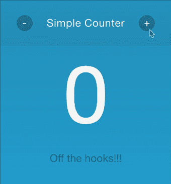
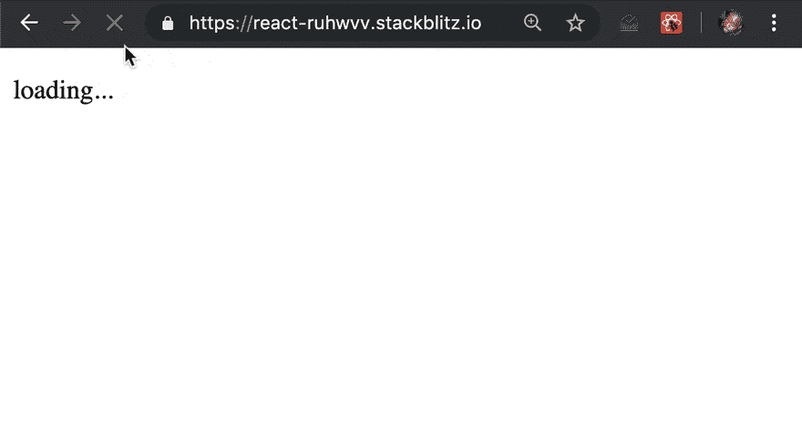
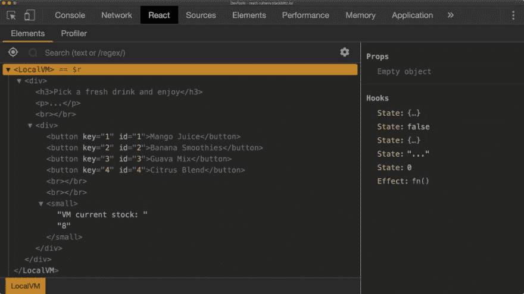

# 如何用 React 钩子构建一个简单的柜台和自动售货机应用程序

> 原文：<https://dev.to/adyngom/how-to-build-a-simple-counter-and-a-vending-machine-app-with-react-hooks-3an1>

今天我将向你介绍很多人认为是流行的 React 库的最闪亮的新特性——React 挂钩。

我个人爱上了 [**React.memo**](https://reactjs.org/docs/react-api.html#reactmemo) 的概念，但是我们可以把它保留到另一个教程中。

我们在这里谈论钩子，所以让我们进入它。

### 首先首先什么是钩子？？

公平的问题。组件是 React 库的核心，本质上有两种方式来编写它们。要么作为**类基础组件**要么作为**功能组件**。

在版本 **16.8** 之前，我相信使用基类语法是进入**组件生命周期方法**的唯一方法，也是直接访问非常重要的**状态**对象的唯一方法。

解决方法或现状是将功能组件包装在类组件中，并让它以 **props** 的形式传递状态。

随着钩子的加入，这不再是必要的，因为功能组件现在可以“挂钩”React 公开的方法，例如我们将深入研究的 **useState** 和 **useEffect** 。

现在我们已经解决了这个问题，让我们看看它的代码

### 一个简单的计数器

让我们把示例功能组件放在一起。用户界面是两个按钮，负责递增或递减默认为 0 的计数值。

下面的代码是我们可以使用的方法之一

```
import React, { useState } from "react";
import { render } from "react-dom";
import "./styles.css";

const Counter = () => {
  const [count, setCount] = useState(0);
  return (
    <div id="counter">
      <div id="wrapper"> </div>
      <header id="counter-header">
        <div id="header-wrapper"> </div>
        // The fun stuff
        <button
          className="cbtn" onClick={e => {
            if (count > 0) setCount(count - 1);
          }}
        >
         -
        </button>
        <h1>Simple Counter </h1>
        <button
          className="cbtn" onClick={e => {
            setCount(count + 1);
          }}
        >
        +
        </button>
      </header>
      <p className="count">{count} </p>
      <p className="label">Off the hooks!!! </p>
    </div>
  );
};

render(<Counter />, document.getElementById("root")); 
```

就像我们在开放行中导入组件一样，我们添加了**使用状态钩子**。然后使用一个类似析构的语句来设置内部状态

```
const [count, setCount] = useState(0); 
```

构造中的第一个变量 **count，**是**值**，第二个 **setCount** 是您稍后将用来更新该值的函数的名称——您可以随意调用它。

最后，语句右边的 **useState** 接受看起来像参数的东西，但实际上是状态键的初始值。

所以用简单的英语说:

> 使用状态挂钩，创建一个名为 count 的变量，并关联一个名为 setCount 的函数，该函数将负责更新该变量的值。同时，将 count 的初始值设置为 0

然后我们在按钮上添加事件监听器，对于每个事件监听器，我们使用* *setCount ** 来相应地更新* *count ** 值

```
 <button className="cbtn" onClick = {(e) => { if(count> 0) setCount(count - 1)}}>
-
 </button>

 <h1>Simple Counter </h1>

 <button className="cbtn" onClick = {(e) => { setCount(count + 1)}}>
+
 </button> 
```

[](https://res.cloudinary.com/practicaldev/image/fetch/s--8kNmj1H7--/c_limit%2Cf_auto%2Cfl_progressive%2Cq_66%2Cw_880/https://techlabs28.com/wp-content/uploads/2019/07/react-counter.gif%2522)

现在我们来看一些更复杂的东西，它将允许我们利用功能组件中的一些生命周期方法

### 自动售货机

如果你读过我的一些文章，你可能会遇到我的 **[JavaScript - 28 相关问题系列](https://adyngom.github.io/28-relevant-js-questions/toc.html)。**

挑战之一是建立一个“简化的”自动售货机。

你可以通过下面的链接了解更多，并尝试一下。

[# 6 自动售货机-
鲍勃经营着一家成功的自动售货机企业。他想添加一个接口...](https://adyngom.github.io/28-relevant-js-questions/6-vending-machine.html)

我为它设计的一个解决方案是使用一个函数作为一个模块。我们将在 React 功能组件中导入它，并使用它来更新应用程序的各种状态

完整的代码可以在这里找到:[带挂钩的反应自动售货机](https://stackblitz.com/edit/react-ruhwvv)但是让我们快速地一步一步来。

让我们先来看看我们的自动售货机模块

```
export default function VendingMachine(inventory) {
  var drinks = inventory || null;

  if (!drinks) {
    throw new Error("No inventory: Cannot add a new VM");
  }

  const drinksKeys = Object.keys(drinks);

  var sale = function(pid) {
    if (!drinks[pid]) {
      return;
    }

    if (drinks[pid].stock > 0) {
      drinks[pid].stock--;
      return `1 ${drinks[pid].name} - Thank you, come again!!`;
    } else {
      drinks[pid].stock = 0;
      return ` ${drinks[pid].name} is out of stock :( Come back tomorrow`;
    }
  };

  var stock = function() {
    const total = drinksKeys.reduce((c, n) => c + drinks[n].stock, 0);
    return total;
  };

  return Object.freeze({ sale, stock });
} 
```

自动售货机公开了两个公共方法* *sale ** 和* *stock。** 它还需要传递一个类似于
的库存对象

```
{  "1":  {  "name":  "Mango Juice",  "stock":  2  },  "2":  {  "name":  "Banana Smoothies",  "stock":  2  },  "3":  {  "name":  "Guava Mix",  "stock":  1  },  "4":  {  "name":  "Citrus Blend",  "stock":  3  }  } 
```

让我们假设这个对象来自一个 HTTP 调用。在基于类的组件场景中，我们可能会使用**componentdimount**生命周期方法来发出请求并更新状态。在功能组件的情况下，我们将挂钩到 **useEffect** 方法来实现。

现在，让我们设置一些我们希望 React 组件执行的规则/目标:

*   仅当虚拟机已正确设置了有效清单时，才应呈现 UI
*   该组件将需要进行 HTTP 请求调用来获取初始清单
*   UI 将显示加载状态，直到它准备好呈现虚拟机
*   加载后，库存中的每种饮料都将由一个按钮表示。
*   点击任何饮料按钮将触发 VM 销售方法调用，并显示成功销售或缺货消息
*   用户界面将显示起始库存，该数字将在每次成功销售时更新

#### 1。初始设置

让我们为我们的小应用程序
放置初始包装器

```
import React, { Fragment, useState, useEffect } from "react";
import { render } from "react-dom";
import VendingMachine from "./FunModules/VendingMachine";

const LocalVM = () => {
  // functional logic here
  return <Fragment>// view logic here</Fragment>;
};

render(<LocalVM />, document.getElementById("root")); 
```

正如我们对简单计数器所做的那样，我们导入了**使用状态**以及**使用效果**和 **[片段](https://reactjs.org/docs/fragments.html)** 。

我个人喜欢的片段是它让我们很容易选择是否要在 DOM 中添加额外的标签——非常强大。

最后一个导入行只是让我们得到我们的 **VM 模块**。无论我是在 Angular 还是 React 项目中工作，我通常会创建一个包含纯普通 JS 的实用程序文件夹，这些实用程序很容易在框架或库中重用。

#### 2。宣布我们的州

类组件中的状态语法是一个键值对象。我们当然可以在这里重复同样的模式，但是使用* *useState ** 钩子非常有趣和灵活的是，您可以设置您想要跟踪的每个单独的状态。

让我们在功能逻辑章节
中举例说明

```
// functional logic here
const [vm, setVM] = useState({});
const [loading, isLoading] = useState(true);
const [data, setData] = useState({});
const [message, setMessage] = useState("...");
const [stock, setStock] = useState(0); 
```

我真的很喜欢这种阅读方式，它几乎是自文档化的，并且可能很容易搞清楚这些是做什么的。如果你不同意，请告诉我:)

不过，非常清楚的是，这是每个人将要处理的内容:

1.  vm 将是我们的自动售货机的本地实例，并作为一个空对象启动
2.  **loading** 是一个布尔值，默认为 true，当 VM UI 准备好呈现时将为 false
3.  **数据**是我们将从 HTTP 请求调用中获取的库存对象
4.  **消息**将用于显示成功或缺货状态
5.  最后， **stock** 将显示饮料总库存的初始计数，并在购买时更新该数字

#### 3。请求库存

现在有趣的部分来了，我们可以利用 **useEffect** 来包装我们的 HTTP 请求。

```
useEffect(
  () => {
    fetch("https://my-json-server.typicode.com/adyngom/vmapi/db")
      .then(response => response.json())
      .then(data => {
        setData(data);
        setVM(VendingMachine(data));
        isLoading(false);
      });
    // return function statement when component unmounts
  },
  [] // empty array as second argument to ensure the effect runs once
); 
```

钩子包装我们的 **fetch** 调用，一旦我们得到响应， **setData** 更新**数据**状态， **setVM** 将带有新库存的自动售货机实例附加到我们的 **vm** 状态。

请注意，为了简洁起见，我们没有在我们的**获取**调用中添加错误处理。

代码添加了两个非常重要的涉及生命周期管理的注释。理解 **useEffect** 相当于**的 ComponentDidMount、ComponentDidUpdate 和 ComponentWillUnmount** 生命周期方法的组合是非常重要的

如果我们不将空数组作为第二个参数传递，那么每次组件更新时， **"effect"** 都会运行。

这对于某些用例来说是很棒的，但是在这个特定的用例中，我们会告诉我们的组件在每次 UI 中有更新的时候去获取并设置一个自动售货机。

作为第二个参数的空数组有助于我们避免这种情况，因为它是一个已经完成的交易。

被注释掉的**返回函数语句**是一个占位符，如果你想在组件**卸载**时执行操作，你可以在这里放置你的代码。

考虑一些用例，例如删除事件监听器、取消订阅可观察对象等...

我强烈推荐在 [React 文档页面](https://reactjs.org/docs/hooks-effect.html)上阅读更多相关内容。

#### 4。最终呈现用户界面

既然我们的大部分逻辑都处理好了，我们就可以专注于将组件的内容放到页面上了。如果我们从 fetch 调用中收到了**数据**，这将意味着* *加载**状态已经完成，现在为假。

使用三元运算符，我们可以组成如下的视图

```
return (
  <Fragment>
    {loading ? (
      <p>loading... </p>
    ) : (
      <div>// loading is done put the VM interface here</div>
    )}
  </Fragment> ); 
```

让我们也在 **useEffect** 块之前添加两个助手函数，这将允许一个干净的方法来调用 VM
的**销售**和**股票**方法

```
const sale = pid => {
  return vm.sale(pid);
};

const getStock = () => {
  return vm.stock();
}; 
```

一切就绪后，让我们将 UI 的最后一部分添加到三元语句
的 falsy 部分
中

```
return (
  <Fragment>
    {loading ? (
      <p>loading... </p>
    ) : (
      <div>
        <h3>Pick a fresh drink and enjoy </h3>
        <p>{message} </p>
        <br />
        <div>
          {Object.keys(data).map(d => {
            return (
              <button
                key={d}
                id={d}
                onClick={e => {
                  setMessage(sale(e.target.id));
                }}
              >
                {data[d].name}{"  "}
              </button>
            );
          })}
          <br /> <br />
          <small>VM current stock: {getStock()} </small>
        </div>
      </div>
    )}
  </Fragment> ); 
```

因此，如果我们在最后一个街区从上到下走，我们基本上是:

*   放置一个反应式**消息**字符串。每当我们点击下一个按钮时，它就会更新
*   使用**数据**对象，我们循环通过**键**并动态构建我们的按钮 UI。
*   每个按钮都有一个事件监听器，并将购买的 id 或 **pid** 传递给本地 **sale** 函数。
*   该动作被包装在一个 **setMessage** 调用中，该调用以适当的成功或缺货字符串更新我们的**消息**字符串
*   最后， **getStock** 将在组件更新时被调用，以给出库存计数的更新值

#### 5。让我们看看它的实际效果

[](https://res.cloudinary.com/practicaldev/image/fetch/s--0tbZbVOP--/c_limit%2Cf_auto%2Cfl_progressive%2Cq_66%2Cw_880/https://techlabs28.com/wp-content/uploads/2019/07/react-vm-compressor.gif)

如果你已经安装了 **[React 开发者工具](https://chrome.google.com/webstore/detail/react-developer-tools/fmkadmapgofadopljbjfkapdkoienihi?hl=en)** 扩展，那么在 React DOM 中它是我们 UI 的一个非常光滑的表现

[](https://res.cloudinary.com/practicaldev/image/fetch/s--iSMlvtA---/c_limit%2Cf_auto%2Cfl_progressive%2Cq_auto%2Cw_880/https://adyngom.com/wp-content/uploads/2019/07/screams-2019-07-05-at-8.30.26-PM-1024x576.jpg)

### 结论

我已经警告过你，或者至少我在标题中试图告诉你，这将会很长。如果你已经做到了这一步，我希望你和我一样，已经对这种用 React 库编写漂亮 ui 的迷人方式有所了解。

对于功能组件中的许多用例来说，**效果**和**状态**挂钩很可能是最突出的。但是不要把自己局限在这两个方面。

我怎么推荐都不为过，这篇文章的作者是**[Aayush Jaiswal](https://blog.bitsrc.io/@aayush1408)**:
[你工具箱里应该有的 10 个反应钩子](https://blog.bitsrc.io/10-react-custom-hooks-you-should-have-in-your-toolbox-aa27d3f5564d)

**[安东宁·雅努斯卡](https://antjanus.com/about-aj/)** 也整理了一份不错的钩子备忘单:
[最终版 React 钩子备忘单](https://antjanus.com/blog/web-development-tutorials/front-end-development/the-definitive-react-hooks-cheatsheet)

如果您创建了一些可重用的代码，您肯定可以尝试创建一些自定义的挂钩，并与我们其他人共享。React 文档无疑是一个很好的起点:
[建立自己的钩子](https://reactjs.org/docs/hooks-custom.html)

最后，不要忘记调整自己的节奏。有些非常直观和简单，有些可能需要一些小技巧。

感谢你读到这里，不要忘记通过分享这篇文章来“勾搭”一些朋友；)