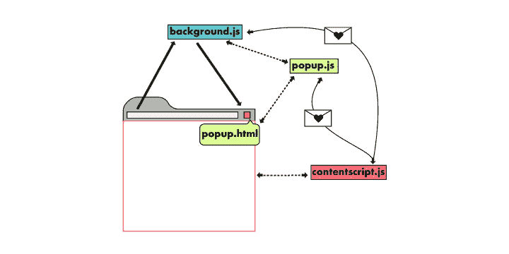

# 如何构建人工智能支持的自然语言合成 Chrome 扩展

> 原文：<https://dev.to/dabit3/how-to-build-an-ai-enabled-natural-language-synthesization-chrome-extension-1bhl>

Transilator 是一个 Chrome 扩展，它可以翻译屏幕上的文本，然后将其合成为听起来自然的语音。在本教程中，我将向您展示我是如何构建它的。

> 要查看代码，请点击[这里](https://github.com/dabit3/transilator)

下面是该扩展的演示:

[https://www.youtube.com/embed/R90uQ_LrpE0](https://www.youtube.com/embed/R90uQ_LrpE0)

* * *

这是一个 3 部分系列的第 1 部分，将使用 [AWS 放大预测](https://aws-amplify.github.io/docs/js/predictions)为你的应用程序添加机器学习和人工智能功能。

第 1 部分-构建翻译程序:文本的语言检测、文本翻译和自然语音合成。

第 2 部分-图像实体识别-建立探索自然的野外指南。

第 3 部分-从图像中识别文本-将会议徽章转换为联系人。

* * *

## 关于这个扩展

Translitor 允许您高亮显示屏幕上的文本，并以您选择的语言阅读。

### 特性

*   好听的栩栩如生的讲话
*   语言输出支持:阿拉伯语，英语，中文，荷兰语，西班牙语，葡萄牙语，丹麦语，印地语，意大利语，日语，韩语，挪威语，波兰语，俄语，瑞典语，土耳其语
*   语言输入支持:荷兰语，葡萄牙语，英语，意大利语，法语，西班牙语

### 用例

*   学习一门新语言/单词应该如何发音
*   听新闻文章、文档或博客文章
*   有视力问题/辅助功能相关使用案例的用户
*   听邮件
*   收听从其他语言翻译成您的语言的内容
*   在发布博客帖子/推文之前对其进行审核
*   一般的多任务处理(一边听别人说话一边做一些事情)

## 入门

本教程有两个主要部分:

1.  创建 Amplify 项目并创建 ML 和 AI 服务
2.  构建 Chrome 扩展并连接到步骤 1 中创建的 ML 和 AI 服务

## 第 1 部分——用 Amplify 创建 ML & AI 服务

AWS Amplify 是一个框架，用于构建支持云的应用程序，包括一个 CLI(用于创建和管理服务)、一个客户端库(用于连接到 CLI 创建的 API)、一个 UI 库(用于简化身份验证等工作)以及一个带有 CI & CD 的托管平台。

在本教程中，我们将使用 CLI 创建服务，并使用 Amplify 客户端库与这些 API 进行交互。

### 创建项目。

我们希望使用模块化的现代 JavaScript 来构建我们的扩展，因此我们需要使用 Webpack(或类似的东西)。一个完美的启动项目已经存在，一个使用 Webpack 的 Chrome 扩展样板(点击[这里](https://github.com/samuelsimoes/chrome-extension-webpack-boilerplate)查看)。

克隆这个样板文件，然后切换到新目录:

```
git clone git@github.com:samuelsimoes/chrome-extension-webpack-boilerplate.git

cd chrome-extension-webpack-boilerplate 
```

> 如果您尚未安装和配置 Amplify CLI，请单击此处的观看视频演示。

接下来，初始化一个新的 Amplify 项目:

```
$ amplify init 
```

接下来，我们将使用**预测**类别添加我们需要的服务。

#### 文字解释

我们将从添加文本解释开始:

```
$ amplify add predictions

? Please select from of the below mentioned categories:
❯ Interpret

? What would you like to interpret?
❯ Interpret Text

? Provide a friendly name for your resource: (interpretText<XXXX>)

? What kind of interpretation would you like?
❯ All

? Who should have access?
❯ Auth and Guest users 
```

#### 文字翻译

接下来，我们将添加文本翻译:

```
$ amplify add predictions

? Please select from of the below mentioned categories:
❯ Convert

? What would you like to convert?
❯ Translate text into a different language

? Provide a friendly name for your resource: (translateText<XXXX>)

? What is the source language?
❯ Choose any language, we will change this dynamically later in our app

? What is the target language?
❯ Choose any language, we will change this dynamically later in our app

? Who should have access?
❯ Auth and Guest users 
```

#### 语音合成

接下来，我们要添加一种方法，采取文本翻译和合成语音。

```
$ amplify add predictions

? Please select from of the below mentioned categories:
❯ Convert

? What would you like to convert?
❯ Generate speech audio from text

? Provide a friendly name for your resource (speechGenerator<XXXX>)

? What is the source language?
❯ Choose any language, we will change this dynamically later in our app

? Select a speaker
❯ Choose any speaker, we will change this dynamically later in our app

? Who should have access?
❯ Auth and Guest users 
```

现在，我们已经创建了所有的 API 配置，我们可以通过运行 Amplify `push`命令:
来创建服务

```
amplify push 
```

现在服务已经部署好了，我们可以继续创建 Chrome 扩展了！

## 第二部分-建筑扩建。

### 铬扩展概述

Chrome 扩展由几个主要文件组成:

> 在这里阅读更多关于 chrome 扩展的基础知识。下面的文件定义是从这篇文章中复制的。

这个文件引导你的扩展并提供元数据，比如版本控制。没有这个，你就没有分机。

**后台脚本**(background . js)——你扩展的心脏和灵魂。您可以在这里创建一个监听器，当用户单击您的图标时实际触发弹出窗口。所有“硬”业务逻辑和原生浏览器交互应该尽可能放在这里。

**内容脚本**(Content . js)——内容脚本可以被注入到浏览器的选项卡中，并在浏览器会话的上下文中访问 DOM。您可以在这里添加新的 DOM 元素，添加额外的侦听器等。内容脚本是可选的

**弹出 UI**(popup . js【popup.html】)——点击/激活某个扩展时看到的小应用。可以用任何框架构建，比如 React 或 Vue，或者只是普通的 JS。我们使用普通的 JS。

在这个扩展中，我使用弹出式 UI 和内容脚本来控制大多数行为。

在`popup.js`中，有一个逻辑允许用户选择他们想将文本翻译成的语言。在`content.js`中，有一个监听器监听发生在`popup.js`的事件，因此我们可以在两者之间来回发送消息。当用户选择一种语言时，我们在`popup.js`中调用下面的方法:

```
// popup.js
chrome.tabs.query({active: true, currentWindow: true}, function(tabs) {
  chrome.tabs.sendMessage(tabs[0].id, {language}, function(response) {
    console.log('response: ', response)
  });
}); 
```

然后，在`content.js`中，我们可以接收该消息，并通过为当前页面附加一个监听器来更新本地状态:

```
// content.js
chrome.runtime.onMessage.addListener(
  function(request, sender) {
    if (!sender) return
    state.setLanguage(request.language)
    return true
}) 
```

这两个函数控制 chrome 扩展 UI 和用户浏览器上运行的实际代码之间的数据流。

[](https://res.cloudinary.com/practicaldev/image/fetch/s--thGcu9sm--/c_limit%2Cf_auto%2Cfl_progressive%2Cq_auto%2Cw_880/https://thepracticaldev.s3.amazonaws.com/i/0ba0ojvsg9sj6w06trqz.jpg)

### 大厦外

接下来我们需要做的是安装 Amplify 库:

```
npm install aws-amplify 
```

接下来，我们需要添加内容脚本。这个样板文件默认没有这个，所以我们将手动添加它。

```
touch src/js/content.js 
```

现在，更新`manifest.json`并添加以下内容以启用新的内容脚本，并允许内容脚本在当前活动的选项卡上工作:

```
"permissions":  ["activeTab"],  "content_scripts":  [{  "matches":  ["*://*/*"],  "js":  ["content.bundle.js"],  "run_at":  "document_end"  }], 
```

接下来，我们需要更新 webpack 配置来处理`content.js`脚本:

```
entry: {
  popup: path.join(__dirname, "src", "js", "popup.js"),
  options: path.join(__dirname, "src", "js", "options.js"),
  background: path.join(__dirname, "src", "js", "background.js"),
  content: path.join(__dirname, "src", "js", "content.js")
},
chromeExtensionBoilerplate: {
  notHotReload: ["content"]
}, 
```

这里我们[从热重载](https://github.com/samuelsimoes/chrome-extension-webpack-boilerplate/issues/4#issuecomment-261788690)中排除内容脚本，并将新的入口点添加到条目配置中。

### [t1](#popupjs)[弹出。js](https://github.com/dabit3/transilator/blob/master/src/js/popup.js)

在 **popup.js** 中，我们为弹出窗口中的点击设置了一个事件监听器。当用户点击一种语言时，我们向内容脚本发送一条消息，其中包含一个包含所选语言的对象。我们也有一个功能，在按钮上添加一个新的类，使背景变暗，让用户知道它被选中了。

```
import "../css/popup.css";

window.addEventListener('DOMContentLoaded', () => {
  var buttons = document.getElementsByClassName("lang-button");
  Array.from(buttons).forEach(function(button) {
    button.addEventListener('click', function(item) {
      Array.from(buttons).forEach(item => item.classList.remove("button-selected"))
      item.target.classList.add("button-selected")
      const language = item.target.dataset.id
      chrome.tabs.query({active: true, currentWindow: true}, function(tabs) {
        chrome.tabs.sendMessage(tabs[0].id, {language}, function(response) {
          console.log('response: ', response)
        });
      });
    });
  });
}); 
```

### [content.js](https://github.com/dabit3/transilator/blob/master/src/js/content.js)

Content.js 是我们大部分代码所在的地方。这里，有一个事件侦听器来侦听 mouseup 事件，有三个主要函数在选择任何文本时运行:

`interpretFromPredictions` -此功能解释所选文本的语言:

```
function interpretFromPredictions(textToInterpret) {
  Predictions.interpret({
    text: {
      source: {
        text: textToInterpret,
      },
      type: "ALL"
    }
  }).then(result => {
    const language = result.textInterpretation.language
    const translationLangugage = state.getLanguage()
    translate(textToInterpret, language, translationLangugage)
  })
  .catch(err => {
    console.log('error: ', err)
  })
} 
```

`translate` -此功能将高亮显示的文本翻译成用户选择的语言。

```
function translate(textToTranslate, language, targetLanguage) {
  Predictions.convert({
    translateText: {
      source: {
        text: textToTranslate,
        language
      },
      targetLanguage
    }
  }).then(result => {
    generateTextToSpeech(targetLanguage, result.text)
  })
    .catch(err => {
      console.log('error translating: ', err)
    })
} 
```

翻译完成后，最后一步是将其合成为自然语言。

```
function generateTextToSpeech(language, textToGenerateSpeech) {
  const voice = voices[language]
  Predictions.convert({
    textToSpeech: {
      source: {
        text: textToGenerateSpeech,
      },
      voiceId: voice
    }
  }).then(result => {
    console.log('result: ', result)
    let AudioContext = window.AudioContext || window.webkitAudioContext;
    console.log({ AudioContext });
    const audioCtx = new AudioContext();
    if (source) {
      source.disconnect()
    }
    source = audioCtx.createBufferSource();
    audioCtx.decodeAudioData(result.audioStream, (buffer) => {
      source.buffer = buffer;
      source.playbackRate.value = 1
      source.connect(audioCtx.destination);
      source.start(0);
    }, (err) => console.log({err}));

    // setResponse(`Generation completed, press play`);
  })
    .catch(err => {
      console.log('error synthesizing speech: ', err)
    })
} 
```

用于语音合成的服务是 Amazon Polly。Amazon Polly 对翻译的语言有不同的声音(见这里的列表)。

在`generatedTestToSpeech`函数中，我们使用语言来确定声音:

```
// Voice data
const voices = {
  ar: "Zeina",
  zh: "Zhiyu",
  da: "Naja",
  nl: "Lotte",
  en: "Salli",
  ...
}

// Get proper voice in the function:
const voice = voices[language] 
```

为了设置和更新用户选择的语言，我们有一个基本的状态机:

```
const state = {
  language: 'en',
  getLanguage: function() {
    return this.language
  },
  setLanguage: function(language) {
    this.language = language
  }
} 
```

> 要查看`content.js`的所有代码，点击[这里](https://github.com/dabit3/transilator/blob/master/src/js/content.js)。

最后，在[popup.html](https://github.com/dabit3/transilator/blob/master/src/popup.html)中，我们渲染按钮来选择不同的语言。

```
<!DOCTYPE html>
<html lang="en">
<head>
  <meta charset="UTF-8">
  
</head>
<body>
  <p class="heading">Choose Language</p>
  <div class="list">
    <h4 class='lang-button' data-id="en">English</h4>
    <h4 class='lang-button' data-id="es">Spanish</h4>
    <h4 class='lang-button' data-id="pt">Portugese</h4>
    <h4 class='lang-button' data-id="zh">Chinese</h4>
    <h4 class='lang-button' data-id="ar">Arabic</h4>
    <h4 class='lang-button' data-id="da">Danish</h4>
    <h4 class='lang-button' data-id="nl">Dutch</h4>
    <h4 class='lang-button' data-id="hi">Hindi</h4>
    <h4 class='lang-button' data-id="it">Italian</h4>
    <h4 class='lang-button' data-id="ja">Japanese</h4>
    <h4 class='lang-button' data-id="ko">Korean</h4>
    <h4 class='lang-button' data-id="no">Norwegian</h4>
    <h4 class='lang-button' data-id="pl">Polish</h4>
    <h4 class='lang-button' data-id="ru">Russian</h4>
    <h4 class='lang-button' data-id="sv">Swedish</h4>
    <h4 class='lang-button' data-id="tr">Turkish</h4>
  </div>
</body>
</html> 
```

接下来，使用 [popup.css](https://github.com/dabit3/transilator/blob/master/src/css/popup.css) 中的 css 或者为 **popup.css** 中的弹出菜单创建你自己的样式。

### 构建和部署扩展

现在扩展已经完成了，我们可以试一试了。

要运行 webpack 并构建扩展，请运行以下命令:

```
npm run build 
```

现在您将看到, **build** 文件夹中填充了 webpack 捆绑的扩展代码。

要上传和使用扩展:

1.  访问 chrome://扩展(菜单->设置->扩展)。
2.  勾选右上角的复选框，启用开发者模式。
3.  点击“加载解压后的扩展名...”按钮。
4.  选择包含解压缩的扩展的目录。

> 要查看完整的代码库，请点击[此处](https://github.com/dabit3/transilator)

* * *

> 我的名字是纳德·达比特 T2。我是亚马逊网络服务的开发者倡导者，负责类似 [AWS AppSync](https://aws.amazon.com/appsync/) 和 [AWS Amplify](https://aws-amplify.github.io/) 这样的项目。我专攻跨平台&云应用开发。