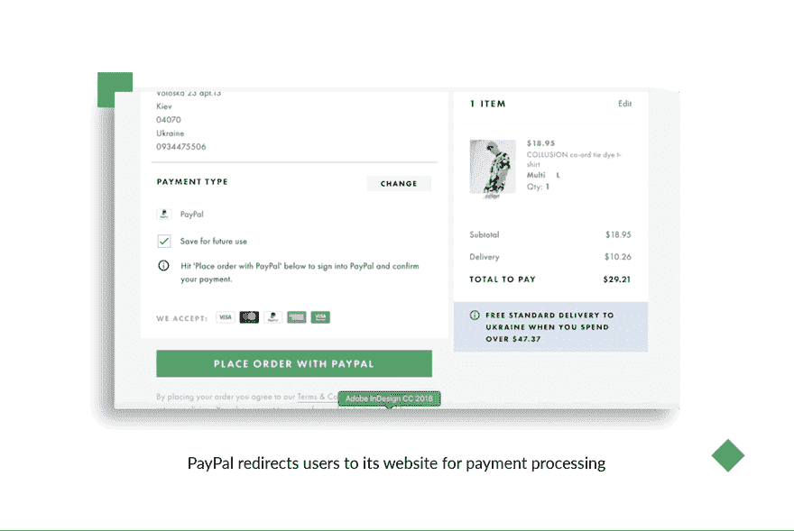
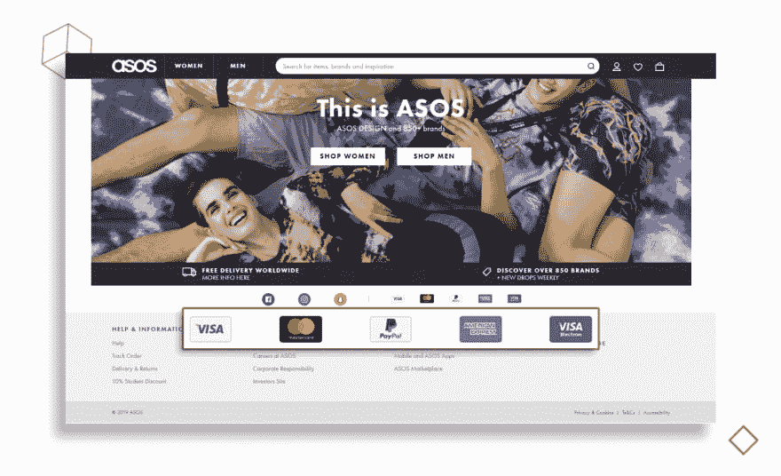
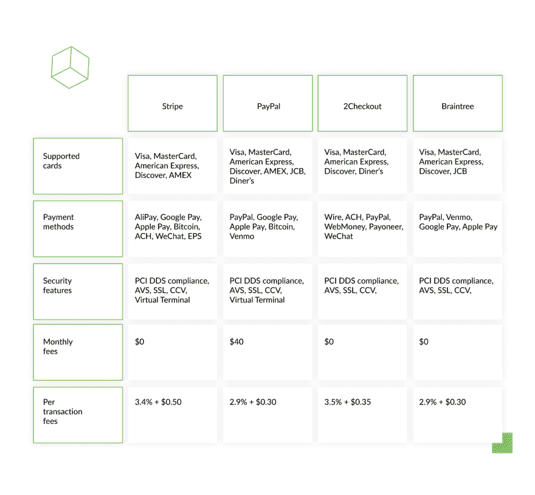

# 支付网关:如何选择最好的

> 原文：<https://dev.to/django_stars/how-to-choose-a-payment-gateway-for-your-project-3kbj>

2018 年 7 月，价值市场研究公司发布了一份关于上一年在线支付平台状况的报告。该报告提到了该行业的价值——135 亿美元。现在 18 个月后，一份新的报告显示，价值已经增加到惊人的 294 亿美元——比之前的数字高出 55%。

每年，支付网关都会得到改进，并积极向公众推广。几乎没有一次促销是不成功的——如今，很难找到一种只包含一种支付方式的在线服务，无论是电子商店还是付费网络应用。此外，这个话题已经变得如此热门，以至于科技公司现在都在竞相提供最快、*最流畅、*(不管这意味着什么)、最面向用户的支付网关。

尽管存在竞争，但永远不会有满足所有需求的通用解决方案(除非所有企业突然同意遵循单一的商业模式)。这并不是简单的‘嗯，我只是喜欢这个，她只是喜欢那个。’不，这是更深层的问题。因此，为了全面掌握可能影响企业家选择一种或另一种支付解决方案的因素，我将在本文开始时定义市场上的支付网关、它们的类型以及哪些最适合某些类型的企业。不过，重点将是初创公司，因为初创公司往往一门心思地追求他们的 MVP，以至于他们经常忽视考虑在线支付网关的一些陷阱。

我们将假设您也有一个相当透明的业务，没有很多客户退款请求，因为对于某些业务来说，退款费用可能是一个重要的成本来源，而退款费用管理是一个全新的领域，值得在单独的帖子中单独讨论。

此外，让我们明确一点:我们不是在讨论通过各种移动平台(如应用商店)销售的数字产品，这些产品会从你的收入中抽取很大一部分，在许多情况下高达 30%。在本帖中，我们将介绍如何在你的网站上接受付款。

# 支付网关 101

当客户点击“立即购买”时，有两方参与在线支付——支付网关和支付处理器。

支付网关是一种软件，它允许在线商店或付费服务向顾客要求支付。支付网关是结帐页面的一部分，它收集客户的帐单信息，并将其发送给支付处理器。处理者是一个公司，它验证交易并连接发卡银行(即客户的)和收单银行(您的)之间的交易数据。处理器保护并批准交易。

像 PayPal 和 Stripe 这样的公司既是支付网关，也是支付处理器。不同之处在于，只有网关对客户可见。

对于顾客来说，它只是一个‘用来支付商品和服务的东西’。然而，对于企业来说，支付网关扮演着更重要的角色。首先，它让你得到报酬。但是在钱转到你的账户之前，会有很多过程，其中一些相当复杂。实际上，正是金融行业的复杂性使得支付网关成为一个独立的分支。

以下是支付服务在您获得支付之前所做的工作:

*   他们核实客户的账单信息。这包括姓名、地址、年龄(这对只能卖给 18 岁或 21 岁以上的人的商品或服务至关重要)和卡信息。许多行业禁止未成年人进入，所以他们必须确保他们的客户达到法定年龄。赌博和成人娱乐只是几个例子。
*   他们核实每笔交易的资金。这意味着他们检查卡是否真的有足够的钱来支付所选的服务。这种验证是必需的，因为有各种各样的方式来收取费用。最受欢迎的是“你被收费，然后你得到服务”。但也有其他的，比如“他们划出一笔金额，你得到服务，你被收费”。对于国际交易，虽然系统会立即处理您的资金，但在您被收费之前可能会有一两天的延迟。
*   他们负责法律和安全事务。一些支付网关承担保护您免受欺诈、黑客、过期卡、资金不足、超信用限额等的责任。这就是他们投入大量资金来确保数据保护和遵守各种法规(包括 HIPAA 和 GDPR)的原因。因此，您不必担心这些风险，可以完全专注于您的业务。

你的支付提供商可能会对你的业务产生巨大的影响。这就是为什么您考虑的因素越多，您以后不得不更改网关的可能性就越小。

这就引出了下一部分——选择支付网关时需要考虑的事项。

# 如何选择支付网关

就像关于你的创业公司的未来的其他决定一样，你不能只是随机选择一个支付网关。在选择完全满足您所有业务需求的网关之前，您应该考虑一系列明确的因素。

我将讨论支付网关的类型、安全性和设计特点，以及定价和可接受的支付方式。

## 支付聚合器和商户账户

支付聚合器是一种服务提供商，它使用各种支付方法(如银行转账和信用卡/借记卡)来促进初创公司(商家)和消费者之间的支付。聚合器的主要优势在于，它们负责初创公司的运营负担，这对于那些经常忘记填写报告和税务表格的人来说非常棒。聚合器之所以被称为聚合器，是因为它们直接从你客户的账户中提取资金，然后进行验证，最后存入你的账户。他们中的大多数使用每笔交易的费用，所以除非有人使用你的服务(即，进行交易),否则你不会被收取任何费用。

另一方面，还有商家账号。要使用它，你需要向银行申请。这是一种特殊类型的账户，您可以用它来促进客户与您之间的交易。不像聚合者，实际上是你(或者你的会计师)应该做所有的操作和管理法规遵从性。这就是为什么大多数初创公司都选择聚合器——因为这让他们可以专注于业务发展，而不用担心法律问题。商家账户的一个好处是，他们通常收取月费，这可能是大销量的正确决定。如今，只有实体企业才能使用商户账户。

PayPal 和 Stripe 等公司将商家账户和网关的功能合二为一，因此选择现代解决方案就不需要商家账户。资金直接存入你的银行账户。

说到业务发展——从技术上来说，为一家初创公司组织支付可以通过一个集成的支付网关或一个托管的非现场支付网关进行，该网关将用户重定向到支付网关网站，就像 PayPal 一样。

## 集成和托管网关

一个**集成的**支付网关通过网关的 API 直接在你的网站上运行。这个选项允许设计者从一开始就在用户的旅程上工作，因为许多这样的 API 是白标的(即，可以被品牌化)。所以，一方面，你可以拥有一个令人愉悦的 UX。

使用集成网关的挑战在于:( 1)您需要进行一些编码以将其构建到您的系统中,( 2)您要承担存储客户数据和遵守法律法规的全部责任。这里最复杂的是安全性，因为如果忽视它，可能会威胁到整个企业。所以你必须为你所做的承担更多的责任。

每当您被重定向到支付提供商的网站进行支付时，您都在使用托管的异地支付网关。正如我在上一节中所说的，PayPal 是这种类型的网关中最受欢迎的。

这种解决方案吸引了许多公司，因为支付提供商负责保护客户的个人信息并遵守法律法规。非现场支付也是值得信赖的，因为对于客户来说，它们似乎是独立的金融机构。

选择异地服务的不利之处在于，它们在某些国家可能不可用。为了解决这个问题，初创公司会研究他们的受众和地理位置，并在做出最终决定之前考虑这些因素。

##### 从软件开发人员的角度来看，最好的支付网关是拥有最清晰的 API 集成文档的网关。毕竟，我们的工作是编写灵活的代码，允许我们以最小的努力来改变提供者或进行任何其他修改。

*- **[格莱布·普什科夫](https://djangostars.com/blog/author/gleb-pushkov/)** ，Django Stars 的高级 Python 开发者*

然而，这不是一个非此即彼的情况。任何网站都可以有多个网关，包括托管网关和集成网关。你需要考虑两件事:首先，对你的客户来说，什么是最有吸引力的支付途径？第二，你愿意为多一个选择支付多少钱？以下是更多关于定价的信息。

## 安全和法规要求

当谈到安全性时，我们可以区分两种不同的情况:(1)客户认为他们正在进行安全的交易，因此他们的数据不会丢失或被盗；(2)实际上在技术层面上进行安全的交易。

在选择支付网关时，你必须确保它具有一定的安全功能(如反欺诈保护)，这样你的客户才能对你的新(不熟悉)服务感到熟悉。根据 Vouchercloud 的调查，80%的顾客在结账页面上看到醒目的值得信赖的信用卡标识时会感到更安全。一些支付网关，如 Stripe，允许白标支付处理(即，能够定制结账以包含您公司的品牌标识)。

PCI 合规性是所有支付网关的必备条件。这是指由支付卡行业安全标准委员会定义的一套法规，该法规确定了保护在线交易的最关键方面。大多数网关都符合这些规定，但我建议您在选择支付网关时考虑另外三个特性:

*   SSL 加密，让您避免各种数据泄露
*   数字签名，使黑客无法访问您的帐户，即使他们有您的 ID 信息
*   动态 IPs，所以帐户被拒绝，除非它是从您的 IP 地址访问

## 支付方式

只有当您的网关支持客户首选的支付方式时，您的客户才能进行交易。我不是说越多越好。我是说，‘了解你的受众，并考虑他们的支付习惯。’如果你在结账前安排好各种支付方式，你就增加了让用户满意的机会。

之后，你可以使用谷歌分析或其他方法来观察客户的行为，停止提供他们很少使用的方法，并进行客户研究，以了解更多他们喜欢的其他支付方式。

你可能还会发现，你的客户不仅使用信用卡或在线账户，还使用支付宝和微信等应用，甚至加密货币。我建议，只有当你的主要市场是中国时，你才整合它们。

这带来了另一个问题:客户开发的一个挑战是不要总是做你的客户要求的事情。即使他们中的一两个人说他们喜欢支付宝，请记住，创业公司的成功并不能归结为拥有每一种可能的支付方式。这同样适用于加密货币——它们是一大堆麻烦。尽管加密货币被吹捧为“彻底改革”支付行业的一种方式，但加密货币仍然主要由炒作者使用，他们不想接受老式但完全可用的信用卡。但这类用户的数量可以数十个。

一句话:只有在验证了实现加密货币和交易聊天的积极投资回报后，才选择加密货币和交易聊天的支付网关。

## 定价、订阅和限制

在注册一个网关之前，计算所有的费用是至关重要的，因为对于一个初创公司来说，每一分钱都很重要。支付提供商可以收取多种费用:

-安装费

*   月费
*   每笔交易费用
*   交易费的百分比
*   货币转换费
*   特定支付方式费用
*   退款费用

例如，Stripe 没有安装费或月租费。他们每笔交易收取 0.30 美元，外加每笔交易金额的 2.9%。因此，如果你以 100 美元的价格出售某样东西，你会得到报酬:

100-(100 * 2.9%)-0.30 =**$ 96.80**
计入您企业账户的支付费用百分比(这将因支付货币和国家而异)，您将获得净金额。

你应该知道，如果你的业务增长，交易数量急剧增加，一些支付提供商为高交易量的企业提供特殊定价。

如果你是一家基于订阅的创业公司(SaaS)，你的支付网关必须提供定期支付服务。基本套件应提供循环计费，并允许客户取消和恢复订阅，改变他们的计费信息(如姓氏或地址)和切换到不同类型的订阅(从标准到高级)。

## 结论

考虑以上所有因素，并尝试一下。大多数支付服务为在线业务提供试用期，因此您可以探索该服务提供的更多功能。

当然，还有许多其他次要因素我没有在这篇文章中探讨，但这里的内容应该足以让你了解为初创公司设置支付网关的主要步骤。

由于一些支付网关可以集成到设计流程中，因此在开发阶段之前开始探索您的选项是明智的，这样设计团队就可以防止由于所选支付网关施加的意外技术限制而可能出现的任何糟糕体验。

关于创业的其他建议，请阅读[如何在一年内不失败](https://djangostars.com/blog/fintech-startup-handbook-not-fail-one-year/)。

本[支付网关指南](https://djangostars.com/blog/payment-gateway-startup-guide/)由 Django Stars 的商业分析师 Alexander Savchenko 撰写。最初发布在 Django Stars 博客上。