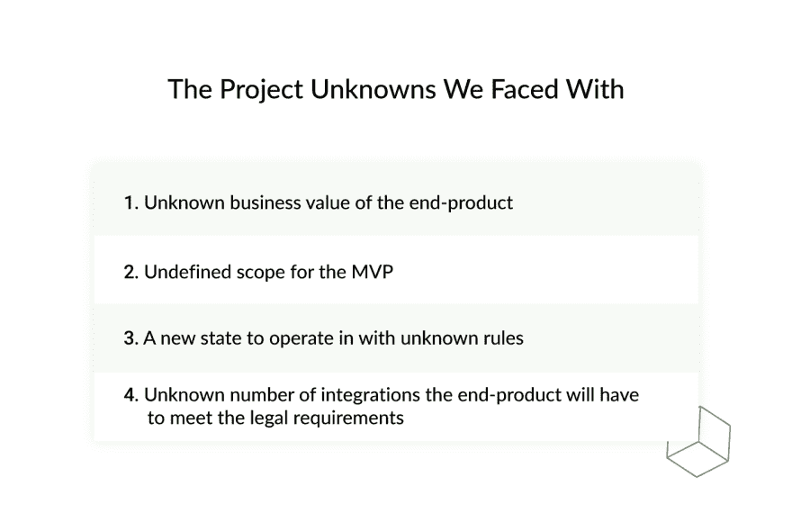
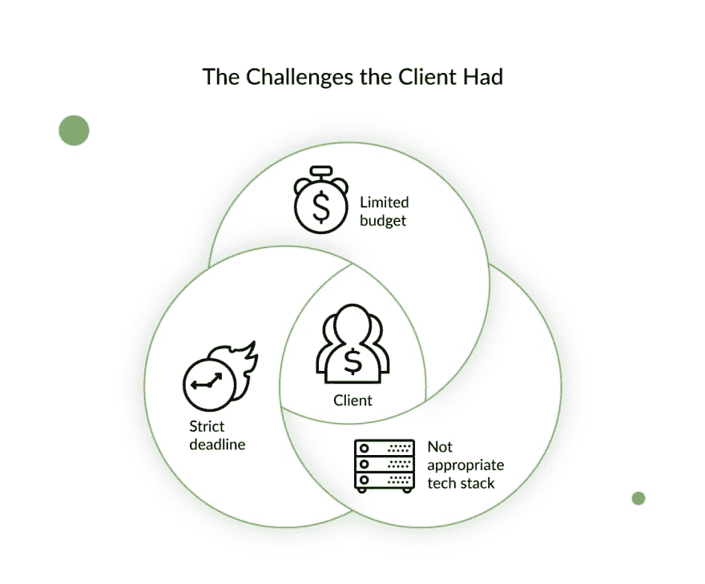
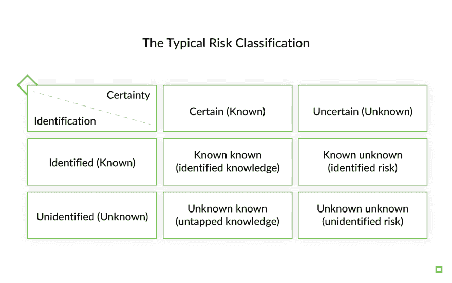
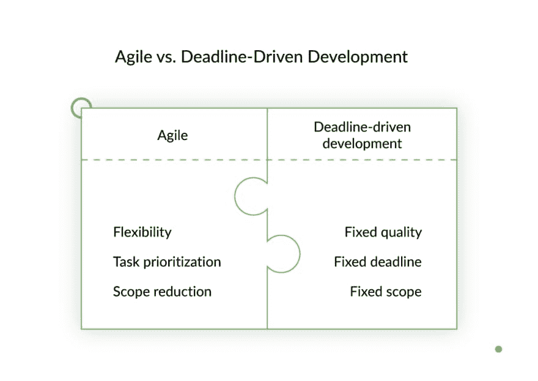
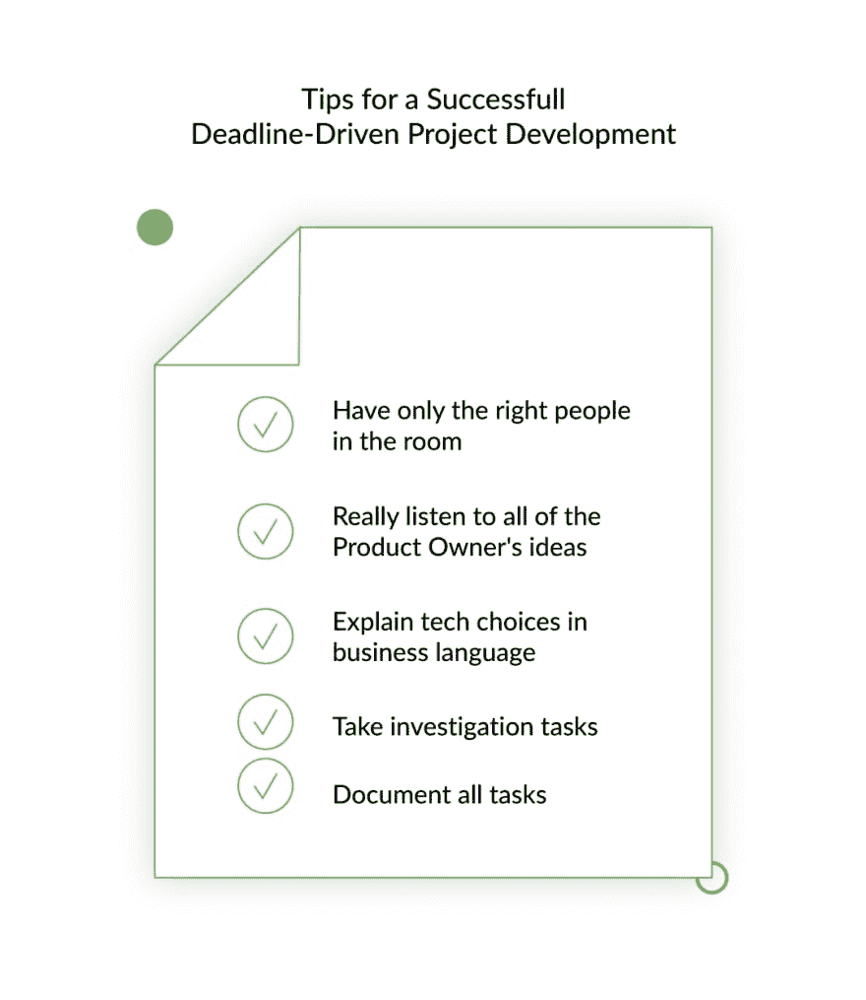

# 将截止日期驱动的开发与敏捷相结合的教程

> 原文：<https://dev.to/django_stars/how-to-combine-deadline-driven-development-with-agile-and-delivered-5gc8>

这篇文章的标题听起来似乎不可能。但是根据我们的经验，如果开发团队和项目经理有很深的专业知识，并且和产品负责人一起，认真倾听对方的意见，保持合作的开放态度，一切都可以完成。

在这里，我的目的是展示经验、对纪律的尊重以及坚持遵循良好的项目管理实践是如何在面临许多挑战的情况下帮助开发成功的软件项目的。我们将展示如何应对一个没有明确范围、紧迫期限和有限预算的项目。

作为一家 IT 公司的项目经理，我与许多非技术型的初创公司创始人、我们的客户一起工作，经常解决各种与技术和沟通有关的有趣问题。明确地说，我们不会讨论如何开始一个软件开发项目，或者你应该采取哪些步骤来开始它。你可以在项目管理知识手册中读到所有相关内容。相反，我将分享我在严格的最后期限内，在一些已经很明显的挑战下，让一个复杂的金融科技项目有一个正确的开始的经验。我们开始吧。

## 截止日期和不明确的范围与敏捷:我们面临的项目挑战

当开始一个新项目时，它的经理显然需要仔细规划所有的步骤，从项目计划到发布，甚至更远。为了这个目的，一个人的头脑中必须有尽可能清晰的最终产品的图像。有必要了解最终产品的业务预期和价值，并计划实现这些目标的步骤。与此同时，在软件开发项目开始时，你必须了解法律要求，你的最终产品必须满足——例如，在安全性、个人数据存储、服务器要求等方面。因为在开发产品时这些都必须考虑在内。

这是项目开始时最理想的状态。但是没有奋斗就没有成长。以下是我们在项目中面临的一些挑战。

### 挑战 1。有许多未知因素的复杂项目

项目复杂性是一个主观的、相对的概念。这里的意思是该项目的以下特点的总和。首先，当我们会见其中一位初创公司创始人和产品负责人时，我们发现他们有一个雄心勃勃的想法，要创造一种在该地区没有同类产品的产品。它一定是同类中的第一个。但是在仔细研究了他们对产品的设想后，发现有很多未定义的元素。该项目的初始需求只包括最终产品的预期特性、预算、截止日期和技术堆栈。但他们几乎无法定义产品的商业价值。此外，最小可行产品(MVP)功能的范围并不完全清楚。结果，开发团队无法估计发布 MVP 需要多少时间，软件开发也无法进行。

阅读更多:[MVP、MMP、MLP、MDP 和 MAP 启动阶段指南](https://djangostars.com/blog/guide-mvp-mmp-mlp-mdp-map-startup-stages/)

下一个未知因素是，产品计划运行的状态对我们来说是未知的领域。要明确的是，我们在金融科技领域工作过很多次。我们知道如何制造金融科技产品，但我们从未在客户所在的州工作过。我们既不知道其法律规定的特点，也不知道当地用户的文化和道德。鉴于此，还不清楚我们必须对产品进行哪些整合，以符合当地对产品安全监控、金融运营监管和个人数据存储的潜在要求。

所有这些，伴随着下面描述的挑战，使得这个项目乍看起来几乎是不可能的。

### 挑战 2。雄心勃勃的固定期限

我们的客户有投资者设定的固定期限。问题是当他们来找我们时，截止日期越来越近了。他们花了大量时间选择技术堆栈，并与外部顾问讨论技术解决方案。但是越接近最后期限，讨论的解决方案就越不合适。他们在严格的截止日期和无法在规定时间内完成的解决方案之间进退两难。他们有多少时间？他们有 5 个月的时间来开发 MVP。鉴于他们甚至不知道 MVP 应该是什么样子，这是一个相当雄心勃勃的目标。

### 挑战 3。精疲力竭的业务团队

最后但同样重要的是，值得一提的挑战是业务团队的状态。当我们遇到他们的时候，他们已经因为寻找一个致力于这个项目的开发团队而筋疲力尽了。在花了将近一年的时间在外部顾问的帮助下选择正确的技术解决方案后，他们发现自己的预算非常有限，最后期限也快到了。此外，预定义的技术堆栈不适合如此严格的期限。

我们与客户讨论了 MVP，估计了我们需要多少时间来开发它。似乎实现他们想要的堆栈将比项目允许的时间框架多花 2.5 周。很明显，客户的技术与他们的最后期限完全冲突。

由于这些挑战，客户完全筋疲力尽，厌倦了等待开发阶段的开始。他们让我们用预定义的技术解决方案开始开发，认为这样会更快。我们不得不召开多次会议，不仅是为了讨论最合适的技术解决方案，也是为了说服他们相信我们的专业知识。

## 我们如何应对项目挑战:关键见解

在这里，我将向您展示我们如何应对项目的严峻挑战，以及我们如何在一个截止日期驱动的开发环境中坚持敏捷方法。

> 洞察力#1。多次与业务团队讨论所有事情。

当你有一个和这个一样多未知的项目时，成功的关键是业务和开发团队之间的双向持续沟通。在我们的案例中，我们开了很多会议讨论所有的事情，从产品的特性、商业价值、相关的技术解决方案和团队组成开始。每一个微小的细节都经过讨论并达成一致。因此，我们帮助客户定义产品的商业价值，同时他们就当地法规的细节向我们提供建议。通过提前讨论细节，你会在未来节省很多时间。

这里最重要的事情是与客户就技术堆栈达成一致。正如您所记得的，他们带着预先定义的技术堆栈来找我们，经过粗略的估计，这似乎与截止日期完全冲突。我们和客户开了几次会，解释作为一种更有效的开发途径，使用 Python 开发的好处。

当上市时间是一个关键因素时，Python 是一个很好的选择。它有各种各样的库和现成的解决方案，使得开发相对快速和容易。此外，Python 是“敏捷”的，因此使用它可以解决任何复杂的技术任务。鉴于所有这些，Python 允许您比使用其他选项更快地开发 MVP。

阅读更多:[更快、更容易、更好或者为什么 Python 是初创公司的最佳编程语言](https://djangostars.com/blog/python-best-programming-language-for-startup/)

此外，与技术团队讨论的一个关键问题是产品的可伸缩性。我们的客户计划在未来扩大产品规模，以满足预计的用户数量增长。Python 可以让我们快速完成这项工作，而不需要太多额外的工作。此外，我们有过许多未知的类似项目的经验，我们知道，使用 Python，我们可以解决任何问题，从而保证按时交付高质量的产品。

> 洞察力#2。研究越深入越好。

在敏捷中，开发团队通常会在每个 sprint 中花 4 到 6 个小时来计划会议和讨论下一个 sprint 要做的事情。与此同时，在积极的冲刺阶段，团队成员可能会承担所谓的“调查任务”。这意味着他们可能会从为下一个 sprint 计划的 backlog 中提取一个任务，并对其进行研究。如果需要，他们可以向客户询问细节，分析任务，寻找最佳解决方案。因此，当开发该任务的时候，团队已经有了如何解决它的想法，这节省了大量时间。

在截止日期驱动的开发环境中，就像我们发现自己所处的环境，这样的实践是救命稻草。有时我们在 sprint 中花 2-3 天的时间做计划，这对于一个普通的项目来说是非常规的。但它帮助我们避免了匆忙做事时发生的错误。相反，我们确切地知道我们将要做什么，我们需要多少时间，我们需要什么资源。

> 洞察力#3。组建合适的团队。

通常，开发团队由具有不同专业知识的工程师组成，以中级专业人员为核心，高层为高层。但是我们有一个严格的截止日期和太多关于 MVP 范围的未知数。正因为如此，我们根本不知道我们需要多少开发人员来完成这个项目，因为我们不知道我们需要解决哪些技术任务。与此同时，产品负责人已经计划了一定的团队规模，并为此准备了具体的预算。在这种情况下，由于我们所面临的高度不确定性，项目估算没有以通常的方式进行估算。

由于行业的不完全可预测性，基于过去的项目数据，我们在计算的时间估计值上增加了 30%。通过这种方式，我们保护了自己免受项目过程中可能发生的风险，因为项目和行业中存在各种未知的未知因素。

我们最初的时间估计+ 30%的“保险”揭示了当前的团队组成不足以满足最后期限。因此，我们建议产品负责人同意团队扩展和高级软件开发人员的轮换。我们同意与资深开发人员组成开发团队，他们有丰富的经验，可以在 MVP 开发阶段紧张的时间表上工作。结果，我们在截止日期前 5 个工作日完成了 MVP，并按照标准的团队组成完成了项目的剩余部分，以遵守预算。

## 我们的失误以及我们是如何处理的:

**1。第三方服务集成影响了路线图**。我们不知道测试与第三方服务(支持金融科技产品工作的服务，如银行或支付系统)的集成会花这么长时间。似乎你不能随时测试你想测试的东西。该服务每月为您预订一次“测试窗口”，您只能在这段时间内进行测试。我们在规划路线图时没有考虑到这一点。因此，我们开发了一个解决方案，允许我们在我们的“沙箱”中测试内部集成，并使用“真实”测试作为最终验证。
2**。第三方服务影响数据架构**。当我们开始设计一个软件项目时，我们不知道要创建一个正常工作的产品需要多少集成，也不知道集成将如何提供数据。在项目的第一阶段部分吸引产品架构师有助于解决这个问题，因为他们试图至少估计这种集成的大概数量。
**3。业务和技术团队没有通用的沟通工具**。当开发团队使用吉拉进行项目跟踪，使用 Slack 进行交流时，客户继续使用 Excel 进行跟踪，使用 SMS 进行交流。我们向业务部门展示了使用 Slack 和吉拉的好处，并教他们如何有效地做到这一点。

## 期限驱动开发中的敏捷方法

软件开发项目中的敏捷已经被证明是一种最佳实践。它是灵活的、多用途的，可以被过程中的双方——企业和工程师——理解。它还非常注重提前规划任务。然而，在期限驱动的开发中，敏捷可能是一个相当大的挑战。如上所述，敏捷假设灵活性；截止日期意味着，嗯，截止日期。

### 敏捷与截止日期:如何实现双赢

在第一阶段的短期限内完成一个雄心勃勃的项目需要每个团队成员的参与。有了这类项目的经验信息，很明显，关键任务是通过培养一种非常特殊类型的项目“文化”来最小化可能的风险当谈到风险时，我们的意思是产品负责人对项目的技术特性不太了解。他们只是知道产品最终应该有什么功能。为了实现这些目标，他们求助于外部顾问，由于他们的非最优建议，这些顾问最终给初创公司带来了严重的风险。必须采取措施应对这些风险。

### 方法决策

当风险很高并且没有犯错的余地时，创建一种方法——几乎是一种文化——以高度尊重纪律为核心可能是你能做出的最好的非技术性决策之一。

我们做过的事情:

*   **高度细致的冲刺计划** —有时我们会花长达 3 个小时的时间进行计划，这让我们能够深入到下一次冲刺的任务中，让所有团队成员达成一致，并让他们高度参与冲刺。
*   **尖峰型任务** —团队成员对分配给他们的下一个 sprint 任务进行了深入调查，将他们的解决方案的可能集成的代码草案定义为完成。当团队成员没有足够的时间来搞清楚任务的所有特性时，这在积极的冲刺阶段节省了大量时间。
*   **与产品负责人的适当沟通** —我们不断地与产品负责人协商，因为他们对利益相关者有清晰的了解，可以提醒我们产品应该是什么样的。
*   QA 专家和开发人员之间相互尊重的交流，QA 团队成员提前准备测试文档，开发人员在开始编写代码时就可以访问这些文档。

由于我们的方法，我们没有一次失败的冲刺。我们实现了预计和实际项目时间和成本之间的准确性，培养了良好的团队精神，并提前一周交付了产品。

## 五个截止日期驱动的开发要点

如果你以客户为导向，在这个领域有经验，并且关注质量，你的产品仍然可以成功，即使错误的代价可能是灾难性的，并且你在严格的期限内使用敏捷。

总结一下，这里有五个提示，即使是高级项目经理也可以用于复杂的产品开发:

### 1.房间里只有合适的人

如果你的时间和预算有限，你就不能把这些稀缺资源花在那些不能给项目带来任何有价值东西的人身上。这意味着在项目的每个阶段，你都应该评估它的需求和你的资源。如果你需要快速交付，吸引那些会及时完成的高级开发人员，而不是使用更多的初级员工，他们会花费更多的时间进行开发，错过最后期限，结果毁掉整个项目。

### 2.真正倾听产品负责人的所有想法

不要打断，但一定要把事情写下来，问一些澄清性的问题，以弄清他们试图用他们的产品解决什么样的商业问题。它会帮助你了解你正在开发的产品。

### 3.用商业语言解释技术选择

你的专业知识很有价值，但商务人士不会说“技术”，所以要学会从时间表、数字和对业务的优势等方面传达你的想法，无论是现在还是长远。

### 4.接受调查任务

向产品负责人解释，给团队成员分配调查任务并不是在积极冲刺阶段浪费生产时间，而是加速进一步冲刺的投资。

阅读更多:[如何成功地为开发团队设定任务](https://djangostars.com/blog/successfully-set-tasks-development-team/)

### 5.尽可能完整地记录所有任务

记录一切。首先，开发人员在吉拉跟踪他们的工作——所以如果你想完成某件事，确保你为它创建了一个任务。这样，它就永远不会丢失。此外，花时间使用打印屏幕和示例详细描述您想要的内容。如果你在写一个任务时节省了几分钟，你就从每个从事这项任务的人身上花了更多的时间，他们最终只会浪费他们和你的时间来阐明你最初想说什么。

最后，不要害怕紧迫的截止日期。我们希望我们的案例能激励你接受看似不可能的挑战——我们的外卖将帮助你应对这些挑战。

这个关于如何将截止日期驱动的开发与敏捷相结合的案例研究是由 Django Stars 的 Nataliia Peterheria - PM 撰写的。在[姜戈明星博客](https://djangostars.com/blog/)上阅读原文。