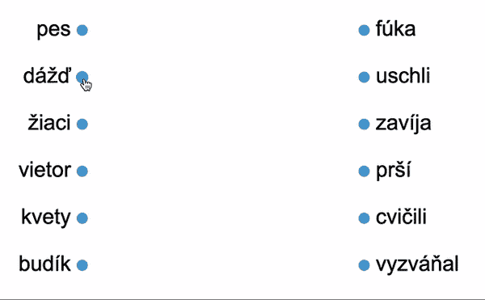

# [如何]在网页上用线条连接元素

> 原文：<https://dev.to/sekara/how-to-connect-elements-with-lines-on-web-page-5b9n>

最近我为教科书协会做了一个项目，我必须用他们五年级课本上的任务做一个网络应用程序。有九种类型的任务，其中一种是用线连接单词(或句子)。我知道 HTML 没有对这类东西的本地支持，所以我不得不随机应变。当然，我做的第一件事是寻找一些 JS 库，但我能找到的任何东西都不是轻量级的，而且有很多我需要的功能。此外，这个 WEB 应用程序应该在触摸设备和旧浏览器上响应和支持(Windows XP 支持最新版本的 Chrome 和 Firefox(不要问...)).

### 潜峰的最终结果✅

在这里，您可以看到当您将一些单词与另一个单词连接起来并检查连接是否正确时的最终结果。
[T3】](https://res.cloudinary.com/practicaldev/image/fetch/s--Gyp1cnFJ--/c_limit%2Cf_auto%2Cfl_progressive%2Cq_66%2Cw_880/https://thepracticaldev.s3.amazonaws.com/i/xfhnteflc26e1ubbsku0.gif)

### 想法💡

起初，我想使用 div 的绝对位置，2-3px 的高度和动态宽度(计算两个钩子之间的距离),以及旋转原点在左上方(或下方)的旋转，但这只是可怕的。

两分钟后，我想到了 canvas，我们都知道 canvas 应该用于这样的绘图，但 canvas 有一个缺点(在这种情况下，实际上可能有很多，但只有一个),它只是绘图，我们不能修改已经绘制的元素(我们可以，但我们必须重新绘制整个 canvas)。

**SVG** 。**S**calable**V**ector**G**raphics。这就是答案。Canvas 和 SVG 的主要区别在于 Canvas 是位图(像素和颜色),而 SVG 将所有元素保存在 HTML DOM 中。因此，如果你想要图形密集型的东西，你应该使用 Canvas，如果你想要能够修改元素的图形，并且你不会有很多这样的图形(因为它会极大地影响性能)，那么你应该使用 SVG。

### 但是，如何？🤔

我必须提到，我没有在我的项目中使用确切的代码，我张贴简化版本，以便您可以得到一个想法，并按照您想要的实现。

好了，现在我们知道我们将使用 SVG 来画线，其他内容将是普通的 HTML。为了实现我们想要的，我们将制作这样的结构

```
<div class="wrapper">
  
  <div class="content">
    <ul>
      <li>One <div class="hook" data-value="One" data-accept="First"></div></li>
      <li>Two <div class="hook" data-value="Two" data-accept="Second"></div></li>
      <li>Three <div class="hook" data-value="Three" data-accept="Third"></div></li>
    </ul>
    <ul>
      <li><div class="hook" data-value="Second" data-accept="Two"></div> Second</li>
      <li><div class="hook" data-value="Third" data-accept="Three"></div> Third</li>
      <li><div class="hook" data-value="First" data-accept="One"></div> First</li>
    </ul>
  </div>
</div> 
```

如你所见，我使用数据集来描述我的钩子(用于绘制和连接相应线条的点)。

以及一些合理安排内容的 CSS

```
.wrapper {
  position: relative;
}
.wrapper svg {
  position: absolute;
  top: 0;
  left: 0;
  width: 100%;
  height: 100%;
  z-index: 1;
  shape-rendering: geometricPrecision; /* for better looking lines */
}
.wrapper .content {
  position: relative;
  z-index: 2;
  display: flex;
  justify-content: space-evenly;
  align-items: center;
}
.wrapper .hook {
  background-color: blue;
  display: inline-block;
  width: 15px;
  height: 15px;
  border-radius: 50%;
  cursor: pointer;
} 
```

现在我们已经设置好了，是时候学习一些 JavaScript 了。

```
const wrapper = document.querySelector(".wrapper")
const svgScene = wrapper.querySelector("svg")
const content = wrapper.querySelector(".content")

const sources = []
let currentLine = null
let drag = false 
```

`sources`将包含带有开始和结束挂钩的线条，在`currentLine`中，我们将存储我们正在绘制的当前线条，`drag`将告诉我们是否正在绘制新线条。

正如我之前提到的，这段代码应该可以在桌面和移动(触摸)设备上运行，所以我必须编写可以在这两种情况下运行的代码。

首先我们将附加事件监听器

```
wrapper.addEventListener("mousedown", drawStart)
wrapper.addEventListener("mousemove", drawMove)
wrapper.addEventListener("mouseup", drawEnd)

wrapper.addEventListener("touchstart", drawStart)
wrapper.addEventListener("touchmove", drawMove)
wrapper.addEventListener("touchend", drawEnd) 
```

请注意，我对鼠标和触摸事件使用了相同的方法。

### drawStart()

由于这个方法是附加在包装器上而不是钩子上，我们首先要做的是检查用户是否从正确的点
开始画线

```
if(!e.target.classList.contains("hook")) return 
```

第二件事是捕捉鼠标(或触摸)的 X 和 Y 坐标

```
let eventX = e.type == "mousedown" ? e.clientX - scene.offsetLeft : e.targetTouches[0].clientX - scene.offsetLeft
let eventY = e.type == "mousedown" ? e.clientY - scene.offsetTop + window.scrollY : e.targetTouches[0].clientY - scene.offsetTop + window.scrollY 
```

并划出一条线

```
let lineEl = document.createElementNS('http://www.w3.org/2000/svg','line')
currentLine = lineEl;
currentLine.setAttribute("x1", eventX)
currentLine.setAttribute("y1", eventY)
currentLine.setAttribute("x2", eventX)
currentLine.setAttribute("y2", eventY)
currentLine.setAttribute("stroke", "blue")
currentLine.setAttribute("stroke-width", "4")

svgScene.appendChild(currentLine)
sources.push({ line: lineEl, start: e.target, end: null })

drag = true 
```

嘿，但是我们没有第二点坐标？！？！是的，没错，这就是`drawMove()`发挥作用的地方。您可以看到，我们将我们的`drag`标志设置为`true`。

### drawMove()

当用户在我们的包装元素上移动鼠标(或触摸)时，这个方法被调用，所以我们要做的第一件事是检查用户是在画线还是只是移动鼠标(触摸)

```
if (!drag || currentLine == null) return 
```

这里的第二件事与从`drawStart()`到
相同

```
let eventX = e.type == "mousedown" ? e.clientX - scene.offsetLeft : e.targetTouches[0].clientX - scene.offsetLeft
let eventY = e.type == "mousedown" ? e.clientY - scene.offsetTop + window.scrollY : e.targetTouches[0].clientY - scene.offsetTop + window.scrollY 
```

最后我们更新线
的第二点坐标

```
currentLine.setAttribute("x2", eventX)
currentLine.setAttribute("y2", eventY) 
```

在这一阶段，你将拥有带钩子的场景，你将能够用钩子上的一个点和跟随你的鼠标(或触摸)的第二个点画线，直到你松开鼠标按钮(或从屏幕上移开你的手指)，线将冻结。让我们继续下一个方法。

### drawn end()

当用户释放鼠标按钮或将手指移出屏幕时，这个方法被调用，所以首先我们必须确保他一直在画线

```
if (!drag || currentLine == null) return 
```

第二件事是定义我们的`targetHook`

```
let targetHook = e.type == "mouseup" ? e.target : document.elementFromPoint(e.changedTouches[0].clientX, e.changedTouches[0].clientY) 
```

看到我用`e.target`做 mouseup 事件，用`document.elementFromPoint()`做触控设备得到`targetHook`了吗？这是因为在`mouseup`事件中的`e.target`将是我们当前悬停的元素，而在`touchend`事件中，它将是触摸开始的元素。

如果用户想将行尾附加到非钩子的元素上，或者附加到行首的钩子上，该怎么办？我们不会允许的。

```
if (!targetHook.classList.contains("hook") || targetHook == sources[sources.length - 1].start) {
  currentLine.remove()
  sources.splice(sources.length - 1, 1)
} else {
  // patience, we'll cover this in a second
} 
```

最后，如果线的末端在正确的位置上

```
if (!targetHook.classList.contains("hook") || targetHook == sources[sources.length - 1].start) {
  currentLine.remove()
  sources.splice(sources.length - 1, 1)
} else {
  sources[sources.length - 1].end = targetHook

  let deleteElem = document.createElement("div")
  deleteElem.classList.add("delete")
  deleteElem.innerHTML = "&#10005"
  deleteElem.dataset.position = sources.length - 1
  deleteElem.addEventListener("click", deleteLine)
  let deleteElemCopy = deleteElem.cloneNode(true)
  deleteElemCopy.addEventListener("click", deleteLine)

  sources[sources.length - 1].start.appendChild(deleteElem)
  sources[sources.length - 1].end.appendChild(deleteElemCopy)
}

drag = false 
```

现在我们必须实现`deleteLine()`方法来允许我们的用户删除行。

先是一些 CSS

```
.wrapper .hook > .delete {
  position: absolute;
  left: -3px;
  top: -3px;
  width: 21px;
  height: 21px;
  background-color: red;
  color: white;
  display: flex;
  justify-content: center;
  align-items: center;
  border-radius: 50%;
}
.wrapper .hook:hover {
  transform: scale(1.1);
} 
```

`deleteLine()`和
的实现

```
let position = e.target.dataset.position

sources[position].line.remove();
sources[position].start.getElementsByClassName("delete")[0].remove()
sources[position].end.getElementsByClassName("delete")[0].remove()
sources[position] = null 
```

那么检查单词是否正确连接呢？
法`checkAnswers()`

```
sources.forEach(source => {
  if (source != null) {
    if (source.start.dataset.accept.trim().toLowerCase() == source.end.dataset.value.trim().toLowerCase() && source.end.dataset.accept.trim().toLowerCase() == source.start.dataset.value.trim().toLowerCase()) {
      source.line.style.stroke = "green"
    } else {
      source.line.style.stroke = "red"
    }
  }
}) 
```

### 结束🎉

这就是全部，现在你已经完全实现了拖拽和画线功能，最大限度地减少了不常见的 html 标签的使用，最重要的是，它在非触摸和触摸设备上都可以工作！

我希望你喜欢这篇文章，并学到一些新东西😊