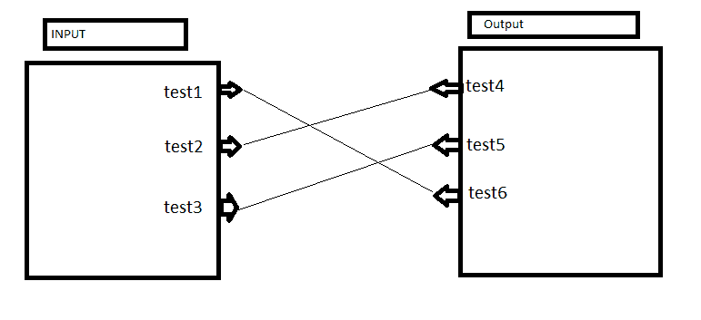

# 如何连接两个包含 json 节点的矩形 SVG

> 原文：<https://dev.to/vikramas/how-to-connect-two-rectangle-svgs-containing-json-nodes-220b>

我有一个 json 输入:

```
{
  "test1":"test1",
  "test2":"test2",
  "test3":"test3"
} 
```

以及输出 json:

```
{
  "test4":"test4",
  "test5":"test5",
  "test6":"test6"
} 
```

所以我正在尝试使用 D3.js 做以下事情，我是 D3.js 的新手，

用户将导入输入 JSON 并输出 JSON。

[](https://i.stack.imgur.com/m58gy.png)

基于输入和输出 JSON 映射，这是通过链接相应的节点来完成的，它将被映射。

因此，输出将是:

```
{
  "test4":"test2",
  "test5":"test3",
  "test6":"test1"
} 
```

我找到了一个例子([https://stack overflow . com/questions/39685298/draw-a-line-between-2-divs-once-2-result-div-clicked-using-angular js](https://stackoverflow.com/questions/39685298/draw-a-line-between-2-divs-once-2-consequence-div-clicked-using-angularjs))，但是只使用了 javascript 而没有使用 D3。