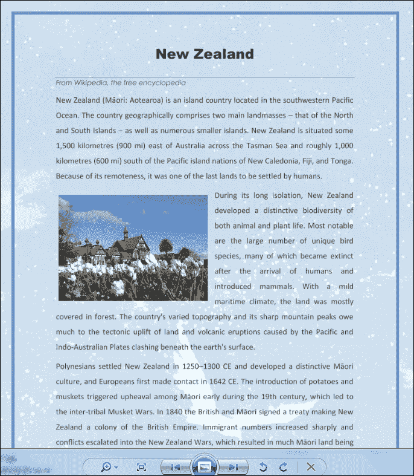
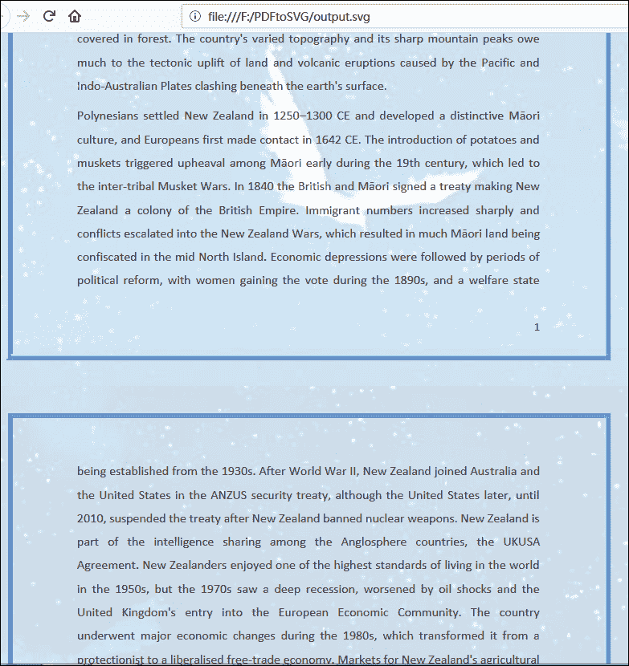

# 如何在 Java 中将 PDF 转换成图像

> 原文：<https://dev.to/eiceblue/how-to-convert-pdf-to-image-in-java-491g>

开发人员通常需要将 PDF 转换成图像。在[免费 Spire.PDF](https://www.e-iceblue.com/Introduce/free-pdf-for-java.html)的帮助下，我们可以在 Java 应用中轻松地将任意大小和版本的 PDF 文件转换成高质量的图像。在这篇文章中，我将解释如何将 PDF 文件转换成 PNG、BMP、JPEG、GIF 等格式的位图图像。和 PDF 文件转换成 EMF、WMF 和 SVG 格式的矢量图像。

将 PDF 页面转换为位图图像(BMP、Jpeg、Png 和 GIF)

Java 的 Spire.pdf 提供了一个 pdf.saveAsImage()方法来将 PDF 页面转换为 Jpeg、Jpg、Png、Bmp、Tiff、Gif 格式的位图图像以及 WMF 和 EMF 格式的矢量图像等。这里我们用 PDF 来。例如 png 图像。

```
import java.awt.image.BufferedImage;
import java.io.File;
import java.io.IOException;
import com.spire.pdf.PdfDocument;
import javax.imageio.ImageIO;

public class PDFtoImage {
        public static void main(String[] args) throws IOException {
        //load the sample PDF
        PdfDocument pdf = new PdfDocument();
        pdf.loadFromFile("Sample.pdf");

        //save every PDF to .png image
        BufferedImage image;
        for (int i = 0; i < pdf.getPages().getCount(); i++) {
            image = pdf.saveAsImage(i);
            File file = new File( String.format("ToImage-img-%d.png", i));
            ImageIO.write(image, "png", file);
        }
        pdf.close();
    }

} 
```

[](https://res.cloudinary.com/practicaldev/image/fetch/s--ww6x6qGs--/c_limit%2Cf_auto%2Cfl_progressive%2Cq_auto%2Cw_880/https://thepracticaldev.s3.amazonaws.com/i/yahmmrer6xei50x5is0m.png)

将 PDF 页面转换为矢量图像(EMF、WMF、SVG)
常见的矢量图像格式有 EMF、WMF 和 SVG。Java 的 Spire.PDF 提供了一个方法 pdf.saveToFile("result.svg "，FileFormat。SVG)将 PDF 页面保存到 SVG 图像。使用这种方法，PDF 文件中的每个页面都默认保存为一个 SVG 文件。例如，如果 PDF 包含 10 页，我们将分别获得 10 个 SVG 文件。我们还可以设置属性 pdf.getConvertOptions()。setOutputToOneSvg()设置为 true，将多页 PDF 转换为 Java 中的一个 Svg 文件。

```
import com.spire.pdf.*;

public class PDFtoImage {
    public static void main(String[] args) {
        //Load the PDF file
        PdfDocument pdf = new PdfDocument();
        pdf.loadFromFile("Sample.pdf");

        //convert the PDF to one SVG
        pdf.getConvertOptions().setOutputToOneSvg(true);

        //Save to SVG image
        pdf.saveToFile("Output/output.svg",FileFormat.SVG);
        pdf.close();
    }
} 
```

[](https://res.cloudinary.com/practicaldev/image/fetch/s--jI6gIi0G--/c_limit%2Cf_auto%2Cfl_progressive%2Cq_auto%2Cw_880/https://thepracticaldev.s3.amazonaws.com/i/hnzn4ezocapa2aiaqot3.png)