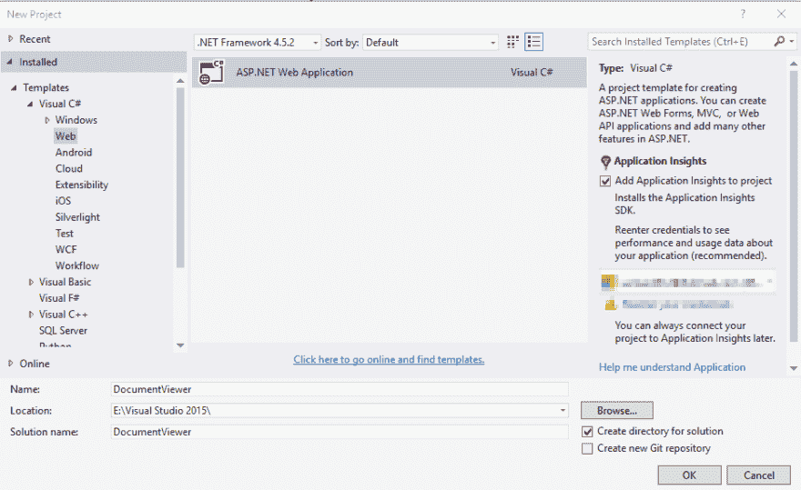
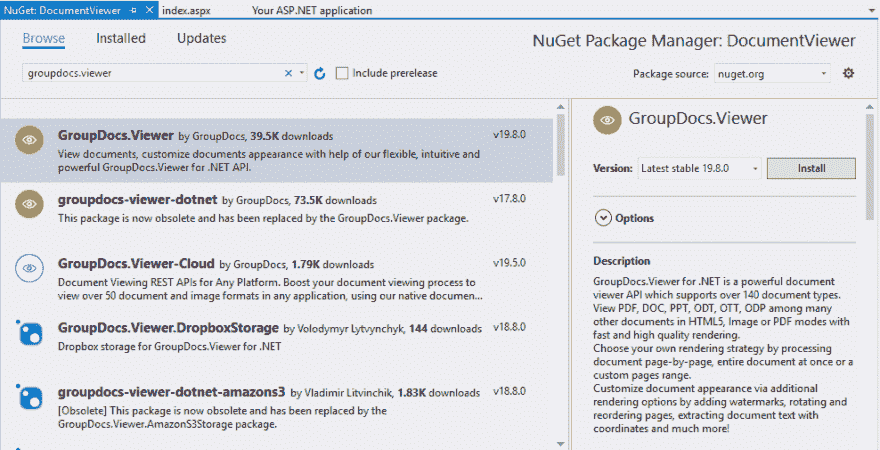
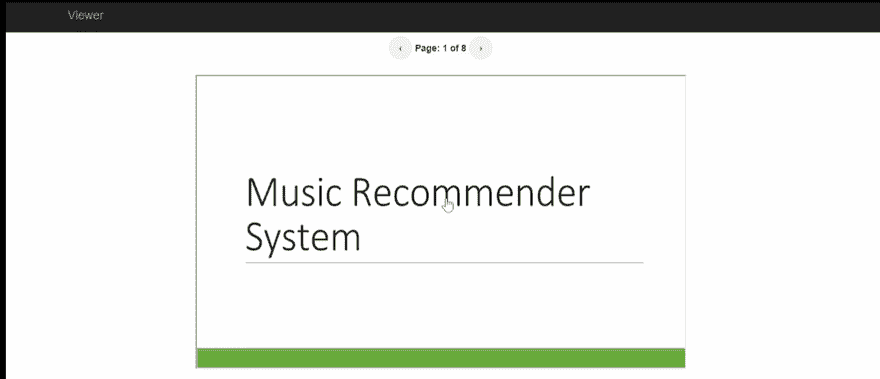

# 如何在 ASP.NET c#中创建文档查看器

> 原文：<https://dev.to/usmanaziz/how-to-create-a-document-viewer-in-asp-net-c-24b6>

如果你正在寻找如何在 ASP.NET 创建一个文档查看器，那么你就来对地方了，因为在这篇文章中，我将向你展示如何通过几个步骤用 C#在 ASP.NET 创建一个简单通用的文档查看器。

它将是一个基于 [GroupDocs 的通用文档查看器。查看器。NET](https://products.groupdocs.com/viewer/net) API，支持查看 PowerPoint 演示文稿、Excel 电子表格、文字处理和 PDF 文档，以及各种流行的[文件格式](https://docs.groupdocs.com/display/viewernet/Supported+Document+Formats)。

让我们开始吧。

**要求**

*   Visual Studio 2015 或更高版本
*   。NET 2.0 或更高版本
*   GroupDocs。查看器。NET v19.8 或更高版本

**解决方案概述**

我们将在后端用 C#在 ASP.NET web forms 中创建文档查看器。应用程序的前端将创建在 HTML 使用引导样式。此外，AJAX 调用将用于与服务器端代码和 GroupDocs 通信。查看器。NET 将用于将文档页面呈现为图像。

**步骤 1 -创建一个项目**

*   打开 Visual Studio 并创建一个新的 ASP.NET Web 应用程序项目。
*   从模板列表中选择空，然后单击确定。

**步骤 2 -添加依赖关系和文件夹**

*   在解决方案资源管理器中右键单击该项目，然后选择“管理 NuGet 包”。
*   搜索 GroupDocs。查看器并安装软件包。
*   在项目的根文件夹中创建 2 个新文件夹- **输出**和**存储**。存储文件夹将包含要查看的文档，输出文件夹将用于保存渲染图像。

**步骤 3 -编写代码**

*   在解决方案资源管理器中右键单击项目，创建一个新的 Web 表单，并将其保存为 *index.aspx* 。
*   将以下脚本添加到 *head* 标记中，以添加引导程序的 CSS 和 JQuery:

```
<link href="Content/bootstrap.min.css" type="text/css" rel="stylesheet" />
<script src="http://ajax.googleapis.com/ajax/libs/jquery/1.8.3/jquery.min.js" type="text/javascript"></script> 
```

Enter fullscreen mode Exit fullscreen mode

*   在*主体*标签中插入以下 HTML。这个 HTML 将创建页面导航按钮和一个 iframe 来显示页面。

```
<div class="navbar navbar-inverse navbar-fixed-top">
    <div class="container">
        <div class="navbar-header">
            <a class="navbar-brand" runat="server" href="~/index.aspx">Viewer</a>
        </div>
    </div>
</div>
<div class="container body-content">
    <div align="center" style="margin-top: 5%"> 
        <a href="#" id="btnPrevious" class="previous round">&#8249;</a>
      <strong>  Page:
        <asp:Label runat="server" ID="lblCurrentPage" Text="1"></asp:Label>
        of
        <asp:Label runat="server" ID="lblTotalPages"></asp:Label></strong> 
        <a href="#" id="btnNext" class="next round">&#8250;</a>
    </div>
    <div align="center">
        <iframe src="" name="container" id="container" scrolling="no" align="center" frameborder="1"
            width="750px" height="450px" style="margin-top: 2%;  overflow: hidden;" frameborder="0"
            allowfullscreen sandbox></iframe>
    </div>
    <hr />
    <footer>
        <p>&copy; <%: DateTime.Now.Year %> - GroupDocs</p>
    </footer>
</div> 
```

Enter fullscreen mode Exit fullscreen mode

*   在上面提到的 HTML 下面，在 *body* 标签内添加下面的 JavaScript。这个 JavaScript 包含下一个和上一个按钮的函数，以及获取页面的 AJAX 调用。

```
<script>
    $(document).ready(function () {
        // call for the first time
        Navigate(1);
        $('#btnNext').click(function () {
            var currentPage = getCurrentPageNumber();
            var totalPages = getTotalPages();
            if ((currentPage + 1) <= totalPages) {
                Navigate(currentPage + 1);
                $('#<%=lblCurrentPage.ClientID%>').html(currentPage + 1)
            }
        });
        $('#btnPrevious').click(function () {
            var currentPage = getCurrentPageNumber();
            var totalPages = getTotalPages();
            if ((currentPage - 1) >= 1) {
                Navigate(currentPage - 1);
                $('#<%=lblCurrentPage.ClientID%>').html(currentPage - 1)
            }
        });
    });
    function getCurrentPageNumber()
    {
        return parseInt($('#<%=lblCurrentPage.ClientID%>').html());            
    }
    function getTotalPages()
    {
        return parseInt($('#<%= lblTotalPages.ClientID %>').html());
    }
    function Navigate(value) {
        $.ajax({
            type: "POST",
            url: "index.aspx/GetPage",
            data: '{value: "' + value + '" }',
            contentType: "application/json; charset=utf-8",
            dataType: "json",
            success: function (response) {
                var $iframe = $('#container');
                $iframe.attr('src', response.d);
            },
            failure: function (response) {
                alert("Filed: " + response.d);
            }
        });
    }
</script> 
```

Enter fullscreen mode Exit fullscreen mode

*   打开 *index.aspx.cs* ，将代码替换为:

```
using GroupDocs.Viewer;
using GroupDocs.Viewer.Caching;
using GroupDocs.Viewer.Options;
using GroupDocs.Viewer.Results;
using System;
using System.Collections.Generic;
using System.IO;
using System.Linq;
using System.Web;
using System.Web.UI;
using System.Web.UI.WebControls;

namespace DocumentViewer
{
    public partial class index : System.Web.UI.Page
    {
        static string OutputPath;
        static string DocumentName = "sample.pptx";
        static string StorageFolder;
        static string CachePath;
        static FileCache cache;
        static ViewerSettings settings;

        protected void Page_Load(object sender, EventArgs e)
        {
            if (!IsPostBack)
            {
                // Set output directories
                OutputPath = Server.MapPath("~/output/"); 
                // Set storage folder where the source document is located
                StorageFolder = Server.MapPath("~/storage");
                // Set the cache path to keep the rendered images
                CachePath = Path.Combine(OutputPath, "cache");
                // Set cache
                cache = new FileCache(CachePath);
                settings = new ViewerSettings(cache);
                // Get document info
                GetDocumentInfo();
            }
        }

        private void GetDocumentInfo()
        {
            try
            {
                using (Viewer viewer = new Viewer(Path.Combine(StorageFolder, DocumentName)))
                {
                    ViewInfo info = viewer.GetViewInfo(ViewInfoOptions.ForPngView(false));  
                    lblTotalPages.Text = info.Pages.Count.ToString();
                }

            }
            catch
            {
                // Do something
            }
        }

        [System.Web.Services.WebMethod]
        public static string GetPage(string value)
        {
            int PageNumber = Convert.ToInt32(value);
            string PageFilePathFormat = Path.Combine(OutputPath, "img{0}.png");
            using (Viewer viewer = new Viewer(Path.Combine(StorageFolder, DocumentName)))
            {
                PngViewOptions options = new PngViewOptions(PageFilePathFormat);
                options.Width = 750;
                options.Height = 450; 

                viewer.View(options, PageNumber);
            } 

            return Path.Combine(@"output", string.Format("img{0}.png", PageNumber));

        } 
    }
} 
```

Enter fullscreen mode Exit fullscreen mode

**步骤 4 -构建解决方案并运行**

*   构建解决方案。
*   在您最喜欢的浏览器中查看 *index.aspx* 。

**输出**
[](https://res.cloudinary.com/practicaldev/image/fetch/s--6iybtqvv--/c_limit%2Cf_auto%2Cfl_progressive%2Cq_66%2Cw_880/https://thepracticaldev.s3.amazonaws.com/i/clvj4cmwng82slj6aax6.gif)

就是这样。

您可以从 [GitHub](https://github.com/usmanazizgroupdocs/document-viewer) 下载完整的现成源代码。

### 你会爱你读:

*   [使用 Python 连接到 SMTP 服务器](https://blog.aspose.com/2021/12/16/connect-to-smtp-server-using-python/)
*   [用 Java 将 HTML 文件转换成 Word 文档](https://blog.aspose.com/2021/11/29/convert-html-to-word-in-java/)
*   [用 Python 从 Word 文档中提取图像](https://blog.aspose.com/2021/11/19/extract-images-from-word-in-python/)
*   [如何在 Java 中读取 Excel 文件](https://blog.aspose.com/2021/11/10/how-to-read-excel-files-in-java/)
*   [如何在 C#中读取 Excel 文件](https://blog.aspose.com/2021/10/10/how-to-read-excel-files-in-csharp/)
*   [使用 Python 读取 Excel 文件中的数据](https://blog.aspose.com/2021/12/09/read-excel-files-using-python/)

干杯！