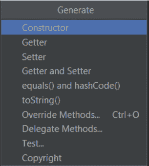

# 如何创建一个 Android 应用:Android Room

> 原文：<https://dev.to/edrome/how-to-create-an-android-app-android-room-il>

### 再次嗨(x3)大家好！

我们几乎完成了所有的应用程序功能，缺少保存机制。一旦用户填写了他的信息，那么它必须保存在数据库中，以避免用户重复填写。

Android 支持 SQLite 或 Room，我更喜欢第二个，因为添加查询和修改列更容易。此外，允许单一实例和异步任务。

正如我们在上一篇文章中提到的，可读性很重要，实现它的方法是创建存储类的包。

在 gradle 内部添加以下实现。他们会添加非常重要的 android 房间注释。

```
 implementation 'androidx.room:room-runtime:2.1.0'
    annotationProcessor 'androidx.room:room-compiler:2.1.0'
    implementation 'org.jetbrains:annotations-java5:15.0' 
```

Android Room 需要四个不同的类:

1.  ***实体:*** 它是表格定义。
2.  ***道:*** 可以对表进行所有的查询。
3.  ***POJO:*** 这里是刀的功能性
4.  ***房间数据库:*** 这里我们创建数据库实例。

开始创建包数据库，如果我们想添加更多的表，我们将在其中创建子包。我建议像这样构造你所有的数据库包。

```
+-- com.main.package
|   +-- database
|      +-- dao
|      +-- entity
|      +-- pojo
|      +-- room 
```

首先我们将创建实体，我选择的名称是 profileModel。这个类需要一个空的或者非空的构造函数，优选的私有属性，每个属性的 getter 和 setter，否则将抛出一个错误。
表格设计如下:

| 列名 | 数据类型 | 属性 |
| --- | --- | --- |
| profileID | 整数 | 主键，自动生成，非空 |
| 用户名 | 线 | 不为空 |
| 性别 | 线 | 不为空 |
| 生日 | 日期 | 不为空 |
| 照片 | 字节[] |  |

正如你所看到的，我们添加了一个自动生成的主键，除了照片外，每一列都可以是非空的，允许用户选择或不选择个人资料照片。

为每一列添加注释，并生成包含 getters 和 setters 的构造函数。注意类开头的“实体”注释，它告诉 android 这个类是一个表，它的名字是 profile。

```
@Entity(tableName = "profile")
public class profileModel {

    public profileModel(@NonNull String username, 
                        @NonNull String gender, 
                        @NonNull Date birthday, 
                        @NonNull byte[] photo) {
        this.username = username;
        this.gender = gender;
        this.birthday = birthday;
        this.photo = photo;
    }

    @NonNull
    @PrimaryKey(autoGenerate = true)
    private Integer profileId;

    @NonNull
    private String username;

    @NonNull
    private String gender;

    @NonNull
    private Date birthday;

    @NonNull
    private byte[] photo;

    @NonNull
    public Integer getProfileId() {
        return profileId;
    }

    public void setProfileId(@NonNull Integer profileId) {
        this.profileId = profileId;
    }

    @NonNull
    public String getUsername() {
        return username;
    }

    public void setUsername(@NonNull String username) {
        this.username = username;
    }

    @NonNull
    public String getGender() {
        return gender;
    }

    public void setGender(@NonNull String gender) {
        this.gender = gender;
    }

    @NonNull
    public Date getBirthday() {
        return birthday;
    }

    public void setBirthday(@NonNull Date birthday) {
        this.birthday = birthday;
    }

    @NonNull
    public byte[] getPhoto() {
        return photo;
    }

    public void setPhoto(@NonNull byte[] photo) {
        this.photo = photo;
    }
} 
```

> 提示:您可以按 alt+insert 或右键单击 generate 来弹出一个生成菜单。
> [](https://res.cloudinary.com/practicaldev/image/fetch/s--S2gC1T-m--/c_limit%2Cf_auto%2Cfl_progressive%2Cq_auto%2Cw_880/https://thepracticaldev.s3.amazonaws.com/i/9fsm5p3szendwqs1mpg8.png) 
> 选择除主键之外的所有列，按确定。
> [](https://res.cloudinary.com/practicaldev/image/fetch/s--3NVQSCEI--/c_limit%2Cf_auto%2Cfl_progressive%2Cq_auto%2Cw_880/https://thepracticaldev.s3.amazonaws.com/i/7a9woevuux8pwogwdvwj.png) 
> 这些步骤也适用于 getter 和 setter，在这种情况下你可以选择所有列，包括主键。

DAO 将是接口而不是类，包含所有的表操作，如插入、查询、删除和更新。在本教程中，我们将定义一个插入、一个更新和一个查询。

```
@Dao
public interface profileDAO {

    @Insert
    void insert(profileModel profile);

    @Update
    void update(profileModel profile);

    @Query("SELECT * FROM profile WHERE profileId = :id")
    profileModel getProfile(Integer id);

} 
```

一旦创建了实体和 DAO，我们就添加数据库 room 类。它必须是抽象的，顶部有注释。该注释指示数据库中包含的实体，以及每次对实体进行更改时必须增加的版本号和 exportSchema 指示符，对于本系列，它被定义为 false。

```
@Database(entities = {profileModel.class}, version = 1, exportSchema = false)
public abstract class databaseRoom extends RoomDatabase {

    public abstract profileDAO foodsDao();

    public static volatile databaseRoom INSTANCE;

    public static databaseRoom getDatabase(final Context context){
        if (INSTANCE == null){
            synchronized (databaseRoom.class){
                if (INSTANCE == null){
                    INSTANCE = Room.databaseBuilder(
                                   context.getApplicationContext(),
                                   databaseRoom.class,
                                   "profile_database")
                               .fallbackToDestructiveMigration()
                               .allowMainThreadQueries()
                               .build();
                }
            }
        }
        return INSTANCE;
    }

} 
```

当所有文件都准备好了，我们就创建一个 POJO 类，它将被用来在我们的数据库中执行操作。

```
public class profilePOJO {

    private profileDAO mProfileDao;
    private profileModel mProfile;

    public profilePOJO(Application application) {
        databaseRoom db = databaseRoom.getDatabase(application);
        mProfileDao = db.foodsDao();
    }

    public profileModel getProfile(Integer id) {
        return mProfileDao.getProfile(id);
    }

    public void insert(profileModel profile){
        new insertAsyncTask(mProfileDao).execute(profile);
    }

    private static class insertAsyncTask extends AsyncTask<profileModel, Void, Void> {

        private profileDAO mAsyncTaskDao;

        insertAsyncTask(profileDAO dao){
            mAsyncTaskDao = dao;
        }

        @Override
        protected Void doInBackground(final profileModel... profiles) {
            mAsyncTaskDao.insert(profiles[0]);
            return null;
        }
    }
} 
```

aand....我们要把它留在这里，否则帖子会太大，无法阅读。

和往常一样，我在 GitHub 上分享这个[项目](https://github.com/EdRome/AppProfile)的链接。你可以随意使用它。

> 编辑:忘记加刀标注了。很抱歉